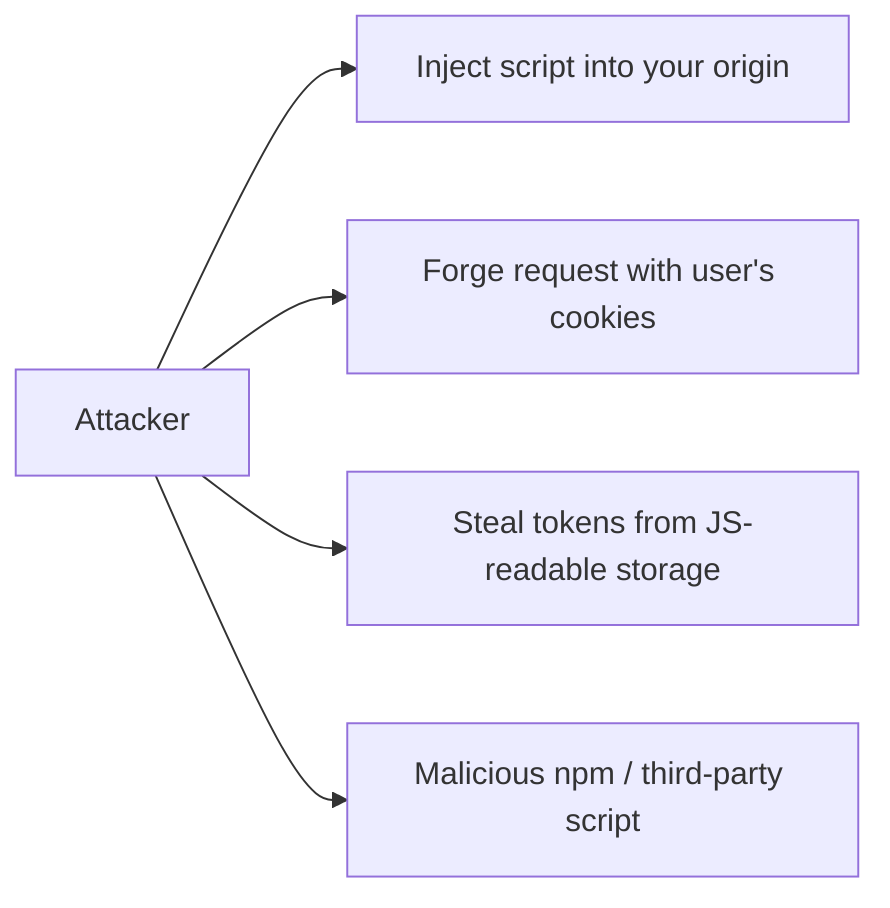
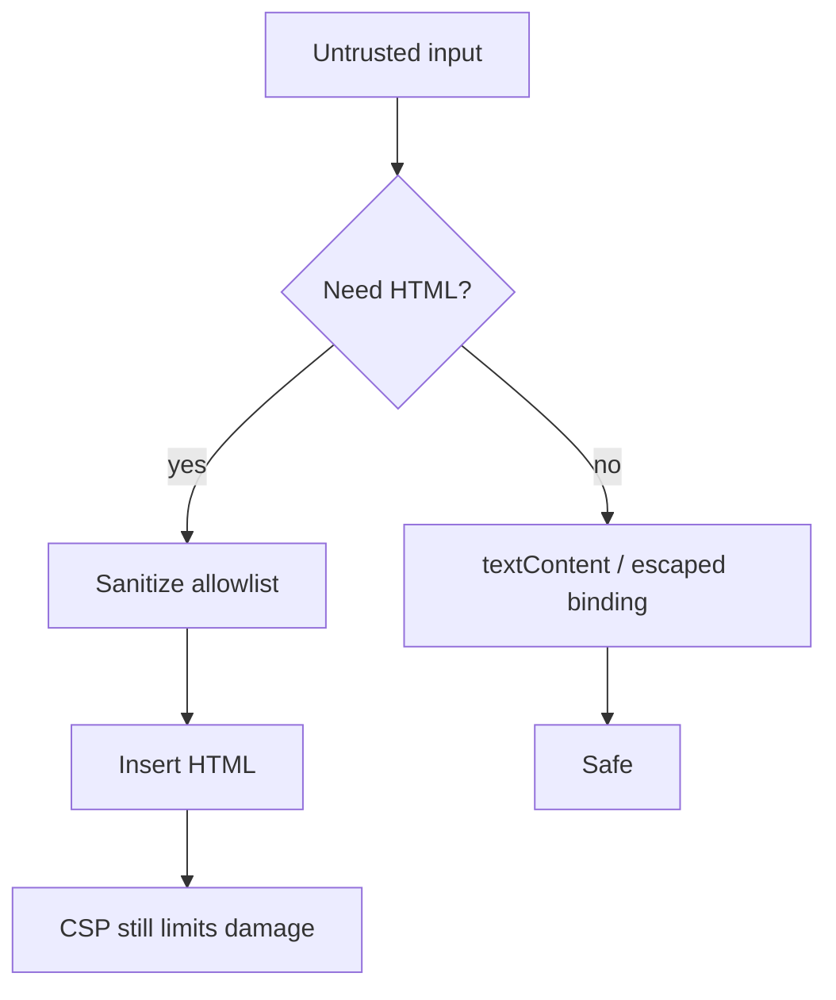
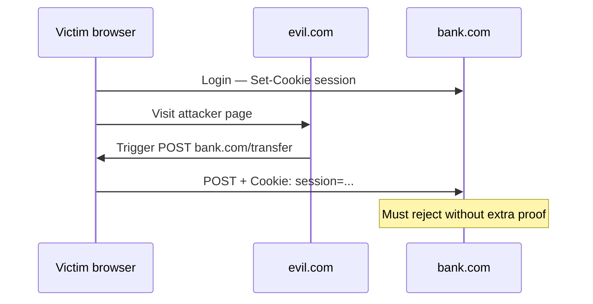
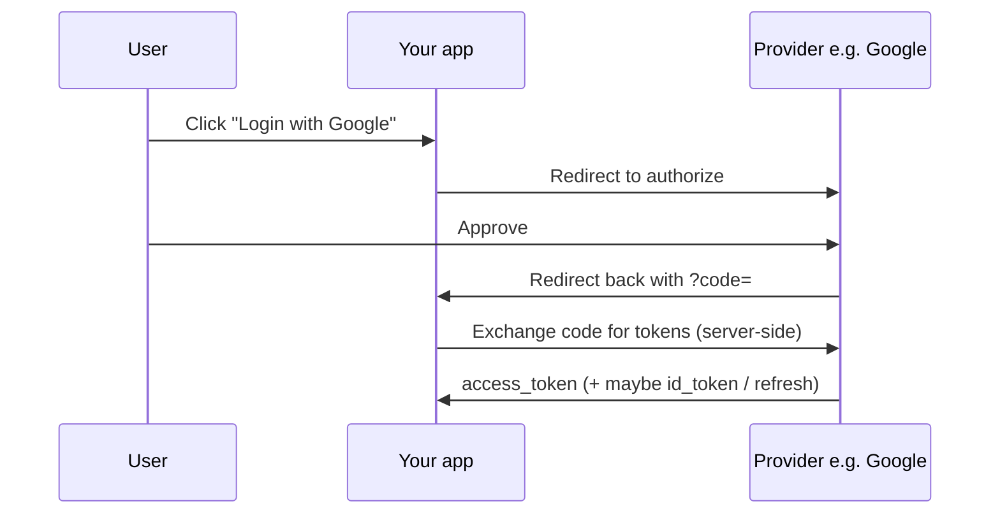
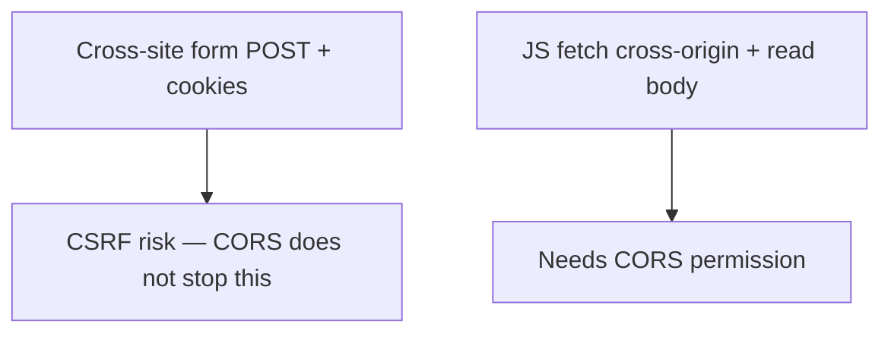
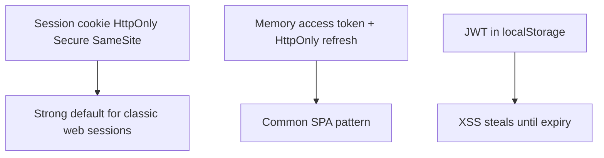

# Security

This chapter teaches web security from scratch. You do not need prior knowledge of XSS, CSRF, or OAuth. By the end you should explain **what goes wrong** in each attack, then **how defenses fix it**, in plain language an interviewer can follow.

---

## 1. Threat model — who is attacking what?

Your frontend runs in the user’s browser under your **origin** (scheme + host + port). An attacker wants to:

1. Run their JavaScript as if it were yours (**XSS**)
2. Trick the user’s browser into calling your API while logged in (**CSRF**)
3. Steal or abuse tokens/cookies
4. Load hostile third-party code (supply chain / scripts)
5. Trick clicks via iframes (**clickjacking**)



Defense in depth: **no single header** saves you. Escape output + cookie flags + CSP + careful token design.

---

## 2. XSS — Cross-Site Scripting

### 2.1 What goes wrong

The attacker finds a way to make the victim’s browser **execute attacker-controlled script** in your site’s origin.

Once that happens, the script can:

- Read the DOM
- Read `localStorage` / `sessionStorage`
- Read non-HttpOnly cookies
- Call your APIs as the user (`fetch` with cookies)
- Rewrite the page (fake login forms)

Analogy: a forged note slipped into the company’s internal memo binder — employees treat it as official.

### 2.2 Three common flavors

| Type | How it works |
| --- | --- |
| **Stored** | Attacker saves payload on your server (comment, bio); every viewer runs it |
| **Reflected** | Payload rides in a URL; server echoes it into HTML; victim clicks a malicious link |
| **DOM-based** | Server may never see it; client JS takes `location` / `postMessage` data and pipes it into a dangerous sink |

```ts
// Vulnerable sinks — attacker string becomes HTML/JS
el.innerHTML = userComment
el.outerHTML = `<div>${userName}</div>`
document.write(userInput)
eval(userInput)
```

```ts
// Safer defaults
el.textContent = userComment // text, not HTML
```

### 2.3 How we fix XSS

1. **Treat untrusted data as data, not code**  
   Prefer `textContent`, framework text bindings, parameterized APIs.

2. **Sanitize if you must render HTML**  
   Use a vetted library (e.g. DOMPurify) or the Sanitizer API — allowlists, not blacklists.

3. **Be careful with URLs**  
   `javascript:` URLs in `href` are classic XSS.

```ts
function safeUrl(u: string): string {
  const parsed = new URL(u, window.location.origin)
  if (!["http:", "https:", "mailto:"].includes(parsed.protocol)) return "#"
  return parsed.href
}
```

4. **CSP** (next section) — limits what scripts can run even if injection slips through.

5. **Framework awareness**  
   React escapes text children by default — **not** `dangerouslySetInnerHTML`, not unchecked markdown HTML, not `eval`.



---

## 3. CSRF — Cross-Site Request Forgery

### 3.1 What goes wrong

Browsers **automatically attach cookies** for a site when a request goes to that site — even if the request was triggered by **another** site.

Analogy: you are logged into your bank. You visit evil.com. Evil.com quietly submits a form to `bank.com/transfer`. Your browser helpfully includes your bank session cookie. The bank thinks **you** asked.



CSRF targets **state-changing** actions (transfer, email change, delete) authenticated by cookies.

### 3.2 How we fix CSRF

1. **`SameSite` cookies**  
   Tell the browser when cookies may be sent on cross-site requests.

| Value | Behavior (simplified) |
| --- | --- |
| `Strict` | Cookie almost never sent on cross-site navigations/requests |
| `Lax` | Sent on top-level GET navigations; blocked on most cross-site POSTs |
| `None` | Sent cross-site — requires `Secure`; **need other CSRF defenses** |

```http
Set-Cookie: session=abc; HttpOnly; Secure; SameSite=Lax; Path=/
```

2. **Anti-CSRF tokens**  
   Server issues a secret token the attacker’s site cannot read (Same-Origin Policy). Client must send it back in a header or form field. Server rejects mismatches.

3. **Check `Origin` / `Referer`** on mutating requests.

4. **Don’t use cookies alone for some SPA APIs**  
   `Authorization: Bearer …` headers are not auto-attached cross-site like cookies — but then you must store tokens carefully (XSS becomes the bigger worry).

> [!IMPORTANT]
> **CORS is not a CSRF defense.** See section 8.

---

## 4. CSP — Content Security Policy

### 4.1 What goes wrong (that CSP addresses)

Even with careful escaping, bugs happen. CSP is a **seatbelt**: an HTTP header that tells the browser **which script/style/image sources are allowed**.

If an attacker injects `<script src="https://evil.com/x.js">` and your CSP does not allow `evil.com`, the browser **blocks** it.

### 4.2 How it works

```http
Content-Security-Policy:
  default-src 'self';
  script-src 'self';
  object-src 'none';
  base-uri 'self';
  frame-ancestors 'none';
  img-src 'self' https: data:;
  connect-src 'self' https://api.example.com;
```

Plain language of important directives:

| Directive | Meaning |
| --- | --- |
| `default-src 'self'` | By default, only load from same origin |
| `script-src` | Who can run scripts |
| `connect-src` | Where `fetch`/XHR/WebSocket may go |
| `frame-ancestors` | Who may embed you in an iframe (clickjacking) |
| `object-src 'none'` | Block plugins |

Avoid `'unsafe-inline'` and `'unsafe-eval'` — they punch holes in XSS protection.

Prefer **nonces** for required inline scripts:

```http
Content-Security-Policy: script-src 'self' 'nonce-rAnd0mValue'
```

```html
<script nonce="rAnd0mValue">window.__BOOT__ = {}</script>
```

Attacker-injected inline scripts lack the nonce → blocked.

Deploy with `Content-Security-Policy-Report-Only` first to see breakage without enforcing.

---

## 5. Cookies — flags that matter

A cookie is a small piece of data the browser stores and may send on later requests.

```http
Set-Cookie: session=abc; Path=/; HttpOnly; Secure; SameSite=Lax
```

| Flag | What it does | Why it matters |
| --- | --- | --- |
| `HttpOnly` | JavaScript cannot read it | XSS cannot easily steal the session cookie |
| `Secure` | Only sent over HTTPS | Stops cleartext sniffing |
| `SameSite` | Limits cross-site sending | CSRF posture |
| `Path` / `Domain` | Scope | Least privilege |
| `__Host-` prefix | Forces Secure + Path=/ + no Domain | Hardens cookie |

Analogy: `HttpOnly` is a badge locked in a drawer the browser shows at the door, but page scripts cannot photocopy.

---

## 6. JWT — JSON Web Tokens

### 6.1 What a JWT is

A **JWT** is a compact, signed string with three Base64url parts: `header.payload.signature`.

Typical payload claims: `sub` (user id), `exp` (expiry), roles, etc.

Analogy: a signed museum pass. Staff verify the signature and expiry without calling the ticket office every time (unless you also maintain a blocklist).

```ts
// Client often sends:
headers: { Authorization: `Bearer ${accessToken}` }
```

### 6.2 What goes wrong

- Storing JWT in `localStorage` → **any XSS steals it** until it expires
- No expiry / huge lifetime → stolen tokens live forever
- Accepting tokens without verifying signature/issuer/audience
- Putting secrets in the payload (payload is **readable** by anyone; only signature is integrity)

### 6.3 How we fix / design sanely

- Prefer **short-lived access tokens** + **refresh** rotation
- Store refresh tokens in **HttpOnly Secure SameSite** cookies when possible
- Keep access tokens in **memory** for SPAs when feasible
- Always verify JWT on the **server**
- Use standard libraries; do not hand-roll crypto

JWTs are not “more secure than sessions” by magic — they are a **format**. Security depends on storage, transport, validation, and revocation strategy.

---

## 7. OAuth — “login with Google” without sharing passwords

### 7.1 What problem it solves

You want users to authorize your app to use **their identity or data at another provider** without your app ever seeing their Google/GitHub password.

Analogy: a hotel keycard issued after the front desk checks your ID — the room lock never learns your passport number.

### 7.2 Basic authorization code flow (mental model)



Important pieces:

- **Authorization code** — short-lived; exchanged **from your backend** with a client secret (for confidential clients)
- **PKCE** — required for public clients (SPAs/native) so stolen codes are harder to redeem
- **Redirect URI allowlist** — stops open redirect token theft
- **`state` parameter** — CSRF protection on the OAuth redirect itself

### 7.3 What goes wrong

- Open redirect on `redirect_uri`
- Skipping `state` / PKCE
- Exposing client secrets in frontend code
- Confusing **authentication** (who are you?) with **authorization** (what may you access?)

OAuth is often paired with **OIDC** (`id_token`) for login identity.

---

## 8. CORS — Cross-Origin Resource Sharing

### 8.1 What goes wrong / what CORS actually is

By default, the **Same-Origin Policy** stops your JavaScript on `https://app.com` from **reading** responses from `https://api.com`.

Analogy: you can mail a letter to another company (the request may go out), but the receptionist won’t hand **you** their reply unless they explicitly allow your company.

**CORS** is the server’s way of saying: “Browsers may let JS from origin X read my response.”

```http
Access-Control-Allow-Origin: https://app.example.com
Access-Control-Allow-Credentials: true
```

Never combine `Allow-Origin: *` with credentials.

### 8.2 CORS is not CSRF protection

A simple HTML form POST from evil.com to your.com **does not need CORS permission** to be **sent**. Cookies may still attach (depending on SameSite). CSRF defenses still required.

CORS controls **cross-origin reads from JS**, not “all cross-site requests.”



---

## 9. Related attacks (short)

### Clickjacking

Attacker embeds your site in a transparent iframe and tricks the user into clicking “Transfer.”

**Fix:** `Content-Security-Policy: frame-ancestors 'none'` or `X-Frame-Options: DENY`.

### Open redirects

```ts
// Bad
res.redirect(req.query.next)
// Fix: allowlist relative paths or known hosts
```

### Supply chain / third-party scripts

Analytics and chat widgets run with your origin’s power. Prefer Subresource Integrity (SRI) for CDNs:

```html
<script
  src="https://cdn.example.com/lib.js"
  integrity="sha384-…"
  crossorigin="anonymous"
></script>
```

Lockfiles, audits, minimal dependencies.

---

## 10. Sensitive data storage — choosing the shelf



| Storage | XSS can read? | Auto-sent on requests? | Notes |
| --- | --- | --- | --- |
| HttpOnly cookie | No | Yes | Needs CSRF strategy |
| `localStorage` | Yes | No | Convenient, dangerous for secrets |
| In-memory variable | Only while XSS runs now | No | Lost on refresh |

---

## Interview Questions

### Q1. Explain XSS and how you prevent it.
**Expected:** Attacker injects script into your origin (stored, reflected, or DOM-based), gaining the user’s privileges in the browser. Prevent by never treating untrusted input as HTML/JS (`textContent`, sanitization), validating URLs, avoiding dangerous sinks, and deploying a tight CSP with nonces.  
**Common wrong:** “React makes XSS impossible.”  
**Follow-ups:** Give a DOM XSS example with `location.hash`.

### Q2. Explain CSRF and defenses.
**Expected:** Attacker’s site causes the victim’s browser to send an authenticated request to your site using automatic cookies. Defend with SameSite cookies, anti-CSRF tokens, Origin checks, and careful auth design.  
**Common wrong:** “HTTPS alone stops CSRF.”  
**Follow-ups:** Lax vs Strict vs None?

### Q3. Does CORS stop CSRF?
**Expected:** No. CORS governs whether JS can read cross-origin responses. Cookie-authenticated form POSTs can still forge state changes without CORS approval.  
**Common wrong:** “We enabled CORS so CSRF is solved.”  
**Follow-ups:** When do preflight requests happen?

### Q4. What does CSP do?
**Expected:** An allowlist policy for what the page may load/execute, reducing XSS blast radius; ideally no unsafe-inline; use nonces/hashes; report-only to roll out.  
**Common wrong:** “CSP replaces input validation.”  
**Follow-ups:** What is `frame-ancestors` for?

### Q5. HttpOnly cookie vs localStorage for tokens?
**Expected:** HttpOnly cookies are not readable by JS, so XSS cannot trivially exfiltrate them; localStorage is fully readable by any injected script. Cookies need CSRF protections; bearer tokens in JS need XSS protections.  
**Common wrong:** “localStorage is safer because it isn’t sent automatically.” (Safer against CSRF, worse against XSS.)  
**Follow-ups:** Describe a hybrid SPA token design.

### Q6. What is a JWT, briefly?
**Expected:** A signed (sometimes encrypted) compact token carrying claims; servers verify signature and expiry. Security depends on validation and storage, not the format alone.  
**Common wrong:** “JWTs are encrypted so users can’t read them.” (Signed ≠ encrypted.)  
**Follow-ups:** How do you revoke a stolen JWT?

### Q7. What problem does OAuth solve?
**Expected:** Delegated authorization so a user can grant your app limited access to a provider without sharing their provider password; commonly used for social login (with OIDC).  
**Common wrong:** “OAuth is just a fancy session cookie.”  
**Follow-ups:** Why PKCE for SPAs?

## Common Mistakes

- Claiming React eliminates XSS (`dangerouslySetInnerHTML`, markdown, URLs).
- `SameSite=None` without CSRF tokens.
- CSP theater: `'unsafe-inline' 'unsafe-eval'` everywhere.
- Putting tokens in query strings (Referer logs, history).
- Confusing CORS with authentication or CSRF defense.
- Storing long-lived JWTs in `localStorage`.
- Implementing OAuth redirects without `state` / allowlisted redirect URIs.

## Trade-offs / Production Notes

- Strict CSP breaks legacy inline scripts — migrate with nonces; ship Report-Only first.
- `SameSite=Strict` can break some OAuth return navigations — often `Lax` + CSRF tokens.
- Short-lived tokens improve blast-radius; refresh rotation adds complexity.
- Defense in depth: escape + CSP + HttpOnly + least-privilege APIs + dependency hygiene.
- Related: [Browser APIs](/javascript/19-browser-apis), [Browser security](/browser/06-security), [Auth](/backend/07-auth), [Node security](/node/12-security).
