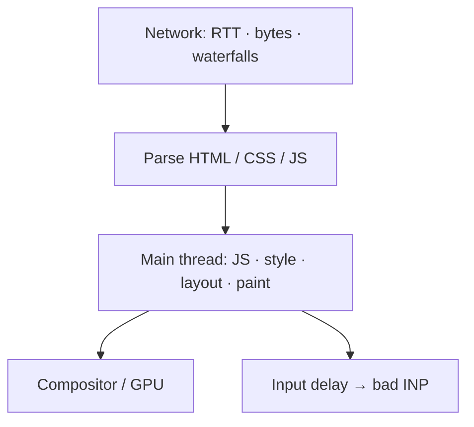
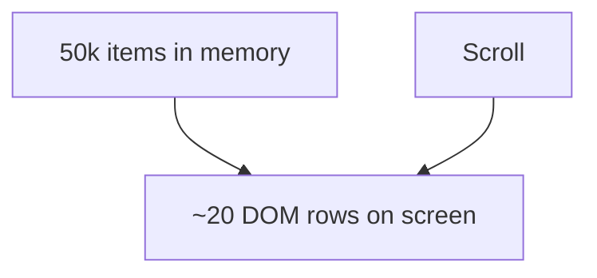
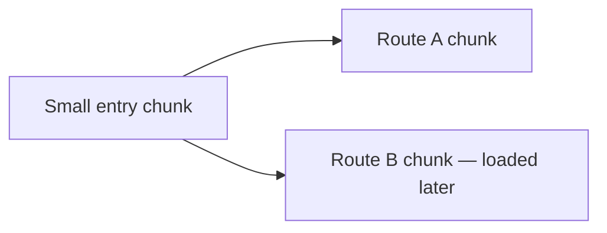
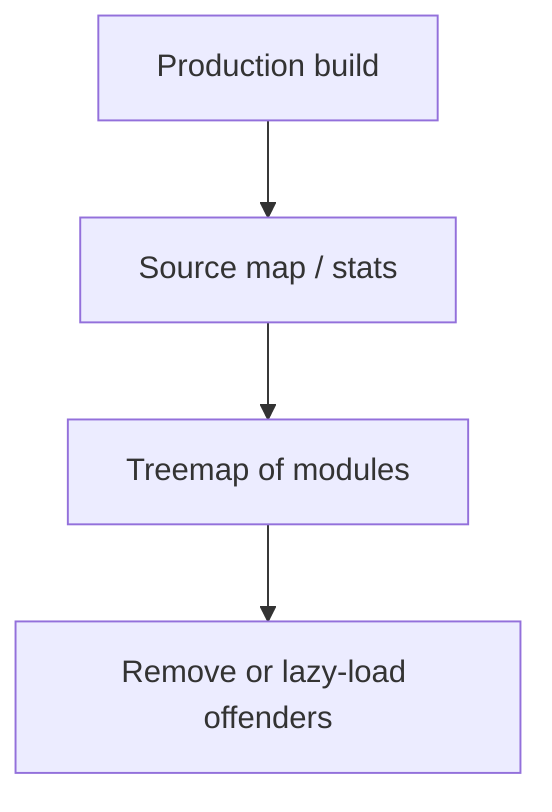
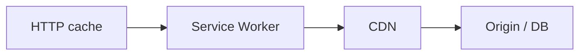

# Performance

This chapter teaches frontend performance from scratch. You do not need prior knowledge of LCP or bundle analyzers. By the end you should explain **what feels slow**, **how we measure it**, and **what problem each technique solves** — debounce, throttle, virtualization, lazy loading, code splitting, prefetch/preload, and bundle analysis.

---

## 1. Start with the problem, not the trick

Users experience slowness as:

1. **“Nothing appeared yet”** — slow first paint / LCP  
2. **“I clicked and it froze”** — slow interactions / INP  
3. **“The page jumps around”** — layout shifts / CLS  
4. **“It got sluggish after a while”** — memory / long lists  

Every optimization below targets one of those. **Measure before/after** or you are guessing.


---

## 2. Measure — Core Web Vitals (plain language)

| Metric | User meaning | Rough “good” |
| --- | --- | --- |
| **LCP** (Largest Contentful Paint) | When the main content showed up | ≤ 2.5s |
| **INP** (Interaction to Next Paint) | How fast the UI responds to clicks/keys | ≤ 200ms |
| **CLS** (Cumulative Layout Shift) | How much the page jumped while loading | ≤ 0.1 |

Also useful: **TTFB** (server wait), **FCP** (first paint of anything), **long tasks** (main-thread blocks > 50ms), **TBT** (total blocking time in lab).

```ts
new PerformanceObserver((list) => {
  for (const e of list.getEntries()) {
    console.log(e.entryType, e.startTime, e)
  }
}).observe({ type: "largest-contentful-paint", buffered: true })
```

Lab (Lighthouse) ≠ field (CrUX / RUM). Ship both mindsets.

---

## 3. Mental model — where time goes



Related pipeline story: [Rendering](/javascript/20-rendering).

---

## 4. Debounce — “wait until they stop poking”

### Problem

A search box fires an API call on **every keystroke**. Typing “javascript” = 10 requests, race conditions, wasted money.

### Solution

**Debounce:** run the function only after a quiet period of `wait` ms.

Analogy: elevator doors — they reset the timer every time someone blocks the sensor; they close only after everyone stops interrupting.

```ts
function debounce<F extends (...args: never[]) => unknown>(fn: F, wait: number) {
  let timer: ReturnType<typeof setTimeout> | undefined
  return (...args: Parameters<F>) => {
    if (timer !== undefined) clearTimeout(timer)
    timer = setTimeout(() => fn(...args), wait)
  }
}

const onSearch = debounce((q: string) => fetch(`/api?q=${q}`), 300)
```

**Use for:** search-as-you-type, resize handlers that rebuild expensive layouts, autosave.

**Not for:** continuous scroll position updates where you need regular samples (use throttle).

---

## 5. Throttle — “at most once per time window”

### Problem

`scroll` or `pointermove` can fire **dozens of times per second**. A heavy handler each time melts the main thread (INP/jank).

### Solution

**Throttle:** ensure the function runs at most once per `wait` ms (leading and/or trailing variants).

Analogy: a turnstile that only lets one person through every second, even if a crowd pushes.

```ts
function throttle<F extends (...args: never[]) => unknown>(fn: F, wait: number) {
  let last = 0
  return (...args: Parameters<F>) => {
    const now = Date.now()
    if (now - last >= wait) {
      last = now
      fn(...args)
    }
  }
}
```

| | Debounce | Throttle |
| --- | --- | --- |
| Intent | Wait until quiet | Cap call rate |
| Search box | ✓ | |
| Scroll spy / stickys | | ✓ |

Implementations with leading/trailing edges: [Machine Coding](/javascript/23-machine-coding).

---

## 6. Virtualization — “don’t build 50,000 DOM nodes”

### Problem

Rendering a list of 50k rows creates 50k DOM nodes. Style, layout, and memory explode. Scrolling stutters.

### Solution

**Windowing / virtualization:** only mount the rows **visible in the viewport** (plus a small overscan buffer). As the user scrolls, recycle or replace nodes.

Analogy: a theater with 50k seats but only painting the seats currently on camera.



Libraries: `react-window`, `react-virtuoso`, TanStack Virtual, etc.

**Use for:** large tables, message logs, infinite feeds when the DOM cost dominates.

**Not magic for:** huge **data** downloads — you may still need pagination/server filtering.

---

## 7. Lazy loading — “don’t pay until you need it”

### Problem

You download and decode images below the fold, or initialize a heavy map widget the user never opens → worse LCP and wasted bandwidth.

### Solution patterns:

**Images:**

```html

```

**Components / routes:** load code when the UI is about to need it (next section).

**IntersectionObserver:** start loading when a sentinel nears the viewport — [Browser APIs](/javascript/19-browser-apis).

Analogy: don’t cook every dish on the menu before the guest sits down.

---

## 8. Code splitting — “ship less JS on first load”

### Problem

One giant `bundle.js` must download, parse, and compile before the app is interactive — even features on rare routes.

### Solution

Split the bundle so the **initial route** loads a smaller chunk; other routes/features load on demand via dynamic `import()`.

```ts
// Route-level split (React example)
const Chart = lazy(() => import("./Chart"))

// Event-driven split
button.addEventListener("click", async () => {
  const { openEditor } = await import("./editor")
  openEditor()
})
```



Bundlers (Vite, webpack, etc.) emit separate files at `import()` boundaries. See [Modules](/javascript/13-modules).

**Problem it solves:** parse/compile/execute cost + download weight on first visit.

**Watch out for:** request waterfalls (parent waits, then child import starts). Prefetch critical next chunks when you know the next step.

---

## 9. `preload` vs `prefetch` vs `preconnect`

These are **hints** to the browser’s network scheduler. Wrong use can **hurt** LCP by stealing bandwidth.

| Hint | Problem it solves | Plain meaning |
| --- | --- | --- |
| `preconnect` | Slow handshake to a known critical origin | DNS + TCP + TLS early |
| `dns-prefetch` | DNS only, cheaper | Resolve name early |
| `preload` | Critical resource discovered late | Fetch **now** at high priority |
| `prefetch` | Likely needed for **next** navigation | Fetch later at low priority |

```html
<link rel="preconnect" href="https://api.example.com" crossorigin />
<link rel="preload" as="image" href="/hero.avif" fetchpriority="high" />
<link rel="prefetch" href="/next-page-chunk.js" />
```

Analogy:

- **preconnect** — call ahead and keep a taxi waiting at the restaurant you will visit tonight  
- **preload** — order the appetizer you know you need for **this** meal immediately  
- **prefetch** — quietly pack tomorrow’s lunch in the background  

> [!WARNING]
> Over-`preload`ing fights your LCP image for bandwidth. Be intentional.

---

## 10. Bundle analysis — “what is actually in my JS?”

### Problem

You “feel” the app is heavy but cannot see **which dependency** added 200KB. Guessing leads to random deletes.

### Solution

Visualize the production bundle:

- `rollup-plugin-visualizer` / Vite bundle visualizer  
- `source-map-explorer`  
- webpack-bundle-analyzer  
- Chrome Coverage tab (what executed vs shipped)



Typical findings:

- Accidental full lodash/moment import  
- Duplicate copies of the same library  
- Locale data you never needed  
- Admin UI sitting in the main chunk  

**Problem it solves:** turns “JS is big” into a **concrete delete/split list**.

Also: tree-shake side-effect-free ESM ([Modules](/javascript/13-modules)); set `"sideEffects"` correctly in libraries.

---

## 11. Other high-leverage fixes (by problem)

### Network / LCP

- CDN, HTTP/2/3, Brotli  
- Optimized images (`srcset`, AVIF/WebP), correct dimensions  
- SSR/streaming critical HTML  
- Cache hashed assets forever; short HTML  

### Main thread / INP

- Break long tasks (`scheduler.yield`, chunking)  
- Move CPU to **Workers**  
- Shrink hydration; defer non-urgent React updates  
- Avoid layout thrashing  

### CLS

- Width/height or `aspect-ratio` on media  
- `font-display` strategy  
- Skeletons that match final size  
- Don’t inject banners above existing content without reserved space  

```css
.card {
  content-visibility: auto;
  contain-intrinsic-size: 240px;
}
```

### Caching layers



---

## 12. Budgets (production discipline)

Examples:

- Critical-route JS < ~170KB gzipped  
- LCP image prioritized (`fetchpriority="high"`)  
- Third parties behind facades / async load  

Fail CI on Lighthouse/RUM regressions — performance as a product requirement.

---

## Interview Questions

### Q1. Debounce vs throttle — what problem does each solve?
**Expected:** Debounce collapses bursts into one call after quiet (search). Throttle caps how often a hot event runs (scroll).  
**Common wrong:** Swapping the definitions.  
**Follow-ups:** Leading vs trailing edge?

### Q2. How do you improve LCP?
**Expected:** Faster TTFB, prioritize the LCP resource (`preload`/`fetchpriority`), reduce render-blocking CSS/JS, properly sized compressed images, SSR critical HTML when appropriate.  
**Common wrong:** “Add more memoization.”  
**Follow-ups:** How do you identify the LCP element in DevTools?

### Q3. How do you improve INP?
**Expected:** Shorten event handlers, yield long tasks, debounce/throttle noisy input, move heavy CPU to workers, reduce hydration/render work on interaction.  
**Common wrong:** Only blaming the network.  
**Follow-ups:** What is a long task?

### Q4. What problem does virtualization solve?
**Expected:** Avoid creating thousands of DOM nodes for long lists by rendering only the visible window.  
**Common wrong:** “It reduces API payload size automatically.”  
**Follow-ups:** When is server pagination still required?

### Q5. `preload` vs `prefetch`?
**Expected:** `preload` = needed for current navigation, high priority; `prefetch` = likely for future navigation, low priority.  
**Common wrong:** Using them interchangeably.  
**Follow-ups:** When does preload hurt LCP?

### Q6. Why analyze the bundle?
**Expected:** To find which modules dominate download/parse cost so you can remove, replace, or code-split them with evidence.  
**Common wrong:** “Just enable compression and you’re done.”  
**Follow-ups:** What is a barrel file’s impact on tree-shaking?

### Q7. Is micro-optimizing `map` vs `for` worth it?
**Expected:** Usually not compared to network, bundle size, and layout work. Profile first; optimize the measured bottleneck.  
**Common wrong:** Rewriting loops before measuring.  
**Follow-ups:** Give an example of a 10× win vs a 1% win.

## Common Mistakes

- Optimizing without field/lab metrics.  
- Over-`preload` competing with the LCP image.  
- Premature `memo` everywhere in React.  
- Code-splitting into hundreds of tiny chunks → waterfalls.  
- Ignoring third-party script cost.  
- Virtualizing without fixed/estimated row heights (jumping scroll).  
- Debouncing without cancel on unmount → setState on dead components.

## Trade-offs / Production Notes

- SSR/ISR can improve LCP but add infra complexity and hydration INP risk.  
- Aggressive splitting needs prefetch of the next critical chunk.  
- Image quality vs bytes — set perceptual budgets per breakpoint.  
- Related: [Rendering](/javascript/20-rendering), [Browser APIs](/javascript/19-browser-apis), [Machine Coding](/javascript/23-machine-coding), [Browser optimization](/browser/09-optimization).
