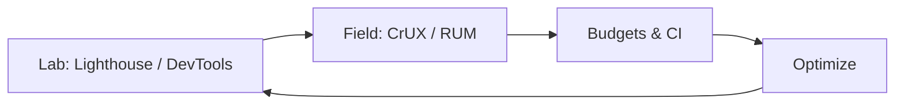
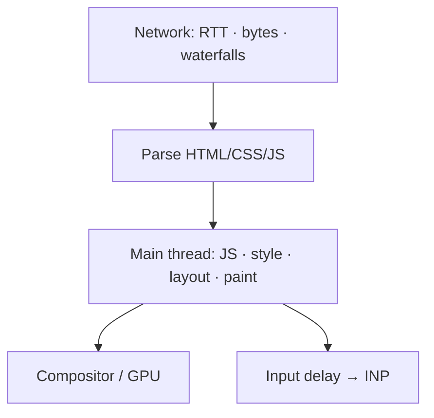
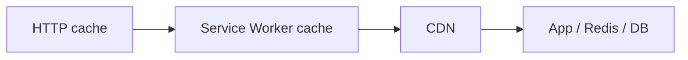

# Performance

Measure Core Web Vitals, find main-thread bottlenecks, and apply JS/network/rendering fixes — interview answers need metrics + techniques, not vibes.

## Measure first



### Core Web Vitals (know definitions)

| Metric | What | Good (approx) |
| --- | --- | --- |
| **LCP** | Largest contentful paint | ≤ 2.5s |
| **INP** | Interaction to next paint (replaces FID) | ≤ 200ms |
| **CLS** | Cumulative layout shift | ≤ 0.1 |

Also: TTFB, FCP, TBT, Speed Index, long tasks (>50ms).

```ts
new PerformanceObserver((list) => {
  for (const e of list.getEntries()) {
    // LCP entries, event timing, layout-shift (hadRecentInput check)
    console.log(e.entryType, e.startTime, e)
  }
}).observe({ type: "largest-contentful-paint", buffered: true })

performance.getEntriesByType("navigation")
performance.getEntriesByType("resource")
```

## Mental model: what can be slow



## Network optimizations

- CDN + HTTP/2/3, Brotli/gzip
- Cache headers / immutable hashed assets
- `preconnect` / `dns-prefetch` / `preload` ( sparingly )
- Responsive images: `srcset`, `sizes`, modern formats (AVIF/WebP)
- Don't download what you don't need (code split, conditional imports)

```ts
const Chart = lazy(() => import("./Chart"))
await import("./heavy-locale-" + locale + ".js") // constrain locale!
```

## JavaScript cost

```ts
// Bundle size → download + parse + compile + execute
// Tools: source-map-explorer, rollup-plugin-visualizer, Coverage tab
```

Techniques:

- Route-based / component-based splitting
- Tree-shake side-effect-free modules ([Modules](/javascript/13-modules))
- Avoid giant polyfills; target modern browsers
- Debounce/throttle input handlers ([Machine Coding](/javascript/23-machine-coding))
- Move heavy CPU to **Workers**
- Break long tasks (`scheduler.yield`, `setTimeout(0)`, chunking)

```ts
async function yieldToMain() {
  await new Promise((r) => setTimeout(r, 0))
}
```

## Rendering performance

- Prefer `transform`/`opacity` animations ([Rendering](/javascript/20-rendering))
- Virtualize long lists
- Avoid layout thrashing
- Containment: `content-visibility`, `contain`
- Reserve image/font space → CLS

```css
img, video {
  aspect-ratio: attr(width) / attr(height); /* or explicit width/height */
}
.card {
  content-visibility: auto;
  contain-intrinsic-size: 240px;
}
```

## React-flavored notes (interview crossover)

- Unnecessary re-renders → memoization **after** measuring
- State location / context granularity
- Transitions for non-urgent updates
- SSR/streaming for LCP; watch hydration cost for INP
- See [React optimization](/react/08-optimization), [Next caching](/nextjs/10-caching)

## Memory

Leaked listeners/observers/closures retain detached DOM — [Memory](/javascript/12-memory). Large arrays retained in closures after fetch.

## Caching layers



Stale-while-revalidate for UX; cache bust with content hashes.

## Budgets (production discipline)

Example budgets:

- JS for critical route < 170KB gzipped
- LCP image optimized + priority (`fetchpriority="high"`)
- Third parties async / facade pattern

CI: Lighthouse CI fail on regression.

## Interview Questions

**Q: How do you improve LCP?**  
Optimize server TTFB, prioritize LCP resource (`preload`/`fetchpriority`), reduce render-blocking CSS/JS, compress/size image, SSR critical HTML.

**Q: How do you improve INP?**  
Shorten event handlers, yield long tasks, debounce, move work off main thread, reduce hydration, avoid large synchronous renders.

**Q: How do you improve CLS?**  
Size attributes, font-display strategy, avoid inserting above-fold content without reservation, skeleton placeholders matching final size.

**Q: Micro-opt `map` vs `for` — worth it?**  
Usually not vs bundle size / network / reflows. Profile first.

**Q: What is a long task?**  
Main-thread work >50ms blocking input/paint. Break up or defer.

**Q: `preload` vs `prefetch`?**  
`preload` = critical now; `prefetch` = likely next navigation — lower priority.

## Common Mistakes

- Optimizing without measuring field data.
- Over-`preload` fighting bandwidth with LCP image.
- Premature memoization everywhere.
- Huge client bundles for mostly static pages.
- Ignoring third-party script cost.
- Animating layout properties.

## Trade-offs / Production Notes

- SSR/ISR improve LCP, increase infra complexity and hydration risk.
- Aggressive code splitting → waterfalls; use proper preload for critical async chunks.
- Image quality vs bytes — perceptual budgets per viewport.
- Related: [Rendering](/javascript/20-rendering), [Browser optimization](/browser/09-optimization), [Node performance](/node/11-performance), [FE observability](/frontend-system-design/07-observability).
