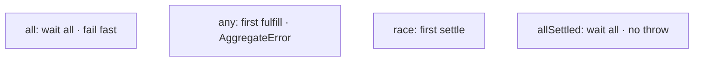
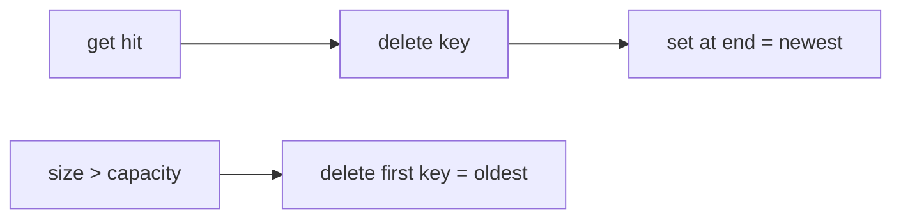
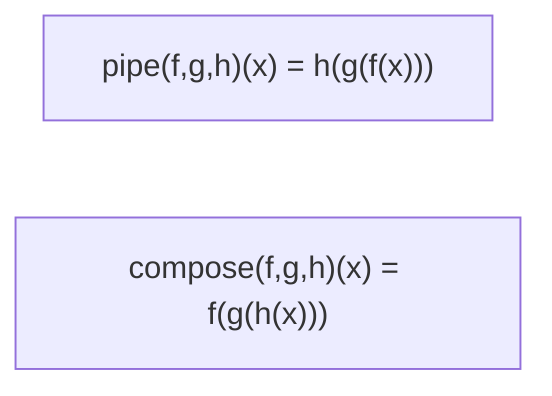

# Machine Coding Utils

Whiteboard-ready implementations: Promise combinators, debounce/throttle, EventEmitter, LRU, deep clone, curry, pipe, compose. Speak complexity and edge cases while coding.

## `Promise.all`

Fail-fast: resolve when all fulfill; reject on first rejection.

```ts
function promiseAll<T>(input: Iterable<T | PromiseLike<T>>): Promise<Awaited<T>[]> {
  return new Promise((resolve, reject) => {
    const items = Array.from(input)
    const n = items.length
    if (n === 0) {
      resolve([])
      return
    }
    const results = new Array<Awaited<T>>(n)
    let remaining = n

    items.forEach((item, i) => {
      Promise.resolve(item).then(
        (value) => {
          results[i] = value as Awaited<T>
          remaining -= 1
          if (remaining === 0) resolve(results)
        },
        reject, // first rejection wins; later rejections ignored by Promise
      )
    })
  })
}
```

**Edge cases:** empty iterable → `[]`; preserve order; already-rejected input rejects async (microtask).

## `Promise.any`

Fulfill on first success; if all reject → `AggregateError`.

```ts
function promiseAny<T>(input: Iterable<T | PromiseLike<T>>): Promise<Awaited<T>> {
  return new Promise((resolve, reject) => {
    const items = Array.from(input)
    const n = items.length
    if (n === 0) {
      reject(new AggregateError([], "All promises were rejected"))
      return
    }
    const errors = new Array<unknown>(n)
    let rejected = 0

    items.forEach((item, i) => {
      Promise.resolve(item).then(resolve, (err) => {
        errors[i] = err
        rejected += 1
        if (rejected === n) {
          reject(new AggregateError(errors, "All promises were rejected"))
        }
      })
    })
  })
}
```

Also know: `race` (first settle), `allSettled` (never rejects — `{status,value|reason}[]`).



## Debounce

Invoke after `wait` ms of quiet. Leading/trailing variants common follow-ups.

```ts
type AnyFn = (...args: never[]) => unknown

function debounce<F extends AnyFn>(fn: F, wait: number) {
  let timer: ReturnType<typeof setTimeout> | undefined

  const debounced = (...args: Parameters<F>) => {
    if (timer !== undefined) clearTimeout(timer)
    timer = setTimeout(() => {
      timer = undefined
      fn(...args)
    }, wait)
  }

  debounced.cancel = () => {
    if (timer !== undefined) clearTimeout(timer)
    timer = undefined
  }

  return debounced
}
```

Leading + trailing sketch:

```ts
function debounceLeadingTrailing<F extends AnyFn>(
  fn: F,
  wait: number,
  { leading = false, trailing = true } = {},
) {
  let timer: ReturnType<typeof setTimeout> | undefined
  let lastArgs: Parameters<F> | undefined

  return (...args: Parameters<F>) => {
    lastArgs = args
    const callNow = leading && timer === undefined
    if (timer !== undefined) clearTimeout(timer)
    timer = setTimeout(() => {
      timer = undefined
      if (trailing && lastArgs) fn(...lastArgs)
      lastArgs = undefined
    }, wait)
    if (callNow) fn(...args)
  }
}
```

## Throttle

At most once per `wait` window (leading throttle shown).

```ts
function throttle<F extends AnyFn>(fn: F, wait: number) {
  let last = 0
  let timer: ReturnType<typeof setTimeout> | undefined
  let lastArgs: Parameters<F> | undefined

  return (...args: Parameters<F>) => {
    const now = Date.now()
    const remaining = wait - (now - last)
    lastArgs = args

    if (remaining <= 0 || remaining > wait) {
      if (timer !== undefined) {
        clearTimeout(timer)
        timer = undefined
      }
      last = now
      fn(...args)
    } else if (timer === undefined) {
      timer = setTimeout(() => {
        last = Date.now()
        timer = undefined
        if (lastArgs) fn(...lastArgs)
      }, remaining)
    }
  }
}
```

| | Debounce | Throttle |
| --- | --- | --- |
| Intent | Wait until quiet | Cap call rate |
| Search box | ✓ | |
| Scroll handler | | ✓ |

## EventEmitter

```ts
type Handler = (...args: unknown[]) => void

class EventEmitter {
  #map = new Map<string, Set<Handler>>()

  on(event: string, handler: Handler): () => void {
    let set = this.#map.get(event)
    if (!set) {
      set = new Set()
      this.#map.set(event, set)
    }
    set.add(handler)
    return () => this.off(event, handler)
  }

  once(event: string, handler: Handler): () => void {
    const wrap: Handler = (...args) => {
      this.off(event, wrap)
      handler(...args)
    }
    return this.on(event, wrap)
  }

  off(event: string, handler: Handler) {
    this.#map.get(event)?.delete(handler)
  }

  emit(event: string, ...args: unknown[]) {
    const handlers = [...(this.#map.get(event) ?? [])]
    for (const h of handlers) h(...args)
  }

  listenerCount(event: string) {
    return this.#map.get(event)?.size ?? 0
  }
}
```

**Follow-ups:** wildcard events, error listener convention (`emit('error')` throws if no listener — Node style), max listeners warning, async emit.

## LRU Cache

Map maintains insertion order in JS — exploit for O(1) LRU.

```ts
class LRUCache<K, V> {
  #map = new Map<K, V>()
  constructor(private capacity: number) {
    if (capacity < 1) throw new RangeError("capacity")
  }

  get(key: K): V | undefined {
    if (!this.#map.has(key)) return undefined
    const v = this.#map.get(key)!
    this.#map.delete(key)
    this.#map.set(key, v) // move to most-recent
    return v
  }

  set(key: K, value: V) {
    if (this.#map.has(key)) this.#map.delete(key)
    this.#map.set(key, value)
    if (this.#map.size > this.capacity) {
      const oldest = this.#map.keys().next().value as K
      this.#map.delete(oldest)
    }
  }

  has(key: K) {
    return this.#map.has(key)
  }
}
```



Doubly-linked list + hashmap is the classic non-Map version — mention both.

## Deep clone

See full discussion in [Objects](/javascript/14-objects). Compact interview version:

```ts
function deepClone<T>(value: T, seen = new WeakMap<object, unknown>()): T {
  if (value === null || typeof value !== "object") return value
  if (seen.has(value as object)) return seen.get(value as object) as T

  if (value instanceof Date) return new Date(value) as T
  if (value instanceof RegExp) return new RegExp(value.source, value.flags) as T

  if (Array.isArray(value)) {
    const arr: unknown[] = []
    seen.set(value, arr)
    for (const item of value) arr.push(deepClone(item, seen))
    return arr as T
  }

  const out: Record<PropertyKey, unknown> = {}
  seen.set(value as object, out)
  for (const key of Reflect.ownKeys(value as object)) {
    out[key] = deepClone((value as Record<PropertyKey, unknown>)[key], seen)
  }
  return out as T
}
```

Prefer `structuredClone` when available; call out functions/DOM/cycles.

## Curry

```ts
type Curried<A extends unknown[], R> =
  A extends [infer H, ...infer T]
    ? (arg: H) => Curried<T, R>
    : R

function curry<A extends unknown[], R>(fn: (...args: A) => R): Curried<A, R> {
  const arity = fn.length
  function curried(this: unknown, ...args: unknown[]): unknown {
    if (args.length >= arity) return fn.apply(this, args as A)
    return (...more: unknown[]) => curried.apply(this, args.concat(more))
  }
  return curried as Curried<A, R>
}

const add = (a: number, b: number, c: number) => a + b + c
const addC = curry(add)
addC(1)(2)(3) // 6
addC(1, 2)(3) // 6
```

**Caveat:** `fn.length` breaks with default/rest params — mention it.

## Pipe & compose

```ts
type Fn = (x: never) => unknown

function pipe<T>(...fns: Array<(arg: T) => T>): (arg: T) => T
function pipe(...fns: Fn[]) {
  return (x: unknown) => fns.reduce((v, f) => f(v as never), x)
}

function compose<T>(...fns: Array<(arg: T) => T>): (arg: T) => T
function compose(...fns: Fn[]) {
  return (x: unknown) => fns.reduceRight((v, f) => f(v as never), x)
}

const double = (n: number) => n * 2
const inc = (n: number) => n + 1
pipe(inc, double)(3)     // (3+1)*2 = 8
compose(inc, double)(3)  // (3*2)+1 = 7
```



## Interview Questions

**Q: Difference `Promise.all` vs `any` vs `race`?**  
`all` — all fulfill / first reject. `any` — first fulfill / all reject as AggregateError. `race` — first settle (fulfill or reject).

**Q: Debounce vs throttle?**  
Debounce waits for silence; throttle enforces max frequency.

**Q: How does Map-based LRU get O(1)?**  
JS `Map` is ordered; delete+set moves to newest; evict `keys().next()`.

**Q: Why WeakMap in deepClone?**  
Cycle detection without retaining cloned graphs forever.

**Q: Curry vs partial?**  
Curry returns unary chain until arity met; partial fixes some args and returns a function of the rest (often one step).

## Common Mistakes

- `Promise.all` results out of order (must index by position).
- Debounce without `cancel` → setState after unmount.
- EventEmitter mutating handler Set while emitting (copy first).
- LRU `get` without reordering.
- Curry relying on `.length` with defaults.
- Deep clone forgetting cycles → stack overflow.

## Trade-offs / Production Notes

- Prefer native Promise.* when available; reimplement in interviews to show understanding.
- Lodash debounce options (`maxWait`) matter for UX — mention in follow-ups.
- LRU size by **bytes** vs entry count for real caches.
- Related: [Async](/javascript/11-async), [Functions](/javascript/09-functions), [Objects](/javascript/14-objects), [Coding patterns](/coding/01-debounce-throttle), [Machine coding builds](/machine-coding/index).
