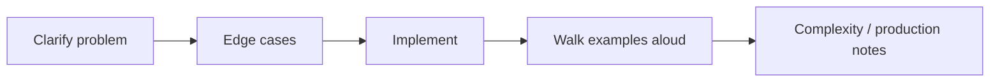
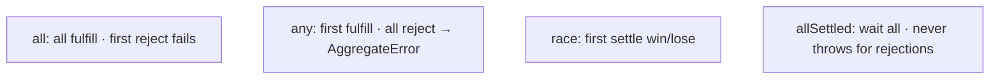
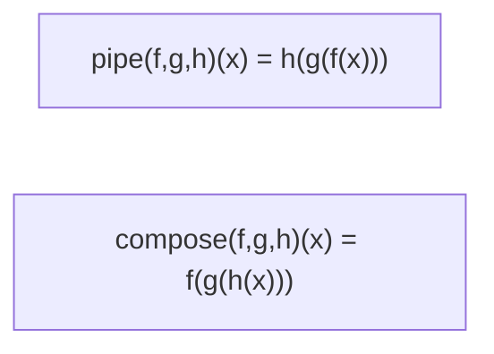

# Machine Coding Utils

This chapter teaches classic interview utilities **from scratch**. You will not only memorize code — you will understand **what problem each helper solves**, then build it step by step in TypeScript. Covered: `Promise.all` / `Promise.any`, debounce, throttle, EventEmitter, LRU cache, deep clone, curry, pipe, and compose.

---

## 1. How to use this chapter in an interview

1. Restate the problem in one sentence.  
2. List edge cases before coding.  
3. Write a small correct version; then mention complexity.  
4. Narrate trade-offs (native API vs reimplementation).



---

## 2. `Promise.all` — wait for every success, fail fast

### Problem

You kick off several async jobs (3 API calls) and need **all** results — but if any fails, you want to know **immediately**, not after the slowest one finishes.

### Behavior to implement

- Input: iterable of values or thenables  
- Output: Promise of results **in the same order**  
- If **any** rejects → the returned promise rejects with that reason (**fail-fast**)  
- Empty input → resolve `[]`

Analogy: a project manager waiting for three teammates. If one says “blocked,” the meeting ends even if others are still working.

### Step-by-step design

1. Wrap in `new Promise`.  
2. Snapshot inputs into an array (so we know `n`).  
3. Make a `results` array of length `n`.  
4. Track `remaining` fulfillments.  
5. For each item, `Promise.resolve(item)` so non-promises work.  
6. On fulfill: store at **index i**, decrement; if `remaining === 0`, resolve.  
7. On reject: call `reject` once (later rejections are ignored by the Promise machinery).

```ts
function promiseAll<T>(input: Iterable<T | PromiseLike<T>>): Promise<Awaited<T>[]> {
  return new Promise((resolve, reject) => {
    const items = Array.from(input)
    const n = items.length
    if (n === 0) {
      resolve([])
      return
    }

    const results = new Array<Awaited<T>>(n)
    let remaining = n

    items.forEach((item, i) => {
      Promise.resolve(item).then(
        (value) => {
          results[i] = value as Awaited<T>
          remaining -= 1
          if (remaining === 0) resolve(results)
        },
        reject,
      )
    })
  })
}
```

**Edge cases to say out loud:** empty iterable; order preservation; already-rejected input still rejects asynchronously (microtask); non-promise values.

---

## 3. `Promise.any` — first success wins

### Problem

You have multiple mirrors/CDNs. You want the **first success**. Failures are OK unless **all** fail.

### Behavior

- Resolve with the **first fulfillment**  
- If all reject → reject with `AggregateError` holding all reasons  
- Empty input → `AggregateError` immediately  

Analogy: calling three pizza places; hang up when the first says “on the way.” If all say no, you’re out of luck (with a list of excuses).

```ts
function promiseAny<T>(input: Iterable<T | PromiseLike<T>>): Promise<Awaited<T>> {
  return new Promise((resolve, reject) => {
    const items = Array.from(input)
    const n = items.length
    if (n === 0) {
      reject(new AggregateError([], "All promises were rejected"))
      return
    }

    const errors = new Array<unknown>(n)
    let rejected = 0

    items.forEach((item, i) => {
      Promise.resolve(item).then(
        (value) => resolve(value as Awaited<T>),
        (err) => {
          errors[i] = err
          rejected += 1
          if (rejected === n) {
            reject(new AggregateError(errors, "All promises were rejected"))
          }
        },
      )
    })
  })
}
```

### Compare the family



Also know `Promise.race` (first settle) and `Promise.allSettled` (always fulfills with `{ status, value | reason }[]`).

---

## 4. Debounce — run after the storm passes

### Problem

Hot events (keyup, resize) fire too often. You want **one** call after the user pauses.

### Teaching model

Every call **resets** a timer. Only when `wait` ms pass with **no new calls** do you invoke `fn`.

```ts
type AnyFn = (...args: never[]) => unknown

function debounce<F extends AnyFn>(fn: F, wait: number) {
  let timer: ReturnType<typeof setTimeout> | undefined

  const debounced = (...args: Parameters<F>) => {
    if (timer !== undefined) clearTimeout(timer)
    timer = setTimeout(() => {
      timer = undefined
      fn(...args)
    }, wait)
  }

  debounced.cancel = () => {
    if (timer !== undefined) clearTimeout(timer)
    timer = undefined
  }

  return debounced
}
```

**Why `cancel`?** In UI frameworks, unmount while a timer is pending → calling `setState` later crashes or warns. Cancel on cleanup.

### Leading / trailing (common follow-up)

- **Trailing** (default above): fire after quiet  
- **Leading**: fire immediately on first call, then ignore until quiet window resets  

```ts
function debounceLeadingTrailing<F extends AnyFn>(
  fn: F,
  wait: number,
  { leading = false, trailing = true } = {},
) {
  let timer: ReturnType<typeof setTimeout> | undefined
  let lastArgs: Parameters<F> | undefined

  return (...args: Parameters<F>) => {
    lastArgs = args
    const callNow = leading && timer === undefined
    if (timer !== undefined) clearTimeout(timer)
    timer = setTimeout(() => {
      timer = undefined
      if (trailing && lastArgs) fn(...lastArgs)
      lastArgs = undefined
    }, wait)
    if (callNow) fn(...args)
  }
}
```

Production lodash also has `maxWait` — “don’t delay forever while events keep coming.”

---

## 5. Throttle — speed limit

### Problem

You need regular updates during continuous activity (scroll position), but not 200 times/second.

### Teaching model

Track last invoke time. If enough time passed, run now; otherwise schedule a trailing call for when the window ends (so the last event isn’t lost).

```ts
function throttle<F extends AnyFn>(fn: F, wait: number) {
  let last = 0
  let timer: ReturnType<typeof setTimeout> | undefined
  let lastArgs: Parameters<F> | undefined

  return (...args: Parameters<F>) => {
    const now = Date.now()
    const remaining = wait - (now - last)
    lastArgs = args

    if (remaining <= 0 || remaining > wait) {
      if (timer !== undefined) {
        clearTimeout(timer)
        timer = undefined
      }
      last = now
      fn(...args)
    } else if (timer === undefined) {
      timer = setTimeout(() => {
        last = Date.now()
        timer = undefined
        if (lastArgs) fn(...lastArgs)
      }, remaining)
    }
  }
}
```

| | Debounce | Throttle |
| --- | --- | --- |
| Mental model | Reset timer until quiet | Cap rate during noise |
| Search input | ✓ | |
| Scroll handler | | ✓ |

Deep dive on when to use which: [Performance](/javascript/22-performance).

---

## 6. EventEmitter — pub/sub in a class

### Problem

Many parts of an app need to react to named events (`"login"`, `"error"`) without hard-wiring every listener to every producer.

### Teaching model

Keep a `Map<eventName, Set<handler>>`.

- `on` — subscribe; return an unsubscribe function  
- `off` — unsubscribe  
- `once` — wrap handler so it removes itself  
- `emit` — call a **copy** of handlers (so a handler that unsubscribes mid-emit doesn’t break iteration)

```ts
type Handler = (...args: unknown[]) => void

class EventEmitter {
  #map = new Map<string, Set<Handler>>()

  on(event: string, handler: Handler): () => void {
    let set = this.#map.get(event)
    if (!set) {
      set = new Set()
      this.#map.set(event, set)
    }
    set.add(handler)
    return () => this.off(event, handler)
  }

  once(event: string, handler: Handler): () => void {
    const wrap: Handler = (...args) => {
      this.off(event, wrap)
      handler(...args)
    }
    return this.on(event, wrap)
  }

  off(event: string, handler: Handler) {
    this.#map.get(event)?.delete(handler)
  }

  emit(event: string, ...args: unknown[]) {
    const handlers = [...(this.#map.get(event) ?? [])]
    for (const h of handlers) h(...args)
  }

  listenerCount(event: string) {
    return this.#map.get(event)?.size ?? 0
  }
}
```

**Follow-ups interviewers love:** Node’s `error` event convention; max listeners warning; async emit; wildcard events; typed emitters with generics.

---

## 7. LRU Cache — forget the least recently used

### Problem

You want a bounded cache. When full, evict the entry that hasn’t been used for the longest time (**L**east **R**ecently **U**sed).

Analogy: a tiny fridge. When you buy new food and there’s no room, throw out whatever you haven’t reached for in longest.

### Why `Map` makes this easy in JS

`Map` remembers **insertion order**. If we `delete` then `set` on access, that key moves to “newest.” The oldest key is `map.keys().next().value`.

```ts
class LRUCache<K, V> {
  #map = new Map<K, V>()

  constructor(private capacity: number) {
    if (capacity < 1) throw new RangeError("capacity")
  }

  get(key: K): V | undefined {
    if (!this.#map.has(key)) return undefined
    const v = this.#map.get(key)!
    this.#map.delete(key)
    this.#map.set(key, v) // newest
    return v
  }

  set(key: K, value: V) {
    if (this.#map.has(key)) this.#map.delete(key)
    this.#map.set(key, value)
    if (this.#map.size > this.capacity) {
      const oldest = this.#map.keys().next().value as K
      this.#map.delete(oldest)
    }
  }

  has(key: K) {
    return this.#map.has(key)
  }
}
```

```mermaid
flowchart LR
  hit["get hit"] --> del["delete key"]
  del --> end["set again = newest"]
  full["size > capacity"] --> evict["delete first key = oldest"]
```

**Complexity:** O(1) average for get/set with `Map`. Classic whiteboard alternative: hashmap + doubly linked list (mention it).

**Production note:** real caches often evict by **bytes**, not entry count; also TTL.

---

## 8. Deep clone — copy the graph, not the reference

### Problem

```ts
const a = { nest: { n: 1 } }
const b = a
b.nest.n = 2 // also changed a!
```

Shallow copy (`{ ...a }`, `Object.assign`) only clones the **top** level. Nested objects are still shared.

### Teaching model

Recurse. Use a `WeakMap` to remember “original → clone” so **cycles** don’t infinite-loop.

```ts
function deepClone<T>(value: T, seen = new WeakMap<object, unknown>()): T {
  if (value === null || typeof value !== "object") return value
  if (seen.has(value as object)) return seen.get(value as object) as T

  if (value instanceof Date) return new Date(value) as T
  if (value instanceof RegExp) return new RegExp(value.source, value.flags) as T

  if (Array.isArray(value)) {
    const arr: unknown[] = []
    seen.set(value, arr)
    for (const item of value) arr.push(deepClone(item, seen))
    return arr as T
  }

  const out: Record<PropertyKey, unknown> = {}
  seen.set(value as object, out)
  for (const key of Reflect.ownKeys(value as object)) {
    out[key] = deepClone((value as Record<PropertyKey, unknown>)[key], seen)
  }
  return out as T
}
```

**Prefer in real apps:** `structuredClone(value)` when available — handles more types, built-in cycle handling.

**Cannot clone meaningfully:** functions, DOM nodes, some exotic objects — say so.

More: [Objects](/javascript/14-objects).

---

## 9. Curry — turn multi-arg into a chain of single args

### Problem

You want to specialize functions gradually:

```ts
const add = (a: number, b: number, c: number) => a + b + c
// Want: add(1)(2)(3) or add(1, 2)(3)
```

Useful for partial configuration in functional pipelines.

### Teaching model

If you’ve collected enough args (`>= fn.length`), call `fn`. Otherwise return a function that accepts more.

```ts
type Curried<A extends unknown[], R> = A extends [infer H, ...infer T]
  ? (arg: H) => Curried<T, R>
  : R

function curry<A extends unknown[], R>(fn: (...args: A) => R): Curried<A, R> {
  const arity = fn.length
  function curried(this: unknown, ...args: unknown[]): unknown {
    if (args.length >= arity) return fn.apply(this, args as A)
    return (...more: unknown[]) => curried.apply(this, args.concat(more))
  }
  return curried as Curried<A, R>
}

const addC = curry((a: number, b: number, c: number) => a + b + c)
addC(1)(2)(3) // 6
addC(1, 2)(3) // 6
```

**Caveat:** `fn.length` ignores default/rest parameters — mention this limitation.

**Curry vs partial:** partial fixes some args and returns a function of the rest (often one step). Curry aims for unary chaining until arity is met.

---

## 10. Pipe & compose — build pipelines

### Problem

Nested calls are hard to read: `h(g(f(x)))`.

### Teaching model

- **`pipe(f, g, h)(x)`** → left to right: `h(g(f(x)))` — “assembly line order”  
- **`compose(f, g, h)(x)`** → right to left: `f(g(h(x)))` — math style  

```ts
type Fn = (x: never) => unknown

function pipe<T>(...fns: Array<(arg: T) => T>): (arg: T) => T
function pipe(...fns: Fn[]) {
  return (x: unknown) => fns.reduce((v, f) => f(v as never), x)
}

function compose<T>(...fns: Array<(arg: T) => T>): (arg: T) => T
function compose(...fns: Fn[]) {
  return (x: unknown) => fns.reduceRight((v, f) => f(v as never), x)
}

const double = (n: number) => n * 2
const inc = (n: number) => n + 1

pipe(inc, double)(3) // (3+1)*2 = 8
compose(inc, double)(3) // (3*2)+1 = 7
```



Typed variadic pipes get more complex (libraries like `fp-ts` / Remeda). For interviews, same-type `T → T` is enough; mention generics if asked.

---

## Interview Questions

### Q1. `Promise.all` vs `any` vs `race`?
**Expected:** `all` waits for every fulfillment and fails on first rejection (order preserved). `any` takes the first fulfillment and only fails if all reject (`AggregateError`). `race` settles with whichever promise settles first — success or failure.  
**Common wrong:** Treating `any` and `race` as identical.  
**Follow-ups:** When prefer `allSettled`?

### Q2. Debounce vs throttle?
**Expected:** Debounce waits for silence; throttle enforces a maximum call frequency during continuous events.  
**Common wrong:** Swapped definitions.  
**Follow-ups:** Implement leading + trailing debounce.

### Q3. How is Map-based LRU O(1)?
**Expected:** JS `Map` is insertion-ordered; delete+set moves a key to newest; evict via the first key in iteration order.  
**Common wrong:** Scanning the whole map for the oldest timestamp each time.  
**Follow-ups:** Describe the linked-list + hashmap version.

### Q4. Why WeakMap in deepClone?
**Expected:** Cycle detection: map originals to clones without retaining the cloned graph forever after the clone finishes (keys are weak).  
**Common wrong:** “WeakMap makes cloning faster.”  
**Follow-ups:** What can’t `structuredClone` copy?

### Q5. Curry vs partial application?
**Expected:** Curry returns nested unary (or progressive) functions until arity is satisfied; partial fixes some arguments now and returns a function awaiting the rest, often in one step.  
**Common wrong:** They are always the same.  
**Follow-ups:** Why is `fn.length` unreliable?

### Q6. Why copy handlers before `emit`?
**Expected:** So listeners that unsubscribe (or add new listeners) during emit don’t break iteration or cause missed/double calls unpredictably.  
**Common wrong:** “Sets are fine to mutate while iterating always.”  
**Follow-ups:** Node `error` event behavior?

## Common Mistakes

- Storing `Promise.all` results with `push` and losing index order.  
- Debounce without `cancel` → updates after unmount.  
- EventEmitter iterating the live `Set` while emitting.  
- LRU `get` that returns a value **without** reordering.  
- Curry trusting `.length` with defaults/rest.  
- Deep clone without cycle handling → stack overflow.  
- Confusing `pipe` and `compose` order in the interview explanation.

## Trade-offs / Production Notes

- Prefer native `Promise.*` in apps; reimplement in interviews to prove understanding.  
- Lodash debounce `maxWait` matters for UX — mention it.  
- LRU by entry count ≠ LRU by memory bytes.  
- Prefer `structuredClone` over hand-rolled clones when it fits.  
- Related: [Async](/javascript/11-async), [Functions](/javascript/09-functions), [Objects](/javascript/14-objects), [Performance](/javascript/22-performance), [Coding patterns](/coding/01-debounce-throttle).
