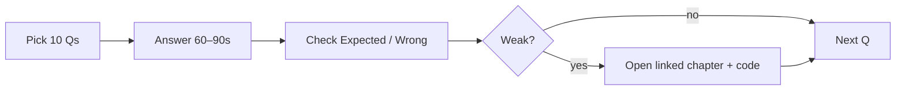

# 150 Senior JavaScript Q&A

Compact drill set for senior screens. Each item: **Expected**, **Common wrong**, **Follow-ups**, **Production**.

> Speak answers aloud in 60–90s, then check follow-ups. Cross-link deep dives: [Event Loop](/javascript/10-event-loop), [Closures](/javascript/05-closures), [Rendering](/javascript/20-rendering), [Security](/javascript/21-security), [Machine Coding](/javascript/23-machine-coding).

## Q1–Q25: Fundamentals & language semantics
### Q1. What are JS data types?
- **Expected:** 7 primitives (string, number, bigint, boolean, undefined, symbol, null) + object (arrays, functions, dates, …).
- **Common wrong:** Saying null is an object type as designed; listing only 5–6 types.
- **Follow-ups:** Why typeof null === 'object'? Symbol uniqueness vs Symbol.for?
- **Production:** Type guards at API boundaries prevent coercion bugs in prod.
### Q2. null vs undefined?
- **Expected:** undefined = missing/uninitialized; null = intentional empty. == equates them; === does not.
- **Common wrong:** They're identical / interchangeable everywhere.
- **Follow-ups:** What should APIs return? How does optional chaining interact?
- **Production:** Pick one sentinel per API; document JSON null vs omitted keys.
### Q3. == vs === vs Object.is?
- **Expected:** === strict same-type; == coerces; Object.is like === but NaN equals NaN and +0 ≠ -0.
- **Common wrong:** == is fine if you're careful; Object.is is just ===.
- **Follow-ups:** When is == null idiomatic? Give an Object.is use case.
- **Production:** Lint ban on == except nullish; reduces prod incidents.
### Q4. Is JavaScript pass-by-reference?
- **Expected:** Pass-by-value; object values are references. Mutating via ref is visible; rebinding param is not.
- **Common wrong:** Objects are pass-by-reference like C++ refs.
- **Follow-ups:** Show reassign vs mutate example.
- **Production:** Avoid accidental shared mutation across modules/stores.
### Q5. What does const freeze?
- **Expected:** Only the binding. Object contents remain mutable unless Object.freeze/deep patterns.
- **Common wrong:** const deep-freezes objects.
- **Follow-ups:** freeze vs seal vs preventExtensions?
- **Production:** Config mutation bugs → freeze configs in prod builds.
### Q6. Explain ToPrimitive / coercion.
- **Expected:** Abstract ops prefer valueOf then toString unless string hint; Symbol.toPrimitive overrides.
- **Common wrong:** Listing only == table without abstract ops.
- **Follow-ups:** How does + decide concat vs add?
- **Production:** Explicit conversion at edges beats implicit coercion.
### Q7. Why [] == ![] is true?
- **Expected:** ![] → false; [] == false → ToNumber both sides → 0 == 0.
- **Common wrong:** Because empty array is falsy.
- **Follow-ups:** What about [] == false vs Boolean([])?
- **Production:** Never rely on == with objects in conditionals.
### Q8. Boxing / autoboxing?
- **Expected:** Primitives temporarily wrapped to access methods; new String() creates real objects with identity surprises.
- **Common wrong:** Strings are always objects.
- **Follow-ups:** Why is new Boolean(false) truthy?
- **Production:** Ban wrapper constructors in style guides.
### Q9. Symbol use cases?
- **Expected:** Unique keys, avoid collisions, well-known protocols (iterator, toPrimitive, toStringTag).
- **Common wrong:** Just fancy strings.
- **Follow-ups:** Enumerability of symbol keys? Symbol.for?
- **Production:** Library meta-keys without breaking user enumeration.
### Q10. structuredClone vs JSON clone?
- **Expected:** structuredClone handles Date/Map/Set/bigint/cycles differently; JSON loses types, drops undefined/functions.
- **Common wrong:** They're equivalent.
- **Follow-ups:** What can't structuredClone clone?
- **Production:** postMessage/IndexedDB use structured clone — know limits.
### Q11. What is a pure function?
- **Expected:** Same inputs → same output; no side effects / no external mutable state.
- **Common wrong:** Any function without await.
- **Follow-ups:** Are Date.now or Math.random pure?
- **Production:** Pure cores are testable and cacheable (React Compiler / memo).
### Q12. var vs let vs const?
- **Expected:** var function-scoped + hoisted init undefined; let/const block + TDZ; const no rebind.
- **Common wrong:** let is block const is immutable value.
- **Follow-ups:** Temporal Dead Zone mechanics?
- **Production:** Default const; let when rebind needed; never var in modern code.
### Q13. What is NaN?
- **Expected:** IEEE Not-a-Number; typeof number; NaN !== NaN; detect with Number.isNaN.
- **Common wrong:** NaN means null number / use == NaN.
- **Follow-ups:** isNaN vs Number.isNaN?
- **Production:** Validate parses with Number.isFinite before math.
### Q14. MAX_SAFE_INTEGER significance?
- **Expected:** 2^53-1; beyond that integers aren't exact in float64.
- **Common wrong:** Max number JS can store.
- **Follow-ups:** How to handle snowflake IDs?
- **Production:** Serialize large IDs as strings in JSON APIs.
### Q15. 0.1+0.2 !== 0.3 why?
- **Expected:** Binary floating-point can't represent those decimals exactly.
- **Common wrong:** JS bug / rounding mode bug unique to JS.
- **Follow-ups:** How do you compare floats? Money strategy?
- **Production:** Integer cents or decimal libs for money.
### Q16. bigint vs number?
- **Expected:** bigint arbitrary int precision; no mixed arithmetic with number; JSON needs custom handling.
- **Common wrong:** bigint is just bigger float.
- **Follow-ups:** 0n == 0 vs ===?
- **Production:** Use bigint for crypto/int IDs when needed; document serialization.
### Q17. Falsy values list?
- **Expected:** false, 0, -0, 0n, '', null, undefined, NaN — only those.
- **Common wrong:** Including [] or {}.
- **Follow-ups:** Why is [] truthy but [] == false?
- **Production:** Prefer explicit checks over truthiness for 0/''.
### Q18. Property descriptors — what are they?
- **Expected:** value/writable/enumerable/configurable or get/set + enumerable/configurable.
- **Common wrong:** Just keys and values.
- **Follow-ups:** Defaults of defineProperty vs literals?
- **Production:** Libraries use non-enumerable fields; freeze for immutability.
### Q19. Object.freeze vs seal?
- **Expected:** freeze: no add/delete/reconfigure/value change; seal: values still mutable.
- **Common wrong:** They're the same.
- **Follow-ups:** Deep freeze? Performance?
- **Production:** Shallow freeze catches accidental top-level mutation only.
### Q20. Prototype chain lookup?
- **Expected:** Own property then [[Prototype]] walk until null.
- **Common wrong:** Copying parent methods onto child always.
- **Follow-ups:** hasOwn vs in? Shadowing?
- **Production:** Avoid deep prototype mutation shared across app.
### Q21. classical vs prototypal inheritance?
- **Expected:** JS is prototypal; class is syntax over prototypes + constructor.
- **Common wrong:** JS has true classical inheritance like Java.
- **Follow-ups:** What does extends set up?
- **Production:** Prefer composition for app domain models.
### Q22. new keyword steps?
- **Expected:** Create object, set prototype to Fn.prototype, call Fn with this, return object unless ctor returns object.
- **Common wrong:** Only assigns this.
- **Follow-ups:** What if ctor returns a number?
- **Production:** Factories sometimes clearer than new.
### Q23. this binding rules?
- **Expected:** Default, implicit, explicit (call/apply/bind), new, arrow lexical — priority: new > bind > call/apply > implicit > default.
- **Common wrong:** this always equals the object before the dot.
- **Follow-ups:** Arrow methods on prototype? class fields arrows?
- **Production:** Lost this in callbacks is a common prod bug — bind or arrows.
### Q24. Arrow functions differences?
- **Expected:** Lexical this/arguments/super/new.target; no construct; no prototype; can't be new'ed.
- **Common wrong:** Just shorter syntax.
- **Follow-ups:** When not to use arrows?
- **Production:** Prototype methods needing dynamic this → regular methods.
### Q25. Closures — define precisely?
- **Expected:** Function retaining access to lexical environment after outer returns.
- **Common wrong:** Only nested functions / only for privacy.
- **Follow-ups:** Memory retention? Loop var vs let?
- **Production:** Stale closures in React effects/handlers — deps arrays.

## Q26–Q50: Scope, async, event loop, memory
### Q26. Lexical vs dynamic scope?
- **Expected:** JS is lexical: scope decided by write location, not call site (except this).
- **Common wrong:** JS is dynamically scoped.
- **Follow-ups:** How is this not lexical (except arrows)?
- **Production:** Predictable scoping aids refactors.
### Q27. What is TDZ?
- **Expected:** Period from scope entry until let/const init where access throws.
- **Common wrong:** Same as var hoisting to undefined.
- **Follow-ups:** typeof undeclared vs TDZ let?
- **Production:** Keeps bugs loud instead of undefined.
### Q28. Module scope vs script?
- **Expected:** Modules have own top-level scope, strict, deferred; scripts share global.
- **Common wrong:** Identical.
- **Follow-ups:** Live bindings?
- **Production:** ESM encapsulation prevents global leaks.
### Q29. Event loop high level?
- **Expected:** Call stack runs sync; Web APIs schedule; macrotasks queue; microtasks drain fully after each task before render.
- **Common wrong:** setTimeout(0) runs before promises.
- **Follow-ups:** Where do MutationObserver / queueMicrotask fit?
- **Production:** Long tasks block input — yield for INP.
### Q30. Microtask vs macrotask examples?
- **Expected:** Micro: Promise.then, queueMicrotask, MutationObserver. Macro: setTimeout, setInterval, I/O, message, UI events.
- **Common wrong:** Promises are macrotasks.
- **Follow-ups:** Starving the event loop with microtask recursion?
- **Production:** Don't chain unbounded then in tight loops.
### Q31. Node event loop phases?
- **Expected:** timers → pending → idle/prepare → poll → check (setImmediate) → close; nextTick + microtasks between.
- **Common wrong:** Same as browser only.
- **Follow-ups:** process.nextTick vs Promise.then vs setImmediate?
- **Production:** Starvation via nextTick is a prod footgun.
### Q32. Promise states?
- **Expected:** pending, fulfilled, rejected — settle once (immutable).
- **Common wrong:** resolved always means fulfilled.
- **Follow-ups:** Resolve with thenable / another promise?
- **Production:** Idempotent handlers; attach catch always.
### Q33. Implement Promise.then chaining semantics?
- **Expected:** Return value fulfills next; throw rejects; returning promise adopts state.
- **Common wrong:** then always sync.
- **Follow-ups:** Why reactions are async?
- **Production:** Consistent async avoids Zalgo.
### Q34. async/await desugar?
- **Expected:** async returns Promise; await parks function, resumes as microtask on settle.
- **Common wrong:** await blocks the OS thread.
- **Follow-ups:** Error handling with try vs .catch?
- **Production:** Don't block event loop — await yields JS thread only.
### Q35. Promise.all semantics?
- **Expected:** All fulfill → array in order; first reject fails fast.
- **Common wrong:** Rejects only after all finish.
- **Follow-ups:** Empty array? Partial success pattern?
- **Production:** allSettled for batch reporting in jobs.
### Q36. Promise.race vs any?
- **Expected:** race first settle; any first fulfill else AggregateError.
- **Common wrong:** They're the same.
- **Follow-ups:** Timeout via race pattern?
- **Production:** Cancel underlying work with AbortSignal too.
### Q37. Unhandled rejection?
- **Expected:** Rejected promise without handler; browser/Node emit events; may crash Node policies.
- **Common wrong:** Automatically becomes throw.
- **Follow-ups:** How to globally log?
- **Production:** Treat as bug; alert; fail CI on unhandled.
### Q38. What is Zalgo?
- **Expected:** API sometimes sync sometimes async callback — unpredictable stack.
- **Common wrong:** A JS engine bug.
- **Follow-ups:** How do Promises avoid Zalgo?
- **Production:** Always async public APIs for I/O.
### Q39. Generators vs async generators?
- **Expected:** function* yields iterators; async function* yields promises of values for streams.
- **Common wrong:** Generators are obsolete because async.
- **Follow-ups:** Pull vs push streams?
- **Production:** Useful for pagination iterators / Redux-saga history.
### Q40. for await…of?
- **Expected:** Consumes async iterables; awaits each next.
- **Common wrong:** Works on sync arrays only with await magic.
- **Follow-ups:** Break and cleanup return()?
- **Production:** Streaming APIs (files, fetch body) in Node/browser.
### Q41. AbortController purpose?
- **Expected:** Signal cancellation to fetch/streams/readers; abort rejects with AbortError.
- **Common wrong:** Kills the JS thread.
- **Follow-ups:** Compose signals? Timeout?
- **Production:** Cancel stale React requests on unmount.
### Q42. Debounce vs throttle?
- **Expected:** Debounce after quiet; throttle max rate.
- **Common wrong:** Opposite definitions swapped.
- **Follow-ups:** Leading/trailing? maxWait?
- **Production:** Search box debounce; scroll throttle — UX + perf.
### Q43. requestAnimationFrame vs setTimeout for animation?
- **Expected:** rAF syncs to refresh, pauses in background; setTimeout drifts and not paint-aligned.
- **Common wrong:** setTimeout(16) equals 60fps.
- **Follow-ups:** Why rAF before measuring layout?
- **Production:** Smooth UI; battery on background tabs.
### Q44. queueMicrotask vs Promise.resolve().then?
- **Expected:** Similar microtask scheduling; queueMicrotask clearer intent; subtle edge differences rare.
- **Common wrong:** queueMicrotask is macrotask.
- **Follow-ups:** When prefer one?
- **Production:** Flush state before paint carefully — don't starve.
### Q45. Memory leak common FE causes?
- **Expected:** Detached DOM with listeners, uncleared intervals, growing caches, closed-over large data, observers.
- **Common wrong:** JS has no leaks because GC.
- **Follow-ups:** How to diagnose in DevTools?
- **Production:** Heap snapshots in prod incidents; cleanup in useEffect.
### Q46. GC mark-sweep / generations (high level)?
- **Expected:** Reachability from roots; V8 generational + incremental/concurrent collectors.
- **Common wrong:** GC runs every N seconds fixed.
- **Follow-ups:** What retains objects?
- **Production:** Avoid accidental globals retaining trees.
### Q47. WeakMap / WeakRef use?
- **Expected:** WeakMap keys weakly held — metadata without retaining; WeakRef/FinalizationRegistry advanced.
- **Common wrong:** WeakMap is just Map with weak values.
- **Follow-ups:** Why keys must be objects?
- **Production:** Caches keyed by objects without leaks.
### Q48. event.preventDefault vs stopPropagation?
- **Expected:** preventDefault stops browser default; stopPropagation stops bubble/capture further.
- **Common wrong:** They're synonyms.
- **Follow-ups:** stopImmediatePropagation?
- **Production:** passive listeners can't preventDefault on touch — scroll perf.
### Q49. Event delegation why?
- **Expected:** One parent listener; dynamic children; lower memory.
- **Common wrong:** Always slower than per-element.
- **Follow-ups:** closest + contains pattern?
- **Production:** Standard for large lists/tables.
### Q50. Capture vs bubble?
- **Expected:** Capture root→target then bubble target→root.
- **Common wrong:** Bubble happens first.
- **Follow-ups:** When listen in capture?
- **Production:** Analytics/outside-click libs use capture sometimes.

## Q51–Q75: Modules, collections, strings, errors
### Q51. ESM vs CJS?
- **Expected:** ESM static+live bindings+async; CJS sync require+exports object; interop asymmetric.
- **Common wrong:** Just different syntax same runtime model.
- **Follow-ups:** Can CJS require ESM?
- **Production:** ESM-first packages; dual package hazard.
### Q52. Live bindings?
- **Expected:** Import names read exporter's binding; updates visible; importer can't assign.
- **Common wrong:** Imports are copies of values.
- **Follow-ups:** Circular dependency behavior?
- **Production:** Avoid top-level reads in cycles.
### Q53. Tree shaking requirements?
- **Expected:** ESM static structure, side-effect free modules, no dynamic import paths for static drop.
- **Common wrong:** Works automatically always with CJS.
- **Follow-ups:** Barrel files impact?
- **Production:** sideEffects flag in package.json matters for bundles.
### Q54. Array map vs forEach?
- **Expected:** map returns new array; forEach for side effects returns undefined.
- **Common wrong:** forEach is faster map always.
- **Follow-ups:** Hole handling?
- **Production:** Prefer map for transforms — clearer intent.
### Q55. Why reduce needs initialValue?
- **Expected:** Empty array throws; type of accumulator; avoid wrong first element as acc.
- **Common wrong:** Optional always.
- **Follow-ups:** Implement reduce?
- **Production:** Production: always pass init.
### Q56. flatMap?
- **Expected:** map then flatten depth 1 — 1:many transforms.
- **Common wrong:** Deep flatten recursive.
- **Follow-ups:** Implement flat?
- **Production:** Cleaner than nested loops for expanding lists.
### Q57. Sparse arrays?
- **Expected:** Holes: index not present; some methods skip holes.
- **Common wrong:** Just arrays with undefined values.
- **Follow-ups:** new Array(n).map pitfall?
- **Production:** Prefer Array.from({length}) to init.
### Q58. sort default behavior?
- **Expected:** Lexicographic ToString unless comparator; mutates array.
- **Common wrong:** Numeric sort by default.
- **Follow-ups:** toSorted? Stability?
- **Production:** Never sort React state in place.
### Q59. includes vs indexOf with NaN?
- **Expected:** includes uses SameValueZero finds NaN; indexOf uses === does not.
- **Common wrong:** Same.
- **Follow-ups:** find vs filter?
- **Production:** Use includes for membership.
### Q60. UTF-16 and string.length?
- **Expected:** length counts code units; emoji may be 2; iterate code points with for-of.
- **Common wrong:** length always equals characters users see.
- **Follow-ups:** Grapheme clusters / Segmenter?
- **Production:** Truncate carefully for UX and DB limits.
### Q61. slice vs substring?
- **Expected:** Prefer slice (negatives); substring quirks with negatives/order.
- **Common wrong:** Identical.
- **Follow-ups:** substr status?
- **Production:** Consistent string utils reduce bugs.
### Q62. encodeURI vs encodeURIComponent?
- **Expected:** Component encodes reserved URI chars — use for query values.
- **Common wrong:** Interchangeable.
- **Follow-ups:** When decode fails?
- **Production:** Wrong encoding → broken APIs / open redirect issues.
### Q63. Intl.NumberFormat why?
- **Expected:** Locale-aware currency/number display vs brittle toFixed.
- **Common wrong:** toFixed is enough globally.
- **Follow-ups:** Collator for sorting?
- **Production:** i18n correctness for global products.
### Q64. Custom Error classes?
- **Expected:** Extend Error with code/name; use cause; fix prototype if needed.
- **Common wrong:** throw strings is fine.
- **Follow-ups:** instanceof across iframes?
- **Production:** Stable error codes for client handling/metrics.
### Q65. try/catch and promises?
- **Expected:** Only catches awaited/synced throws; bare Promise.reject needs .catch.
- **Common wrong:** try wraps any promise creation.
- **Follow-ups:** finally return override?
- **Production:** Always handle rejections — unhandledrejection monitoring.
### Q66. Operational vs programmer errors?
- **Expected:** Operational expected (network); programmer bugs — fail loud.
- **Common wrong:** All errors retryable.
- **Follow-ups:** When to crash Node process?
- **Production:** Retry policies only for operational.
### Q67. AggregateError?
- **Expected:** Multiple errors container — Promise.any / typed arrays of causes.
- **Common wrong:** Just Error with array message.
- **Follow-ups:** How to log?
- **Production:** Batch job failure reporting.
### Q68. JSON.stringify quirks?
- **Expected:** Drops undefined in objects, converts to null in arrays; Error→{}; no bigint; Date→ISO string.
- **Common wrong:** Perfect round trip all types.
- **Follow-ups:** replacer/space?
- **Production:** Define DTOs explicitly for APIs.
### Q69. deep equality approaches?
- **Expected:** structuredClone+compare, lodash isEqual, or hand-roll with cycle WeakMap.
- **Common wrong:** === for objects compares content.
- **Follow-ups:** Performance?
- **Production:** Prefer identity for React; deep eq sparingly.
### Q70. Object.assign vs spread?
- **Expected:** Both shallow; spread is expression; getters invoked; symbols handling differs slightly.
- **Common wrong:** Deep merge.
- **Follow-ups:** Prototype of result?
- **Production:** Immutable updates: {…state, x}.
### Q71. prototype pollution?
- **Expected:** Merging untrusted keys __proto__/constructor into objects alters Object.prototype.
- **Common wrong:** Only a Node issue.
- **Follow-ups:** Mitigations?
- **Production:** Object.create(null), freeze, sanitizing merges — security critical.
### Q72. Map vs Object as dictionary?
- **Expected:** Map any keys, size, insertion order guaranteed, no proto keys; Object JSON friendly.
- **Common wrong:** Object always better.
- **Follow-ups:** When WeakMap?
- **Production:** User-keyed caches → Map.
### Q73. Set use cases?
- **Expected:** Unique membership O(1) average; difference/intersection patterns.
- **Common wrong:** Just array without dupes always.
- **Follow-ups:** NaN in Set?
- **Production:** Tag sets, visited graph nodes.
### Q74. Typed arrays when?
- **Expected:** Binary data, WASM, crypto, network protocols; fixed length.
- **Common wrong:** Faster number[] always.
- **Follow-ups:** Endianness?
- **Production:** File/image processing pipelines.
### Q75. Proxy uses?
- **Expected:** Interception for reactive libs, validation, virtual props, negative arrays.
- **Common wrong:** Same as Object.defineProperty only.
- **Follow-ups:** Revocable? Invariants?
- **Production:** Vue 3 reactivity — know costs.

## Q76–Q100: Browser, rendering, security, performance
### Q76. Critical rendering path?
- **Expected:** HTML→DOM, CSS→CSSOM, combine render tree→layout→paint→composite.
- **Common wrong:** Only JS execution matters.
- **Follow-ups:** What blocks first paint?
- **Production:** Optimize CRP for LCP.
### Q77. defer vs async script?
- **Expected:** Both download parallel; defer ordered after parse; async unordered ASAP.
- **Common wrong:** async preserves order.
- **Follow-ups:** type=module default?
- **Production:** Use module/defer for app bundles.
### Q78. Why CSS render-blocking?
- **Expected:** Avoid FOUC; browser waits critical CSSOM before paint.
- **Common wrong:** CSS never blocks.
- **Follow-ups:** media=print trick?
- **Production:** Critical CSS inlining trade-offs.
### Q79. Layout thrashing?
- **Expected:** Interleaved write/read forcing sync reflow repeatedly.
- **Common wrong:** Too many CSS classes.
- **Follow-ups:** How to batch?
- **Production:** Major jank source in UI libs.
### Q80. Compositor-only animations?
- **Expected:** transform/opacity can skip layout/paint on main.
- **Common wrong:** Any CSS property composites.
- **Follow-ups:** will-change pitfalls?
- **Production:** 60fps interactions without blocking main.
### Q81. LCP meaning and fixes?
- **Expected:** Largest contentful paint timing; optimize TTFB, image, blocking assets, preload.
- **Common wrong:** Same as FCP.
- **Follow-ups:** What element typically?
- **Production:** Core Web Vital for SEO/UX.
### Q82. INP meaning and fixes?
- **Expected:** Interaction to next paint; shorten handlers, yield, less hydration.
- **Common wrong:** Same as FPS only.
- **Follow-ups:** vs FID?
- **Production:** Responsiveness vital — prod RUM.
### Q83. CLS causes?
- **Expected:** Unsized media, late fonts, injected content without reserved space.
- **Common wrong:** Slow network only.
- **Follow-ups:** font-display strategies?
- **Production:** Visual stability vital.
### Q84. long task?
- **Expected:** Main thread >50ms continuous work.
- **Common wrong:** Any async function.
- **Follow-ups:** How to break up?
- **Production:** TBT/INP regressions.
### Q85. preload vs prefetch vs preconnect?
- **Expected:** preload critical now; prefetch likely next; preconnect DNS+TCP+TLS.
- **Common wrong:** All identical hints.
- **Follow-ups:** Overuse harm?
- **Production:** Hint carefully or contend with LCP.
### Q86. XSS definition + prevent?
- **Expected:** Inject script into origin; escape, sanitize, CSP, safe sinks.
- **Common wrong:** Only server problem; React immune always.
- **Follow-ups:** DOM XSS examples?
- **Production:** Token theft / account takeover.
### Q87. CSRF definition + prevent?
- **Expected:** Cross-site request with cookies; SameSite, tokens, Origin checks.
- **Common wrong:** CORS fixes CSRF.
- **Follow-ups:** SameSite=Lax vs Strict?
- **Production:** State-changing endpoints must be protected.
### Q88. CSP purpose?
- **Expected:** Allowlist script/style sources; nonces/hashes; reduce XSS impact.
- **Common wrong:** Blocks CSRF.
- **Follow-ups:** unsafe-inline problem?
- **Production:** Defense in depth header.
### Q89. HttpOnly cookie why?
- **Expected:** JS can't read — mitigates XSS token theft.
- **Common wrong:** Makes cookie more secure against network.
- **Follow-ups:** Still sent CSRF?
- **Production:** Session cookies should be HttpOnly Secure SameSite.
### Q90. localStorage for JWT downside?
- **Expected:** Any XSS reads it; long-lived theft.
- **Common wrong:** Safest storage.
- **Follow-ups:** Memory + refresh cookie pattern?
- **Production:** Prefer httpOnly session patterns.
### Q91. CORS vs CSRF confusion?
- **Expected:** CORS restricts JS cross-origin reads; doesn't stop cookie form POST CSRF.
- **Common wrong:** CORS = CSRF protection.
- **Follow-ups:** When ACAO * forbidden?
- **Production:** Don't claim CORS solves auth issues.
### Q92. Service Worker security considerations?
- **Expected:** Powerful network proxy; HTTPS; scope; can be persistence for attackers if XSS installs.
- **Common wrong:** Only offline cache.
- **Follow-ups:** Update lifecycle?
- **Production:** Careful caching of authenticated responses.
### Q93. iframe sandbox?
- **Expected:** Restricts capabilities of embedded doc; mitigates untrusted HTML.
- **Common wrong:** Only styling.
- **Follow-ups:** allow attributes?
- **Production:** Embed third-party safely.
### Q94. SRI Subresource Integrity?
- **Expected:** Browser verifies CDN script hash.
- **Common wrong:** Encrypts script.
- **Follow-ups:** crossorigin need?
- **Production:** Supply-chain mitigation for CDNs.
### Q95. postMessage security?
- **Expected:** Check event.origin; don't use *; validate data.
- **Common wrong:** Safe by default.
- **Follow-ups:** targetOrigin on send?
- **Production:** Widget/iframe bridges.
### Q96. Content-Type sniffing risk?
- **Expected:** Browser misinterpreting response as HTML/script — X-Content-Type-Options nosniff.
- **Common wrong:** Irrelevant today.
- **Follow-ups:** JSON served as HTML?
- **Production:** Set nosniff on APIs.
### Q97. Why workers for perf?
- **Expected:** CPU off main thread; UI remains responsive; no DOM access.
- **Common wrong:** Faster network.
- **Follow-ups:** Structured clone cost?
- **Production:** Image processing, parsing, crypto.
### Q98. IntersectionObserver use?
- **Expected:** Lazy load, infinite scroll, ad viewability — async, efficient vs scroll handlers.
- **Common wrong:** Forces layout every scroll.
- **Follow-ups:** rootMargin?
- **Production:** Standard for feed infinite scroll.
### Q99. ResizeObserver vs window resize?
- **Expected:** Element-level size observation without layout thrash patterns of reading in resize.
- **Common wrong:** Same thing.
- **Follow-ups:** loop limit errors?
- **Production:** Responsive component libraries.
### Q100. fetch doesn't throw on 404?
- **Expected:** Only network failures reject; check res.ok/status.
- **Common wrong:** fetch throws for all HTTP errors.
- **Follow-ups:** AbortError handling?
- **Production:** Centralize HTTP client error mapping.

## Q101–Q125: Patterns, meta, TypeScript-adjacent
### Q101. Memoization?
- **Expected:** Cache fn results by args; trade memory for CPU; pure fns only.
- **Common wrong:** Same as debounce.
- **Follow-ups:** Cache eviction?
- **Production:** Selector memo in Redux; React.memo related but different.
### Q102. Currying use?
- **Expected:** Transform multi-arg into unary chain; partial application ergonomics.
- **Common wrong:** Required for closures.
- **Follow-ups:** fn.length pitfalls?
- **Production:** FP pipelines; config-first APIs.
### Q103. compose vs pipe?
- **Expected:** compose right-to-left; pipe left-to-right.
- **Common wrong:** Identical order.
- **Follow-ups:** Typed pipe in TS?
- **Production:** Readable data transforms.
### Q104. Observable vs Promise?
- **Expected:** Promise single future value; Observable multi over time cancellable (Rx).
- **Common wrong:** Same.
- **Follow-ups:** push vs pull?
- **Production:** Complex async event graphs — cost of learning Rx.
### Q105. Pub/sub vs EventEmitter?
- **Expected:** Same idea; EventEmitter is in-process pub/sub; brokers for distributed.
- **Common wrong:** Only Node has events.
- **Follow-ups:** Memory leaks via listeners?
- **Production:** Decouple modules carefully.
### Q106. LRU cache?
- **Expected:** Evict least recently used when over capacity; Map order or list+hash.
- **Common wrong:** FIFO always.
- **Follow-ups:** Complexity?
- **Production:** In-memory API caches; React Query analogies.
### Q107. Singleton pattern in JS modules?
- **Expected:** Module evaluated once — natural singleton export.
- **Common wrong:** Must use class getInstance.
- **Follow-ups:** SSR multi-instance pitfalls?
- **Production:** Beware shared mutable singletons in SSR.
### Q108. Factory vs constructor?
- **Expected:** Factory returns object without new; hides impl; easy private state.
- **Common wrong:** Factories can't use prototypes.
- **Follow-ups:** When class better?
- **Production:** Prefer factories for flexible returns.
### Q109. Immutability strategies?
- **Expected:** spread/structural sharing/Immer/freeze; never mutate shared state.
- **Common wrong:** const is enough.
- **Follow-ups:** Perf cost?
- **Production:** Predictable React/Redux updates.
### Q110. Structural sharing?
- **Expected:** Reuse unchanged subtrees when 'copying' persistent data structures.
- **Common wrong:** Deep clone always.
- **Follow-ups:** Immer produce?
- **Production:** Cheap updates for large state trees.
### Q111. Tail call optimization in JS?
- **Expected:** ES2015 specified proper TCO but engines largely don't ship it (except Safari historically).
- **Common wrong:** Always optimized recursion.
- **Follow-ups:** How to rewrite recursion?
- **Production:** Prefer iteration/trampolines for deep recursion.
### Q112. eval / Function dangers?
- **Expected:** XSS, debugger disable, deopt, CSP violations.
- **Common wrong:** Fine if input trusted always.
- **Follow-ups:** JSON.parse vs eval?
- **Production:** Never on user input.
### Q113. with statement?
- **Expected:** Adds object to scope chain — forbidden in strict; ambiguous; slow.
- **Common wrong:** Useful sugar.
- **Follow-ups:** Why removed from modules?
- **Production:** Don't use.
### Q114. document.write issues?
- **Expected:** Can wipe document after load; blocks parser; XSS-prone.
- **Common wrong:** Standard DOM update method.
- **Follow-ups:** Modern alternatives?
- **Production:** Banned in audits.
### Q115. innerHTML risks?
- **Expected:** Parses HTML → XSS if untrusted; slower than text for plain text.
- **Common wrong:** Always safe in modern browsers.
- **Follow-ups:** Trusted Types?
- **Production:** Prefer textContent or sanitizer.
### Q116. TypeScript erase-only?
- **Expected:** Types removed at compile; no runtime type enforcement unless validators.
- **Common wrong:** TS adds runtime checks automatically.
- **Follow-ups:** What remains? enums/namespaces?
- **Production:** Zod/io-ts at boundaries.
### Q117. nominal vs structural typing?
- **Expected:** TS structural; brands simulate nominal.
- **Common wrong:** TS is nominal like Java.
- **Follow-ups:** When brands?
- **Production:** UserId vs OrderId safety.
### Q118. declaration merging?
- **Expected:** Interfaces/namespaces merge; useful for extending libs.
- **Common wrong:** All types merge.
- **Follow-ups:** Module augmentation?
- **Production:** Patching third-party types carefully.
### Q119. satisfies operator purpose?
- **Expected:** Validate value matches type while inferring narrower type.
- **Common wrong:** Same as as assertion.
- **Follow-ups:** vs as const?
- **Production:** Config objects keep literal inference.
### Q120. unknown vs any?
- **Expected:** unknown forces narrowing; any disables checking.
- **Common wrong:** Same.
- **Follow-ups:** Catch clause type?
- **Production:** Prefer unknown for untrusted.
### Q121. Discriminated unions?
- **Expected:** Shared literal tag for exhaustive switches.
- **Common wrong:** Just union of interfaces without tag.
- **Follow-ups:** never exhaustiveness?
- **Production:** Redux actions / API results.
### Q122. Variance in TS briefly?
- **Expected:** How generic subtyping behaves for params/returns; bivariant function params historic under strictFunctionTypes fixed.
- **Common wrong:** Irrelevant.
- **Follow-ups:** readonly arrays covariance?
- **Production:** Correct callback typing prevents bugs.
### Q123. Conditional types / infer?
- **Expected:** Type-level if; infer extracts parts (ReturnType-like).
- **Common wrong:** Runtime if for types.
- **Follow-ups:** distributive conditionals?
- **Production:** Typed utilities without runtime cost.
### Q124. Module resolution NodeNext?
- **Expected:** Respects package exports; often needs .js extensions in imports.
- **Common wrong:** Paths magically work like bundlers.
- **Follow-ups:** bundler vs nodenext?
- **Production:** Align tsconfig with runtime.
### Q125. Why prefer named exports?
- **Expected:** Tree-shake friendly, rename refactor, clearer API.
- **Common wrong:** default always better.
- **Follow-ups:** Interop with CJS default?
- **Production:** Library API design.

## Q126–Q150: Engine, production, senior judgment
### Q126. How does V8 optimize hot functions?
- **Expected:** Interpreter → baseline → optimizing compiler (TurboFan); deopts on shape changes.
- **Common wrong:** Always maximally optimized from start.
- **Follow-ups:** Hidden classes / inline caches?
- **Production:** Keep object shapes stable in hot paths.
### Q127. Object shape / hidden class?
- **Expected:** Objects with same property add order share transition tree; megamorphic hurts.
- **Common wrong:** Only TypeScript concept.
- **Follow-ups:** delete property impact?
- **Production:** Initialize props in same order.
### Q128. Inlining / deoptimization triggers?
- **Expected:** Unstable types, try/catch historically, megamorphic calls, arguments object — evolves by version.
- **Common wrong:** Never deopts.
- **Follow-ups:** How to see in perf profiles?
- **Production:** Write predictable code; measure.
### Q129. Why avoid polyfilling everything?
- **Expected:** Bundle bloat, parse cost; target baselines; legacy separate bundle.
- **Common wrong:** Polyfill all ES features always.
- **Follow-ups:** core-js usage?
- **Production:** Modern browsers cut JS weight.
### Q130. Hydration mismatch causes?
- **Expected:** Server HTML ≠ client first render (Date, random, locale, bad markup).
- **Common wrong:** Only CSS.
- **Follow-ups:** suppressHydrationWarning?
- **Production:** SSR apps — broken interactivity.
### Q131. Waterfalls in data fetching?
- **Expected:** Sequential awaits that could be parallel; RQ/router patterns to avoid.
- **Common wrong:** Inevitable.
- **Follow-ups:** Promise.all / suspense?
- **Production:** Latency killer in prod.
### Q132. Cache stampede?
- **Expected:** Many clients miss cache simultaneously → thundering herd to origin.
- **Common wrong:** Only DB problem.
- **Follow-ups:** soft TTL / singleflight?
- **Production:** FE+BE caching layers.
### Q133. Idempotency in client retries?
- **Expected:** Safe retries need idempotent keys/methods; POST dangerous without keys.
- **Common wrong:** Retry all forever.
- **Follow-ups:** Abort + backoff?
- **Production:** Payment/APIs correctness.
### Q134. Feature detection vs UA sniffing?
- **Expected:** Detect API in window; UA brittle and spoofed.
- **Common wrong:** UA is reliable.
- **Follow-ups:** Modernizr era?
- **Production:** Progressive enhancement.
### Q135. Temporal dead zones in temporal API? (joke-aware)
- **Expected:** Clarify: TDZ is let/const; Temporal is upcoming dates API — don't confuse.
- **Common wrong:** Temporal replaces TDZ.
- **Follow-ups:** Date pitfalls meanwhile?
- **Production:** Use libraries (Luxon) carefully for TZ.
### Q136. Why Date is hard?
- **Expected:** Mutable, local vs UTC confusion, parsing implementation-defined for non-ISO, DST.
- **Common wrong:** Just a number.
- **Follow-ups:** toISOString vs locale?
- **Production:** Store UTC; display with Intl.
### Q137. Secure random IDs?
- **Expected:** crypto.getRandomValues / randomUUID; not Math.random.
- **Common wrong:** Math.random fine for tokens.
- **Follow-ups:** Collision probabilities?
- **Production:** Session tokens / CSRF tokens.
### Q138. ReDoS?
- **Expected:** Evil regex backtracking on crafted input → CPU DoS.
- **Common wrong:** Regex always linear.
- **Follow-ups:** Mitigations?
- **Production:** Validate length; use safe parsers.
### Q139. Prototype methods vs own methods perf?
- **Expected:** Shared prototype saves memory; own arrow fields per instance cost memory.
- **Common wrong:** Own always faster.
- **Follow-ups:** class field arrows trade-off?
- **Production:** Hot instance counts matter.
### Q140. Binary protocols in JS?
- **Expected:** ArrayBuffer, DataView, TypedArrays; endianness; WASM bridge.
- **Common wrong:** Only strings over WS.
- **Follow-ups:** protobuf/msgpack?
- **Production:** Realtime games/finance feeds.
### Q141. Shadow DOM purpose?
- **Expected:** Style/DOM encapsulation for components; slots.
- **Common wrong:** Same as iframe.
- **Follow-ups:** closed vs open mode?
- **Production:** Design systems / widgets.
### Q142. Custom elements lifecycle?
- **Expected:** connectedCallback, disconnected, attributeChanged — Web Components.
- **Common wrong:** Only React has components.
- **Follow-ups:** interop with frameworks?
- **Production:** Embeddable widgets across stacks.
### Q143. Trusted Types?
- **Expected:** Browser policy forcing sinks to use typed vetted strings — XSS mitigation.
- **Common wrong:** Replaces CSP.
- **Follow-ups:** Adoption cost?
- **Production:** Enterprise XSS hardening.
### Q144. Why avoid unbounded arrays in memory?
- **Expected:** Retained data → GC pressure / OOM tabs.
- **Common wrong:** GC always frees ASAP.
- **Follow-ups:** Streaming processing?
- **Production:** Virtualize UI; page server-side.
### Q145. Backpressure concept?
- **Expected:** Fast producer slow consumer needs signaling — streams pause/pull.
- **Common wrong:** Only TCP.
- **Follow-ups:** Node streams / WHATWG streams?
- **Production:** File upload/download correctness.
### Q146. Exactly-once delivery in browsers?
- **Expected:** Generally at-least-once; idempotent handlers; dedupe IDs.
- **Common wrong:** WebSocket guarantees exactly once.
- **Follow-ups:** Duplicate event handling?
- **Production:** Chat/payments clients.
### Q147. Feature flags client-side risks?
- **Expected:** Flash of wrong variant; leaking unreleased UI; evaluation performance.
- **Common wrong:** No risks.
- **Follow-ups:** Bootstrap flags SSR?
- **Production:** Experimentation platforms.
### Q148. Observability in FE?
- **Expected:** RUM vitals, error reporting, tracing fetch, logs with privacy.
- **Common wrong:** Only backend needs observability.
- **Follow-ups:** PII scrubbing?
- **Production:** Debug prod INP/LCP regressions.
### Q149. When to use WASM?
- **Expected:** CPU-heavy codecs, crypto, games, image; not DOM apps wholesale.
- **Common wrong:** Replaces JS entirely soon.
- **Follow-ups:** Interop cost?
- **Production:** Targeted hotspots.
### Q150. Senior summary: JS concurrency model?
- **Expected:** Single-threaded JS per realm + event loop + workers for parallelism; shared memory via SAB+Atomics advanced.
- **Common wrong:** True multi-threaded shared heap by default.
- **Follow-ups:** Race conditions without threads?
- **Production:** Design async carefully; workers for CPU; Atomics rare.

## How to use this chapter

1. Pick 10 random numbers 1–150; answer without notes.
2. For any weak answer, jump to the linked deep-dive chapter and re-implement one code sample.
3. Add your own production war story under **Production** — interviewers score judgment, not memorization.

## Common Mistakes (meta)

- Reciting jargon without a concrete example or trade-off.
- Confusing CORS with CSRF; microtasks with macrotasks; freeze with deep immutability.
- Claiming React/TS "makes XSS impossible."
- Optimizing without naming a metric (LCP/INP/CLS/TBT).

## Trade-offs / Production Notes

- Senior bar: **correct mental model + edge cases + when it mattered in prod**.
- Prefer measuring (RUM, profiles) over folklore micro-opts.
- Related: [Senior Q&A track](/senior-qa/index), [Performance](/javascript/22-performance), [Browser Q&A](/browser/10-interview-qa).
