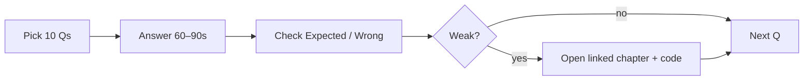

# 150 Senior JavaScript Q&A

This chapter is a **teaching drill set**, not a cheat sheet. Each answer explains the idea in plain language so you can *teach it back* in an interview. Keep about **150 questions**, grouped by topic.

For every question you will see:

- **Expected** — a short paragraph you should be able to say (60–90 seconds)
- **Common wrong** — the trap answer that loses senior credit
- **Follow-ups** — where interviewers dig next
- **Production** — why it matters beyond the whiteboard

Cross-link deep dives: [Event Loop](/javascript/10-event-loop), [Closures](/javascript/05-closures), [Modules](/javascript/13-modules), [Rendering](/javascript/20-rendering), [Security](/javascript/21-security), [Performance](/javascript/22-performance), [Machine Coding](/javascript/23-machine-coding).

---
## Q1–Q25: Fundamentals & language semantics

These questions check whether you understand *values*, *bindings*, and *identity* — the ground floor everything else sits on. Interviewers use them to see if you can explain coercion and prototypes without mythology.

### Q1. What are JS data types?
- **Expected:** JavaScript has seven primitive types — string, number, bigint, boolean, undefined, symbol, and null — plus objects. Arrays, functions, dates, maps, and regular expressions are all objects (functions are callable objects). Interviews want this list plus the reminder that `typeof null === 'object'` is a historical bug, not a design goal.
- **Common wrong:** Listing only five or six types, or saying null is intentionally an object type.
- **Follow-ups:** Why is typeof null 'object'? How do Symbol() and Symbol.for() differ?
- **Production:** Validate and narrow types at API boundaries; silent coercion at the edge causes production bugs.
### Q2. null vs undefined?
- **Expected:** undefined means a variable or property has not been given a value (missing, uninitialized, or a function returned nothing). null is an intentional empty value you assign to mean “no object.” Loose equality `null == undefined` is true; strict `===` is false. Prefer documenting which sentinel your API uses.
- **Common wrong:** Treating them as identical everywhere, or using them randomly in the same codebase.
- **Follow-ups:** What should APIs return for missing data? How does optional chaining treat nullish values?
- **Production:** Pick one sentinel per API surface; document JSON null versus omitted keys so clients do not diverge.
### Q3. == vs === vs Object.is?
- **Expected:** `===` compares without coercion (same type required, with NaN quirks). `==` applies abstract equality with coercion — surprising for mixed types. `Object.is` is like `===` except `Object.is(NaN, NaN)` is true and `Object.is(+0, -0)` is false. Day-to-day code should prefer `===` or nullish checks.
- **Common wrong:** Saying == is fine if you are careful, or that Object.is is literally identical to ===.
- **Follow-ups:** When is `x == null` idiomatic? Give a real Object.is use case (NaN maps, -0).
- **Production:** Lint-ban == except nullish comparisons; reduces an entire class of production incidents.
### Q4. Is JavaScript pass-by-reference?
- **Expected:** JavaScript is pass-by-value. For objects, the value is a reference (pointer-like). Mutating properties through that reference is visible to the caller; reassigning the parameter only changes the local binding. Saying “objects are pass-by-reference” like C++ references is imprecise and confuses interviewers who care about rebinding vs mutation.
- **Common wrong:** Claiming objects are pass-by-reference in the C++ sense.
- **Follow-ups:** Show reassign-vs-mutate with a short code example.
- **Production:** Accidental shared mutation across modules and stores is a common production bug — prefer immutable updates for shared state.
### Q5. What does const freeze?
- **Expected:** `const` freezes the binding: you cannot reassign the variable. Object contents remain mutable unless you also use `Object.freeze`, deep-freeze patterns, or immutable libraries. `const` is about the name, not deep immutability.
- **Common wrong:** Believing const deep-freezes objects.
- **Follow-ups:** freeze vs seal vs preventExtensions?
- **Production:** Freeze config objects in production builds to catch accidental mutation early.
### Q6. Explain ToPrimitive / coercion.
- **Expected:** When JS needs a primitive from an object, it uses ToPrimitive: prefer `Symbol.toPrimitive` if present, otherwise typically `valueOf` then `toString` (order depends on the hint: number vs string). Operators like `+` and `==` lean on these abstract operations. Senior answers name the mechanism, not only a coercion table.
- **Common wrong:** Only listing == cases without mentioning abstract operations / hints.
- **Follow-ups:** How does `+` decide between addition and concatenation?
- **Production:** Convert explicitly at system boundaries instead of relying on implicit coercion.
### Q7. Why [] == ![] is true?
- **Expected:** `![]` is false because arrays are truthy. Then `[] == false` coerces both sides toward numbers: ToNumber([]) is 0, ToNumber(false) is 0, so 0 == 0. It is not because empty arrays are falsy — they are truthy under Boolean().
- **Common wrong:** Because empty arrays are falsy.
- **Follow-ups:** Compare `[] == false` with `Boolean([])`. What about `[] == true`?
- **Production:** Never rely on == between objects and primitives in conditionals.
### Q8. Boxing / autoboxing?
- **Expected:** Primitives temporarily get wrapped in object wrappers so you can call methods (`'hi'.toUpperCase()`). Using `new String()` / `new Boolean()` creates real objects with surprising truthiness and identity. Prefer primitives; avoid wrapper constructors.
- **Common wrong:** Claiming strings are always objects.
- **Follow-ups:** Why is `new Boolean(false)` truthy?
- **Production:** Ban wrapper constructors in style guides and lint rules.
### Q9. Symbol use cases?
- **Expected:** Symbols create unique property keys that avoid accidental name collisions, and power well-known protocols (`Symbol.iterator`, `Symbol.toPrimitive`, `Symbol.toStringTag`). They are not “fancy strings” — uniqueness and non-enumerability patterns matter for library APIs.
- **Common wrong:** Treating Symbols as just another string key.
- **Follow-ups:** Are symbol keys enumerable in for…in / Object.keys? What is Symbol.for?
- **Production:** Libraries stash meta-keys without breaking user enumeration of data properties.
### Q10. structuredClone vs JSON clone?
- **Expected:** `JSON.parse(JSON.stringify(x))` loses undefined, functions, symbols, Dates become strings, and cannot handle cycles. `structuredClone` preserves more types (Date, Map, Set, ArrayBuffer, cyclic graphs) via the structured-clone algorithm used by postMessage and IndexedDB. Neither clones functions or DOM nodes meaningfully.
- **Common wrong:** Saying they are equivalent.
- **Follow-ups:** What can structuredClone not clone? How do transferables work with postMessage?
- **Production:** Know structured clone limits when using workers, IndexedDB, or cloning Redux-like state.
### Q11. What is a pure function?
- **Expected:** A pure function returns the same output for the same inputs and performs no observable side effects (no writing globals, no DOM, no network, no reading mutable external state). Purity enables testing, caching, and safer concurrency reasoning. `Date.now` and `Math.random` break purity.
- **Common wrong:** Any function without await, or any function that only returns a value.
- **Follow-ups:** Are Date.now or Math.random pure? Can a pure function call other pure functions?
- **Production:** Pure cores are testable and cacheable — relevant to memoization and React Compiler / selectors.
### Q12. var vs let vs const?
- **Expected:** `var` is function-scoped, hoisted, and initialized to undefined. `let`/`const` are block-scoped and live in the Temporal Dead Zone until initialized. `const` forbids rebinding but not mutation of object contents. Modern code defaults to `const`, uses `let` when rebinding is needed, and avoids `var`.
- **Common wrong:** Saying let is block-scoped and const makes values deeply immutable.
- **Follow-ups:** Explain TDZ with a failing example. What happens with var in loops with async callbacks?
- **Production:** Default const; let when rebind needed; never var in modern app code.
### Q13. What is NaN?
- **Expected:** NaN means Not-a-Number under IEEE floating point; `typeof NaN` is still `'number'`. NaN is not equal to itself (`NaN !== NaN`). Detect with `Number.isNaN` (not global `isNaN`, which coerces).
- **Common wrong:** Thinking NaN means null, or checking with `== NaN`.
- **Follow-ups:** isNaN vs Number.isNaN? How does SameValueZero treat NaN in Set/Map?
- **Production:** Validate parses with Number.isFinite before doing math in production.
### Q14. MAX_SAFE_INTEGER significance?
- **Expected:** `Number.MAX_SAFE_INTEGER` is 2^53 − 1. Above that, not every integer is exactly representable in float64, so IDs can silently corrupt. BigInt or strings are the usual escapes for snowflake IDs.
- **Common wrong:** Calling it the maximum number JavaScript can store (Infinity exists; floats go beyond).
- **Follow-ups:** How do you handle Twitter/Discord snowflake IDs in JSON?
- **Production:** Serialize large integer IDs as strings in JSON APIs.
### Q15. 0.1+0.2 !== 0.3 why?
- **Expected:** Binary floating point cannot represent many decimals exactly, so the sum is a nearby float, not 0.3. This is IEEE behavior shared by most languages, not a unique JavaScript bug. Compare with epsilon, or use integer cents / decimal libraries for money.
- **Common wrong:** Blaming a JavaScript-only rounding bug.
- **Follow-ups:** How do you compare floats safely? What is a money strategy?
- **Production:** Integer cents or decimal libraries for currency — never raw binary floats for money.
### Q16. bigint vs number?
- **Expected:** bigint holds arbitrary-precision integers (`10n`). You cannot mix bigint and number in arithmetic without explicit conversion. JSON has no native bigint — you need custom serialization. bigint is not a bigger float.
- **Common wrong:** Calling bigint a bigger floating-point number.
- **Follow-ups:** What about `0n == 0` vs `===`? JSON strategies?
- **Production:** Use bigint for crypto/int IDs when needed; document serialization contracts.
### Q17. Falsy values list?
- **Expected:** Exactly: false, 0, -0, 0n, '', null, undefined, NaN. Empty arrays and objects are truthy. Many bugs come from treating 0 or '' as missing when using truthiness checks.
- **Common wrong:** Including [] or {} as falsy.
- **Follow-ups:** Why is [] truthy but [] == false?
- **Production:** Prefer explicit nullish checks when 0 and '' are valid data.
### Q18. Property descriptors — what are they?
- **Expected:** Every property has attributes: for data properties, value/writable/enumerable/configurable; for accessors, get/set plus enumerable/configurable. `Object.defineProperty` exposes them; object literals use defaults that differ slightly. This explains freeze/seal and non-enumerable library fields.
- **Common wrong:** Thinking properties are only keys and values with no attributes.
- **Follow-ups:** Defaults of defineProperty vs literals? How does freeze use configurability?
- **Production:** Libraries use non-enumerable fields; freeze for shallow immutability contracts.
### Q19. Object.freeze vs seal?
- **Expected:** `freeze` makes an object non-extensible and all own properties non-writable and non-configurable — values cannot change at the top level. `seal` prevents adding/removing/reconfiguring properties but leaves writable values mutable. Both are shallow.
- **Common wrong:** Saying they are the same.
- **Follow-ups:** How do you deep-freeze? Performance cost?
- **Production:** Shallow freeze only catches top-level mutation — document that limit.
### Q20. Prototype chain lookup?
- **Expected:** Property access checks the object, then walks `[[Prototype]]` until null. Own properties shadow prototypes. `in` sees the chain; `Object.hasOwn` / `hasOwnProperty` check ownership. This is the core of JS inheritance.
- **Common wrong:** Claiming inheritance always copies parent methods onto the child.
- **Follow-ups:** hasOwn vs in? What is shadowing?
- **Production:** Avoid mutating shared prototypes at runtime across an app.
### Q21. classical vs prototypal inheritance?
- **Expected:** JavaScript is prototypal: objects delegate to other objects. `class` syntax is sugar over constructor functions and prototypes, not Java-style classical inheritance under the hood. Prefer composition for domain models when it clarifies ownership.
- **Common wrong:** Saying JS has true classical inheritance identical to Java.
- **Follow-ups:** What does extends set up on the prototype chain?
- **Production:** Prefer composition for app domain models; use class when the domain fits hierarchies.
### Q22. new keyword steps?
- **Expected:** Roughly: create a new object; set its prototype to `Fn.prototype`; call `Fn` with `this` bound to that object; return the object unless the constructor explicitly returns another object. Returning a primitive is ignored.
- **Common wrong:** Saying new only assigns this.
- **Follow-ups:** What if the constructor returns a number? What if it returns an object?
- **Production:** Factories are sometimes clearer than new for flexible return types.
### Q23. this binding rules?
- **Expected:** `this` is decided by call site (except arrows, which are lexical): default (undefined in strict / global in sloppy), implicit (obj.method), explicit (call/apply/bind), and new. Priority commonly taught: new > bind > call/apply > implicit > default. Lost `this` in callbacks is a classic bug.
- **Common wrong:** Claiming this always equals the object before the dot.
- **Follow-ups:** Arrow methods on prototypes? Class field arrows vs prototype methods?
- **Production:** Lost this in callbacks — bind, arrows, or wrap; a frequent production bug.
### Q24. Arrow functions differences?
- **Expected:** Arrows inherit lexical `this`, `arguments`, `super`, and `new.target`; they are not constructible and have no prototype. They are not just shorter syntax — the binding rules change which patterns they fit.
- **Common wrong:** Only mentioning shorter syntax.
- **Follow-ups:** When should you not use arrows?
- **Production:** Prototype methods that need dynamic this should be regular methods, not arrows.
### Q25. Closures — define precisely?
- **Expected:** A closure is a function plus its retained lexical environment — it can access outer variables even after the outer function returned. Closures enable privacy and callbacks, but they also retain memory. Loop + async bugs differ for var vs let.
- **Common wrong:** Saying closures are only nested functions or only for privacy.
- **Follow-ups:** Memory retention? Loop var vs let with setTimeout?
- **Production:** Stale closures in React effects/handlers — dependency arrays matter.

## Q26–Q50: Scope, async, event loop, memory

Here the focus is *when code runs* and *what stays alive*. If you can explain microtasks vs macrotasks and common leak patterns, you clear a large fraction of senior FE screens.

### Q26. Lexical vs dynamic scope?
- **Expected:** JavaScript uses lexical (static) scope: free variables resolve by where the function was written, not where it was called. The major exception people confuse with dynamic scope is `this`, which is call-site based (except arrow functions). Lexical scope makes refactors predictable.
- **Common wrong:** Claiming JavaScript is dynamically scoped.
- **Follow-ups:** How is this not lexical (except arrows)?
- **Production:** Predictable scoping aids large refactors and code review.
### Q27. What is TDZ?
- **Expected:** The Temporal Dead Zone is the period from entering a scope until a `let`/`const` binding is initialized. Accessing the binding throws ReferenceError. Unlike `var`, you do not get silent undefined. `typeof` on an undeclared binding is safe; `typeof` on a TDZ binding still throws.
- **Common wrong:** Equating TDZ with var hoisting to undefined.
- **Follow-ups:** typeof undeclared vs typeof a TDZ let?
- **Production:** TDZ makes certain bugs loud instead of undefined — prefer that in production code.
### Q28. Module scope vs script?
- **Expected:** Classic scripts share the global object; top-level vars can become globals. ES modules have their own top-level scope, run in strict mode, defer by default as classic scripts would with defer, and use live bindings for imports/exports.
- **Common wrong:** Saying modules and scripts are identical.
- **Follow-ups:** What are live bindings? How do you mark a browser script as a module?
- **Production:** ESM encapsulation prevents accidental global leaks.
### Q29. Event loop high level?
- **Expected:** Synchronous code runs on the call stack. Browser/Node APIs schedule work onto task queues. After each macrotask, the engine drains the microtask queue completely, then may render. Long tasks block input and frames. `setTimeout(0)` is not sooner than promise microtasks.
- **Common wrong:** Claiming setTimeout(0) runs before promises.
- **Follow-ups:** Where do MutationObserver and queueMicrotask fit?
- **Production:** Long tasks block input — yield work for better INP.
### Q30. Microtask vs macrotask examples?
- **Expected:** Microtasks include Promise reactions, queueMicrotask, and MutationObserver callbacks. Macrotasks include setTimeout/setInterval, I/O, message events, and many UI events. Promises are not macrotasks. Unbounded microtask scheduling can starve rendering.
- **Common wrong:** Calling promises macrotasks.
- **Follow-ups:** Can microtask recursion starve the event loop?
- **Production:** Do not chain unbounded then handlers in tight loops in production.
### Q31. Node event loop phases?
- **Expected:** Node’s loop is phased: timers → pending callbacks → idle/prepare → poll → check (setImmediate) → close callbacks, with process.nextTick and promise microtasks running between phases. It is not identical to the browser model; nextTick can starve the loop if abused.
- **Common wrong:** Saying Node and browser event loops are the same.
- **Follow-ups:** process.nextTick vs Promise.then vs setImmediate?
- **Production:** Starvation via nextTick is a known production footgun.
### Q32. Promise states?
- **Expected:** A promise is pending, fulfilled, or rejected. Settlement is one-way and sticky. “Resolved” can mean “following another thenable,” which is not always “fulfilled.” Attach handlers; never assume a promise stays pending forever.
- **Common wrong:** Using resolved as a synonym for fulfilled always.
- **Follow-ups:** What happens when you resolve with another promise/thenable?
- **Production:** Treat unhandled rejections as bugs; attach catch paths consistently.
### Q33. Implement Promise.then chaining semantics?
- **Expected:** Returning a value fulfills the next promise; throwing rejects it; returning a thenable adopts that thenable’s settlement. Reactions run asynchronously as microtasks even if the promise is already settled — this avoids Zalgo.
- **Common wrong:** Claiming then callbacks always run synchronously.
- **Follow-ups:** Why are reactions async even for already-settled promises?
- **Production:** Consistent async public APIs prevent Zalgo surprises.
### Q34. async/await desugar?
- **Expected:** `async` functions always return promises. `await` pauses the async function’s execution and resumes via a microtask when the awaited value settles. It does not block the OS thread; other JS can run on the same thread meanwhile.
- **Common wrong:** Saying await blocks the operating-system thread.
- **Follow-ups:** Error handling with try/catch vs .catch on the returned promise?
- **Production:** Await yields the JS call stack, but CPU-heavy sync work still blocks — move that to workers.
### Q35. Promise.all semantics?
- **Expected:** `Promise.all` fulfills with an array of results in input order when every input fulfills, and rejects on the first rejection (fail-fast). Empty input fulfills with []. Partial success needs `allSettled` or manual patterns.
- **Common wrong:** Saying it waits for all rejections before failing.
- **Follow-ups:** Empty array behavior? How do you get partial success?
- **Production:** Use allSettled for batch jobs that must report every outcome.
### Q36. Promise.race vs any?
- **Expected:** `race` settles with the first settlement — fulfill or reject. `any` fulfills with the first fulfillment and only rejects if every input rejects, via AggregateError. Timeout helpers often use race plus AbortSignal for real cancellation.
- **Common wrong:** Saying race and any are the same.
- **Follow-ups:** How do you implement a timeout with race? Why cancel underlying work too?
- **Production:** Always pair timeout races with AbortSignal so work actually stops.
### Q37. Unhandled rejection?
- **Expected:** A rejected promise with no rejection handler becomes an unhandled rejection. Browsers and Node emit events; Node policies may crash. It is not automatically a synchronous throw in your current stack.
- **Common wrong:** Believing unhandled rejections become synchronous throws always.
- **Follow-ups:** How do you globally log unhandledrejections?
- **Production:** Treat as a bug; alert; fail CI on unhandled rejections.
### Q38. What is Zalgo?
- **Expected:** Zalgo is the hazard of an API that sometimes calls back synchronously and sometimes asynchronously, making stack traces and ordering unpredictable. Promises avoid this by always deferring reactions. Public I/O APIs should be consistently async.
- **Common wrong:** Calling Zalgo a JavaScript engine bug.
- **Follow-ups:** How do Promises avoid Zalgo?
- **Production:** Always-async public APIs for I/O keep production debugging sane.
### Q39. Generators vs async generators?
- **Expected:** `function*` yields an iterator you pull with next(). `async function*` yields promises of values — useful for async streams you pull with for-await. Generators are not obsolete; they model pull-based sequences and historically powered sagas.
- **Common wrong:** Saying generators are obsolete because async/await exists.
- **Follow-ups:** Pull vs push streams? When prefer Observables?
- **Production:** Useful for pagination iterators and streaming pipelines.
### Q40. for await…of?
- **Expected:** `for await…of` consumes async iterables, awaiting each `next()`. It also works with sync iterables by awaiting values. Breaking should trigger the iterator’s `return()` for cleanup when implemented.
- **Common wrong:** Thinking it only works by magic on sync arrays without iteration protocols.
- **Follow-ups:** What happens on break regarding cleanup return()?
- **Production:** Streaming APIs (files, fetch bodies) in Node and browsers use async iteration.
### Q41. AbortController purpose?
- **Expected:** AbortController provides a signal you pass to fetch and other APIs to cancel work. Abort rejects with AbortError (DOMException). It does not kill the JS thread; it cooperatively cancels. Compose timeouts with AbortSignal.timeout or AbortSignal.any.
- **Common wrong:** Saying it kills the JavaScript thread.
- **Follow-ups:** How do you compose multiple signals? Timeout patterns?
- **Production:** Cancel stale React requests on unmount to avoid setState-after-unmount races.
### Q42. Debounce vs throttle?
- **Expected:** Debounce waits until events go quiet for N ms, then runs once — ideal for search boxes. Throttle caps how often a handler runs during continuous events — ideal for scroll. Leading/trailing edges and maxWait are common follow-ups.
- **Common wrong:** Swapping the two definitions.
- **Follow-ups:** Leading/trailing? What is maxWait?
- **Production:** Search debounce and scroll throttle are everyday UX/perf tools.
### Q43. requestAnimationFrame vs setTimeout for animation?
- **Expected:** rAF schedules work before the next paint, syncs to display refresh, and typically pauses in background tabs. setTimeout(16) drifts, is not paint-aligned, and keeps firing in ways that waste battery. Use rAF for visual work.
- **Common wrong:** Equating setTimeout(16) with reliable 60fps.
- **Follow-ups:** Why schedule layout reads inside rAF?
- **Production:** Smooth UI and better background-tab battery behavior.
### Q44. queueMicrotask vs Promise.resolve().then?
- **Expected:** Both schedule microtasks. queueMicrotask states intent clearly without creating a promise. Subtle edge-case differences exist but rarely matter. Neither is a macrotask.
- **Common wrong:** Calling queueMicrotask a macrotask.
- **Follow-ups:** When prefer one over the other?
- **Production:** Be careful flushing state before paint — unbounded microtasks starve rendering.
### Q45. Memory leak common FE causes?
- **Expected:** Common leaks: detached DOM nodes still referenced by listeners, uncleared intervals/timeouts, growing unbounded caches, closures retaining large data, observers not disconnected. GC does not save you if references remain reachable.
- **Common wrong:** Saying JavaScript cannot leak because it has GC.
- **Follow-ups:** How do you diagnose with heap snapshots?
- **Production:** Cleanup in useEffect; hunt retained detached nodes in production incidents.
### Q46. GC mark-sweep / generations (high level)?
- **Expected:** Garbage collectors free objects unreachable from roots. Engines like V8 use generational and incremental/concurrent strategies so pauses stay short. GC does not run on a fixed “every N seconds” schedule you can rely on.
- **Common wrong:** Claiming GC runs on a fixed timer always.
- **Follow-ups:** What retains objects? What are roots?
- **Production:** Avoid accidental globals retaining large trees.
### Q47. WeakMap / WeakRef use?
- **Expected:** WeakMap keys are held weakly: if nothing else references the key, the entry can be collected — perfect for metadata without pinning objects. Values are strong. WeakRef and FinalizationRegistry are advanced and easy to misuse. Keys must be objects.
- **Common wrong:** Saying WeakMap has weak values, or is just a Map synonym.
- **Follow-ups:** Why must keys be objects? When use WeakSet?
- **Production:** Object-keyed caches without leaking the keys.
### Q48. event.preventDefault vs stopPropagation?
- **Expected:** `preventDefault` cancels the browser’s default action (navigate, check checkbox). `stopPropagation` stops the event from traveling further in capture/bubble. `stopImmediatePropagation` also skips remaining listeners on the same node. Passive listeners cannot preventDefault on touch/wheel.
- **Common wrong:** Treating them as synonyms.
- **Follow-ups:** What is stopImmediatePropagation? Why passive listeners?
- **Production:** Passive touch listeners improve scroll performance — know the trade-off.
### Q49. Event delegation why?
- **Expected:** One listener on a parent handles many children via event.target/closest, works for dynamically added nodes, and uses less memory than thousands of per-row listeners. For large lists it is the standard pattern.
- **Common wrong:** Claiming per-element listeners are always faster/simpler at scale.
- **Follow-ups:** Show closest + contains guarding.
- **Production:** Standard approach for large tables and dynamic lists.
### Q50. Capture vs bubble?
- **Expected:** The event travels capture phase from root toward the target, then bubble phase back out. Default addEventListener uses bubble. Capture is useful to intercept early (outside-click, some analytics).
- **Common wrong:** Saying bubble happens first.
- **Follow-ups:** When listen in capture?
- **Production:** Outside-click and analytics libraries often use capture.

## Q51–Q75: Modules, collections, strings, errors

This block mixes module-system literacy with everyday data structures and failure modes. Senior candidates should connect tree-shaking, prototype pollution, and JSON quirks to real shipping bugs.

### Q51. ESM vs CJS?
- **Expected:** ESM uses static import/export, live bindings, and async loading semantics with browser support. CommonJS uses synchronous require and a mutable module.exports object, historically Node-centric. Interop is asymmetric: importing CJS often works; requiring pure ESM usually does not without dynamic import().
- **Common wrong:** Saying they are only different syntax for the same model.
- **Follow-ups:** Can CJS require ESM? What is the dual-package hazard?
- **Production:** Prefer ESM-first packages; dual packages can duplicate singletons.
### Q52. Live bindings?
- **Expected:** An imported name is a live read of the exporter’s binding. If the exporter reassigns an exported `let`, importers see the update. Importers cannot reassign the binding themselves. This differs from “copy the value once at import time.”
- **Common wrong:** Believing imports always copy primitives once.
- **Follow-ups:** How do circular dependencies interact with live bindings?
- **Production:** Avoid reading partially initialized exports at module top level across cycles.
### Q53. Tree shaking requirements?
- **Expected:** Bundlers eliminate unused exports best with static ESM structure and side-effect-free modules. Dynamic import paths and heavy side effects defeat shaking. CJS is harder to shake reliably. Barrel files can pull large graphs accidentally.
- **Common wrong:** Claiming tree shaking always works automatically, including for CJS.
- **Follow-ups:** How do barrel files hurt? What does sideEffects in package.json mean?
- **Production:** Library authors should set sideEffects correctly; apps should avoid mega-barrels.
### Q54. Array map vs forEach?
- **Expected:** `map` transforms to a new array; `forEach` runs side effects and returns undefined. Prefer map when producing data — intent is clearer. Performance differences rarely matter next to I/O and layout. Hole/sparse behavior can differ across methods.
- **Common wrong:** Saying forEach is always faster so use it for transforms.
- **Follow-ups:** How do they treat holes in sparse arrays?
- **Production:** Prefer map for transforms — clearer reviews and fewer accidental mutations.
### Q55. Why reduce needs initialValue?
- **Expected:** Without an initial value, reduce uses the first element as the accumulator and fails on empty arrays. An explicit initial value also fixes the accumulator’s type. Always pass an init in production code.
- **Common wrong:** Saying initialValue is optional and never matters.
- **Follow-ups:** Implement reduce? What happens on [] without init?
- **Production:** Always pass initialValue in production reducers.
### Q56. flatMap?
- **Expected:** `flatMap` maps then flattens one level — ideal for 1-to-many expansions without nested arrays. It is not a deep recursive flatten; use flat(Infinity) or recursive approaches carefully for deep structures.
- **Common wrong:** Calling it a deep recursive flatten.
- **Follow-ups:** How would you implement flat?
- **Production:** Cleaner than nested loops when expanding lists.
### Q57. Sparse arrays?
- **Expected:** Sparse arrays have holes — indexes that are not present, which is different from storing undefined. Some methods skip holes; `new Array(n).map(...)` often does nothing useful because of holes. Prefer `Array.from({ length: n }, fn)` to initialize.
- **Common wrong:** Saying sparse arrays are just arrays filled with undefined.
- **Follow-ups:** Why does new Array(n).map fail to populate?
- **Production:** Prefer Array.from({length}) or explicit fills when initializing.
### Q58. sort default behavior?
- **Expected:** Without a comparator, sort converts elements to strings and sorts lexicographically — so [10, 2] becomes [10, 2] as strings wrongly for numbers. sort mutates in place; use toSorted when you need immutability. Modern engines use stable sort.
- **Common wrong:** Assuming numeric ascending sort by default.
- **Follow-ups:** toSorted? Stability guarantees?
- **Production:** Never sort React state arrays in place — copy first or use toSorted.
### Q59. includes vs indexOf with NaN?
- **Expected:** `includes` uses SameValueZero and can find NaN. `indexOf` uses strict equality and cannot find NaN. Prefer includes for membership checks.
- **Common wrong:** Saying they behave identically for all values.
- **Follow-ups:** find vs filter differences?
- **Production:** Use includes for membership; be explicit for object identity checks.
### Q60. UTF-16 and string.length?
- **Expected:** JavaScript strings are UTF-16 code units. `length` counts units, so many emoji are length 2. `for…of` iterates code points. Grapheme clusters (what users see as one character) may need `Intl.Segmenter`.
- **Common wrong:** Assuming length always equals user-perceived characters.
- **Follow-ups:** Grapheme clusters / Segmenter?
- **Production:** Truncate carefully for UX and database limits.
### Q61. slice vs substring?
- **Expected:** Prefer `slice`: it supports negative indexes and has predictable argument order. `substring` swaps args if start > end and treats negatives as 0. `substr` is legacy. Consistency beats cleverness.
- **Common wrong:** Saying slice and substring are identical.
- **Follow-ups:** What is the status of substr?
- **Production:** Standardize on slice in shared string utils.
### Q62. encodeURI vs encodeURIComponent?
- **Expected:** `encodeURI` encodes a full URI but leaves structural characters like `/ ? &`. `encodeURIComponent` encodes those too — use it for query parameter values and path segments. Mixing them up breaks APIs and can contribute to open-redirect issues.
- **Common wrong:** Treating them as interchangeable.
- **Follow-ups:** When does decodeURIComponent throw?
- **Production:** Wrong encoding breaks APIs and can create security footguns.
### Q63. Intl.NumberFormat why?
- **Expected:** Locale-aware number and currency formatting beats brittle `toFixed` for global products. Pair with `Intl.Collator` for sorting and `DateTimeFormat` for dates. i18n is correctness, not polish.
- **Common wrong:** Saying toFixed is enough for global currency display.
- **Follow-ups:** Collator for sorting? PluralRules?
- **Production:** i18n correctness for global products and legal currency display.
### Q64. Custom Error classes?
- **Expected:** Extend Error, set name/code, use `cause` for wrapping, and ensure prototype chain is correct for instanceof. Throwing strings loses stacks and type information. Across iframes, instanceof can fail — duck-type carefully.
- **Common wrong:** Saying throw 'string' is fine in apps.
- **Follow-ups:** instanceof across iframes/realms?
- **Production:** Stable error codes enable client handling and metrics.
### Q65. try/catch and promises?
- **Expected:** try/catch catches synchronous throws and rejections when you await inside try. Creating a rejected promise without await/catch is not caught by an outer try. finally can unexpectedly override returns if you return inside it.
- **Common wrong:** Believing try wraps any promise creation automatically.
- **Follow-ups:** finally return override? How to handle floating promises?
- **Production:** Always handle rejections; monitor unhandledrejection.
### Q66. Operational vs programmer errors?
- **Expected:** Operational errors are expected at runtime (network down, disk full) and often retryable with backoff. Programmer errors are bugs (calling API wrong) — fail loud, fix the code. Not all errors should be retried.
- **Common wrong:** Treating all errors as retryable.
- **Follow-ups:** When should a Node process crash?
- **Production:** Retry policies only for operational failures with jittered backoff.
### Q67. AggregateError?
- **Expected:** AggregateError holds multiple errors — used by Promise.any when all reject, and useful for batch validation. Log the `.errors` array, not only the message string.
- **Common wrong:** Treating it as a normal Error with an array jammed into message.
- **Follow-ups:** How do you log AggregateError well?
- **Production:** Batch job failure reporting and Promise.any failures.
### Q68. JSON.stringify quirks?
- **Expected:** stringify drops undefined object properties, turns undefined array holes/elements into null, cannot serialize bigint by default, turns Date to ISO strings, and collapses Error to `{}`. It is not a perfect type-preserving round trip.
- **Common wrong:** Assuming perfect round trips for all JS values.
- **Follow-ups:** replacer and space arguments? toJSON methods?
- **Production:** Define explicit DTOs for API payloads.
### Q69. deep equality approaches?
- **Expected:** Deep equality walks structure (with cycle care via WeakMap), or you use libraries (lodash isEqual) or compare structured clones carefully. `===` only compares object identity, not content. Deep equality is expensive — use sparingly.
- **Common wrong:** Using === and expecting content comparison for objects.
- **Follow-ups:** Performance trade-offs? When prefer reference equality?
- **Production:** Prefer identity checks in React; deep-equal sparingly in tests/selectors.
### Q70. Object.assign vs spread?
- **Expected:** Both do shallow copies. Spread is an expression; assign can target an existing object. Getters are invoked; nested objects remain shared. Neither deep-merges. Resulting objects are typically plain objects with Object.prototype.
- **Common wrong:** Calling either a deep merge.
- **Follow-ups:** Prototype of the result? Symbol own keys behavior?
- **Production:** Immutable updates commonly use `{ ...state, x }` patterns.
### Q71. prototype pollution?
- **Expected:** If you recursively merge untrusted JSON into objects, keys like `__proto__` or `constructor.prototype` can mutate Object.prototype and change behavior app-wide — a security bug, not just Node-specific. Mitigate with Object.create(null), key allowlists, freeze, and safe merge libraries.
- **Common wrong:** Saying it is only a Node issue or only theoretical.
- **Follow-ups:** Mitigations? HasOwn checks?
- **Production:** Security-critical: sanitize merges; prefer Map or null-prototype objects for dictionaries.
### Q72. Map vs Object as dictionary?
- **Expected:** Map accepts any key type, has size, has guaranteed insertion order, and avoids prototype-key pitfalls. Objects are JSON-friendly and ergonomic for fixed shapes. User-controlled string keys often belong in Map (or null-prototype objects).
- **Common wrong:** Saying Object is always better or always worse.
- **Follow-ups:** When WeakMap instead?
- **Production:** User-keyed caches and dynamic dictionaries → Map.
### Q73. Set use cases?
- **Expected:** Set stores unique values with average O(1) membership tests — tags, visited nodes in graphs, dedupe. NaN is treated as the same value in Set (SameValueZero). Prefer Set over repeated array includes for large membership tests.
- **Common wrong:** Saying a deduped array is always equivalent in performance and clarity.
- **Follow-ups:** NaN in Set? How to compute intersection?
- **Production:** Tag sets and graph visited sets in algorithms and UI state.
### Q74. Typed arrays when?
- **Expected:** Typed arrays (Uint8Array, Float64Array, …) view binary buffers for WASM, crypto, media, and network protocols. They are fixed-length and numeric-only — not a faster general replacement for number[]. Endianness matters with DataView.
- **Common wrong:** Claiming typed arrays are always faster than number[].
- **Follow-ups:** Endianness? Relationship to ArrayBuffer?
- **Production:** File/image/audio processing pipelines and protocol parsers.
### Q75. Proxy uses?
- **Expected:** Proxy intercepts get/set/apply and more — powering reactive systems (Vue 3), validation layers, virtual properties, and negative-index arrays. It is more general than defineProperty alone, with invariants and performance costs. Revocable proxies exist for lockdown patterns.
- **Common wrong:** Saying Proxy is the same as Object.defineProperty.
- **Follow-ups:** Revocable proxies? Invariants with frozen targets?
- **Production:** Vue 3 reactivity — know the cost of many proxies on hot paths.

## Q76–Q100: Browser, rendering, security, performance

This is the “ship it in Chrome” block: critical rendering path, Core Web Vitals, XSS/CSRF, and platform APIs. Pair answers with a metric or a threat model — seniors do not recite buzzwords alone.

### Q76. Critical rendering path?
- **Expected:** Bytes arrive as HTML → DOM; CSS → CSSOM; they combine into a render tree; then layout, paint, and composite to the screen. JS can block parsing and force reflows. Optimizing CRP means fewer critical bytes and round trips before meaningful paint — not only faster JS.
- **Common wrong:** Saying only JavaScript execution time matters.
- **Follow-ups:** What blocks first paint? How do scripts and CSS interact?
- **Production:** Optimize CRP specifically against LCP/FCP goals.
### Q77. defer vs async script?
- **Expected:** Both download in parallel without blocking the HTML parser the way classic blocking scripts do. defer runs after document parse and preserves order. async runs as soon as downloaded, unordered. `type=module` is deferred by default and understands dependencies.
- **Common wrong:** Claiming async preserves execution order.
- **Follow-ups:** What is the default for type=module?
- **Production:** Ship app bundles as module or defer — avoid blocking head scripts.
### Q78. Why CSS render-blocking?
- **Expected:** Without styles, first paint would be unstyled then flash into the real design (FOUC). Browsers wait for critical CSSOM before painting. `media="print"` stylesheets do not block screen paint. Inlining critical CSS trades cacheability for speed.
- **Common wrong:** Saying CSS never blocks rendering.
- **Follow-ups:** media=print trick? Critical CSS inlining trade-offs?
- **Production:** Measure LCP when choosing inline vs external critical CSS.
### Q79. Layout thrashing?
- **Expected:** Alternating DOM writes with geometry reads (`offsetHeight`, getBoundingClientRect) forces repeated synchronous reflows. Batch writes then reads, or schedule via rAF. This is a major jank source in UI code.
- **Common wrong:** Blaming thrashing on merely having many CSS classes.
- **Follow-ups:** How do you batch reads/writes?
- **Production:** Profile forced reflow in Performance panel when UI janks.
### Q80. Compositor-only animations?
- **Expected:** Animating transform and opacity can often run on the compositor without layout/paint on every frame. Animating top/left/width usually forces layout and paint. will-change can promote layers but wastes memory if overused.
- **Common wrong:** Claiming any CSS property is compositor-only.
- **Follow-ups:** will-change pitfalls?
- **Production:** Aim for 60fps interactions without blocking the main thread.
### Q81. LCP meaning and fixes?
- **Expected:** Largest Contentful Paint marks when the largest visible content element appears. Improve TTFB, prioritize the LCP resource (preload/fetchpriority), shrink render-blocking CSS/JS, and serve properly sized compressed images. It is not the same as FCP.
- **Common wrong:** Equating LCP with FCP.
- **Follow-ups:** What element is typically the LCP? How do you find it in DevTools?
- **Production:** Core Web Vital for SEO and real-user UX.
### Q82. INP meaning and fixes?
- **Expected:** Interaction to Next Paint measures how quickly the page responds to user input across the visit (replacing FID as the responsiveness vital). Fix by shortening handlers, yielding long tasks, reducing hydration work, and moving CPU off-thread. It is not merely FPS of animations.
- **Common wrong:** Treating INP as identical to animation FPS.
- **Follow-ups:** How does INP differ from FID?
- **Production:** Track INP in RUM — it catches real interaction pain.
### Q83. CLS causes?
- **Expected:** Cumulative Layout Shift comes from unsized images/ads, late font swaps, and injecting content above existing content without reserved space. Slow networks can amplify it but are not the root definition. Reserve space and stabilize fonts.
- **Common wrong:** Blaming CLS only on slow networks.
- **Follow-ups:** font-display strategies? Skeleton sizing?
- **Production:** Visual stability is a Core Web Vital — measure in field data.
### Q84. long task?
- **Expected:** A long task is continuous main-thread work over ~50ms that blocks input and painting. Async functions that await do not count while waiting; the sync stretches between awaits do. Break work into chunks or use workers.
- **Common wrong:** Calling any async function a long task.
- **Follow-ups:** How do you break up long tasks? scheduler.yield?
- **Production:** Long tasks drive TBT/INP regressions in production.
### Q85. preload vs prefetch vs preconnect?
- **Expected:** `preload` fetches something critical for the current navigation at high priority. `prefetch` hints a likely next navigation at low priority. `preconnect` warms DNS+TCP+TLS to an origin. Overusing preload can steal bandwidth from LCP.
- **Common wrong:** Treating all resource hints as identical.
- **Follow-ups:** When does preload hurt LCP?
- **Production:** Hint carefully; measure contention with the LCP resource.
### Q86. XSS definition + prevent?
- **Expected:** XSS lets an attacker run script in your origin (stored, reflected, or DOM-based), stealing tokens and acting as the user. Prevent by treating untrusted data as text, sanitizing HTML, validating URLs, avoiding dangerous sinks, and deploying CSP. React is not magically immune.
- **Common wrong:** Saying XSS is only a server problem or that React makes XSS impossible.
- **Follow-ups:** Give DOM XSS examples (location.hash → innerHTML).
- **Production:** XSS leads to token theft and account takeover — treat as P0.
### Q87. CSRF definition + prevent?
- **Expected:** CSRF tricks the victim’s browser into sending a cookie-authenticated request to your site from another site. Defend with SameSite cookies, anti-CSRF tokens, and Origin/Referer checks. CORS does not fix CSRF.
- **Common wrong:** Claiming CORS fixes CSRF, or HTTPS alone does.
- **Follow-ups:** SameSite=Lax vs Strict vs None?
- **Production:** All state-changing cookie-authenticated endpoints need a CSRF strategy.
### Q88. CSP purpose?
- **Expected:** Content-Security-Policy allowlists what can load and execute, reducing XSS blast radius. Prefer nonces/hashes over unsafe-inline. CSP does not replace input handling and does not stop CSRF by itself. frame-ancestors mitigates clickjacking.
- **Common wrong:** Saying CSP blocks CSRF or replaces output encoding.
- **Follow-ups:** Why is unsafe-inline a problem? Report-Only rollout?
- **Production:** Defense-in-depth header — ship Report-Only first in large apps.
### Q89. HttpOnly cookie why?
- **Expected:** HttpOnly prevents document.cookie / JS from reading the cookie, so XSS cannot trivially exfiltrate session cookies. It does not stop the browser from sending the cookie on requests — CSRF is still a concern. Pair with Secure and SameSite.
- **Common wrong:** Thinking HttpOnly encrypts cookies on the wire by itself.
- **Follow-ups:** Are HttpOnly cookies still sent on CSRF attempts?
- **Production:** Session cookies should be HttpOnly Secure SameSite.
### Q90. localStorage for JWT downside?
- **Expected:** Any XSS can read localStorage and steal a JWT until expiry. That is worse than HttpOnly cookies for session theft under XSS. A common SPA pattern keeps access tokens in memory and refresh tokens in HttpOnly cookies.
- **Common wrong:** Calling localStorage the safest token storage.
- **Follow-ups:** Memory + refresh-cookie pattern?
- **Production:** Prefer httpOnly session patterns for production auth.
### Q91. CORS vs CSRF confusion?
- **Expected:** CORS controls whether JavaScript may read cross-origin responses. A cross-site form POST with cookies can still change state without needing CORS permission. Never claim CORS solves CSRF or authentication.
- **Common wrong:** Equating CORS with CSRF protection.
- **Follow-ups:** When is Access-Control-Allow-Origin * forbidden with credentials?
- **Production:** Do not claim CORS solves auth or CSRF in design reviews.
### Q92. Service Worker security considerations?
- **Expected:** Service workers are powerful network proxies scoped to an origin, requiring HTTPS. A compromised page that registers a malicious worker can persist attacks. Be careful caching authenticated responses and define update/skipWaiting strategies deliberately.
- **Common wrong:** Thinking service workers are only offline caches with no security angle.
- **Follow-ups:** Update lifecycle? Cache authenticated HTML risks?
- **Production:** Review SW caching of private responses carefully.
### Q93. iframe sandbox?
- **Expected:** The sandbox attribute restricts an embedded document (scripts, forms, top-navigation, etc.) and is a key control when embedding untrusted HTML. Permissions are re-enabled surgically via allow tokens. It is not a styling feature.
- **Common wrong:** Thinking sandbox only affects CSS.
- **Follow-ups:** What do allow-scripts / allow-same-origin combinations risk?
- **Production:** Embed third-party content with least privilege.
### Q94. SRI Subresource Integrity?
- **Expected:** SRI lets the browser verify a CDN script/style matches a cryptographic hash before executing. It does not encrypt the script; it detects tampering. crossorigin is required for CORS-enabled fetches of the asset.
- **Common wrong:** Saying SRI encrypts scripts.
- **Follow-ups:** Why is crossorigin needed? How do you rotate hashes on deploy?
- **Production:** Supply-chain mitigation for third-party CDNs.
### Q95. postMessage security?
- **Expected:** Always verify `event.origin` on message, validate the data shape, and set an explicit targetOrigin when sending — never `*` for sensitive data. postMessage is not safe by default; it is a privileged bridge between windows.
- **Common wrong:** Assuming postMessage is safe without origin checks.
- **Follow-ups:** targetOrigin on send? Structured clone limits?
- **Production:** Widget/iframe bridges must treat messages as untrusted input.
### Q96. Content-Type sniffing risk?
- **Expected:** Browsers historically sniffed bytes and might treat a response as HTML/script even when the server meant JSON/text — enabling XSS. `X-Content-Type-Options: nosniff` disables sniffing. Serve correct Content-Type on APIs.
- **Common wrong:** Saying sniffing is irrelevant today everywhere.
- **Follow-ups:** Risk of JSON endpoints rendered as HTML?
- **Production:** Set nosniff on API and static responses.
### Q97. Why workers for perf?
- **Expected:** Workers move CPU-heavy JavaScript off the main thread so input and painting stay responsive. They cannot touch the DOM; you postMessage with structured clone (or transfer ArrayBuffers). They do not make network faster by themselves.
- **Common wrong:** Claiming workers speed up network latency.
- **Follow-ups:** Structured clone cost? SharedArrayBuffer constraints?
- **Production:** Image processing, parsing, and crypto are common worker wins.
### Q98. IntersectionObserver use?
- **Expected:** IO notifies when elements enter/leave a root (usually the viewport) — lazy images, infinite scroll, ad viewability — without expensive scroll handlers measuring layout every frame. rootMargin preloads before fully visible.
- **Common wrong:** Saying it forces layout on every scroll like manual measuring.
- **Follow-ups:** What is rootMargin for? threshold options?
- **Production:** Standard tool for feed infinite scroll and lazy media.
### Q99. ResizeObserver vs window resize?
- **Expected:** ResizeObserver watches an element’s size, which is what responsive components actually need. window.resize fires for the viewport and often leads to layout-thrashy measuring. Beware observation loops that resize what you observe.
- **Common wrong:** Saying they are the same mechanism.
- **Follow-ups:** What is an undelivered ResizeObserver loop error?
- **Production:** Responsive component libraries rely on ResizeObserver.
### Q100. fetch doesn't throw on 404?
- **Expected:** fetch rejects on network failure or abort, not on HTTP error statuses. You must check res.ok or status and map errors yourself. Centralize this in an HTTP client helper.
- **Common wrong:** Believing fetch throws for all HTTP error codes.
- **Follow-ups:** How do you handle AbortError vs HTTP errors?
- **Production:** Centralize HTTP error mapping in one client module.

## Q101–Q125: Patterns, meta, TypeScript-adjacent

Patterns and TypeScript questions separate people who memorize APIs from people who design APIs. Explain *why* a pattern exists, then name a cost.

### Q101. Memoization?
- **Expected:** Memoization caches a function’s results keyed by arguments, trading memory for CPU. It requires purity (or careful invalidation). It is not debounce. React.memo is related in spirit but memoizes render output by props, not arbitrary function results.
- **Common wrong:** Confusing memoization with debounce/throttle.
- **Follow-ups:** Cache eviction strategies? Argument serialization issues?
- **Production:** Selector memoization in Redux; measure before sprinkling React.memo.
### Q102. Currying use?
- **Expected:** Currying transforms a multi-argument function into a chain of unary (or progressive) functions, enabling partial application and config-first APIs. Closures make it possible, but closures are a wider concept. `fn.length` breaks with defaults/rest.
- **Common wrong:** Saying currying is required to have closures.
- **Follow-ups:** fn.length pitfalls? Curry vs partial?
- **Production:** FP pipelines and config-first APIs in libraries.
### Q103. compose vs pipe?
- **Expected:** `pipe(f,g,h)(x)` applies left-to-right: h(g(f(x))). `compose(f,g,h)(x)` applies right-to-left: f(g(h(x))). Mixing them up is a common interview slip. Typed variadic pipes are awkward in TS without helper libraries.
- **Common wrong:** Saying they apply functions in identical order.
- **Follow-ups:** How do you type pipe in TypeScript?
- **Production:** Readable data transforms in business logic pipelines.
### Q104. Observable vs Promise?
- **Expected:** A Promise is a single future value (or failure). An Observable (Rx) is a stream of zero-or-more values over time, typically cancellable and multicast/shareable with operators. They solve different async shapes; Rx has a learning cost.
- **Common wrong:** Saying they are the same abstraction.
- **Follow-ups:** Push vs pull? When is async iteration enough?
- **Production:** Use Observables for complex event graphs; otherwise prefer simpler tools.
### Q105. Pub/sub vs EventEmitter?
- **Expected:** Both are publish/subscribe. EventEmitter is the in-process Node/browser pattern; message brokers extend the idea across processes. The main production risk is leaked listeners retaining memory.
- **Common wrong:** Saying only Node has events or that pub/sub requires a network broker.
- **Follow-ups:** Memory leaks via listeners? Once vs on?
- **Production:** Decouple modules carefully; always unsubscribe.
### Q106. LRU cache?
- **Expected:** LRU evicts the least recently used entry when over capacity. In JS, Map insertion order plus delete+set gives O(1) operations; alternatively hashmap + doubly linked list. FIFO is a different policy.
- **Common wrong:** Equating LRU with FIFO always.
- **Follow-ups:** Time complexity? Byte-based eviction?
- **Production:** In-memory API caches; similar ideas appear in React Query garbage collection.
### Q107. Singleton pattern in JS modules?
- **Expected:** ES modules evaluate once per realm/resolved URL, so exporting an instance is a natural singleton without class getInstance boilerplate. SSR and tests can accidentally share mutable singletons across requests — beware.
- **Common wrong:** Insisting you must use a class getInstance pattern.
- **Follow-ups:** SSR multi-instance pitfalls? Vitest isolation?
- **Production:** Avoid shared mutable singletons for per-request state in SSR.
### Q108. Factory vs constructor?
- **Expected:** A factory is a function that returns an object without requiring `new`; it can hide implementation, return different types, and close over private state. Classes/constructors shine for instanceof hierarchies and shared prototypes. Factories do not forbid prototypes — they just often use closures.
- **Common wrong:** Saying factories cannot use prototypes or are always inferior.
- **Follow-ups:** When is class better?
- **Production:** Prefer factories when return types vary or privacy via closures is clearer.
### Q109. Immutability strategies?
- **Expected:** Use spreads, structural sharing libraries, Immer, or freeze — but `const` alone is not immutability. Avoid mutating shared state so React/Redux updates stay predictable. There is a CPU cost to copying; structural sharing mitigates it.
- **Common wrong:** Saying const is enough for immutability.
- **Follow-ups:** Perf cost of copies? When mutate locally then freeze?
- **Production:** Predictable React/Redux updates in production codebases.
### Q110. Structural sharing?
- **Expected:** Persistent data structures reuse unchanged subtrees when producing an updated copy, so large state trees cheaply share memory. Immer’s produce simulates mutation while emitting structurally shared next state. Blind deep clone is the expensive alternative.
- **Common wrong:** Assuming every update deep-clones the whole tree.
- **Follow-ups:** How does Immer produce work at a high level?
- **Production:** Cheap updates for large client state trees.
### Q111. Tail call optimization in JS?
- **Expected:** ES2015 specified proper tail calls, but major engines largely do not ship TCO (Safari had partial history). Do not write deep recursion expecting optimization — use iteration or trampolines.
- **Common wrong:** Claiming JS always optimizes tail recursion.
- **Follow-ups:** How do you rewrite recursion iteratively?
- **Production:** Prefer iteration/trampolines for deep recursion in production.
### Q112. eval / Function dangers?
- **Expected:** `eval` and `new Function` execute strings as code — XSS vector, CSP violations, and optimizer unfriendliness. Even “trusted” strings become risky as data flows evolve. Prefer JSON.parse for data.
- **Common wrong:** Saying it is fine whenever input is currently trusted.
- **Follow-ups:** JSON.parse vs eval? CSP interactions?
- **Production:** Never run user-controlled strings as code.
### Q113. with statement?
- **Expected:** `with` adds an object to the scope chain, making identifier resolution ambiguous and hostile to optimizations. It is forbidden in strict mode and thus in modules. Do not use it.
- **Common wrong:** Calling it useful syntactic sugar for modern code.
- **Follow-ups:** Why removed from modules/strict?
- **Production:** Don't use — banned in modern style guides.
### Q114. document.write issues?
- **Expected:** After load, document.write can wipe the document. During parse it blocks and invites XSS when fed untrusted strings. Modern DOM APIs (textContent, append) replace it. Audits flag it.
- **Common wrong:** Calling it a standard modern DOM update method.
- **Follow-ups:** Modern alternatives?
- **Production:** Banned in performance and security audits.
### Q115. innerHTML risks?
- **Expected:** innerHTML parses HTML and can execute attacker markup (XSS) if the string is untrusted. For plain text it is also slower/heavier than textContent. Prefer textContent or a sanitizer; Trusted Types harden sinks further.
- **Common wrong:** Saying innerHTML is always safe in modern browsers.
- **Follow-ups:** Trusted Types? Sanitizer API?
- **Production:** Prefer textContent or sanitizer; ban raw innerHTML on user data.
### Q116. TypeScript erase-only?
- **Expected:** TypeScript types are erased at compile time — they do not enforce anything at runtime unless you add validators (Zod, etc.). Some constructs emit runtime code (enums historically, namespaces, decorators depending on settings), but type annotations do not.
- **Common wrong:** Believing TypeScript inserts runtime type checks automatically.
- **Follow-ups:** What remains at runtime? erasableSyntaxOnly / enums?
- **Production:** Validate untrusted data with runtime schemas at boundaries.
### Q117. nominal vs structural typing?
- **Expected:** TypeScript is structural: matching shapes are compatible. Java-like nominal typing treats differently named types as distinct even with identical shapes. Brands/opaque types simulate nominal safety for UserId vs OrderId.
- **Common wrong:** Saying TypeScript is nominal like Java.
- **Follow-ups:** When use brands? Unique symbol brands?
- **Production:** Brand IDs to prevent mixing identifiers in large codebases.
### Q118. declaration merging?
- **Expected:** Interfaces and namespaces can merge declarations, enabling augmentation of library types. Type aliases do not merge the same way. Module augmentation patches third-party modules carefully — version skew is a risk.
- **Common wrong:** Saying all TypeScript types merge.
- **Follow-ups:** Module augmentation patterns?
- **Production:** Patch third-party types carefully and document why.
### Q119. satisfies operator purpose?
- **Expected:** `satisfies` checks that a value matches a type while preserving the more specific inferred type (e.g. retaining literal keys). It is not the same as `as` assertions, which force and can lie. Great for config objects.
- **Common wrong:** Equating satisfies with as assertions.
- **Follow-ups:** vs as const? When prefer each?
- **Production:** Config objects keep literal inference without widening.
### Q120. unknown vs any?
- **Expected:** `unknown` is the type-safe top type: you must narrow before use. `any` turns off checking and spreads unsafety. Prefer unknown for untrusted input and catch clauses under strict settings.
- **Common wrong:** Saying unknown and any are the same.
- **Follow-ups:** Preferred catch clause typing?
- **Production:** Prefer unknown for untrusted data at boundaries.
### Q121. Discriminated unions?
- **Expected:** A shared literal property (tag) lets TypeScript narrow unions in switches and enables exhaustiveness checks with `never`. Untagged unions of overlapping interfaces are weaker. Ideal for Redux actions and API result types.
- **Common wrong:** Using a plain union of interfaces without a discriminant tag.
- **Follow-ups:** never exhaustiveness checks?
- **Production:** Model Redux actions and Result types with discriminants.
### Q122. Variance in TS briefly?
- **Expected:** Variance describes how generic subtyping behaves for parameters vs returns. Under strictFunctionTypes, callback parameters are checked more safely (contravariance) than older bivariant behavior. readonly arrays have covariant reading behavior that needs care when mutating.
- **Common wrong:** Saying variance is irrelevant to day-to-day TS.
- **Follow-ups:** readonly arrays covariance? Function parameter positions?
- **Production:** Correct callback typing prevents subtle assignability bugs.
### Q123. Conditional types / infer?
- **Expected:** Conditional types are type-level if/else; `infer` extracts pieces (as in ReturnType). Distributive conditionals over naked type parameters are a common gotcha. They cost nothing at runtime because they erase.
- **Common wrong:** Thinking conditional types run if/else at runtime.
- **Follow-ups:** Distributive conditionals? Examples like Awaited?
- **Production:** Build typed utilities without runtime cost.
### Q124. Module resolution NodeNext?
- **Expected:** NodeNext/Node16 resolution respects package.json exports and Node’s ESM rules; relative imports often need explicit .js extensions in TypeScript source that emits to ESM. Bundler resolution is looser and different — align tsconfig with the real runtime.
- **Common wrong:** Expecting path aliases and extensionless imports to magically match Node without config.
- **Follow-ups:** bundler vs nodenext? Why .js in TS imports?
- **Production:** Align tsconfig moduleResolution with how Node or the bundler actually loads code.
### Q125. Why prefer named exports?
- **Expected:** Named exports refactor cleanly, keep clear names at import sites, and tree-shake more reliably through re-export graphs than default exports. Defaults are easy to mis-import. CJS interop sometimes still surfaces defaults — know both.
- **Common wrong:** Saying default exports are always better for DX.
- **Follow-ups:** Interop with CJS default? Barrel file concerns?
- **Production:** Design library APIs around named exports by default.

## Q126–Q150: Engine, production, senior judgment

The last block is judgment: engines, SSR, caching, security edge cases, and concurrency reality. Tie each answer to an incident class you would watch for in production.

### Q126. How does V8 optimize hot functions?
- **Expected:** V8 starts interpreting, then tiers up hot functions through baseline and optimizing compilers (historically Ignition/TurboFan). Speculative optimizations depend on stable types and shapes; mismatches cause deoptimization. Code is not maximally optimized from the first call.
- **Common wrong:** Claiming everything is fully optimized from the start.
- **Follow-ups:** Hidden classes / inline caches?
- **Production:** Keep object shapes stable in hot paths; measure with profiles.
### Q127. Object shape / hidden class?
- **Expected:** Engines assign hidden classes (maps) based on property addition order. Objects that diverge become megamorphic and slower to access. delete and odd property patterns can hurt. This is an engine concept, not a TypeScript feature.
- **Common wrong:** Calling hidden classes a TypeScript-only idea.
- **Follow-ups:** What does deleting a property do to shapes?
- **Production:** Initialize properties in a consistent order in constructors/factories.
### Q128. Inlining / deoptimization triggers?
- **Expected:** Optimizing compilers inline small hot calls but bail out when types become unstable, call sites megamorphic, or certain patterns appear (historically try/catch and `arguments` — details evolve). You verify with profiles, not folklore.
- **Common wrong:** Claiming optimized code never deopts.
- **Follow-ups:** How do you spot deopts in performance tooling?
- **Production:** Write predictable code; measure before micro-optimizing.
### Q129. Why avoid polyfilling everything?
- **Expected:** Blanket polyfills inflate download and parse cost for browsers that already have the features. Target modern baselines; ship legacy polyfills only to legacy browsers via differential serving. core-js usage should be intentional.
- **Common wrong:** Polyfilling all ES features for all users always.
- **Follow-ups:** How do you configure core-js / browserslist?
- **Production:** Modern browser baselines cut JS weight significantly.
### Q130. Hydration mismatch causes?
- **Expected:** Hydration fails when server HTML does not match the client’s first render — Date/time, random IDs, locale differences, invalid HTML nesting, or browser-only APIs during render. It is not “just CSS.” Mismatches break event wiring.
- **Common wrong:** Blaming hydration mismatches only on CSS.
- **Follow-ups:** suppressHydrationWarning legitimate uses?
- **Production:** SSR apps must keep server/client initial render deterministic.
### Q131. Waterfalls in data fetching?
- **Expected:** A waterfall is sequential awaits where later requests could have started earlier — classic await getUser() then await getPosts(user.id) when posts only need userId from the URL. Use Promise.all, deferred data APIs, or frameworks that parallelize. Waterfalls dominate latency budgets.
- **Common wrong:** Saying waterfalls are inevitable in async code.
- **Follow-ups:** Promise.all / Suspense / loader patterns?
- **Production:** Hunt waterfalls in network panels — major prod latency killer.
### Q132. Cache stampede?
- **Expected:** When a popular cache entry expires, many clients miss simultaneously and stampede the origin (thundering herd). Mitigate with soft TTL/stale-while-revalidate, singleflight/request coalescing, and jittered expiry. It affects FE and BE layers.
- **Common wrong:** Saying stampedes are only a database concern.
- **Follow-ups:** soft TTL / singleflight patterns?
- **Production:** Design caching layers against stampedes before Black Friday traffic.
### Q133. Idempotency in client retries?
- **Expected:** Retries are only safe when the operation is idempotent or protected by idempotency keys. Blindly retrying POST can double-charge. Combine exponential backoff, jitter, and AbortSignal cancellation.
- **Common wrong:** Retrying all failed requests forever without keys.
- **Follow-ups:** Abort + backoff? Idempotency-Key headers?
- **Production:** Payments and mutating APIs require idempotency design.
### Q134. Feature detection vs UA sniffing?
- **Expected:** Feature detection checks whether an API exists (`'IntersectionObserver' in window`) and progressive-enhances. User-Agent sniffing is brittle, spoofed, and outdated quickly. Prefer capability checks.
- **Common wrong:** Trusting UA strings as reliable capability maps.
- **Follow-ups:** Modernizr-era lessons? Navigator.userAgentData?
- **Production:** Progressive enhancement based on features, not browsers.
### Q135. Temporal dead zones in temporal API? (joke-aware)
- **Expected:** Do not confuse TDZ (the let/const uninitialized period) with the Temporal proposal/API for modern date/time. They share a word, not a concept. Until Temporal is ubiquitous, use well-tested libraries carefully for time zones.
- **Common wrong:** Claiming Temporal replaces TDZ or is the same topic.
- **Follow-ups:** Date pitfalls meanwhile? Temporal status?
- **Production:** Store UTC; display with Intl or a vetted date library.
### Q136. Why Date is hard?
- **Expected:** `Date` is mutable, mixes local and UTC APIs confusingly, parses non-ISO strings inconsistently across engines, and trips over DST. Prefer storing UTC instants and formatting with Intl. DateTimeFormat or libraries with explicit zones.
- **Common wrong:** Treating Date as just a simple number wrapper with no traps.
- **Follow-ups:** toISOString vs locale string? Invalid Date?
- **Production:** Store UTC; display with Intl — document the contract.
### Q137. Secure random IDs?
- **Expected:** Use `crypto.getRandomValues` or `crypto.randomUUID` for tokens and IDs that must be unguessable. `Math.random` is not cryptographically secure. Consider collision probability and entropy needs for session/CSRF tokens.
- **Common wrong:** Using Math.random for security tokens.
- **Follow-ups:** Collision probabilities? UUID versions?
- **Production:** Session tokens and CSRF tokens must use secure randomness.
### Q138. ReDoS?
- **Expected:** Regular expression denial of service happens when crafted input triggers catastrophic backtracking, pinning a CPU core. Not all regexes are linear. Mitigate with length limits, atomic groups/possessive patterns where available, or safer parsers.
- **Common wrong:** Assuming all regex matching is linear time.
- **Follow-ups:** Mitigations? Examples of dangerous patterns?
- **Production:** Validate input length; prefer safe parsers for complex grammars.
### Q139. Prototype methods vs own methods perf?
- **Expected:** Methods on the shared prototype save memory across instances. Per-instance arrow class fields create a new function per object, costing memory at scale. Hot instance counts make this visible. Own methods are not automatically faster.
- **Common wrong:** Claiming own methods are always faster.
- **Follow-ups:** class field arrows vs prototype methods trade-off?
- **Production:** At high instance counts, shared prototypes reduce memory pressure.
### Q140. Binary protocols in JS?
- **Expected:** ArrayBuffer, TypedArrays, and DataView let you speak binary protocols over WebSocket or WASM bridges. Endianness matters. Alternatives include protobuf/msgpack. Strings-over-WS are not the only option for realtime systems.
- **Common wrong:** Assuming only JSON strings are used over WebSocket.
- **Follow-ups:** protobuf/msgpack trade-offs?
- **Production:** Realtime games and finance feeds often need binary codecs.
### Q141. Shadow DOM purpose?
- **Expected:** Shadow DOM encapsulates DOM and CSS for components so styles do not leak in/out as freely, with slots for composition. It is not an iframe (no separate browsing context by default). open vs closed mode affects JS access to the shadow root.
- **Common wrong:** Equating Shadow DOM with iframes.
- **Follow-ups:** closed vs open mode? CSS parts/themes?
- **Production:** Design systems and embeddable widgets use Shadow DOM for isolation.
### Q142. Custom elements lifecycle?
- **Expected:** Custom elements (Web Components) use callbacks like connectedCallback, disconnectedCallback, and attributeChangedCallback. Frameworks are not the only component model. Interop with React/Vue exists but has caveats around properties vs attributes.
- **Common wrong:** Saying only React has components.
- **Follow-ups:** Framework interop pitfalls?
- **Production:** Embeddable widgets that must work across stacks.
### Q143. Trusted Types?
- **Expected:** Trusted Types is a browser policy that forces dangerous sinks (innerHTML, etc.) to accept only specially created typed objects from vetted policies — hardening XSS defenses alongside CSP. It complements CSP rather than replacing it. Adoption has migration cost.
- **Common wrong:** Saying Trusted Types replaces CSP entirely.
- **Follow-ups:** Adoption cost? Policy factories?
- **Production:** Enterprise XSS hardening for large apps.
### Q144. Why avoid unbounded arrays in memory?
- **Expected:** Retaining unbounded arrays (chat history, logs, fetched pages) grows heap until GC thrash or tab OOM. GC only frees what is unreachable. Stream, page, or virtualize instead of keeping everything.
- **Common wrong:** Believing GC always frees promptly even with retained references.
- **Follow-ups:** Streaming processing? Virtualization?
- **Production:** Virtualize UI lists; page on the server for large datasets.
### Q145. Backpressure concept?
- **Expected:** Backpressure is how a slow consumer signals a fast producer to pause — otherwise buffers explode. TCP has it; application streams (Node streams, WHATWG streams) need explicit pull/pause strategies too.
- **Common wrong:** Saying backpressure exists only inside TCP and not in app code.
- **Follow-ups:** Node streams vs WHATWG ReadableStream?
- **Production:** File upload/download pipelines must handle backpressure correctly.
### Q146. Exactly-once delivery in browsers?
- **Expected:** Browsers and networks generally give at-least-once delivery semantics. Exactly-once requires idempotent handlers and dedupe IDs on the application layer. WebSockets do not magically guarantee exactly-once.
- **Common wrong:** Claiming WebSocket guarantees exactly-once delivery.
- **Follow-ups:** How do you dedupe events? Idempotency keys?
- **Production:** Chat and payments clients must be idempotent under retries/dupes.
### Q147. Feature flags client-side risks?
- **Expected:** Client flags can flash the wrong variant, leak unreleased UI in bundles, and add evaluation cost. Bootstrap flags via SSR or edge when possible; gate sensitive code so it is not shipped early.
- **Common wrong:** Claiming client feature flags have no meaningful risks.
- **Follow-ups:** Bootstrap flags with SSR? Bundle leakage?
- **Production:** Experimentation platforms need careful bootstrapping and scrubbing.
### Q148. Observability in FE?
- **Expected:** Frontends need RUM for Web Vitals, error reporting, tracing around fetch, and privacy-aware logs. Backend-only observability misses INP/LCP regressions and client exceptions. Scrub PII before send.
- **Common wrong:** Saying only backends need observability.
- **Follow-ups:** PII scrubbing? Session replay ethics?
- **Production:** Debug prod INP/LCP regressions with RUM + error pipelines.
### Q149. When to use WASM?
- **Expected:** WebAssembly shines for CPU-heavy codecs, crypto, games, and image processing where JS is the bottleneck. It does not wholesale replace JS/DOM apps; interop and data-copy costs matter. Use it for targeted hotspots.
- **Common wrong:** Claiming WASM will replace JavaScript entirely soon.
- **Follow-ups:** Interop cost with JS? Memory model?
- **Production:** Profile first; WASM only for proven hotspots.
### Q150. Senior summary: JS concurrency model?
- **Expected:** Each JS realm is single-threaded: one call stack, an event loop scheduling tasks/microtasks, and optional workers for parallelism. Shared memory via SharedArrayBuffer + Atomics is rare and restricted. Race conditions still happen via shared mutable state and interleaved async turns — you do not need OS threads to create them.
- **Common wrong:** Claiming JS has true multi-threaded shared-heap concurrency by default.
- **Follow-ups:** Race conditions without threads? When use Atomics?
- **Production:** Design async carefully; workers for CPU; Atomics only with clear need.

## How to use this chapter

1. Pick 10 random numbers from 1–150 and answer aloud without notes.
2. Compare to **Expected** — if you only had a one-liner, restudy the linked deep-dive chapter.
3. Add your own **Production** war story; interviewers score judgment, not memorization.
4. Re-implement one related util from [Machine Coding](/javascript/23-machine-coding) each weak week.

## Common Mistakes (meta)

- Reciting jargon without a concrete example or trade-off.
- Confusing CORS with CSRF; microtasks with macrotasks; `const` with deep immutability.
- Claiming React or TypeScript “makes XSS impossible.”
- Optimizing without naming a metric (LCP / INP / CLS / TBT).
- Answering with a single sentence when the interviewer asked you to teach.

## Trade-offs / Production Notes

- Senior bar: **correct mental model + edge cases + when it mattered in prod**.
- Prefer measuring (RUM, profiles) over folklore micro-opts.
- Related: [Senior Q&A track](/senior-qa/index), [Performance](/javascript/22-performance), [Security](/javascript/21-security), [Browser Q&A](/browser/10-interview-qa).
