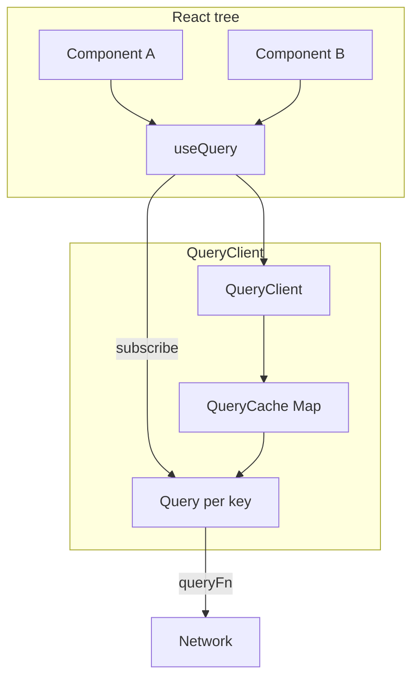
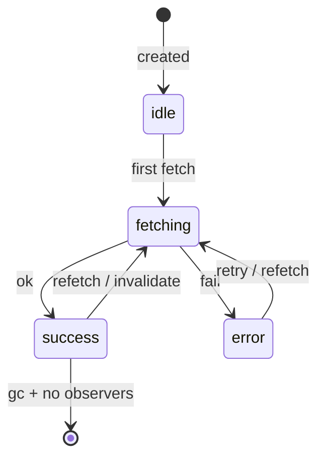

# Build Mini React Query

Implement a **server-state cache**: `QueryClient`, `useQuery`, stale-while-revalidate, request dedupe, and `invalidateQueries`. Interviewers want observers + cache identity — not CSS.

## Requirements

### Functional

- `queryKey` uniquely identifies a cache entry
- `useQuery({ queryKey, queryFn, staleTime? })` → `{ data, error, status, isFetching, refetch }`
- Multiple subscribers with the same key share one in-flight fetch
- Stale data still rendered while background refetch runs
- `invalidateQueries(prefix?)` marks matching entries stale and refetches active ones
- Unused entries GC after `gcTime` when no observers remain

### Non-functional

- No duplicate network calls for identical keys
- Safe under React Strict Mode (double mount)
- TypeScript generics for `TData`

### Clarify

- `useMutation` / optimistic updates? (stretch)
- Retry policy? (optional)

## Architecture





## Complete implementation

```tsx
// mini-query.tsx
import {
  createContext,
  useCallback,
  useContext,
  useEffect,
  useRef,
  useSyncExternalStore,
  type ReactNode,
} from 'react'

export type QueryKey = readonly unknown[]
export type QueryStatus = 'pending' | 'error' | 'success'

export interface QueryState<T> {
  data: T | undefined
  error: Error | null
  status: QueryStatus
  dataUpdatedAt: number
  fetchStatus: 'idle' | 'fetching'
}

type Listener = () => void

function hashKey(key: QueryKey): string {
  return JSON.stringify(key)
}

function matchesPrefix(key: QueryKey, prefix?: QueryKey): boolean {
  if (!prefix || prefix.length === 0) return true
  if (key.length < prefix.length) return false
  return prefix.every((p, i) => Object.is(p, key[i]))
}

class Query<T = unknown> {
  readonly queryKey: QueryKey
  readonly queryHash: string
  state: QueryState<T> = {
    data: undefined,
    error: null,
    status: 'pending',
    dataUpdatedAt: 0,
    fetchStatus: 'idle',
  }

  private listeners = new Set<Listener>()
  private fetchPromise: Promise<void> | null = null
  private gcTimer: ReturnType<typeof setTimeout> | null = null
  private queryFn: (() => Promise<T>) | null = null
  private staleTime = 0
  private gcTime = 5 * 60_000
  private abort: AbortController | null = null
  onGc: (() => void) | null = null

  constructor(queryKey: QueryKey) {
    this.queryKey = queryKey
    this.queryHash = hashKey(queryKey)
  }

  subscribe(listener: Listener): () => void {
    this.listeners.add(listener)
    this.clearGc()
    return () => {
      this.listeners.delete(listener)
      if (this.listeners.size === 0) this.scheduleGc()
    }
  }

  private notify() {
    this.listeners.forEach((l) => l())
  }

  setOptions(opts: {
    queryFn: () => Promise<T>
    staleTime?: number
    gcTime?: number
  }) {
    this.queryFn = opts.queryFn
    if (opts.staleTime !== undefined) this.staleTime = opts.staleTime
    if (opts.gcTime !== undefined) this.gcTime = opts.gcTime
  }

  isStale(now = Date.now()): boolean {
    if (this.state.dataUpdatedAt === 0) return true
    return now - this.state.dataUpdatedAt >= this.staleTime
  }

  hasObservers(): boolean {
    return this.listeners.size > 0
  }

  setData(data: T) {
    this.state = {
      data,
      error: null,
      status: 'success',
      dataUpdatedAt: Date.now(),
      fetchStatus: this.state.fetchStatus,
    }
    this.notify()
  }

  async fetch(): Promise<void> {
    if (this.fetchPromise) return this.fetchPromise
    if (!this.queryFn) return

    this.abort?.abort()
    this.abort = new AbortController()
    const signal = this.abort.signal

    this.state = { ...this.state, fetchStatus: 'fetching' }
    this.notify()

    this.fetchPromise = (async () => {
      try {
        const data = await this.queryFn!()
        if (signal.aborted) return
        this.state = {
          data,
          error: null,
          status: 'success',
          dataUpdatedAt: Date.now(),
          fetchStatus: 'idle',
        }
      } catch (e) {
        if (signal.aborted) return
        this.state = {
          ...this.state,
          error: e instanceof Error ? e : new Error(String(e)),
          status: this.state.data !== undefined ? 'success' : 'error',
          fetchStatus: 'idle',
        }
      } finally {
        this.fetchPromise = null
        this.notify()
      }
    })()

    return this.fetchPromise
  }

  invalidate() {
    this.state = { ...this.state, dataUpdatedAt: 0 }
    this.notify()
    if (this.hasObservers()) void this.fetch()
  }

  private scheduleGc() {
    this.clearGc()
    this.gcTimer = setTimeout(() => this.onGc?.(), this.gcTime)
  }

  private clearGc() {
    if (this.gcTimer) {
      clearTimeout(this.gcTimer)
      this.gcTimer = null
    }
  }

  destroy() {
    this.abort?.abort()
    this.clearGc()
    this.listeners.clear()
  }
}

export class QueryClient {
  private cache = new Map<string, Query>()

  ensureQuery<T>(queryKey: QueryKey): Query<T> {
    const hash = hashKey(queryKey)
    let q = this.cache.get(hash) as Query<T> | undefined
    if (!q) {
      q = new Query<T>(queryKey)
      q.onGc = () => {
        if (!q!.hasObservers()) {
          q!.destroy()
          this.cache.delete(hash)
        }
      }
      this.cache.set(hash, q as Query)
    }
    return q
  }

  async fetchQuery<T>(opts: {
    queryKey: QueryKey
    queryFn: () => Promise<T>
    staleTime?: number
  }): Promise<T> {
    const q = this.ensureQuery<T>(opts.queryKey)
    q.setOptions(opts)
    if (!q.isStale() && q.state.data !== undefined) return q.state.data
    await q.fetch()
    if (q.state.error && q.state.data === undefined) throw q.state.error
    return q.state.data as T
  }

  invalidateQueries(prefix?: QueryKey) {
    for (const q of this.cache.values()) {
      if (matchesPrefix(q.queryKey, prefix)) q.invalidate()
    }
  }

  setQueryData<T>(queryKey: QueryKey, updater: T | ((old: T | undefined) => T)) {
    const q = this.ensureQuery<T>(queryKey)
    const next =
      typeof updater === 'function'
        ? (updater as (old: T | undefined) => T)(q.state.data)
        : updater
    q.setData(next)
  }

  clear() {
    for (const q of this.cache.values()) q.destroy()
    this.cache.clear()
  }
}

const QueryClientContext = createContext<QueryClient | null>(null)

export function QueryClientProvider({
  client,
  children,
}: {
  client: QueryClient
  children: ReactNode
}) {
  return (
    <QueryClientContext.Provider value={client}>
      {children}
    </QueryClientContext.Provider>
  )
}

export function useQueryClient(): QueryClient {
  const c = useContext(QueryClientContext)
  if (!c) throw new Error('Missing QueryClientProvider')
  return c
}

export function useQuery<T>(options: {
  queryKey: QueryKey
  queryFn: () => Promise<T>
  staleTime?: number
  gcTime?: number
  enabled?: boolean
}) {
  const client = useQueryClient()
  const {
    queryKey,
    queryFn,
    staleTime = 0,
    gcTime,
    enabled = true,
  } = options

  const query = client.ensureQuery<T>(queryKey)
  const optsRef = useRef({ queryFn, staleTime, gcTime })
  optsRef.current = { queryFn, staleTime, gcTime }

  const subscribe = useCallback(
    (onStoreChange: () => void) => query.subscribe(onStoreChange),
    [query],
  )
  const getSnapshot = useCallback(() => query.state, [query])
  const state = useSyncExternalStore(subscribe, getSnapshot, getSnapshot)

  useEffect(() => {
    query.setOptions({
      queryFn: () => optsRef.current.queryFn(),
      staleTime: optsRef.current.staleTime,
      gcTime: optsRef.current.gcTime,
    })
    if (!enabled) return
    if (query.isStale() || query.state.data === undefined) {
      void query.fetch()
    }
  }, [query, enabled, hashKey(queryKey)])

  const refetch = useCallback(() => query.fetch(), [query])

  return {
    data: state.data,
    error: state.error,
    status: state.status,
    isPending: state.status === 'pending',
    isError: state.status === 'error',
    isSuccess: state.status === 'success',
    isFetching: state.fetchStatus === 'fetching',
    isStale: query.isStale(),
    refetch,
  }
}

// ─── Demo ────────────────────────────────────────────────────────────

async function fetchTodos(): Promise<{ id: number; title: string }[]> {
  const res = await fetch('/api/todos')
  if (!res.ok) throw new Error('Failed')
  return res.json()
}

export function TodosApp() {
  const client = useRef(new QueryClient()).current
  return (
    <QueryClientProvider client={client}>
      <TodosList />
      <button type="button" onClick={() => client.invalidateQueries(['todos'])}>
        Invalidate
      </button>
    </QueryClientProvider>
  )
}

function TodosList() {
  const { data, isPending, isFetching, error } = useQuery({
    queryKey: ['todos'] as const,
    queryFn: fetchTodos,
    staleTime: 10_000,
  })

  if (isPending) return <p>Loading…</p>
  if (error) return <p>Error: {error.message}</p>
  return (
    <div>
      {isFetching && <span>Refreshing…</span>}
      <ul>
        {data!.map((t) => (
          <li key={t.id}>{t.title}</li>
        ))}
      </ul>
    </div>
  )
}
```

> [!NOTE]
> Prefer `useSyncExternalStore` for concurrent-safe external stores (React 18+).

## Edge cases

| Case | Handling |
| --- | --- |
| Same key, 3 components | One `Query`, one in-flight `fetchPromise` |
| Unmount mid-fetch | Abort or ignore aborted results |
| Strict Mode double mount | Subscribe/unsubscribe; don’t leak GC timers |
| `staleTime: Infinity` | Never auto-refetch; invalidate still works |
| Key change | New hash; old entry may GC |
| Error after success | Keep previous `data` (SWR style) |
| `enabled: false` | Subscribe OK; skip fetch |
| Prefix invalidate `['todos']` | Hits `['todos']` and `['todos', 1]` |

## Follow-up interview questions

1. Difference between `staleTime` and `gcTime`?
2. How does TanStack Query dedupe requests?
3. Why is `queryKey` an array, not a string?
4. How would you add `useMutation` + optimistic updates?
5. `placeholderData` vs `initialData`?
6. What breaks with non-serializable `queryKey` values?
7. How would you implement `useInfiniteQuery` on this cache?
8. Why `useSyncExternalStore` instead of Context for cache reads?

## Common mistakes

| Mistake | Why it hurts |
| --- | --- |
| Fetch in `useEffect` without shared cache | Duplicate requests, races |
| Unstable key identity | Extra cache entries |
| Ignoring in-flight promise | Parallel duplicate fetches |
| GC while observers exist | Flicker / lost data |
| Mutating `data` in place | Subscribers miss updates |
| Throwing away data on refetch error | Worse UX than SWR |

## Trade-offs

| Choice | Pros | Cons |
| --- | --- | --- |
| Global `QueryClient` | Dedupe across tree | SSR needs per-request client |
| Hash = `JSON.stringify` | Simple | Key order / `undefined` quirks |
| Abort on new fetch | Avoids stale writes | `queryFn` must respect signal |
| Full RQ library | Battle-tested | Heavy for interview — show the core |

**Interview close:** “Server state lives in a cache outside React; components are observers. Identity is the key; freshness is `staleTime`; unused entries die via `gcTime`.”

## Related

- Theory: [React Query](/react/06-react-query)
- Next: [Mini Redux](/machine-coding/02-redux)
