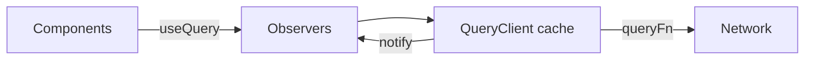

# Build: Mini React Query

Implement a tiny `useQuery` / `queryClient` with caching, deduped in-flight requests, `staleTime`, and rerender on updates.

## Requirements

- `queryClient.fetchQuery({ queryKey, queryFn, staleTime })`
- `useQuery` hook: `{ data, error, isLoading, isFetching, refetch }`
- Deduplicate concurrent fetches for the same key
- Notify subscribers when cache entry changes
- `invalidateQueries(prefix)` marks stale and refetches active observers

## Architecture



## Implementation

```tsx
import {
  createContext,
  useCallback,
  useContext,
  useEffect,
  useRef,
  useState,
  useSyncExternalStore,
  type ReactNode,
} from 'react'

export type QueryKey = readonly unknown[]

type CacheEntry<T = unknown> = {
  data?: T
  error?: unknown
  dataUpdatedAt: number
  promise?: Promise<T>
  observers: Set<() => void>
}

function keyHash(key: QueryKey): string {
  return JSON.stringify(key)
}

export class QueryClient {
  private cache = new Map<string, CacheEntry>()

  get<T>(queryKey: QueryKey): CacheEntry<T> | undefined {
    return this.cache.get(keyHash(queryKey)) as CacheEntry<T> | undefined
  }

  subscribe(queryKey: QueryKey, onStoreChange: () => void): () => void {
    const hash = keyHash(queryKey)
    let entry = this.cache.get(hash)
    if (!entry) {
      entry = { dataUpdatedAt: 0, observers: new Set() }
      this.cache.set(hash, entry)
    }
    entry.observers.add(onStoreChange)
    return () => {
      entry!.observers.delete(onStoreChange)
    }
  }

  private notify(hash: string) {
    this.cache.get(hash)?.observers.forEach((fn) => fn())
  }

  async fetchQuery<T>(opts: {
    queryKey: QueryKey
    queryFn: () => Promise<T>
    staleTime?: number
  }): Promise<T> {
    const { queryKey, queryFn, staleTime = 0 } = opts
    const hash = keyHash(queryKey)
    let entry = this.cache.get(hash) as CacheEntry<T> | undefined
    if (!entry) {
      entry = { dataUpdatedAt: 0, observers: new Set() }
      this.cache.set(hash, entry)
    }

    const fresh =
      entry.data !== undefined &&
      Date.now() - entry.dataUpdatedAt < staleTime

    if (fresh) return entry.data as T
    if (entry.promise) return entry.promise

    entry.promise = (async () => {
      try {
        const data = await queryFn()
        entry!.data = data
        entry!.error = undefined
        entry!.dataUpdatedAt = Date.now()
        return data
      } catch (error) {
        entry!.error = error
        throw error
      } finally {
        entry!.promise = undefined
        this.notify(hash)
      }
    })()

    this.notify(hash)
    return entry.promise
  }

  async invalidateQueries(prefix: QueryKey) {
    const pref = keyHash(prefix).slice(0, -1) // rough prefix on JSON array
    const tasks: Promise<unknown>[] = []
    for (const [hash, entry] of this.cache) {
      if (!hash.startsWith(pref) && hash !== keyHash(prefix)) continue
      entry.dataUpdatedAt = 0
      this.notify(hash)
      // active observers will refetch via hook effect
      void entry
      tasks.push(Promise.resolve())
    }
    await Promise.all(tasks)
  }
}

const QueryClientContext = createContext<QueryClient | null>(null)

export function QueryClientProvider({
  client,
  children,
}: {
  client: QueryClient
  children: ReactNode
}) {
  return (
    <QueryClientContext.Provider value={client}>
      {children}
    </QueryClientContext.Provider>
  )
}

function useQueryClient(): QueryClient {
  const c = useContext(QueryClientContext)
  if (!c) throw new Error('Missing QueryClientProvider')
  return c
}

export function useQuery<T>(opts: {
  queryKey: QueryKey
  queryFn: () => Promise<T>
  staleTime?: number
  enabled?: boolean
}) {
  const client = useQueryClient()
  const { queryKey, queryFn, staleTime = 0, enabled = true } = opts
  const queryFnRef = useRef(queryFn)
  queryFnRef.current = queryFn

  const subscribe = useCallback(
    (onChange: () => void) => client.subscribe(queryKey, onChange),
    [client, queryKey]
  )
  const getSnapshot = useCallback(() => client.get<T>(queryKey), [client, queryKey])
  const entry = useSyncExternalStore(subscribe, getSnapshot, getSnapshot)

  const [isFetching, setIsFetching] = useState(false)

  const refetch = useCallback(async () => {
    setIsFetching(true)
    try {
      await client.fetchQuery({
        queryKey,
        queryFn: () => queryFnRef.current(),
        staleTime: 0,
      })
    } finally {
      setIsFetching(false)
    }
  }, [client, queryKey])

  useEffect(() => {
    if (!enabled) return
    let cancelled = false
    ;(async () => {
      setIsFetching(true)
      try {
        await client.fetchQuery({
          queryKey,
          queryFn: () => queryFnRef.current(),
          staleTime,
        })
      } finally {
        if (!cancelled) setIsFetching(false)
      }
    })()
    return () => {
      cancelled = true
    }
  }, [client, enabled, queryKey, staleTime])

  const data = entry?.data
  const error = entry?.error
  const isLoading = enabled && data === undefined && !error

  return {
    data,
    error,
    isLoading,
    isFetching: isLoading || isFetching,
    refetch,
  }
}
```

### Usage sketch

```tsx
const client = new QueryClient()

function Todos() {
  const { data, isLoading, error, refetch } = useQuery({
    queryKey: ['todos'] as const,
    queryFn: () => fetch('/api/todos').then((r) => r.json()),
    staleTime: 5_000,
  })
  if (isLoading) return <p>Loading…</p>
  if (error) return <button onClick={() => refetch()}>Retry</button>
  return <pre>{JSON.stringify(data, null, 2)}</pre>
}

export function App() {
  return (
    <QueryClientProvider client={client}>
      <Todos />
    </QueryClientProvider>
  )
}
```

## Edge cases

| Case | Handling |
| --- | --- |
| Remount within `staleTime` | Serve cache; no network |
| Parallel mounts same key | Share one `promise` |
| `enabled: false` | Skip fetch |
| Key identity | Stable `JSON.stringify` (document deep-key caveats) |

## Follow-up questions

1. Add `gcTime` garbage collection for unused keys.
2. Implement `useMutation` + `invalidateQueries`.
3. Structural sharing so identical data doesn’t rerender.
4. Persist cache to `sessionStorage`.
5. How does TanStack Query handle infinite queries?
