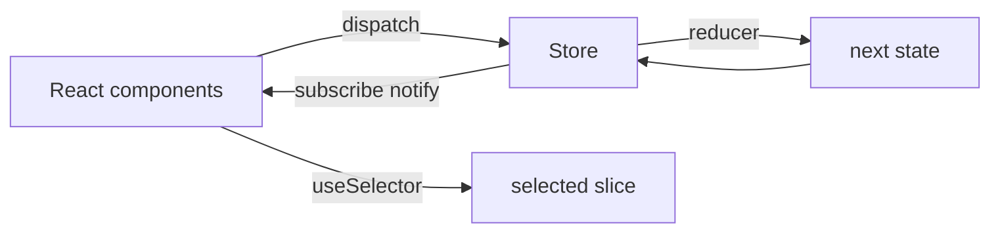
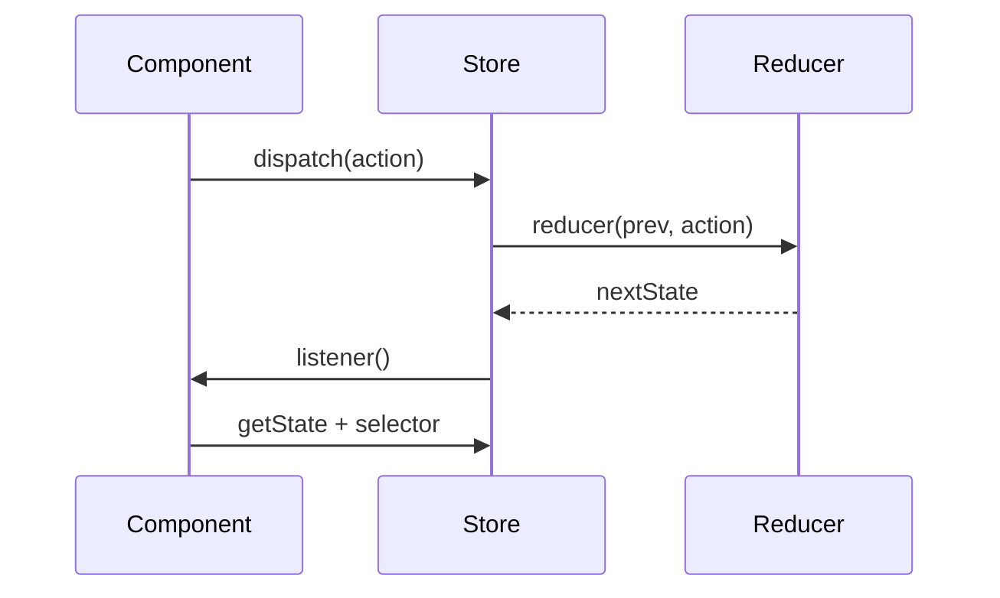

# Build Mini Redux

Implement `createStore`, `combineReducers`, `Provider`, `useSelector`, and `useDispatch`. Interviewers care about **single store + pure reducers + subscription**, not Redux Toolkit boilerplate.

## Requirements

### Functional

- `createStore(reducer, preloadedState?)` → `{ getState, dispatch, subscribe }`
- `dispatch(action)` runs reducer, notifies listeners
- `combineReducers({ slice: reducer })` nests state by key
- React bindings: `Provider`, `useDispatch`, `useSelector(selector)` with store subscription
- Selectors re-render only when selected slice changes by `===` / `Object.is`

### Non-functional

- Reducers must be pure
- Immutability convention (no mutations of previous state)
- TypeScript-friendly action + state types

### Clarify

- Middleware / thunk? (stretch below)
- Immer? (usually out of scope)

## Architecture





## Complete implementation

```tsx
// mini-redux.tsx
import {
  createContext,
  useContext,
  useRef,
  useCallback,
  useSyncExternalStore,
  type ReactNode,
} from 'react'

export type Action<T extends string = string, P = unknown> = {
  type: T
  payload?: P
}

export type Reducer<S, A extends Action = Action> = (
  state: S | undefined,
  action: A,
) => S

export type Store<S, A extends Action = Action> = {
  getState: () => S
  dispatch: (action: A) => A
  subscribe: (listener: () => void) => () => void
  replaceReducer: (next: Reducer<S, A>) => void
}

export function createStore<S, A extends Action = Action>(
  reducer: Reducer<S, A>,
  preloadedState?: S,
): Store<S, A> {
  let currentReducer = reducer
  let currentState = preloadedState as S
  const listeners = new Set<() => void>()
  let isDispatching = false

  currentState = currentReducer(preloadedState, { type: '@@INIT' } as A)

  function getState(): S {
    if (isDispatching) throw new Error('Cannot call getState while dispatching')
    return currentState
  }

  function subscribe(listener: () => void): () => void {
    listeners.add(listener)
    return () => {
      listeners.delete(listener)
    }
  }

  function dispatch(action: A): A {
    if (!action || typeof action.type === 'undefined') {
      throw new Error('Actions need a type')
    }
    if (isDispatching) throw new Error('Reducers may not dispatch')

    try {
      isDispatching = true
      currentState = currentReducer(currentState, action)
    } finally {
      isDispatching = false
    }

    listeners.forEach((l) => l())
    return action
  }

  function replaceReducer(next: Reducer<S, A>) {
    currentReducer = next
    dispatch({ type: '@@REPLACE' } as A)
  }

  return { getState, dispatch, subscribe, replaceReducer }
}

export type ReducersMap<S> = {
  [K in keyof S]: Reducer<S[K]>
}

export function combineReducers<S extends Record<string, unknown>>(
  reducers: ReducersMap<S>,
): Reducer<S> {
  const keys = Object.keys(reducers) as (keyof S)[]

  return function combination(state: S | undefined, action: Action): S {
    const prev = state ?? ({} as S)
    let hasChanged = false
    const next = {} as S

    for (const key of keys) {
      const sliceReducer = reducers[key]
      const prevSlice = prev[key]
      const nextSlice = sliceReducer(prevSlice, action)
      if (typeof nextSlice === 'undefined') {
        throw new Error(`Reducer "${String(key)}" returned undefined`)
      }
      next[key] = nextSlice
      hasChanged = hasChanged || nextSlice !== prevSlice
    }

    return hasChanged || !state ? next : prev
  }
}

const StoreContext = createContext<Store<unknown> | null>(null)

export function Provider<S>({
  store,
  children,
}: {
  store: Store<S>
  children: ReactNode
}) {
  return (
    <StoreContext.Provider value={store as Store<unknown>}>
      {children}
    </StoreContext.Provider>
  )
}

function useStore<S>(): Store<S> {
  const store = useContext(StoreContext)
  if (!store) throw new Error('Missing Provider')
  return store as Store<S>
}

export function useDispatch<A extends Action = Action>() {
  const store = useStore()
  return store.dispatch as (action: A) => A
}

export function useSelector<S, T>(
  selector: (state: S) => T,
  equalityFn: (a: T, b: T) => boolean = Object.is,
): T {
  const store = useStore<S>()
  const selectorRef = useRef(selector)
  const equalityRef = useRef(equalityFn)
  selectorRef.current = selector
  equalityRef.current = equalityFn

  const lastSelected = useRef<T>(selector(store.getState()))

  const subscribe = useCallback(
    (onChange: () => void) => store.subscribe(onChange),
    [store],
  )

  const getSnapshot = useCallback(() => {
    const next = selectorRef.current(store.getState())
    if (equalityRef.current(lastSelected.current, next)) {
      return lastSelected.current
    }
    lastSelected.current = next
    return next
  }, [store])

  return useSyncExternalStore(subscribe, getSnapshot, getSnapshot)
}

// ─── Example: counter + todos via combineReducers ────────────────────

type CounterState = { value: number }
type TodosState = { items: string[] }

type AppState = {
  counter: CounterState
  todos: TodosState
}

type AppAction =
  | { type: 'counter/increment' }
  | { type: 'counter/add'; payload: number }
  | { type: 'todos/add'; payload: string }
  | { type: 'todos/remove'; payload: number }

function counterReducer(
  state: CounterState | undefined,
  action: Action,
): CounterState {
  const s = state ?? { value: 0 }
  switch (action.type) {
    case 'counter/increment':
      return { value: s.value + 1 }
    case 'counter/add':
      return { value: s.value + (action.payload as number) }
    default:
      return s
  }
}

function todosReducer(
  state: TodosState | undefined,
  action: Action,
): TodosState {
  const s = state ?? { items: [] }
  switch (action.type) {
    case 'todos/add':
      return { items: [...s.items, action.payload as string] }
    case 'todos/remove': {
      const i = action.payload as number
      return { items: s.items.filter((_, idx) => idx !== i) }
    }
    default:
      return s
  }
}

const rootReducer = combineReducers<AppState>({
  counter: counterReducer,
  todos: todosReducer,
})

export const store = createStore<AppState, AppAction>(rootReducer)

export function App() {
  return (
    <Provider store={store}>
      <Counter />
      <TodoList />
    </Provider>
  )
}

function Counter() {
  const value = useSelector((s: AppState) => s.counter.value)
  const dispatch = useDispatch<AppAction>()
  return (
    <div>
      <p>{value}</p>
      <button type="button" onClick={() => dispatch({ type: 'counter/increment' })}>
        +1
      </button>
    </div>
  )
}

function TodoList() {
  const items = useSelector((s: AppState) => s.todos.items)
  const dispatch = useDispatch<AppAction>()
  return (
    <ul>
      {items.map((t, i) => (
        <li key={`${t}-${i}`}>
          {t}
          <button
            type="button"
            onClick={() => dispatch({ type: 'todos/remove', payload: i })}
          >
            x
          </button>
        </li>
      ))}
      <button
        type="button"
        onClick={() => dispatch({ type: 'todos/add', payload: 'New' })}
      >
        Add
      </button>
    </ul>
  )
}
```

### Stretch: thunk middleware

```ts
type Middleware<S> = (
  store: Store<S>,
) => (next: (a: Action) => Action) => (action: unknown) => unknown

const thunk: Middleware<AppState> =
  ({ dispatch, getState }) =>
  (next) =>
  (action) => {
    if (typeof action === 'function') {
      return (action as (d: typeof dispatch, g: typeof getState) => unknown)(
        dispatch,
        getState,
      )
    }
    return next(action as Action)
  }
```

## Edge cases

| Case | Handling |
| --- | --- |
| Listener dispatches | Allowed after current dispatch; guard during reduce |
| Selector returns new object each time | Always re-renders — select primitives or memoize |
| Reducer returns `undefined` | Throw in `combineReducers` |
| Unknown action | Return previous state unchanged |
| Subscribe during notify | Set iteration is OK if you don’t delete mid-loop carelessly |
| Same state reference | `useSelector` equality bails out |

## Follow-up interview questions

1. Why must reducers be pure?
2. Context vs Redux — when is each wrong?
3. How does `useSelector` avoid re-rendering on unrelated dispatches?
4. Redux vs React Query for server state?
5. Middleware vs enhancers?
6. Why did Redux Toolkit win?
7. How would you implement time-travel debugging?
8. `connect` vs hooks — subscription differences?

## Common mistakes

| Mistake | Fix |
| --- | --- |
| Mutating `state.push()` | Return new array/object |
| Putting server cache in Redux | Prefer React Query for server state |
| Selecting entire state | Narrow selectors |
| Giant switch without `default` | Always `return state` |
| Creating store inside component render | Module singleton or create once |
| Storing derived data | Compute in selector |

## Trade-offs

| Choice | Pros | Cons |
| --- | --- | --- |
| One global store | Predictable, DevTools | Boilerplate; overkill for local UI |
| `Object.is` equality | Cheap | Fails for new object identities |
| `combineReducers` | Split domains | Nested updates verbose without Immer |
| Redux Toolkit | Less boilerplate | Hides mechanics interviews ask for |

**Interview close:** “Redux is a predictable state container: pure reducer, single tree, subscribers. React bindings select slices so most dispatches don’t re-render the world.”

## Related

- Theory: [Context & Redux](/react/07-context-redux)
- Cache companion: [Mini React Query](/machine-coding/01-react-query)
