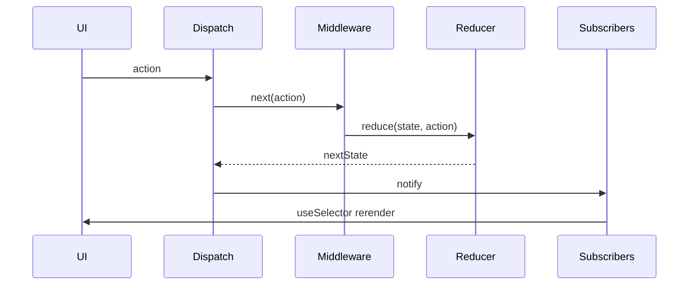

# Build: Mini Redux

Implement `createStore`, `useSelector`, `useDispatch`, and a tiny middleware pipeline.

## Requirements

- `createStore(reducer, preloadedState)`
- `getState`, `dispatch`, `subscribe`
- React bindings with selector equality (`===`)
- Optional middleware: `store => next => action => …`
- Enforce plain action objects `{ type: string }`

## Architecture



## Implementation

```tsx
import {
  createContext,
  useContext,
  useRef,
  useSyncExternalStore,
  type ReactNode,
} from 'react'

export type Action = { type: string; [key: string]: unknown }
export type Reducer<S> = (state: S, action: Action) => S
export type Middleware<S> = (
  store: { getState: () => S; dispatch: (a: Action) => Action }
) => (next: (a: Action) => Action) => (action: Action) => Action

export function createStore<S>(
  reducer: Reducer<S>,
  preloadedState: S,
  middlewares: Middleware<S>[] = []
) {
  let state = preloadedState
  const listeners = new Set<() => void>()

  const getState = () => state

  let dispatch = (action: Action): Action => {
    if (!action || typeof action.type !== 'string') {
      throw new Error('Actions must be plain objects with string type')
    }
    state = reducer(state, action)
    listeners.forEach((l) => l())
    return action
  }

  const api = {
    getState,
    dispatch: (action: Action) => dispatch(action),
    subscribe(listener: () => void) {
      listeners.add(listener)
      return () => listeners.delete(listener)
    },
  }

  // compose middlewares right → left like Redux
  dispatch = middlewares
    .map((mw) => mw(api))
    .reduceRight(
      (next, mw) => mw(next),
      dispatch
    )

  // init
  dispatch({ type: '@@INIT' })

  return api
}

type Store<S> = ReturnType<typeof createStore<S>>

const StoreContext = createContext<Store<unknown> | null>(null)

export function Provider<S>({
  store,
  children,
}: {
  store: Store<S>
  children: ReactNode
}) {
  return (
    <StoreContext.Provider value={store as Store<unknown>}>
      {children}
    </StoreContext.Provider>
  )
}

export function useDispatch() {
  const store = useContext(StoreContext)
  if (!store) throw new Error('Missing Provider')
  return store.dispatch
}

export function useSelector<S, T>(selector: (state: S) => T): T {
  const store = useContext(StoreContext) as Store<S> | null
  if (!store) throw new Error('Missing Provider')
  const selectorRef = useRef(selector)
  selectorRef.current = selector

  return useSyncExternalStore(
    store.subscribe,
    () => selectorRef.current(store.getState()),
    () => selectorRef.current(store.getState())
  )
}

// --- demo domain ---

type State = { count: number; step: number }

const initial: State = { count: 0, step: 1 }

function reducer(state: State = initial, action: Action): State {
  switch (action.type) {
    case 'inc':
      return { ...state, count: state.count + state.step }
    case 'dec':
      return { ...state, count: state.count - state.step }
    case 'setStep':
      return { ...state, step: Number(action.payload) }
    default:
      return state
  }
}

export const logger: Middleware<State> = (store) => (next) => (action) => {
  console.log('dispatch', action, 'prev', store.getState())
  const result = next(action)
  console.log('next', store.getState())
  return result
}

export function CounterApp() {
  const store = useRef(createStore(reducer, initial, [logger])).current
  return (
    <Provider store={store}>
      <Counter />
    </Provider>
  )
}

function Counter() {
  const count = useSelector((s: State) => s.count)
  const step = useSelector((s: State) => s.step)
  const dispatch = useDispatch()
  return (
    <div>
      <p>
        {count} (step {step})
      </p>
      <button onClick={() => dispatch({ type: 'dec' })}>-</button>
      <button onClick={() => dispatch({ type: 'inc' })}>+</button>
      <input
        type="number"
        value={step}
        onChange={(e) =>
          dispatch({ type: 'setStep', payload: e.target.value })
        }
      />
    </div>
  )
}
```

## Edge cases

| Case | Handling |
| --- | --- |
| Dispatch during reducer | Redux forbids; mention throw / queue |
| Selector returns new object each time | Rerender storm — memoize or select primitives |
| Middleware order | Document composition direction |

## Follow-up questions

1. Add `combineReducers`.
2. Implement `redux-thunk` style async middleware.
3. Why `useSyncExternalStore` over `useEffect`+`useState`?
4. Compare to Zustand (less boilerplate selectors).
5. Time-travel debugging sketch.
