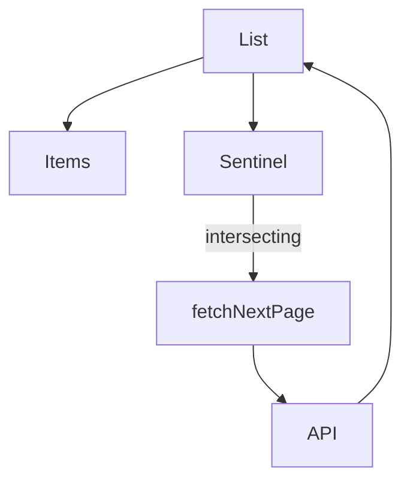

# Build: Infinite Scroll

Paginated list that loads the next page when a sentinel enters the viewport.

## Requirements

- Fetch pages: `{ items, nextCursor }`
- Append pages; show loading row; stop at end
- `IntersectionObserver` sentinel (not scroll math)
- Cancel in-flight on unmount / key change
- Error + retry; empty state
- Deduplicate items by `id`

## Architecture



## Implementation

```tsx
import {
  useCallback,
  useEffect,
  useRef,
  useState,
} from 'react'

type Item = { id: string; title: string }

type Page = {
  items: Item[]
  nextCursor: string | null
}

async function fetchPage(cursor: string | null, signal: AbortSignal): Promise<Page> {
  const url = cursor ? `/api/feed?cursor=${cursor}` : '/api/feed'
  const res = await fetch(url, { signal })
  if (!res.ok) throw new Error(`HTTP ${res.status}`)
  return res.json()
}

export function InfiniteFeed() {
  const [items, setItems] = useState<Item[]>([])
  const [cursor, setCursor] = useState<string | null>(null)
  const [hasMore, setHasMore] = useState(true)
  const [loading, setLoading] = useState(false)
  const [error, setError] = useState<string | null>(null)

  const seen = useRef(new Set<string>())
  const loadingRef = useRef(false)
  const sentinelRef = useRef<HTMLDivElement | null>(null)

  const loadMore = useCallback(async (reset = false) => {
    if (loadingRef.current) return
    if (!reset && !hasMore) return
    loadingRef.current = true
    setLoading(true)
    setError(null)
    const ac = new AbortController()
    try {
      const page = await fetchPage(reset ? null : cursor, ac.signal)
      setItems((prev) => {
        const base = reset ? [] : prev
        if (reset) seen.current.clear()
        const merged = [...base]
        for (const item of page.items) {
          if (seen.current.has(item.id)) continue
          seen.current.add(item.id)
          merged.push(item)
        }
        return merged
      })
      setCursor(page.nextCursor)
      setHasMore(page.nextCursor != null)
    } catch (e) {
      if ((e as Error).name !== 'AbortError') {
        setError((e as Error).message)
      }
    } finally {
      loadingRef.current = false
      setLoading(false)
    }
  }, [cursor, hasMore])

  // initial load
  useEffect(() => {
    void loadMore(true)
    // eslint-disable-next-line react-hooks/exhaustive-deps
  }, [])

  useEffect(() => {
    const node = sentinelRef.current
    if (!node) return
    const io = new IntersectionObserver(
      (entries) => {
        if (entries.some((e) => e.isIntersecting)) void loadMore(false)
      },
      { root: null, rootMargin: '200px', threshold: 0 }
    )
    io.observe(node)
    return () => io.disconnect()
  }, [loadMore])

  return (
    <div>
      <ul>
        {items.map((item) => (
          <li key={item.id}>{item.title}</li>
        ))}
      </ul>

      {error && (
        <p role="alert">
          {error}{' '}
          <button type="button" onClick={() => void loadMore(false)}>
            Retry
          </button>
        </p>
      )}

      {!error && hasMore && (
        <div ref={sentinelRef} aria-hidden style={{ height: 1 }} />
      )}

      {loading && <p>Loading…</p>}
      {!loading && !hasMore && items.length === 0 && <p>No items</p>}
      {!loading && !hasMore && items.length > 0 && <p>End of feed</p>}
    </div>
  )
}
```

## Edge cases

| Case | Handling |
| --- | --- |
| Fast scroll / double observe | `loadingRef` guard |
| Duplicate ids across pages | `seen` set |
| Filter change | Reset list + cursor + seen |
| Short first page | `rootMargin` still triggers if sentinel visible |

## Follow-up questions

1. Integrate React Query `useInfiniteQuery`.
2. Restore scroll position on back navigation.
3. Bidirectional chat-style infinite scroll.
4. Accessibility: announce newly loaded count via live region.
5. Virtualize after 500+ DOM nodes.
