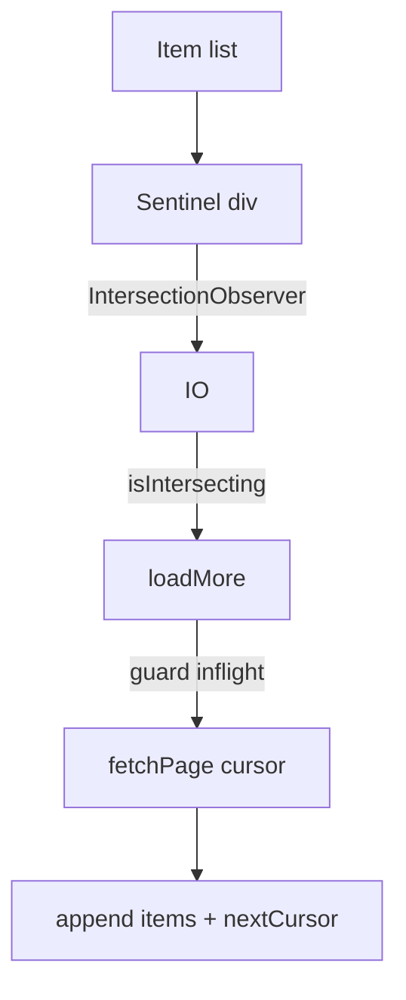
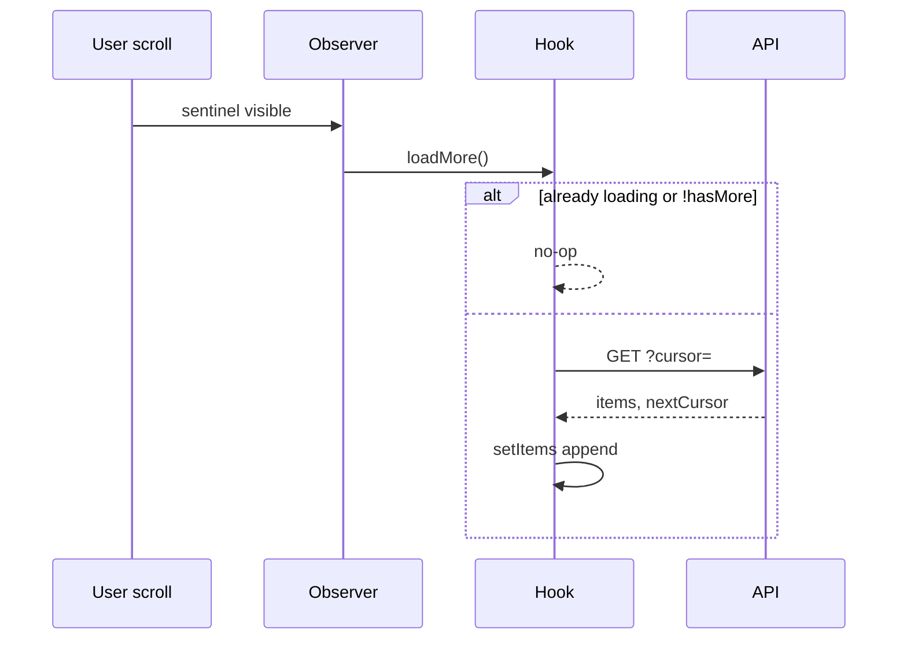

# Infinite Scroll

Load the next page when the user nears the end of a list. Core skills: **IntersectionObserver**, cursor/offset pagination, in-flight guards, and unmount safety.

## Requirements

### Functional

- Initial page fetch on mount
- When sentinel enters viewport → fetch next page
- Append results; stop when `hasMore === false`
- Show loading / error / retry UI
- Optional: “Load more” fallback button

### Non-functional

- No duplicate page fetches (rapid scroll / IO spam)
- Cancel or ignore stale responses on filter change
- Keep prior items visible while loading

### Clarify

- Offset vs cursor pagination?
- Upward infinite scroll (chat history)?
- Combine with virtualization? → [Virtual list](/machine-coding/04-virtual-list)

## Architecture





## Complete implementation

```tsx
// infinite-scroll.tsx
import { useCallback, useEffect, useRef, useState } from 'react'

export type Page<T> = { items: T[]; nextCursor: string | null }

type Status = 'idle' | 'loading' | 'loadingMore' | 'error'

export function useInfiniteQuery<T>(opts: {
  fetchPage: (cursor: string | null) => Promise<Page<T>>
  queryKey: string
  rootMargin?: string
  enabled?: boolean
}) {
  const { fetchPage, queryKey, rootMargin = '200px', enabled = true } = opts

  const [items, setItems] = useState<T[]>([])
  const [cursor, setCursor] = useState<string | null>(null)
  const [hasMore, setHasMore] = useState(true)
  const [status, setStatus] = useState<Status>('idle')
  const [error, setError] = useState<Error | null>(null)

  const inflight = useRef(false)
  const reqId = useRef(0)
  const sentinelRef = useRef<HTMLDivElement | null>(null)

  const load = useCallback(
    async (mode: 'reset' | 'more') => {
      if (!enabled) return
      if (inflight.current) return
      if (mode === 'more' && !hasMore) return

      inflight.current = true
      const id = ++reqId.current
      setStatus(mode === 'reset' ? 'loading' : 'loadingMore')
      setError(null)

      try {
        const pageCursor = mode === 'reset' ? null : cursor
        const page = await fetchPage(pageCursor)
        if (id !== reqId.current) return

        setItems((prev) => (mode === 'reset' ? page.items : [...prev, ...page.items]))
        setCursor(page.nextCursor)
        setHasMore(page.nextCursor != null)
        setStatus('idle')
      } catch (e) {
        if (id !== reqId.current) return
        setError(e instanceof Error ? e : new Error(String(e)))
        setStatus('error')
      } finally {
        if (id === reqId.current) inflight.current = false
      }
    },
    [cursor, enabled, fetchPage, hasMore],
  )

  useEffect(() => {
    setItems([])
    setCursor(null)
    setHasMore(true)
    setError(null)
    inflight.current = false
    void load('reset')
    // reset only on queryKey
    // eslint-disable-next-line react-hooks/exhaustive-deps
  }, [queryKey, enabled])

  useEffect(() => {
    const node = sentinelRef.current
    if (!node || !enabled) return

    const obs = new IntersectionObserver(
      (entries) => {
        if (entries.some((e) => e.isIntersecting)) void load('more')
      },
      { root: null, rootMargin, threshold: 0 },
    )
    obs.observe(node)
    return () => obs.disconnect()
  }, [load, rootMargin, enabled, queryKey])

  return {
    items,
    hasMore,
    status,
    error,
    retry: () => void load(items.length === 0 ? 'reset' : 'more'),
    sentinelRef,
    isLoading: status === 'loading',
    isLoadingMore: status === 'loadingMore',
  }
}

type Post = { id: string; title: string }

async function fetchPosts(cursor: string | null): Promise<Page<Post>> {
  const url = new URL('/api/posts', window.location.origin)
  if (cursor) url.searchParams.set('cursor', cursor)
  url.searchParams.set('limit', '20')
  const res = await fetch(url)
  if (!res.ok) throw new Error('Failed to load')
  return res.json()
}

export function InfinitePostList({ search }: { search: string }) {
  const {
    items,
    hasMore,
    isLoading,
    isLoadingMore,
    error,
    retry,
    sentinelRef,
  } = useInfiniteQuery<Post>({
    queryKey: `posts:${search}`,
    fetchPage: fetchPosts,
  })

  if (isLoading) return <p>Loading…</p>

  return (
    <div>
      <ul>
        {items.map((p) => (
          <li key={p.id}>{p.title}</li>
        ))}
      </ul>
      {error && (
        <div>
          <p>{error.message}</p>
          <button type="button" onClick={retry}>
            Retry
          </button>
        </div>
      )}
      {hasMore && !error && <div ref={sentinelRef} style={{ height: 1 }} aria-hidden />}
      {isLoadingMore && <p>Loading more…</p>}
      {!hasMore && items.length > 0 && <p>End of list</p>}
    </div>
  )
}
```

Prefer **cursors** for feeds (stable under inserts); offsets drift when rows appear at the top.

## Edge cases

| Case | Handling |
| --- | --- |
| Sentinel always visible (short page) | Loop with `inflight` until `hasMore` false or filled |
| Fast filter typing | Bump `reqId` / change `queryKey`; ignore stale |
| Unmount during fetch | `reqId` or `AbortController` |
| Empty page with cursor | Cap loops / detect identical cursor |
| Nested scroll root | Pass `root: scrollEl` |
| Duplicate ids | Dedupe when merging |
| Error mid-list | Keep items; retry at bottom |

## Follow-up interview questions

1. Cursor vs offset — trade-offs?
2. Why IntersectionObserver over `scroll`?
3. Combine with virtualization?
4. How does `useInfiniteQuery` store pages?
5. Preserve scroll when prepending (chat)?
6. What is `rootMargin` for?
7. Prevent page 1→2→3 waterfall on empty viewports?
8. a11y: how do SRs learn about new items?

## Common mistakes

| Mistake | Fix |
| --- | --- |
| No in-flight lock | Duplicate pages |
| Unthrottled scroll listener | Jank |
| Index as key | Bugs on prepend |
| Forgetting `disconnect` | Leaks |
| Reset list without cursor | Wrong page |
| Fetch in render | Infinite loops |

## Trade-offs

| Choice | Pros | Cons |
| --- | --- | --- |
| IO sentinel | Efficient | Nested roots tricky |
| “Load more” button | Predictable a11y | Extra click |
| Virtualize + infinite | Scales | Complex sync |
| Auto-fill viewport | Good UX | Need loop guard |

**Interview close:** “Observer near end → guarded fetch → append by cursor. Reset on filter; drop stale responses.”

## Related

- [Virtual list](/machine-coding/04-virtual-list) · [FE Feed](/frontend-system-design/01-feed)
