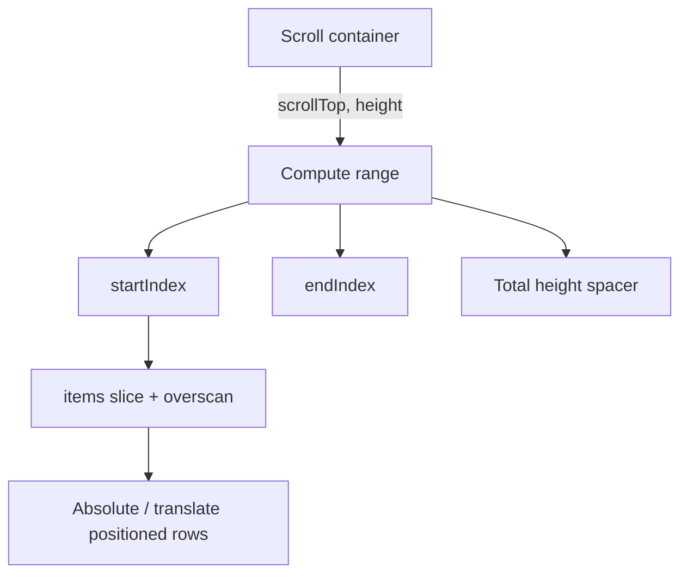
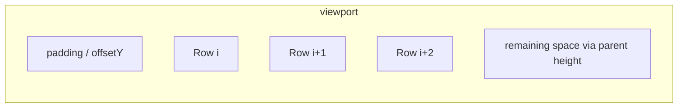

# Virtual List

Render only the **visible window** (+ overscan) of a long list. Interviewers want scroll math: `scrollTop → startIndex → translateY`.

## Requirements

### Functional

- Fixed-height rows first (variable height as stretch)
- Vertical windowing with overscan
- Correct scrollbar size (spacer / total height)
- `scrollToIndex(i)` optional API
- Stable item keys

### Non-functional

- O(visible) DOM nodes for N = 10k–100k
- 60fps scroll on mid hardware
- No layout thrash (read scroll in `requestAnimationFrame` if needed)

### Clarify

- Fixed vs dynamic heights?
- Horizontal virtualization?
- Sticky headers / sections?

## Architecture





## Complete implementation (fixed row height)

```tsx
// virtual-list.tsx
import {
  useCallback,
  useMemo,
  useRef,
  useState,
  type CSSProperties,
  type ReactNode,
  type UIEvent,
} from 'react'

export type VirtualListProps<T> = {
  items: T[]
  rowHeight: number
  height: number // viewport px
  width?: number | string
  overscan?: number
  getKey: (item: T, index: number) => string | number
  renderRow: (item: T, index: number) => ReactNode
}

export function VirtualList<T>({
  items,
  rowHeight,
  height,
  width = '100%',
  overscan = 4,
  getKey,
  renderRow,
}: VirtualListProps<T>) {
  const [scrollTop, setScrollTop] = useState(0)
  const raf = useRef<number | null>(null)
  const pending = useRef(0)

  const totalHeight = items.length * rowHeight

  const onScroll = useCallback((e: UIEvent<HTMLDivElement>) => {
    pending.current = e.currentTarget.scrollTop
    if (raf.current != null) return
    raf.current = requestAnimationFrame(() => {
      raf.current = null
      setScrollTop(pending.current)
    })
  }, [])

  const { start, end, offsetY } = useMemo(() => {
    const startIndex = Math.max(0, Math.floor(scrollTop / rowHeight) - overscan)
    const visibleCount = Math.ceil(height / rowHeight)
    const endIndex = Math.min(
      items.length,
      startIndex + visibleCount + overscan * 2,
    )
    return {
      start: startIndex,
      end: endIndex,
      offsetY: startIndex * rowHeight,
    }
  }, [scrollTop, rowHeight, height, overscan, items.length])

  const slice = items.slice(start, end)

  return (
    <div
      role="list"
      onScroll={onScroll}
      style={{
        height,
        width,
        overflow: 'auto',
        position: 'relative',
      }}
    >
      <div style={{ height: totalHeight, position: 'relative' }}>
        <div
          style={{
            position: 'absolute',
            top: 0,
            left: 0,
            right: 0,
            transform: `translateY(${offsetY}px)`,
          }}
        >
          {slice.map((item, i) => {
            const index = start + i
            const style: CSSProperties = {
              height: rowHeight,
              boxSizing: 'border-box',
            }
            return (
              <div role="listitem" key={getKey(item, index)} style={style}>
                {renderRow(item, index)}
              </div>
            )
          })}
        </div>
      </div>
    </div>
  )
}

// ─── Demo ────────────────────────────────────────────────────────────

type Row = { id: number; label: string }

export function BigListDemo() {
  const items = useMemo<Row[]>(
    () => Array.from({ length: 50_000 }, (_, id) => ({ id, label: `Row #${id}` })),
    [],
  )

  return (
    <VirtualList
      items={items}
      rowHeight={36}
      height={400}
      overscan={5}
      getKey={(r) => r.id}
      renderRow={(r) => <div style={{ padding: '0 8px', lineHeight: '36px' }}>{r.label}</div>}
    />
  )
}

export function scrollToIndex(
  container: HTMLElement,
  index: number,
  rowHeight: number,
  align: 'start' | 'center' | 'end' = 'start',
) {
  const view = container.clientHeight
  let top = index * rowHeight
  if (align === 'center') top -= view / 2 - rowHeight / 2
  if (align === 'end') top -= view - rowHeight
  container.scrollTop = Math.max(0, top)
}
```

## Stretch: variable height (estimated)

```tsx
/**
 * Strategy:
 * - Keep `estimates[i]` (defaultEstimate)
 * - Measure mounted rows via ResizeObserver / ref callback
 * - Maintain prefix sums for O(log n) offset lookup (or Fenwick)
 * - On measure correction, adjust scrollTop if measurement is above viewport
 */
type Metrics = {
  estimated: number
  measured: Map<number, number>
  prefix: number[] // lazy rebuild
}

function getOffset(metrics: Metrics, index: number, fallback: number): number {
  let y = 0
  for (let i = 0; i < index; i++) {
    y += metrics.measured.get(i) ?? fallback
  }
  return y
}
```

In interviews, state the approach; full dynamic virtualizers (TanStack Virtual) are large — fixed height usually suffices.

## Edge cases

| Case | Handling |
| --- | --- |
| Empty list | Total height 0; no rows |
| `scrollTop` beyond new shorter list | Clamp on items length change |
| Overscan 0 | Possible white flash; use ≥2–5 |
| Subpixel rounding | Prefer integer heights; floor/ceil carefully |
| Focus into offscreen row | `scrollToIndex` before focus |
| Window resize | Recompute visible count from new `height` |
| Horizontal overflow | Separate x virtualization or CSS |

## Follow-up interview questions

1. Why not render 50k `<div>`s?
2. How does overscan help?
3. Fixed vs variable height — data structures?
4. How do you keep the scrollbar proportional?
5. `content-visibility: auto` vs JS virtualization?
6. How to virtualize a table with sticky columns?
7. Interaction with infinite scroll?
8. How does recycling pools (react-window) differ from fresh mounts?

## Common mistakes

| Mistake | Fix |
| --- | --- |
| Forgetting outer spacer height | Broken scrollbar |
| Using margin for offset | Collapse / hard math — use transform or top |
| setState on every scroll event | rAF batch |
| Index as key with reorder | Stable ids |
| Measuring during render | Refs + RO after paint |
| Ignoring container padding | Off-by-padding scroll math |

## Trade-offs

| Choice | Pros | Cons |
| --- | --- | --- |
| Fixed height | Simple O(1) index math | Inflexible UI |
| Dynamic measure | Real content heights | Jank risk; complex |
| Library (TanStack Virtual) | Production-ready | Must explain internals |
| CSS `content-visibility` | Tiny code | Weaker control; browser support nuances |

**Interview close:** “Total height = N × rowHeight; only mount `[start, end)` positioned at `start * rowHeight`. Overscan hides fetch/paint latency.”

## Related

- [Infinite scroll](/machine-coding/03-infinite-scroll)
- [Optimized table](/machine-coding/08-optimized-table)
- Browser cost: [Optimization](/browser/09-optimization)
