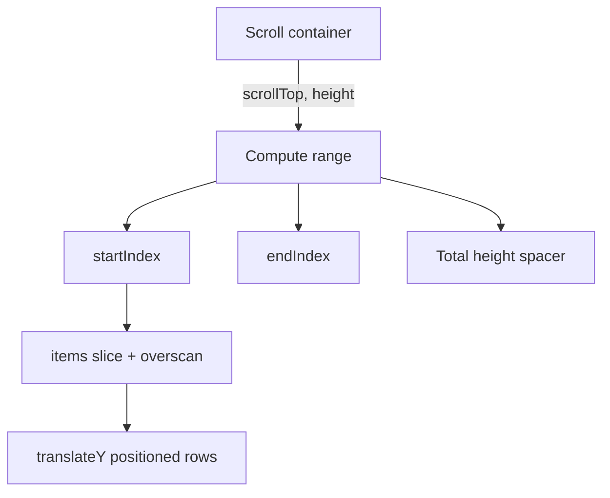

# Virtual List

Render only the **visible window** (+ overscan) of a long list. Interviewers want scroll math: `scrollTop → startIndex → translateY`.

## Requirements

### Functional

- Fixed-height rows first (variable height as stretch)
- Vertical windowing with overscan
- Correct scrollbar size (total height spacer)
- Optional `scrollToIndex(i)`
- Stable item keys

### Non-functional

- O(visible) DOM nodes for N = 10k–100k
- 60fps scroll on mid hardware
- Batch scroll updates with `requestAnimationFrame`

### Clarify

- Fixed vs dynamic heights?
- Horizontal virtualization?
- Sticky headers / sections?

## Architecture



## Complete implementation (fixed row height)

```tsx
// virtual-list.tsx
import {
  useCallback,
  useMemo,
  useRef,
  useState,
  type CSSProperties,
  type ReactNode,
  type UIEvent,
} from 'react'

export type VirtualListProps<T> = {
  items: T[]
  rowHeight: number
  height: number
  width?: number | string
  overscan?: number
  getKey: (item: T, index: number) => string | number
  renderRow: (item: T, index: number) => ReactNode
}

export function VirtualList<T>({
  items,
  rowHeight,
  height,
  width = '100%',
  overscan = 4,
  getKey,
  renderRow,
}: VirtualListProps<T>) {
  const [scrollTop, setScrollTop] = useState(0)
  const raf = useRef<number | null>(null)
  const pending = useRef(0)

  const totalHeight = items.length * rowHeight

  const onScroll = useCallback((e: UIEvent<HTMLDivElement>) => {
    pending.current = e.currentTarget.scrollTop
    if (raf.current != null) return
    raf.current = requestAnimationFrame(() => {
      raf.current = null
      setScrollTop(pending.current)
    })
  }, [])

  const { start, end, offsetY } = useMemo(() => {
    const startIndex = Math.max(0, Math.floor(scrollTop / rowHeight) - overscan)
    const visibleCount = Math.ceil(height / rowHeight)
    const endIndex = Math.min(items.length, startIndex + visibleCount + overscan * 2)
    return { start: startIndex, end: endIndex, offsetY: startIndex * rowHeight }
  }, [scrollTop, rowHeight, height, overscan, items.length])

  const slice = items.slice(start, end)

  return (
    <div
      role="list"
      onScroll={onScroll}
      style={{ height, width, overflow: 'auto', position: 'relative' }}
    >
      <div style={{ height: totalHeight, position: 'relative' }}>
        <div
          style={{
            position: 'absolute',
            top: 0,
            left: 0,
            right: 0,
            transform: `translateY(${offsetY}px)`,
          }}
        >
          {slice.map((item, i) => {
            const index = start + i
            const style: CSSProperties = { height: rowHeight, boxSizing: 'border-box' }
            return (
              <div role="listitem" key={getKey(item, index)} style={style}>
                {renderRow(item, index)}
              </div>
            )
          })}
        </div>
      </div>
    </div>
  )
}

type Row = { id: number; label: string }

export function BigListDemo() {
  const items = useMemo<Row[]>(
    () => Array.from({ length: 50_000 }, (_, id) => ({ id, label: `Row #${id}` })),
    [],
  )

  return (
    <VirtualList
      items={items}
      rowHeight={36}
      height={400}
      overscan={5}
      getKey={(r) => r.id}
      renderRow={(r) => (
        <div style={{ padding: '0 8px', lineHeight: '36px' }}>{r.label}</div>
      )}
    />
  )
}

export function scrollToIndex(
  container: HTMLElement,
  index: number,
  rowHeight: number,
  align: 'start' | 'center' | 'end' = 'start',
) {
  const view = container.clientHeight
  let top = index * rowHeight
  if (align === 'center') top -= view / 2 - rowHeight / 2
  if (align === 'end') top -= view - rowHeight
  container.scrollTop = Math.max(0, top)
}
```

### Stretch: variable height

Keep per-index estimates, measure mounted rows (`ResizeObserver`), maintain prefix sums (or Fenwick) for offset lookup; correct `scrollTop` when a measurement above the viewport changes. In interviews, state the approach — full dynamic virtualizers are large.

## Edge cases

| Case | Handling |
| --- | --- |
| Empty list | Total height 0 |
| List shrinks | Clamp `scrollTop` |
| Overscan 0 | White flash — use ≥2–5 |
| Subpixel rounding | Prefer integer heights |
| Focus offscreen row | `scrollToIndex` first |
| Resize viewport | Recompute visible count |
| Padding on container | Include in scroll math |

## Follow-up interview questions

1. Why not render 50k `<div>`s?
2. How does overscan help?
3. Fixed vs variable height data structures?
4. How keep scrollbar proportional?
5. `content-visibility: auto` vs JS virtualization?
6. Virtualize table with sticky columns?
7. Interaction with infinite scroll?
8. Recycling pools vs fresh mounts?

## Common mistakes

| Mistake | Fix |
| --- | --- |
| No outer spacer height | Broken scrollbar |
| Margin for offset | Prefer `transform` / `top` |
| setState every scroll event | rAF batch |
| Index as key with reorder | Stable ids |
| Measure during render | Refs + RO after paint |

## Trade-offs

| Choice | Pros | Cons |
| --- | --- | --- |
| Fixed height | O(1) index math | Inflexible UI |
| Dynamic measure | Real heights | Jank / complexity |
| Library (TanStack Virtual) | Production-ready | Must explain internals |
| CSS `content-visibility` | Tiny code | Weaker control |

**Interview close:** “Total height = N × rowHeight; mount `[start, end)` at `start * rowHeight`. Overscan hides paint latency.”

## Related

- [Infinite scroll](/machine-coding/03-infinite-scroll) · [Optimized table](/machine-coding/08-optimized-table)
