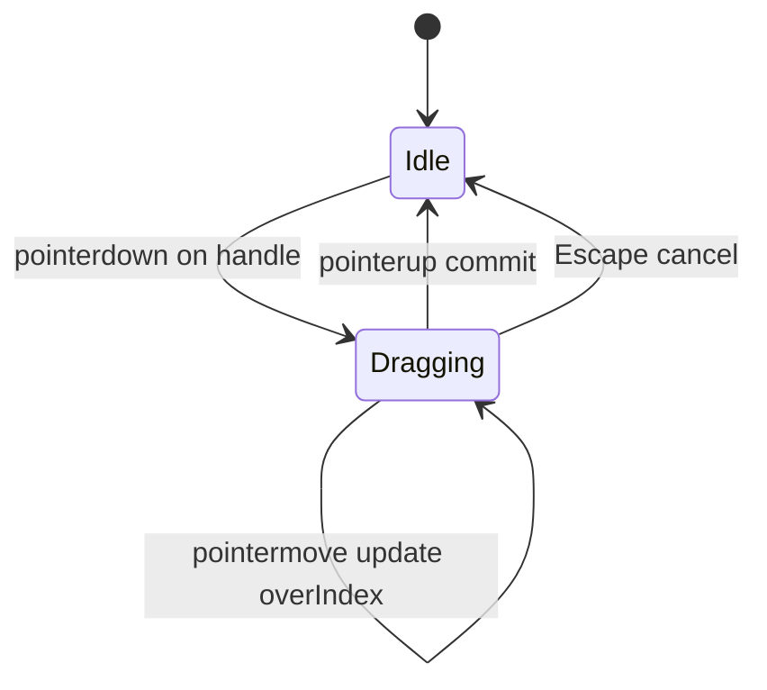
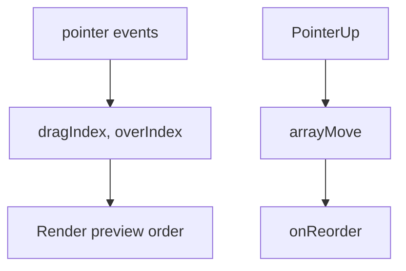

# Drag & Drop

Reorderable list with pointer events (or HTML5 DnD). Interviewers probe hit-testing, index remapping, and keyboard accessibility.

## Requirements

### Functional

- Drag an item; show placeholder / highlight
- Drop reorders the list (`onReorder`)
- Optional: drag between columns (kanban stretch)
- Keyboard: Alt+Arrow move (or Space pick-up / arrows / Space drop)

### Non-functional

- Use transforms while dragging; avoid layout thrash
- Touch + mouse (`touch-action: none` on handle)
- Announce moves via `aria-live`

### Clarify

- Free-form canvas vs list reorder?
- Nested droppable zones?
- Persist order to API?

## Architecture





## Complete implementation

```tsx
// drag-drop-list.tsx
import {
  useCallback,
  useId,
  useRef,
  useState,
  type KeyboardEvent,
  type PointerEvent as ReactPointerEvent,
} from 'react'

function arrayMove<T>(arr: T[], from: number, to: number): T[] {
  const next = arr.slice()
  const [item] = next.splice(from, 1)
  next.splice(to, 0, item)
  return next
}

export type DragDropListProps<T> = {
  items: T[]
  getKey: (item: T) => string
  renderItem: (item: T, opts: { isDragging: boolean }) => React.ReactNode
  onReorder: (next: T[]) => void
}

export function DragDropList<T>({
  items,
  getKey,
  renderItem,
  onReorder,
}: DragDropListProps<T>) {
  const listId = useId()
  const [dragIndex, setDragIndex] = useState<number | null>(null)
  const [overIndex, setOverIndex] = useState<number | null>(null)
  const [live, setLive] = useState('')
  const itemRefs = useRef<(HTMLLIElement | null)[]>([])

  const reset = () => {
    setDragIndex(null)
    setOverIndex(null)
  }

  const commit = useCallback(
    (from: number, to: number) => {
      if (from === to) {
        reset()
        return
      }
      onReorder(arrayMove(items, from, to))
      setLive(`Moved item to position ${to + 1} of ${items.length}`)
      reset()
    },
    [items, onReorder],
  )

  const indexFromPoint = (clientY: number): number => {
    for (let i = 0; i < itemRefs.current.length; i++) {
      const el = itemRefs.current[i]
      if (!el) continue
      const rect = el.getBoundingClientRect()
      if (clientY < rect.top + rect.height / 2) return i
    }
    return items.length - 1
  }

  const onPointerDown = (index: number) => (e: ReactPointerEvent) => {
    if (e.button !== 0) return
    ;(e.target as HTMLElement).setPointerCapture(e.pointerId)
    setDragIndex(index)
    setOverIndex(index)
    setLive(`Grabbed item ${index + 1}. Move to reorder, release to drop.`)
  }

  const onPointerMove = (e: ReactPointerEvent) => {
    if (dragIndex == null) return
    setOverIndex(indexFromPoint(e.clientY))
  }

  const onPointerUp = () => {
    if (dragIndex == null || overIndex == null) {
      reset()
      return
    }
    commit(dragIndex, overIndex)
  }

  const onKeyDown = (index: number) => (e: KeyboardEvent) => {
    if (e.altKey && e.key === 'ArrowDown' && index < items.length - 1) {
      e.preventDefault()
      commit(index, index + 1)
    }
    if (e.altKey && e.key === 'ArrowUp' && index > 0) {
      e.preventDefault()
      commit(index, index - 1)
    }
  }

  const visual =
    dragIndex != null && overIndex != null
      ? arrayMove(items, dragIndex, overIndex)
      : items

  return (
    <>
      <div className="sr-only" aria-live="assertive">
        {live}
      </div>
      <ul
        id={listId}
        onPointerMove={onPointerMove}
        onPointerUp={onPointerUp}
        onPointerCancel={reset}
        style={{ listStyle: 'none', padding: 0, margin: 0 }}
      >
        {visual.map((item, visualIndex) => {
          const originalIndex = items.findIndex((x) => getKey(x) === getKey(item))
          const isDragging = dragIndex === originalIndex
          return (
            <li
              key={getKey(item)}
              ref={(el) => {
                itemRefs.current[visualIndex] = el
              }}
              onKeyDown={onKeyDown(originalIndex)}
              style={{
                display: 'flex',
                gap: 8,
                padding: '8px 12px',
                marginBottom: 4,
                border: '1px solid #ccc',
                background: isDragging ? '#eef' : '#fff',
                opacity: isDragging ? 0.85 : 1,
                touchAction: 'none',
              }}
            >
              <button
                type="button"
                aria-label={`Drag handle for item ${visualIndex + 1}`}
                onPointerDown={onPointerDown(originalIndex)}
                style={{ cursor: 'grab' }}
              >
                ⋮⋮
              </button>
              <div style={{ flex: 1 }}>{renderItem(item, { isDragging })}</div>
            </li>
          )
        })}
      </ul>
    </>
  )
}

export function ReorderDemo() {
  const [items, setItems] = useState([
    { id: 'a', label: 'Design' },
    { id: 'b', label: 'API' },
    { id: 'c', label: 'Tests' },
    { id: 'd', label: 'Ship' },
  ])

  return (
    <DragDropList
      items={items}
      getKey={(x) => x.id}
      onReorder={setItems}
      renderItem={(x) => <span>{x.label}</span>}
    />
  )
}
```

### HTML5 DnD alternative

```tsx
<div
  draggable
  onDragStart={(e) => e.dataTransfer.setData('text/plain', String(index))}
  onDragOver={(e) => e.preventDefault()}
  onDrop={(e) => {
    const from = Number(e.dataTransfer.getData('text/plain'))
    onReorder(arrayMove(items, from, index))
  }}
/>
```

## Edge cases

| Case | Handling |
| --- | --- |
| Drop outside list | Cancel |
| Scrollable container | Auto-scroll near edges (stretch) |
| Nested buttons | Drag **handle** only |
| Touch scroll vs drag | `touch-action: none` on handle |
| Same index drop | No update |
| Virtualized list + DnD | Hard — measure carefully |

## Follow-up interview questions

1. Pointer vs HTML5 DnD vs `dnd-kit`?
2. Kanban multiple droppables?
3. Spatial index for hit-testing?
4. Why `setPointerCapture`?
5. Virtualized lists + DnD?
6. a11y checklist for reorder?
7. Persist order (fractional indices)?
8. Drag preview strategies?

## Common mistakes

| Mistake | Fix |
| --- | --- |
| Reorder DOM without React state | Controlled `items` |
| Index as key | Stable ids |
| Forget `dragover` preventDefault | Drop never fires |
| Whole-row drag breaks buttons | Dedicated handle |
| No live region | SR users lost |
| Mutate array in place | Copy via `arrayMove` |

## Trade-offs

| Choice | Pros | Cons |
| --- | --- | --- |
| Pointer + transform | Full control, touch OK | More code |
| HTML5 DnD | Tiny API | Touch/styling limits |
| Library | Sensors, a11y | Justify dependency |
| Optimistic reorder | Snappy | Rollback on API fail |

**Interview close:** “Track `dragIndex`/`overIndex`, preview with `arrayMove`, commit on pointerup. Handle-only + live regions.”

## Related

- [Virtual list](/machine-coding/04-virtual-list)
