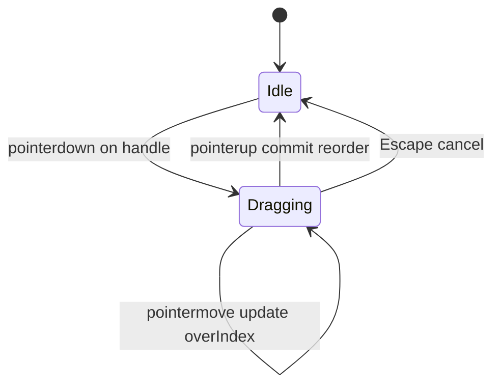
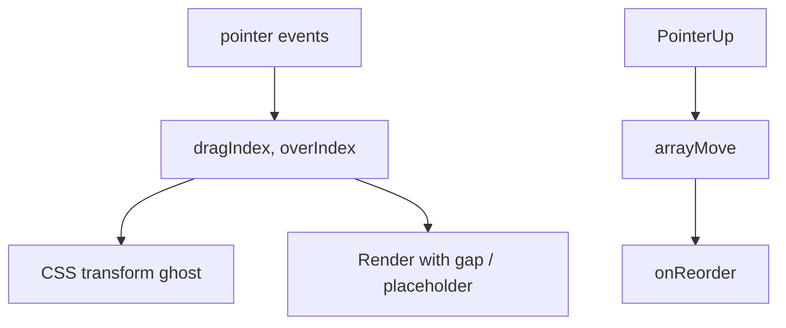

# Drag & Drop

Reorderable list with pointer events (or HTML5 DnD). Interviewers probe hit-testing, index remapping, and keyboard accessibility.

## Requirements

### Functional

- Drag an item; show placeholder / ghost
- Drop reorders the list (`onReorder(from, to)`)
- Optional: drag between columns (kanban stretch)
- Keyboard: Space/Enter to pick up, arrows to move, Space/Escape to drop/cancel

### Non-functional

- No layout thrash; use transforms while dragging
- Touch + mouse support
- Announce moves to screen readers (`aria-live`)

### Clarify

- Free-form canvas vs list reorder?
- Nested droppable zones?
- Persistence / optimistic API?

## Architecture





## Complete implementation (pointer reorder)

```tsx
// drag-drop-list.tsx
import {
  useCallback,
  useId,
  useRef,
  useState,
  type KeyboardEvent,
  type PointerEvent as ReactPointerEvent,
} from 'react'

function arrayMove<T>(arr: T[], from: number, to: number): T[] {
  const next = arr.slice()
  const [item] = next.splice(from, 1)
  next.splice(to, 0, item)
  return next
}

export type DragDropListProps<T> = {
  items: T[]
  getKey: (item: T) => string
  renderItem: (item: T, opts: { isDragging: boolean }) => React.ReactNode
  onReorder: (next: T[]) => void
}

export function DragDropList<T>({
  items,
  getKey,
  renderItem,
  onReorder,
}: DragDropListProps<T>) {
  const listId = useId()
  const [dragIndex, setDragIndex] = useState<number | null>(null)
  const [overIndex, setOverIndex] = useState<number | null>(null)
  const [live, setLive] = useState('')
  const itemRefs = useRef<(HTMLLIElement | null)[]>([])

  const reset = () => {
    setDragIndex(null)
    setOverIndex(null)
  }

  const commit = useCallback(
    (from: number, to: number) => {
      if (from === to) {
        reset()
        return
      }
      const next = arrayMove(items, from, to)
      onReorder(next)
      setLive(`Moved item to position ${to + 1} of ${items.length}`)
      reset()
    },
    [items, onReorder],
  )

  const indexFromPoint = (clientY: number): number => {
    for (let i = 0; i < itemRefs.current.length; i++) {
      const el = itemRefs.current[i]
      if (!el) continue
      const rect = el.getBoundingClientRect()
      const mid = rect.top + rect.height / 2
      if (clientY < mid) return i
    }
    return items.length - 1
  }

  const onPointerDown = (index: number) => (e: ReactPointerEvent) => {
    if (e.button !== 0) return
    ;(e.target as HTMLElement).setPointerCapture(e.pointerId)
    setDragIndex(index)
    setOverIndex(index)
    setLive(`Grabbed item ${index + 1}. Move to reorder, release to drop.`)
  }

  const onPointerMove = (e: ReactPointerEvent) => {
    if (dragIndex == null) return
    setOverIndex(indexFromPoint(e.clientY))
  }

  const onPointerUp = () => {
    if (dragIndex == null || overIndex == null) {
      reset()
      return
    }
    commit(dragIndex, overIndex)
  }

  const onKeyDown = (index: number) => (e: KeyboardEvent) => {
    // Simple pattern: Alt+Arrow moves without full drag mode
    if (e.altKey && e.key === 'ArrowDown' && index < items.length - 1) {
      e.preventDefault()
      commit(index, index + 1)
    }
    if (e.altKey && e.key === 'ArrowUp' && index > 0) {
      e.preventDefault()
      commit(index, index - 1)
    }
  }

  // Visual order while dragging
  const visual =
    dragIndex != null && overIndex != null
      ? arrayMove(items, dragIndex, overIndex)
      : items

  return (
    <>
      <div className="sr-only" aria-live="assertive">
        {live}
      </div>
      <ul
        id={listId}
        onPointerMove={onPointerMove}
        onPointerUp={onPointerUp}
        onPointerCancel={reset}
        style={{ listStyle: 'none', padding: 0, margin: 0 }}
      >
        {visual.map((item, visualIndex) => {
          // Map visual index back to original for drag handle identity
          const originalIndex =
            dragIndex != null && overIndex != null
              ? items.findIndex((x) => getKey(x) === getKey(item))
              : visualIndex
          const isDragging = dragIndex === originalIndex

          return (
            <li
              key={getKey(item)}
              ref={(el) => {
                itemRefs.current[visualIndex] = el
              }}
              onKeyDown={onKeyDown(originalIndex)}
              style={{
                display: 'flex',
                alignItems: 'center',
                gap: 8,
                padding: '8px 12px',
                marginBottom: 4,
                border: '1px solid #ccc',
                background: isDragging ? '#eef' : '#fff',
                opacity: isDragging ? 0.85 : 1,
                touchAction: 'none',
              }}
            >
              <button
                type="button"
                aria-label={`Drag handle for item ${visualIndex + 1}`}
                aria-describedby={listId}
                onPointerDown={onPointerDown(originalIndex)}
                style={{ cursor: 'grab' }}
              >
                ⋮⋮
              </button>
              <div style={{ flex: 1 }}>{renderItem(item, { isDragging })}</div>
            </li>
          )
        })}
      </ul>
    </>
  )
}

// ─── Demo ────────────────────────────────────────────────────────────

export function ReorderDemo() {
  const [items, setItems] = useState([
    { id: 'a', label: 'Design' },
    { id: 'b', label: 'API' },
    { id: 'c', label: 'Tests' },
    { id: 'd', label: 'Ship' },
  ])

  return (
    <DragDropList
      items={items}
      getKey={(x) => x.id}
      onReorder={setItems}
      renderItem={(x) => <span>{x.label}</span>}
    />
  )
}
```

### HTML5 DnD alternative (brief)

```tsx
<div
  draggable
  onDragStart={(e) => {
    e.dataTransfer.setData('text/plain', String(index))
    e.dataTransfer.effectAllowed = 'move'
  }}
  onDragOver={(e) => e.preventDefault()} // allow drop
  onDrop={(e) => {
    const from = Number(e.dataTransfer.getData('text/plain'))
    onReorder(arrayMove(items, from, index))
  }}
/>
```

HTML5 DnD is simpler but weaker on touch and styling the drag image.

## Edge cases

| Case | Handling |
| --- | --- |
| Drop outside list | Cancel (`pointercancel` / leave) |
| Empty list | No-op |
| Scrollable container while dragging | Auto-scroll near edges (stretch) |
| Nested interactive controls | Drag **handle** only — don’t make whole row `draggable` |
| Touch callout / scroll | `touch-action: none` on handle |
| Same index drop | No state update |
| Concurrent React updates | Controlled `items` from parent |

## Follow-up interview questions

1. Pointer events vs HTML5 DnD vs libraries (`dnd-kit`)?
2. How do you implement kanban (multiple droppables)?
3. How to avoid hit-testing every `pointermove` (spatial index)?
4. Why `setPointerCapture`?
5. How should virtualized lists handle DnD?
6. Accessibility checklist for reorderable lists?
7. How to persist order (fractional indices vs full rewrite)?
8. Drag preview: clone vs transform original?

## Common mistakes

| Mistake | Fix |
| --- | --- |
| Reordering DOM without updating state | Controlled list from React state |
| Using index as React key | Stable ids |
| Preventing `dragover` default forgotten | Drop never fires |
| Whole-row drag breaks buttons | Dedicated handle |
| No live region | SR users lost |
| Mutating array in place | `arrayMove` copy |

## Trade-offs

| Choice | Pros | Cons |
| --- | --- | --- |
| Pointer + transform | Full control, touch OK | More code |
| HTML5 DnD | Tiny API | Touch gaps, styling limits |
| `dnd-kit` / Pragmatic DnD | Sensors, a11y, collision | Must justify dependency |
| Optimistic reorder | Snappy | Needs rollback on API fail |

**Interview close:** “Track `dragIndex`/`overIndex`, preview with `arrayMove`, commit on pointerup. Handle-only dragging + live regions for a11y.”

## Related

- Lists: [Virtual list](/machine-coding/04-virtual-list)
- Design systems: [FE Design System](/frontend-system-design/04-design-system)
