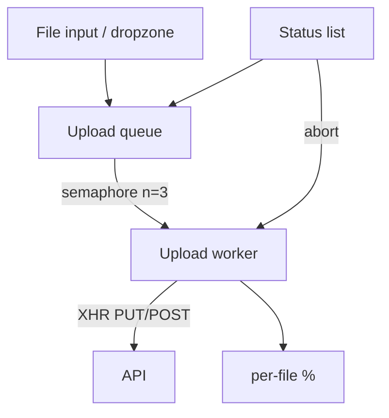

# File Upload

Multi-file upload with progress, abort, concurrency limits, and retries. Tests async orchestration more than UI polish.

## Requirements

### Functional

- Select files via input / drag-drop zone
- Validate type + max size client-side
- Upload with progress (`XMLHttpRequest` or `fetch` + ReadableStream — XHR easiest for progress)
- Cancel in-flight upload
- Retry failed files
- Optional: multi-file queue with max concurrency

### Non-functional

- Don’t block UI thread on large files
- Clear per-file status: queued / uploading / done / error / aborted
- Memory: avoid reading entire huge file into JS string

### Clarify

- Multipart form vs direct-to-S3 presigned PUT?
- Chunked / resumable (tus)?
- Image compression / preview?

## Architecture



```mermaid
sequenceDiagram
  participant U as User
  participant Q as Queue
  participant X as XHR
  participant S as Server
  U->>Q: add files
  Q->>X: start <= concurrency
  X->>S: POST multipart
  S-->>X: progress events
  X-->>Q: update %
  alt success
    X-->>Q: done + url
  else fail
    X-->>Q: error; allow retry
  end
```

## Complete implementation

```tsx
// file-upload.tsx
import {
  useCallback,
  useRef,
  useState,
  type ChangeEvent,
  type DragEvent,
} from 'react'

export type UploadStatus = 'queued' | 'uploading' | 'done' | 'error' | 'aborted'

export type UploadItem = {
  id: string
  file: File
  status: UploadStatus
  progress: number // 0–100
  error?: string
  url?: string
}

type Options = {
  endpoint: string
  concurrency?: number
  maxBytes?: number
  accept?: string[] // mime prefixes e.g. ['image/', 'application/pdf']
}

function uid() {
  return `${Date.now()}-${Math.random().toString(36).slice(2, 9)}`
}

function uploadWithProgress(
  file: File,
  endpoint: string,
  onProgress: (pct: number) => void,
  signal: AbortSignal,
): Promise<{ url: string }> {
  return new Promise((resolve, reject) => {
    const xhr = new XMLHttpRequest()
    xhr.open('POST', endpoint)
    xhr.responseType = 'json'

    const onAbort = () => {
      xhr.abort()
      reject(new DOMException('Aborted', 'AbortError'))
    }
    signal.addEventListener('abort', onAbort)

    xhr.upload.onprogress = (e) => {
      if (!e.lengthComputable) return
      onProgress(Math.round((100 * e.loaded) / e.total))
    }

    xhr.onload = () => {
      signal.removeEventListener('abort', onAbort)
      if (xhr.status >= 200 && xhr.status < 300) {
        const body = xhr.response ?? {}
        resolve({ url: body.url ?? endpoint })
      } else {
        reject(new Error(`HTTP ${xhr.status}`))
      }
    }

    xhr.onerror = () => {
      signal.removeEventListener('abort', onAbort)
      reject(new Error('Network error'))
    }

    xhr.onabort = () => {
      signal.removeEventListener('abort', onAbort)
      reject(new DOMException('Aborted', 'AbortError'))
    }

    const form = new FormData()
    form.append('file', file)
    xhr.send(form)
  })
}

export function useUploadQueue(opts: Options) {
  const { endpoint, concurrency = 3, maxBytes = 10 * 1024 * 1024, accept } = opts
  const [items, setItems] = useState<UploadItem[]>([])
  const controllers = useRef(new Map<string, AbortController>())
  const running = useRef(0)
  const waiters = useRef<Array<() => void>>([])

  const update = (id: string, patch: Partial<UploadItem>) => {
    setItems((prev) => prev.map((x) => (x.id === id ? { ...x, ...patch } : x)))
  }

  const acquire = () =>
    new Promise<void>((resolve) => {
      if (running.current < concurrency) {
        running.current++
        resolve()
      } else {
        waiters.current.push(() => {
          running.current++
          resolve()
        })
      }
    })

  const release = () => {
    running.current--
    const next = waiters.current.shift()
    if (next) next()
  }

  const runOne = async (item: UploadItem) => {
    await acquire()
    const ac = new AbortController()
    controllers.current.set(item.id, ac)
    update(item.id, { status: 'uploading', progress: 0, error: undefined })

    try {
      const { url } = await uploadWithProgress(
        item.file,
        endpoint,
        (progress) => update(item.id, { progress }),
        ac.signal,
      )
      update(item.id, { status: 'done', progress: 100, url })
    } catch (e) {
      if (e instanceof DOMException && e.name === 'AbortError') {
        update(item.id, { status: 'aborted', progress: 0 })
      } else {
        update(item.id, {
          status: 'error',
          error: e instanceof Error ? e.message : String(e),
        })
      }
    } finally {
      controllers.current.delete(item.id)
      release()
    }
  }

  const validate = (file: File): string | null => {
    if (file.size > maxBytes) return `Max size ${maxBytes} bytes`
    if (accept && accept.length > 0) {
      const ok = accept.some(
        (a) => file.type === a || (a.endsWith('/') && file.type.startsWith(a)),
      )
      if (!ok) return `Type not allowed: ${file.type || 'unknown'}`
    }
    return null
  }

  const enqueue = useCallback(
    (files: FileList | File[]) => {
      const list = Array.from(files)
      const accepted: UploadItem[] = []
      for (const file of list) {
        const err = validate(file)
        const id = uid()
        if (err) {
          accepted.push({
            id,
            file,
            status: 'error',
            progress: 0,
            error: err,
          })
        } else {
          accepted.push({ id, file, status: 'queued', progress: 0 })
        }
      }
      setItems((prev) => [...prev, ...accepted])
      for (const item of accepted) {
        if (item.status === 'queued') void runOne(item)
      }
    },
    // runOne stable enough for interview; production: refactor deps
    [endpoint, concurrency, maxBytes, accept],
  )

  const abort = (id: string) => {
    controllers.current.get(id)?.abort()
  }

  const retry = (id: string) => {
    setItems((prev) => {
      const item = prev.find((x) => x.id === id)
      if (!item) return prev
      const next = { ...item, status: 'queued' as const, progress: 0, error: undefined }
      void runOne(next)
      return prev.map((x) => (x.id === id ? next : x))
    })
  }

  const remove = (id: string) => {
    abort(id)
    setItems((prev) => prev.filter((x) => x.id !== id))
  }

  return { items, enqueue, abort, retry, remove }
}

// ─── UI ──────────────────────────────────────────────────────────────

export function FileUploader() {
  const { items, enqueue, abort, retry, remove } = useUploadQueue({
    endpoint: '/api/upload',
    concurrency: 2,
    maxBytes: 5 * 1024 * 1024,
    accept: ['image/', 'application/pdf'],
  })
  const [dragOver, setDragOver] = useState(false)

  const onChange = (e: ChangeEvent<HTMLInputElement>) => {
    if (e.target.files) enqueue(e.target.files)
    e.target.value = '' // allow re-select same file
  }

  const onDrop = (e: DragEvent) => {
    e.preventDefault()
    setDragOver(false)
    if (e.dataTransfer.files) enqueue(e.dataTransfer.files)
  }

  return (
    <div>
      <div
        onDragOver={(e) => {
          e.preventDefault()
          setDragOver(true)
        }}
        onDragLeave={() => setDragOver(false)}
        onDrop={onDrop}
        style={{
          border: `2px dashed ${dragOver ? '#36c' : '#aaa'}`,
          padding: 24,
          textAlign: 'center',
        }}
      >
        <p>Drop files here or</p>
        <input type="file" multiple onChange={onChange} />
      </div>

      <ul>
        {items.map((it) => (
          <li key={it.id}>
            <strong>{it.file.name}</strong> — {it.status}{' '}
            {it.status === 'uploading' && `${it.progress}%`}
            {it.error && <span style={{ color: 'crimson' }}> {it.error}</span>}
            {it.url && (
              <a href={it.url} target="_blank" rel="noreferrer">
                open
              </a>
            )}
            <span style={{ marginLeft: 8 }}>
              {it.status === 'uploading' && (
                <button type="button" onClick={() => abort(it.id)}>
                  Cancel
                </button>
              )}
              {(it.status === 'error' || it.status === 'aborted') && (
                <button type="button" onClick={() => retry(it.id)}>
                  Retry
                </button>
              )}
              <button type="button" onClick={() => remove(it.id)}>
                Remove
              </button>
            </span>
            {it.status === 'uploading' && (
              <progress value={it.progress} max={100} style={{ display: 'block', width: '100%' }} />
            )}
          </li>
        ))}
      </ul>
    </div>
  )
}
```

### Stretch: chunked upload sketch

```ts
async function uploadChunked(file: File, chunkSize = 5 * 1024 * 1024) {
  const total = Math.ceil(file.size / chunkSize)
  const uploadId = await initUpload(file.name, file.size)
  for (let i = 0; i < total; i++) {
    const blob = file.slice(i * chunkSize, (i + 1) * chunkSize)
    await putChunk(uploadId, i, blob)
  }
  return completeUpload(uploadId)
}
```

## Edge cases

| Case | Handling |
| --- | --- |
| 0-byte file | Reject or allow per product |
| Same file selected twice | New id each enqueue; reset input value |
| Abort mid-upload | `AbortError` → status aborted |
| Server 413 / virus scan fail | Surface message; retry may not help |
| Tab close mid-upload | `beforeunload` warn (optional) |
| Concurrency stampede | Semaphore |
| Progress unknown (`lengthComputable` false) | Indeterminate progress bar |
| Drag leave flicker | Count enter/leave or use `pointer-events` |

## Follow-up interview questions

1. Why XHR for progress instead of `fetch`?
2. Presigned S3 upload flow vs server proxy?
3. How do resumable uploads work (tus / multipart S3)?
4. How to limit client memory for multi-GB files?
5. CSRF / auth headers on upload?
6. How to show image preview safely (`URL.createObjectURL` + revoke)?
7. Virus scanning — where?
8. What is multipart boundary / `FormData` doing?

## Common mistakes

| Mistake | Fix |
| --- | --- |
| Only `fetch` without progress plan | Use XHR or fetch streaming hacks |
| No concurrency cap | Browser connection limits / server melt |
| Trusting client MIME only | Server validates again |
| Forgetting to revoke object URLs | Memory leaks |
| Blocking main thread with `FileReader` sync | Async APIs |
| Can’t cancel | Wire `AbortController` / `xhr.abort` |

## Trade-offs

| Choice | Pros | Cons |
| --- | --- | --- |
| Through app server | Simple auth | Bandwidth + cost on server |
| Direct to blob store | Scales | CORS, presign complexity |
| Chunked resumable | Flaky networks | Protocol complexity |
| Client compression | Faster | CPU / quality loss |

**Interview close:** “Queue files, validate, upload with XHR progress under a concurrency semaphore, support abort/retry, keep per-file state machine explicit.”

## Related

- BE files/CDN: [File CDN](/backend-system-design/06-file-cdn)
- Async patterns: [JS Async](/javascript/11-async)
