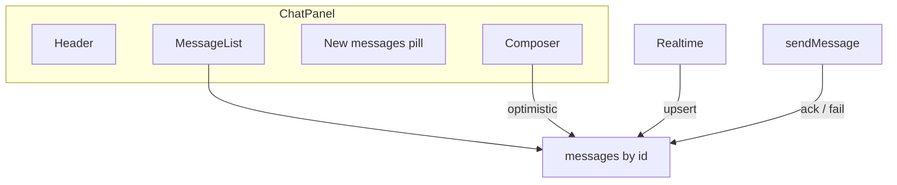
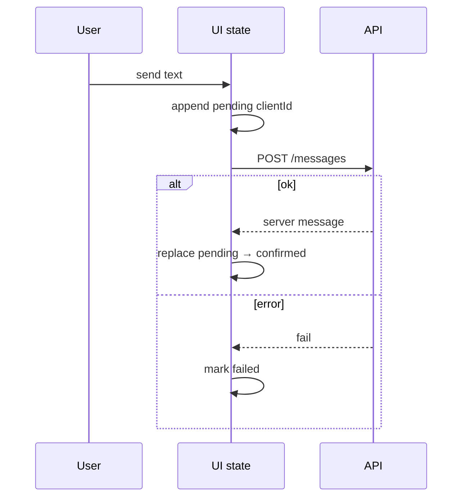

# Chat UI

Messaging thread: message list, composer, optimistic send, stick-to-bottom scroll, and failure/retry. Pairs with [FE Chat design](/frontend-system-design/03-chat).

## Requirements

### Functional

- Chronological messages
- Composer: Enter send, Shift+Enter newline
- Optimistic append with `clientId`; reconcile on ack
- Failed sends show retry
- Auto-scroll when pinned; “New messages” when scrolled up
- Optional: load older at top

### Non-functional

- Don’t jump scroll when prepending history
- Deduplicate realtime + HTTP
- a11y: `role="log"`, labeled composer

### Clarify

- WS vs polling? Markdown / receipts? Group vs 1:1?

## Architecture





## Complete implementation

```tsx
// chat-ui.tsx
import {
  useCallback,
  useLayoutEffect,
  useRef,
  useState,
  type FormEvent,
  type KeyboardEvent,
  type UIEvent,
} from 'react'

export type MsgStatus = 'pending' | 'sent' | 'failed'

export type ChatMessage = {
  id: string
  clientId: string
  text: string
  author: 'me' | 'them'
  createdAt: number
  status: MsgStatus
}

function cid() {
  return `c_${Date.now()}_${Math.random().toString(36).slice(2, 8)}`
}

async function apiSend(
  text: string,
  clientId: string,
): Promise<{ id: string; createdAt: number }> {
  const res = await fetch('/api/chat', {
    method: 'POST',
    headers: { 'Content-Type': 'application/json' },
    body: JSON.stringify({ text, clientId }),
  })
  if (!res.ok) throw new Error('Send failed')
  return res.json()
}

const NEAR_BOTTOM_PX = 80

export function ChatUI({ initial = [], meLabel = 'You' }: { initial?: ChatMessage[]; meLabel?: string }) {
  const [messages, setMessages] = useState<ChatMessage[]>(initial)
  const [draft, setDraft] = useState('')
  const [pinned, setPinned] = useState(true)
  const [unseen, setUnseen] = useState(0)

  const scrollerRef = useRef<HTMLDivElement>(null)
  const bottomRef = useRef<HTMLDivElement>(null)
  const prevHeight = useRef(0)

  const scrollToBottom = useCallback((behavior: ScrollBehavior = 'smooth') => {
    bottomRef.current?.scrollIntoView({ behavior })
  }, [])

  const onScroll = (e: UIEvent<HTMLDivElement>) => {
    const el = e.currentTarget
    const near = el.scrollHeight - el.scrollTop - el.clientHeight < NEAR_BOTTOM_PX
    setPinned(near)
    if (near) setUnseen(0)
  }

  useLayoutEffect(() => {
    if (pinned) scrollToBottom(messages.length <= 1 ? 'auto' : 'smooth')
  }, [messages, pinned, scrollToBottom])

  const send = async (text: string) => {
    const trimmed = text.trim()
    if (!trimmed) return
    const clientId = cid()
    setMessages((prev) => [
      ...prev,
      {
        id: clientId,
        clientId,
        text: trimmed,
        author: 'me',
        createdAt: Date.now(),
        status: 'pending',
      },
    ])
    setDraft('')
    setPinned(true)
    setUnseen(0)

    try {
      const ack = await apiSend(trimmed, clientId)
      setMessages((prev) =>
        prev.map((m) =>
          m.clientId === clientId
            ? { ...m, id: ack.id, createdAt: ack.createdAt, status: 'sent' }
            : m,
        ),
      )
    } catch {
      setMessages((prev) =>
        prev.map((m) => (m.clientId === clientId ? { ...m, status: 'failed' } : m)),
      )
    }
  }

  const retry = async (clientId: string) => {
    const msg = messages.find((m) => m.clientId === clientId)
    if (!msg) return
    setMessages((prev) =>
      prev.map((m) => (m.clientId === clientId ? { ...m, status: 'pending' } : m)),
    )
    try {
      const ack = await apiSend(msg.text, clientId)
      setMessages((prev) =>
        prev.map((m) =>
          m.clientId === clientId
            ? { ...m, id: ack.id, createdAt: ack.createdAt, status: 'sent' }
            : m,
        ),
      )
    } catch {
      setMessages((prev) =>
        prev.map((m) => (m.clientId === clientId ? { ...m, status: 'failed' } : m)),
      )
    }
  }

  const prependHistory = (older: ChatMessage[]) => {
    const el = scrollerRef.current
    if (el) prevHeight.current = el.scrollHeight
    setMessages((prev) => {
      const seen = new Set(prev.map((m) => m.id))
      return [...older.filter((m) => !seen.has(m.id)), ...prev]
    })
  }

  useLayoutEffect(() => {
    const el = scrollerRef.current
    if (!el || prevHeight.current === 0) return
    el.scrollTop += el.scrollHeight - prevHeight.current
    prevHeight.current = 0
  }, [messages])

  const onKeyDown = (e: KeyboardEvent<HTMLTextAreaElement>) => {
    if (e.key === 'Enter' && !e.shiftKey) {
      e.preventDefault()
      void send(draft)
    }
  }

  return (
    <div style={{ display: 'flex', flexDirection: 'column', height: 480, border: '1px solid #ccc', maxWidth: 420 }}>
      <header style={{ padding: 8, borderBottom: '1px solid #eee' }}>Chat</header>
      <div style={{ position: 'relative', flex: 1, minHeight: 0 }}>
        <div
          ref={scrollerRef}
          role="log"
          aria-live="polite"
          onScroll={onScroll}
          style={{ height: '100%', overflow: 'auto', padding: 8 }}
        >
          <button type="button" onClick={() => prependHistory([])}>
            Load older
          </button>
          {messages.map((m) => (
            <div
              key={m.clientId}
              style={{
                display: 'flex',
                justifyContent: m.author === 'me' ? 'flex-end' : 'flex-start',
                marginBottom: 8,
              }}
            >
              <div
                style={{
                  maxWidth: '75%',
                  padding: '8px 10px',
                  borderRadius: 12,
                  background: m.author === 'me' ? '#dcf8c6' : '#f1f0f0',
                  opacity: m.status === 'pending' ? 0.7 : 1,
                }}
              >
                <div>{m.text}</div>
                <div style={{ fontSize: 11, opacity: 0.7 }}>
                  {m.author === 'me' ? meLabel : 'Them'} ·{' '}
                  {m.status === 'pending' && 'Sending…'}
                  {m.status === 'sent' && 'Sent'}
                  {m.status === 'failed' && (
                    <>
                      Failed{' '}
                      <button type="button" onClick={() => void retry(m.clientId)}>
                        Retry
                      </button>
                    </>
                  )}
                </div>
              </div>
            </div>
          ))}
          <div ref={bottomRef} />
        </div>
        {unseen > 0 && (
          <button
            type="button"
            onClick={() => {
              setPinned(true)
              setUnseen(0)
              scrollToBottom()
            }}
            style={{ position: 'absolute', bottom: 8, left: '50%', transform: 'translateX(-50%)' }}
          >
            {unseen} new
          </button>
        )}
      </div>
      <form
        onSubmit={(e: FormEvent) => {
          e.preventDefault()
          void send(draft)
        }}
        style={{ display: 'flex', gap: 8, padding: 8 }}
      >
        <label className="sr-only" htmlFor="chat-draft">
          Message
        </label>
        <textarea
          id="chat-draft"
          rows={2}
          value={draft}
          onChange={(e) => setDraft(e.target.value)}
          onKeyDown={onKeyDown}
          style={{ flex: 1, resize: 'none' }}
        />
        <button type="submit" disabled={!draft.trim()}>
          Send
        </button>
      </form>
    </div>
  )
}
```

## Edge cases

| Case | Handling |
| --- | --- |
| Double ack (HTTP + WS) | Dedupe by `clientId` / server `id` |
| Own send while scrolled up | Usually force pin |
| Prepend history | Adjust `scrollTop` by height delta |
| Empty / whitespace send | Ignore |
| Clock skew ordering | Server timestamp + tie-break id |
| `aria-live` spam | polite; don’t announce drafts |

## Follow-up interview questions

1. Preserve scroll when loading older?
2. Optimistic rollback patterns?
3. Virtualize chat + stick-to-bottom?
4. At-least-once WS delivery?
5. Typing indicator ownership?
6. Offline send queue?
7. E2E encryption impact?
8. How to merge realtime into React Query cache?

## Common mistakes

| Mistake | Fix |
| --- | --- |
| Key = index | Use `clientId` |
| Always auto-scroll | Respect `pinned` |
| Replace list on WS | Upsert |
| Prepend without scroll adjust | Jump |
| Draft in global store | Local state |

## Trade-offs

| Choice | Pros | Cons |
| --- | --- | --- |
| Optimistic send | Instant feel | Reconcile complexity |
| Virtualize | Long history | Sticky bottom harder |
| WS + HTTP send | Reliable ack | Dedupe required |
| Polling | Simple | Latency |

**Interview close:** “Optimistic pending keyed by `clientId`, reconcile on ack, stick-to-bottom when pinned, height-delta when prepending.”

## Related

- [FE Chat](/frontend-system-design/03-chat) · [Infinite scroll](/machine-coding/03-infinite-scroll)
