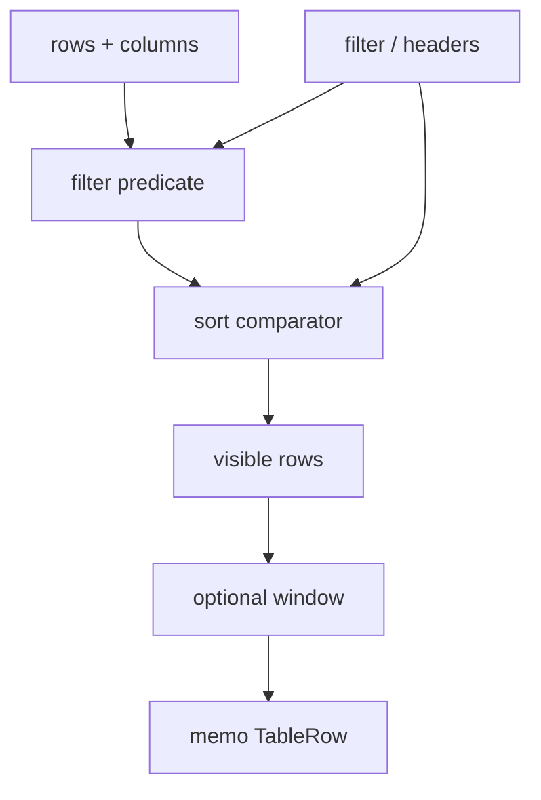
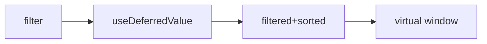

# Optimized Table

Sortable, filterable data table that stays fast at 5k–50k rows: **memoized rows**, stable keys, optional virtualization, and careful derived-state updates.

## Requirements

### Functional

- Columns with headers
- Client-side sort (header toggles asc/desc/none)
- Global text filter
- Optional row selection
- Controlled `rows` prop

### Non-functional

- Filter typing shouldn’t remount every cell wastefully
- Virtualize beyond ~500–1000 DOM rows
- Sortable headers are buttons (keyboard)

### Clarify

- Server-side sort/page?
- Sticky header / frozen columns?
- Inline editing?

## Architecture





## Complete implementation

```tsx
// optimized-table.tsx
import {
  memo,
  useDeferredValue,
  useMemo,
  useState,
  type ReactNode,
} from 'react'

export type Column<T> = {
  id: string
  header: string
  accessor: (row: T) => string | number | boolean | null | undefined
  sortable?: boolean
  width?: number
  cell?: (row: T) => ReactNode
}

type SortState = { id: string; dir: 'asc' | 'desc' } | null

function defaultCompare(a: unknown, b: unknown): number {
  if (a == null && b == null) return 0
  if (a == null) return -1
  if (b == null) return 1
  if (typeof a === 'number' && typeof b === 'number') return a - b
  return String(a).localeCompare(String(b), undefined, { numeric: true })
}

function VirtualWindow<T>({
  items,
  height,
  rowHeight,
  getKey,
  renderRow,
  overscan = 6,
}: {
  items: T[]
  height: number
  rowHeight: number
  getKey: (row: T) => string
  renderRow: (row: T) => ReactNode
  overscan?: number
}) {
  const [scrollTop, setScrollTop] = useState(0)
  const start = Math.max(0, Math.floor(scrollTop / rowHeight) - overscan)
  const end = Math.min(items.length, start + Math.ceil(height / rowHeight) + overscan * 2)
  const offsetY = start * rowHeight
  return (
    <div
      style={{ height, overflow: 'auto', position: 'relative' }}
      onScroll={(e) => setScrollTop(e.currentTarget.scrollTop)}
    >
      <div style={{ height: items.length * rowHeight, position: 'relative' }}>
        <div style={{ transform: `translateY(${offsetY}px)` }}>
          {items.slice(start, end).map((row) => (
            <div key={getKey(row)}>{renderRow(row)}</div>
          ))}
        </div>
      </div>
    </div>
  )
}

export function OptimizedTable<T>({
  rows,
  columns,
  getRowId,
  height = 400,
  rowHeight = 40,
  virtualize = true,
}: {
  rows: T[]
  columns: Column<T>[]
  getRowId: (row: T) => string
  height?: number
  rowHeight?: number
  virtualize?: boolean
}) {
  const [filter, setFilter] = useState('')
  const deferredFilter = useDeferredValue(filter)
  const [sort, setSort] = useState<SortState>(null)
  const [selected, setSelected] = useState<Set<string>>(() => new Set())

  const visible = useMemo(() => {
    const q = deferredFilter.trim().toLowerCase()
    let list = rows
    if (q) {
      list = rows.filter((row) =>
        columns.some((c) => String(c.accessor(row) ?? '').toLowerCase().includes(q)),
      )
    }
    if (sort) {
      const col = columns.find((c) => c.id === sort.id)
      if (col) {
        const dir = sort.dir === 'asc' ? 1 : -1
        list = list.slice().sort(
          (ra, rb) => defaultCompare(col.accessor(ra), col.accessor(rb)) * dir,
        )
      }
    }
    return list
  }, [rows, columns, deferredFilter, sort])

  const toggleSort = (id: string) => {
    setSort((prev) => {
      if (!prev || prev.id !== id) return { id, dir: 'asc' }
      if (prev.dir === 'asc') return { id, dir: 'desc' }
      return null
    })
  }

  const toggleRow = (id: string) => {
    setSelected((prev) => {
      const next = new Set(prev)
      if (next.has(id)) next.delete(id)
      else next.add(id)
      return next
    })
  }

  const gridCols = `32px ${columns.map((c) => `${c.width ?? 120}px`).join(' ')}`

  const header = (
    <div
      role="row"
      style={{
        display: 'grid',
        gridTemplateColumns: gridCols,
        position: 'sticky',
        top: 0,
        background: '#fafafa',
        borderBottom: '1px solid #ddd',
        zIndex: 1,
        height: rowHeight,
        alignItems: 'center',
      }}
    >
      <span />
      {columns.map((c) => (
        <div key={c.id} role="columnheader">
          {c.sortable === false ? (
            c.header
          ) : (
            <button type="button" onClick={() => toggleSort(c.id)}>
              {c.header}
              {sort?.id === c.id ? (sort.dir === 'asc' ? ' ↑' : ' ↓') : ''}
            </button>
          )}
        </div>
      ))}
    </div>
  )

  const renderRow = (row: T) => (
    <TableRow
      row={row}
      columns={columns}
      rowId={getRowId(row)}
      selected={selected.has(getRowId(row))}
      onToggle={toggleRow}
      rowHeight={rowHeight}
      gridCols={gridCols}
    />
  )

  return (
    <div>
      <label>
        Filter{' '}
        <input value={filter} onChange={(e) => setFilter(e.target.value)} placeholder="Search…" />
      </label>
      <div style={{ marginTop: 8, border: '1px solid #ddd' }}>
        {header}
        {virtualize ? (
          <VirtualWindow
            items={visible}
            height={height}
            rowHeight={rowHeight}
            getKey={getRowId}
            renderRow={renderRow}
          />
        ) : (
          <div style={{ maxHeight: height, overflow: 'auto' }}>
            {visible.map((row) => (
              <div key={getRowId(row)}>{renderRow(row)}</div>
            ))}
          </div>
        )}
      </div>
      <p style={{ fontSize: 12, opacity: 0.7 }}>
        Showing {visible.length} / {rows.length}
        {selected.size > 0 && ` · ${selected.size} selected`}
        {filter !== deferredFilter && ' · updating…'}
      </p>
    </div>
  )
}

const TableRow = memo(function TableRowInner<T>({
  row,
  columns,
  rowId,
  selected,
  onToggle,
  rowHeight,
  gridCols,
}: {
  row: T
  columns: Column<T>[]
  rowId: string
  selected: boolean
  onToggle: (id: string) => void
  rowHeight: number
  gridCols: string
}) {
  return (
    <div
      role="row"
      style={{
        display: 'grid',
        gridTemplateColumns: gridCols,
        height: rowHeight,
        alignItems: 'center',
        borderBottom: '1px solid #f0f0f0',
        background: selected ? '#eef6ff' : undefined,
      }}
    >
      <input
        type="checkbox"
        checked={selected}
        onChange={() => onToggle(rowId)}
        aria-label={`Select row ${rowId}`}
      />
      {columns.map((c) => (
        <div key={c.id} role="cell" style={{ overflow: 'hidden', textOverflow: 'ellipsis' }}>
          {c.cell ? c.cell(row) : String(c.accessor(row) ?? '')}
        </div>
      ))}
    </div>
  )
}) as <T>(p: {
  row: T
  columns: Column<T>[]
  rowId: string
  selected: boolean
  onToggle: (id: string) => void
  rowHeight: number
  gridCols: string
}) => React.ReactElement

type User = { id: string; name: string; age: number; role: string }

export function UsersTableDemo() {
  const rows = useMemo<User[]>(
    () =>
      Array.from({ length: 10_000 }, (_, i) => ({
        id: String(i),
        name: `User ${i}`,
        age: 18 + (i % 50),
        role: i % 3 === 0 ? 'admin' : 'member',
      })),
    [],
  )

  const columns: Column<User>[] = useMemo(
    () => [
      { id: 'name', header: 'Name', accessor: (r) => r.name, width: 160 },
      { id: 'age', header: 'Age', accessor: (r) => r.age, width: 80 },
      { id: 'role', header: 'Role', accessor: (r) => r.role, width: 100 },
    ],
    [],
  )

  return <OptimizedTable rows={rows} columns={columns} getRowId={(r) => r.id} virtualize />
}
```

### Server-driven variant

Debounce filter → `GET /api/users?q=&sort=&cursor=` — don’t sort 1M rows on the client.

## Edge cases

| Case | Handling |
| --- | --- |
| Empty / no matches | Empty state |
| Null cells | `defaultCompare` nulls first |
| Unstable `columns` identity | `useMemo` in parent |
| Selection + filter | Select by id |
| `memo` still re-renders | Stabilize callbacks / columns |

## Follow-up interview questions

1. When move sort/filter to server?
2. Why `useDeferredValue`?
3. TanStack Table headless model?
4. Sticky header + virtualization?
5. Avoid re-render all rows on select-one?
6. Unstable `getRowId` bugs?
7. CSV export — main thread vs worker?
8. Frozen columns approach?

## Common mistakes

| Mistake | Fix |
| --- | --- |
| Sort in render without memo | `useMemo` derived rows |
| Inline `columns={[{…}]}` | Recreates cells |
| 10k DOM `<tr>` | Virtualize |
| Mutate `rows.sort()` | Copy then sort |
| Index keys | Stable ids |

## Trade-offs

| Choice | Pros | Cons |
| --- | --- | --- |
| Client sort/filter | Instant | CPU/memory ceiling |
| Server page | Scales | Latency |
| Full virtualize | Smooth at 50k | Width math harder |
| Canvas grid libs | Extreme perf | Heavy deps |

**Interview close:** “Derive filtered+sorted with memoization, defer filter input, virtualize rows, memoize row components with stable ids.”

## Related

- [Virtual list](/machine-coding/04-virtual-list) · [FE Dashboard](/frontend-system-design/06-dashboard)
