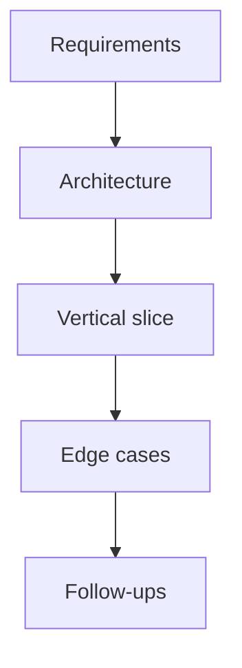

# Frontend Machine Coding

Timed builds interviewers use to test React architecture, state, performance, and API design — not pixel-perfect CSS.

## How to approach (45–60 min)

1. **Clarify** requirements, data shape, happy path + 3 edge cases (2–3 min).
2. **Sketch** components + data flow (Mermaid in your head / whiteboard).
3. **Implement** vertical slice first (ugly but working), then harden.
4. **Narrate** complexity, a11y, and follow-up extensions.

## Build index

| # | Build | Signals |
| --- | --- | --- |
| [01](/machine-coding/01-react-query) | Mini React Query | cache, staleTime, subscribers |
| [02](/machine-coding/02-redux) | Mini Redux | store, dispatch, subscriptions |
| [03](/machine-coding/03-infinite-scroll) | Infinite scroll | IntersectionObserver, paging |
| [04](/machine-coding/04-virtual-list) | Virtual list | windowing math |
| [05](/machine-coding/05-drag-drop) | Drag & drop | pointer events, reorder |
| [06](/machine-coding/06-file-upload) | File upload | progress, validation, abort |
| [07](/machine-coding/07-chat-ui) | Chat UI | lists, optimistic send |
| [08](/machine-coding/08-optimized-table) | Optimized table | sort/filter/virtualize |

## Scoring rubric (what seniors do)

| Level | Behavior |
| --- | --- |
| Junior | Only happy path; prop-drill soup |
| Mid | Working + loading/error; basic hooks |
| Senior | Clear modules, abort/cancel, a11y, perf notes, tests of edge cases |

> [!TIP]
> Prefer **boring, correct TypeScript** over clever abstractions. Interviewers read intent.
