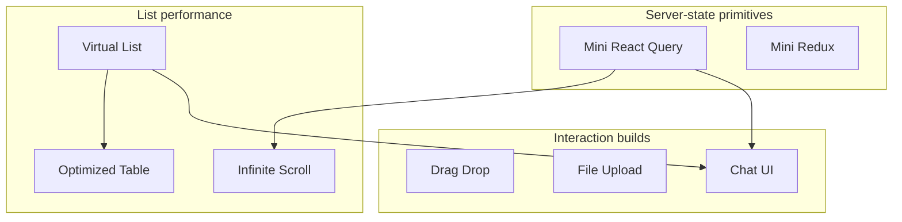

# Frontend Machine Coding

Timed builds interviewers use to probe React fluency: cache design, list performance, DnD, uploads, and chat UX. Prefer **working core + clear trade-offs** over polished CSS.

## How to use this track

1. Read requirements aloud; clarify constraints (fixed vs variable height, pagination style, a11y).
2. Sketch architecture (mermaid in your head) → data flow → state ownership.
3. Implement the **happy path** first; then edge cases the interviewer will poke.
4. Narrate complexity: DOM node count, network, re-renders.

Target: **45–60 minutes** per build in an interview; use these pages as cold drills.

## Build map

| # | Build | What they test |
| --- | --- | --- |
| [01](/machine-coding/01-react-query) | Mini React Query | Cache, observers, stale/dedupe, invalidation |
| [02](/machine-coding/02-redux) | Mini Redux | Store, combineReducers, subscriptions, hooks |
| [03](/machine-coding/03-infinite-scroll) | Infinite scroll | IntersectionObserver, cursors, race guards |
| [04](/machine-coding/04-virtual-list) | Virtual list | Windowing, overscan, scroll math |
| [05](/machine-coding/05-drag-drop) | Drag & drop | Pointer/HTML5 DnD, reorder, a11y |
| [06](/machine-coding/06-file-upload) | File upload | Progress, abort, concurrency, retries |
| [07](/machine-coding/07-chat-ui) | Chat UI | Optimistic send, scroll anchor, realtime merge |
| [08](/machine-coding/08-optimized-table) | Optimized table | Sort/filter, virtualize, memo rows |

## Scoring rubric (what seniors nail)

| Dimension | Weak | Strong |
| --- | --- | --- |
| State ownership | Everything in one `useState` | Server vs UI vs ephemeral UI split |
| Correctness | Ignores races / unmount | Abort, request ids, stale closures |
| Performance | Mounts 10k DOM nodes | Virtualize / window; memo stable keys |
| API design | Hard-coded fetch | Hooks/components with clear contracts |
| Communication | Silent coding | Trade-offs + complexity spoken |

## Related tracks

- Utils / Promise / EventEmitter: [JS Machine Coding](/javascript/23-machine-coding)
- Algo grind: [Coding](/coding/index)
- Product-scale designs: [FE System Design](/frontend-system-design/index)

> [!TIP]
> In interviews, ship a **minimal correct core**, then add one stretch (abort, keyboard DnD, chunked upload). Don’t gold-plate CSS.
