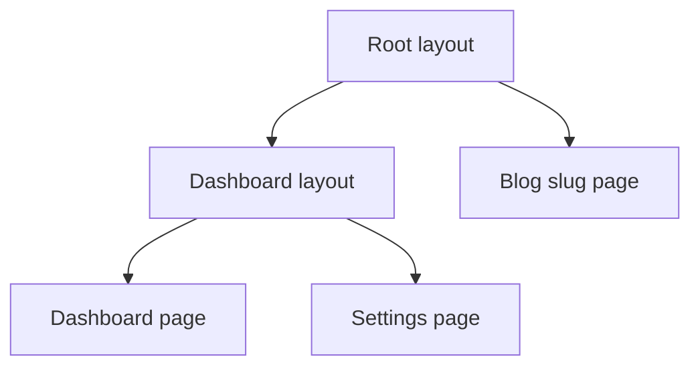

# App Router

The App Router (`app/`) is Next.js’s file-system router built on **React Server Components**, nested layouts, and progressive routing. It replaces (and coexists with) the Pages Router (`pages/`). Senior interviews expect you to know conventions, nesting, and how server/client boundaries map onto folders.

## File conventions

| File | Role |
| --- | --- |
| `layout.tsx` | Shared UI wrapping segments; **preserves state** on navigation |
| `page.tsx` | Route UI; makes segment publicly accessible |
| `loading.tsx` | Instant loading UI → Suspense boundary for segment |
| `error.tsx` | Error boundary for segment (Client Component) |
| `not-found.tsx` | 404 UI |
| `template.tsx` | Like layout but **remounts** on navigation |
| `default.tsx` | Parallel route fallback |
| `route.ts` | Route Handler (API) |
| `middleware.ts` | Edge middleware (project root / src) |

```text
app/
  layout.tsx          # Root layout (required)
  page.tsx            # /
  dashboard/
    layout.tsx
    page.tsx          # /dashboard
    settings/
      page.tsx        # /dashboard/settings
  blog/
    [slug]/
      page.tsx        # /blog/:slug
```



## Nested layouts & state preservation

Layouts don’t remount when navigating between sibling pages under them — perfect for sidebars, auth shells, connection state.

```tsx
// app/dashboard/layout.tsx
export default function DashboardLayout({ children }: { children: React.ReactNode }) {
  return (
    <div className="grid grid-cols-[240px_1fr]">
      <nav>…</nav>
      <main>{children}</main>
    </div>
  )
}
```

`template.tsx` remounts — use for enter animations that need fresh state.

## Server Components by default

Every `page.tsx` / `layout.tsx` is a Server Component unless marked `'use client'`. Push `'use client'` to the **leaves** (buttons, forms with local state).

```tsx
// app/posts/page.tsx — async Server Component
async function getPosts() {
  const res = await fetch('https://api.example.com/posts', { next: { revalidate: 60 } })
  return res.json()
}

export default async function PostsPage() {
  const posts = await getPosts()
  return <PostList posts={posts} />
}
```

## Dynamic segments

```tsx
// app/blog/[slug]/page.tsx
type Props = { params: Promise<{ slug: string }> } // Next 15: params async

export default async function PostPage({ params }: Props) {
  const { slug } = await params
  const post = await getPost(slug)
  return <article>{post.title}</article>
}
```

| Pattern | Example | Match |
| --- | --- | --- |
| `[slug]` | `/blog/a` | one segment |
| `[...slug]` | `/docs/a/b` | catch-all |
| `[[...slug]]` | `/docs` and `/docs/a` | optional catch-all |
| `(marketing)` | route group | no URL segment |
| `@modal` | parallel slot | intercepting/parallel |

## Route groups

```text
app/(marketing)/page.tsx   → /
app/(shop)/page.tsx        → conflict! only one page per URL
app/(shop)/products/page.tsx → /products
```

Groups organize layouts without affecting the URL.

## Parallel & intercepting routes

```text
app/@analytics/page.tsx
app/@team/page.tsx
app/layout.tsx — receives analytics & team as props
```

Intercepting (`(.)photo`, `(..)photo`) for modal URLs while keeping underlying page — common “modal as route” pattern.

## Navigation

```tsx
'use client'
import Link from 'next/link'
import { useRouter } from 'next/navigation'

export function Nav() {
  const router = useRouter()
  return (
    <>
      <Link href="/dashboard">Dashboard</Link>
      <button onClick={() => router.push('/login')}>Login</button>
    </>
  )
}
```

`Link` prefetches in viewport (production). Soft navigation fetches RSC payload for the next segment, **reuses layouts**.

## Special UI files as Suspense / errors

```tsx
// app/dashboard/loading.tsx
export default function Loading() {
  return <DashboardSkeleton />
}

// app/dashboard/error.tsx
'use client'
export default function Error({ error, reset }: { error: Error; reset: () => void }) {
  return (
    <div>
      <p>{error.message}</p>
      <button onClick={reset}>Try again</button>
    </div>
  )
}
```

`loading.tsx` wraps `page` in Suspense automatically — layouts above stay visible.

## Metadata API

```tsx
import type { Metadata } from 'next'

export const metadata: Metadata = {
  title: 'Posts',
  description: 'All posts',
}

export async function generateMetadata({ params }: Props): Promise<Metadata> {
  const { slug } = await params
  const post = await getPost(slug)
  return { title: post.title }
}
```

## Pages Router vs App Router

| | App Router | Pages Router |
| --- | --- | --- |
| Components | RSC default | Client (with SSR) |
| Layouts | Nested native | Custom `_app` / manual |
| Data | `fetch` / await / cache | `getServerSideProps` etc. |
| Routing API | `next/navigation` | `next/router` |

## Interview Q&A

**Q: What is the App Router?**  
A: Next.js router using `app/` directory, RSC, nested layouts, and file conventions for loading/error/API.

**Q: Layout vs template?**  
A: Layout persists across navigations; template remounts.

**Q: Why soft navigation feels instant?**  
A: Prefetch + RSC payload for changed segments + layout reuse + client cache.

**Q: Where put `'use client'`?**  
A: On interactive leaves, not entire pages, to keep data fetching on the server.

**Q: Can root layout be skipped?**  
A: No — root `app/layout.tsx` is required; includes `<html>` / `<body>`.

## Common Mistakes

- Using `next/router` in App Router — use `next/navigation`.
- Marking whole `layout` as client → all children client-bound.
- Forgetting `error.tsx` must be a Client Component.
- Duplicate `page.tsx` for same URL via route groups.
- Blocking root layout with slow `await` — entire app waits; stream with Suspense deeper.

## Trade-offs

| Choice | Pros | Cons |
| --- | --- | --- |
| App Router | RSC, nesting, streaming | Learning curve; some libs lag |
| Pages Router | Mature docs/libs | Weaker RSC story |
| Deep layout awaits | Simple code | Blocks shell |
| Many loading.tsx | Progressive UX | Layout shift management |

**Senior takeaway:** App Router = **nested RSC trees + conventions**. Layouts persist; pages swap; loading/error are Suspense/error boundaries; keep client boundaries leaf-level.


## Search params & dynamic

```tsx
export default async function Page({
  searchParams,
}: {
  searchParams: Promise<{ q?: string }>
}) {
  const { q } = await searchParams
  return <Results q={q} />
}
```

Using `searchParams` typically forces dynamic rendering for that page (version-dependent — know the principle: request-time inputs → dynamic).

## Metadata & viewport

```tsx
export const viewport = { themeColor: '#000' }
export const metadata = { openGraph: { title: '…', images: ['/og.png'] } }
```

## Extra Q&A

**Q: Soft vs hard navigation?**  
A: Soft = client RSC fetch + swap segments. Hard = full document load. `<a href>` without `Link` is hard unless intercepted.


## Default.js for parallel routes

When using parallel slots, navigating away from a slot that doesn’t match can show the `default.tsx` UI for that slot — required to avoid errors on soft navigation.

```tsx
// app/@modal/default.tsx
export default function Default() {
  return null
}
```
