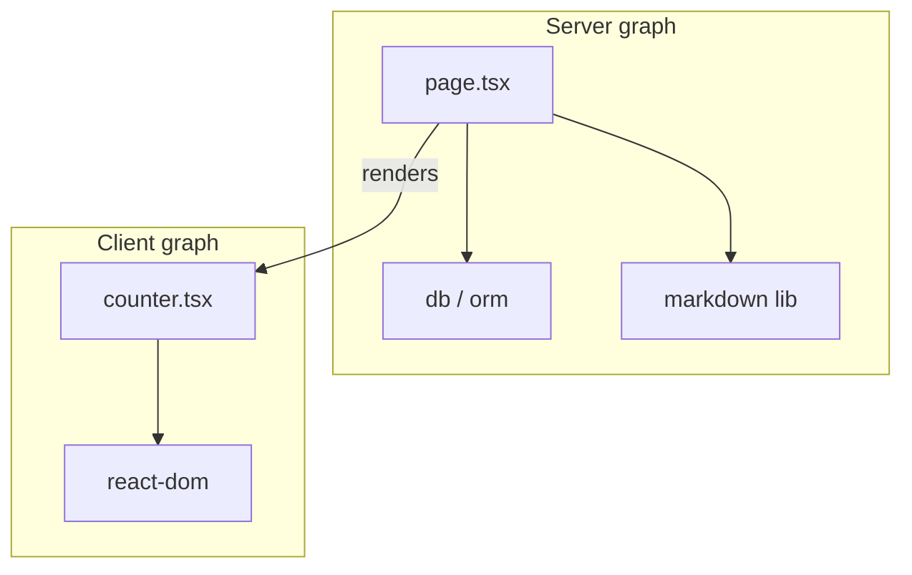

# RSC in Next.js

In the App Router, React Server Components are the **default**. Next.js wires bundling, routing, caching, and streaming around RSC so you can `await` data in pages/layouts and ship less JavaScript. This chapter focuses on Next-specific mechanics; see also React’s RSC chapter.

## Default server, opt-in client

```tsx
// app/page.tsx — Server Component (no directive)
import { HeavyMarkdown } from '@/lib/markdown' // server-only ok
import { Counter } from './counter' // client leaf

export default async function Page() {
  const md = await readMD('intro.md')
  return (
    <>
      <HeavyMarkdown source={md} />
      <Counter />
    </>
  )
}
```

```tsx
// counter.tsx
'use client'
import { useState } from 'react'
export function Counter() {
  const [n, setN] = useState(0)
  return <button onClick={() => setN((x) => x + 1)}>{n}</button>
}
```

## Bundling boundary



`'use client'` is a **module boundary**: that file + its imports go to the client bundle. Server files never import client-only hooks, but they can render client components.

## Composition pattern

```tsx
// client-wrapper.tsx
'use client'
export function Tab({ children }: { children: React.ReactNode }) {
  const [on, setOn] = useState(true)
  return (
    <div>
      <button onClick={() => setOn((v) => !v)}>Toggle</button>
      {on ? children : null}
    </div>
  )
}

// server page
<Tab>
  <ServerChart data={await getData()} />
</Tab>
```

`ServerChart` remains a Server Component because it’s passed as `children` from a Server parent — not imported into the client file.

## Data access on the server

```tsx
import { sql } from '@/db'
import { auth } from '@/auth'

export default async function AccountPage() {
  const session = await auth()
  if (!session) redirect('/login')
  const rows = await sql`select * from accounts where user_id = ${session.user.id}`
  return <AccountTable rows={rows} />
}
```

Secrets and DB URLs stay server-side. Never prefix with `NEXT_PUBLIC_` unless you intend browser exposure.

## `server-only` / `client-only`

```ts
import 'server-only'
export function getSecret() {
  return process.env.API_SECRET!
}
```

Prevents accidentally importing server modules into client graphs (build error).

## Streaming with Suspense

```tsx
export default function Page() {
  return (
    <div>
      <h1>Dashboard</h1>
      <Suspense fallback={<Skeleton />}>
        <Revenue />
      </Suspense>
    </div>
  )
}

async function Revenue() {
  const data = await getRevenue() // slow
  return <Chart data={data} />
}
```

Next streams the shell first; `Revenue` HTML arrives when ready. `loading.tsx` is syntactic sugar for a route-level Suspense boundary.

## Static vs dynamic rendering (RSC angle)

A Server Component tree can be:

- **Static** — rendered at build / with ISR revalidate; cached full route
- **Dynamic** — rendered per request when using dynamic APIs (`cookies`, `headers`, uncached `fetch`, etc.)

```tsx
import { cookies } from 'next/headers'
export default async function Page() {
  const theme = (await cookies()).get('theme')?.value // dynamic
  return <main data-theme={theme}>…</main>
}
```

## Props across the boundary

Serializable: strings, numbers, plain objects/arrays, bigint (per version), Dates (supported in flight), typed arrays in some cases.

Not serializable: functions (except Server Actions), class instances, Maps/Sets (generally), circular refs.

## Interview Q&A

**Q: Are App Router pages Server Components?**  
A: Yes by default. Add `'use client'` only when you need client features.

**Q: How do you keep a child as RSC inside a client parent?**  
A: Pass it as `children` (or props) from a Server Component parent — don’t import the server module into the client file.

**Q: Does RSC replace `getServerSideProps`?**  
A: You `await` in the component / use `fetch` cache options instead of a separate data function. Dynamic behavior is opted into via dynamic APIs and cache rules.

**Q: Why smaller bundles?**  
A: Server-only dependencies never ship to the browser; only Client Component subgraphs do.

**Q: Can I use Context in RSC?**  
A: Server can use context for same-request server trees in limited ways; interactive client context needs Client Components. Typical pattern: read session on server, pass props, or use client providers in a client layout shell.

## Common Mistakes

- `'use client'` on `layout.tsx` wrapping everything.
- Importing `fs` / DB into a file that also has hooks.
- Passing event handler functions from server to client (use Server Actions).
- Fetching client-side data that was already available on the server.
- Assuming RSC can’t be dynamic — cookies/headers force dynamic.

## Trade-offs

| Pattern | Win | Cost |
| --- | --- | --- |
| Default RSC pages | Perf, security | Boundary discipline |
| Client-heavy SPA in `app/` | Familiar DX | Misses RSC benefits |
| Fine-grained client leaves | Best UX/perf | More files |
| Async layouts | Shared data | Can block nested soft nav if overused |

**Senior takeaway:** Next.js RSC = **default server execution + flight payload + leaf client islands**. Master composition-via-children and serialization.


## Third-party client components

Wrap libraries that need hooks:

```tsx
'use client'
import { Chart } from 'some-chart-lib'
export function ClientChart(props: ChartProps) {
  return <Chart {...props} />
}
```

Keep the wrapper thin; fetch data in the Server parent and pass serializable props.

## Extra Q&A

**Q: Shared button component — server or client?**  
A: If it only needs className/children and a Server Action as `action`, it can stay server. If it uses `onClick`/`useState`, mark client.
