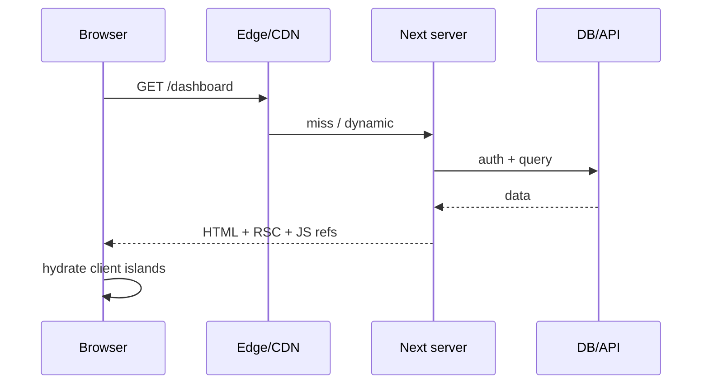

# SSR (Server-Side Rendering)

SSR means HTML is generated **on the server per request** (or per dynamic render), then sent to the browser and hydrated. In App Router, “SSR” overlaps with **dynamic rendering** of Server/Client Components. Interviews still use “SSR” vs SSG/ISR as a product/perf trade-off language.

## What SSR optimizes

| Metric | Effect |
| --- | --- |
| TTFB | Higher than static CDN (compute per request) |
| FCP / LCP | Often better than client-only SPA (HTML has content) |
| SEO / OG | Crawlers see content |
| Personalization | Cookies/session available before paint |



## App Router dynamic rendering

A route becomes dynamic when Next detects dynamic usage:

```tsx
import { cookies, headers } from 'next/headers'
import { connection } from 'next/server' // Next 15+ explicit dynamic

export default async function Page() {
  const session = (await cookies()).get('session')
  const data = await getDashboard(session?.value)
  return <Dashboard data={data} />
}
```

Dynamic APIs include: `cookies()`, `headers()`, `searchParams` (in many versions), uncached `fetch`, `noStore()`, connection().

```tsx
import { unstable_noStore as noStore } from 'next/cache'
export default async function Page() {
  noStore() // opt into dynamic
  const data = await getFresh()
  return <pre>{JSON.stringify(data)}</pre>
}
```

## Pages Router equivalent (classic interview)

```tsx
export async function getServerSideProps(ctx: GetServerSidePropsContext) {
  const data = await fetchData(ctx.req.cookies)
  return { props: { data } }
}

export default function Page({ data }: { data: Data }) {
  return <Dashboard data={data} />
}
```

Runs on every request; HTML includes `data`.

## SSR of Client Components

Client Components still **pre-render on the server** once for HTML, then hydrate. That’s why `window` access must be in `useEffect`, not render:

```tsx
'use client'
export function Width() {
  const [w, setW] = useState<number | null>(null)
  useEffect(() => setW(window.innerWidth), [])
  return <span>{w ?? '…'}</span>
}
```

Mismatch if server HTML ≠ client first render → hydration error.

## Caching interaction

SSR/dynamic doesn’t mean “never cache”:

- CDN can cache with `Cache-Control` for anonymous pages
- `fetch` cache can still store backend responses unless `cache: 'no-store'`
- Full route cache is **bypassed** for dynamic routes

```tsx
await fetch(url, { cache: 'no-store' }) // always hit origin for this fetch
await fetch(url, { next: { revalidate: 60 } }) // ISR-like fetch cache even in dynamic pages
```

## When to choose SSR

- User-specific dashboards
- Strongly consistent prices / inventory
- Auth-gated HTML
- Request-time A/B flags from cookies

When **not**: marketing pages that can be static; high QPS public content better as SSG/ISR.

## Performance patterns

1. Parallel data fetching on the server  
2. Suspense stream shell early  
3. Move slow non-critical widgets behind Suspense  
4. Edge SSR when latency-bound and runtime compatible  
5. Avoid blocking root layout on slow queries  

```tsx
export default function Page() {
  return (
    <Suspense fallback={<Shell />}>
      <AuthenticatedHome />
    </Suspense>
  )
}
```

## Interview Q&A

**Q: SSR vs CSR?**  
A: SSR sends HTML with data from the server; CSR sends shell + fetches in browser. SSR improves SEO/FCP for content; costs server compute.

**Q: SSR vs SSG?**  
A: SSR per-request; SSG at build (or ISR revalidate). SSG cheaper/faster at edge; SSR fresher/personalized.

**Q: Is App Router always SSR?**  
A: No — static by default when possible; dynamic when dynamic APIs used.

**Q: Why hydration after SSR?**  
A: HTML is inert until client JS attaches handlers/state for Client Components.

**Q: getServerSideProps in App Router?**  
A: Replaced by async Server Components + dynamic functions / fetch options.

## Common Mistakes

- Reading `window` during render in client components.
- Forcing dynamic on fully static marketing pages.
- Serial waterfalls of awaits in SSR path.
- Huge JS bundles — SSR doesn’t fix hydration cost.
- Caching personalized HTML at CDN without varying on cookie (security/data leak).

## Trade-offs

| Mode | TTFB | Freshness | Cost | Personalization |
| --- | --- | --- | --- | --- |
| SSR dynamic | Higher | High | Per request | Excellent |
| SSG | Lowest | Build-time | Build | Poor |
| ISR | Low | Bounded stale | Revalidate | Limited |
| CSR | Low shell | After fetch | Origin API | Good |

**Senior takeaway:** In Next 13+, speak **static vs dynamic rendering** precisely, and map classic “SSR” to dynamic RSC/SSR HTML + hydration of client islands.


## Edge SSR

```tsx
export const runtime = 'edge'
export default async function Page() {
  const data = await fetch(url, { cache: 'no-store' })
  return <div>{await data.text()}</div>
}
```

Use when latency to users matters and dependencies fit Edge. Heavy native Node modules force Node runtime.

## Extra Q&A

**Q: Does SSR always mean dynamic?**  
A: SSR HTML can be produced at request time (dynamic) or ahead of time (SSG). Colloquially “SSR” often means request-time — clarify in interviews.
