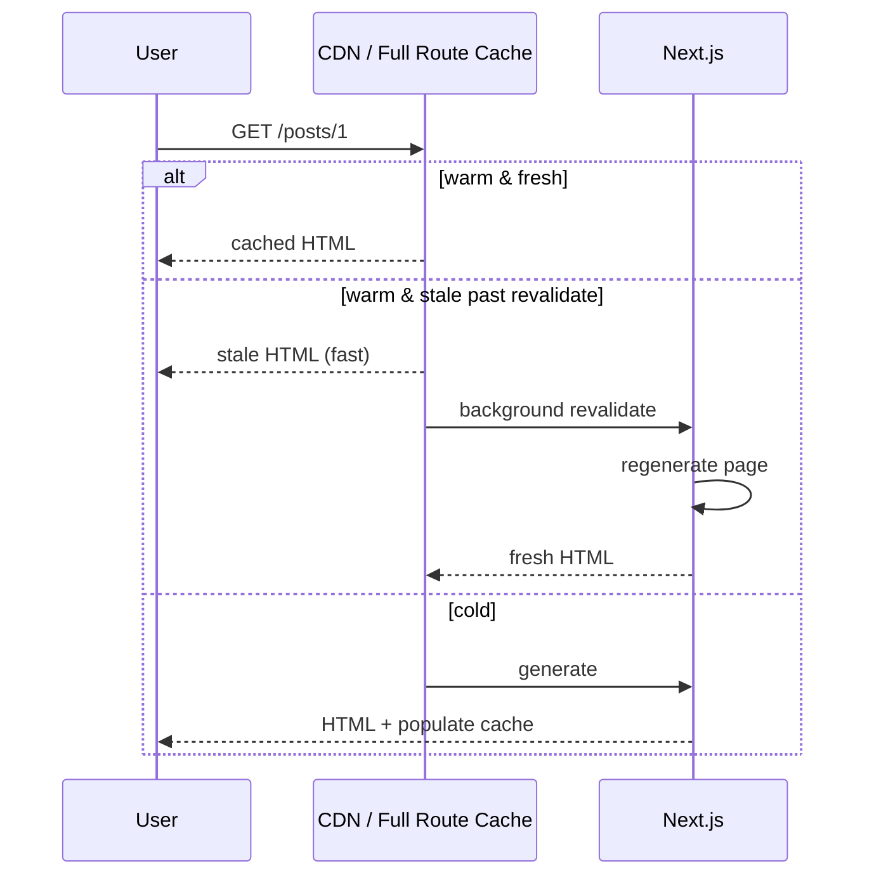

# ISR (Incremental Static Regeneration)

ISR lets you **statically generate** pages and **refresh** them in the background after a time window (or on demand) without a full rebuild. Users get CDN-speed HTML with bounded staleness — the classic “static where possible, revalidate when needed” model.

## Mental model



Stale-while-revalidate UX: first request after expiry may still see old content; next requests get new.

## App Router: `fetch` revalidate

```tsx
export default async function PostPage({ params }: { params: Promise<{ id: string }> }) {
  const { id } = await params
  const res = await fetch(`https://api.example.com/posts/${id}`, {
    next: { revalidate: 60 }, // seconds
  })
  const post = await res.json()
  return <article>{post.title}</article>
}
```

Or segment config:

```tsx
export const revalidate = 60 // segment-level ISR for static pages
```

```tsx
export const dynamic = 'force-static'
export const revalidate = 300
```

## Pages Router classic API

```tsx
export async function getStaticProps() {
  const posts = await getPosts()
  return {
    props: { posts },
    revalidate: 60,
  }
}

export async function getStaticPaths() {
  return {
    paths: [{ params: { id: '1' } }],
    fallback: 'blocking', // or true / false
  }
}
```

| `fallback` | Behavior |
| --- | --- |
| `false` | Unknown paths 404 |
| `true` | Serve fallback shell, generate client-side |
| `'blocking'` | SSR wait for generate, then cache |

## On-demand revalidation

Time-based ISR isn’t enough for “editor just published.”

```tsx
// app/api/revalidate/route.ts
import { revalidatePath, revalidateTag } from 'next/cache'
import { NextRequest } from 'next/server'

export async function POST(req: NextRequest) {
  const secret = req.headers.get('x-revalidate-secret')
  if (secret !== process.env.REVALIDATE_SECRET) {
    return Response.json({ ok: false }, { status: 401 })
  }
  const { path, tag } = await req.json()
  if (tag) revalidateTag(tag)
  if (path) revalidatePath(path)
  return Response.json({ revalidated: true })
}
```

Tag fetch:

```tsx
await fetch(url, { next: { tags: ['posts'] } })
// CMS webhook → revalidateTag('posts')
```

## ISR vs SSR vs SSG

| | SSG | ISR | SSR |
| --- | --- | --- | --- |
| When built | Build | Build + background | Request |
| Freshness | Until rebuild | ≤ revalidate / on-demand | Always |
| Traffic spike | CDN | CDN | Origin load |
| Personalization | Hard | Hard | Natural |

## Edge cases & gotchas

- **Dynamic APIs** (`cookies`) disable static/ISR full route cache — page becomes dynamic.
- **Mixed fetch caches**: one `no-store` fetch can force dynamic depending on version/heuristics — know current docs.
- **Clock skew / multi-region**: eventual consistency across edges.
- **Error during revalidate**: often keep serving last good page (verify platform behavior).

## Interview Q&A

**Q: What is ISR?**  
A: Serve statically generated pages and regenerate them after `revalidate` seconds or on-demand, usually stale-while-revalidate.

**Q: ISR vs SSR?**  
A: ISR mostly CDN hits with periodic refresh; SSR runs render logic every request (unless other caches apply).

**Q: How do you purge immediately?**  
A: `revalidatePath` / `revalidateTag` from a secured Route Handler / Server Action after CMS webhook.

**Q: What is `fallback: 'blocking'`?**  
A: First request to unknown path waits for SSG generation, then caches — no loading fallback page.

**Q: Does `revalidate = 60` guarantee max 60s stale?**  
A: Soft guarantee under normal conditions; on-demand is for hard freshness. Distributed caches may lag briefly.

## Common Mistakes

- Using ISR for per-user dashboards (cache leaks risk if personalized HTML cached).
- Forgetting to secure revalidate API (anyone could DOS regeneration).
- Setting `revalidate: 1` everywhere → near-SSR load with cache complexity.
- Expecting client `router.refresh` alone to update CDN HTML without server revalidation.
- Tagging nothing — can’t surgically invalidate.

## Trade-offs

| Choice | Pros | Cons |
| --- | --- | --- |
| Time-based ISR | Simple | Stale until window |
| On-demand | Editorial freshness | Webhook infra |
| Short revalidate | Fresher | More origin work |
| Long revalidate | Cheap | Stale content risk |
| blocking fallback | SEO-complete HTML | Slower first hit |

**Senior takeaway:** ISR = **static performance + controlled staleness**. Pair `revalidate` with **tags/paths** for CMS-driven sites.


## Tag strategy design

```ts
tags: ['products', `product:${id}`, `store:${storeId}`]
```

Invalidate narrowly (`product:123`) for edits; broad tag (`products`) for bulk imports. Document tag taxonomy like an API.

## Extra Q&A

**Q: First request after revalidate — stale or fresh?**  
A: Often stale-while-revalidate: serve stale immediately, regenerate in background (platform-dependent details).
