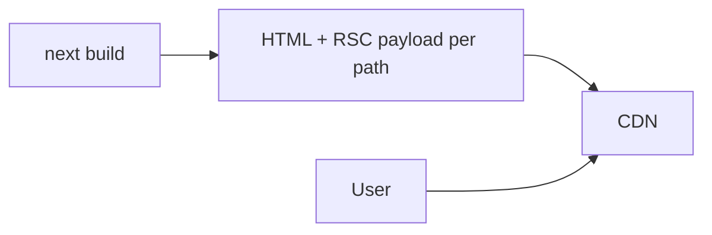

# SSG (Static Site Generation)

SSG pre-renders HTML at **build time** (and serves it from CDN). In App Router this is the default for routes that don’t use dynamic functions — Next calls it **static rendering**. Interviews expect SSG vs SSR vs ISR distinctions and `generateStaticParams` fluency.

## Why SSG

- Fastest TTFB (CDN)
- Cheapest at scale for public content
- Stable for docs, marketing, blogs, product pages with known paths



## App Router static page

```tsx
// app/about/page.tsx — no cookies/headers/no-store → static
export default async function AboutPage() {
  const res = await fetch('https://api.example.com/about', {
    next: { revalidate: false }, // cache forever (until rebuild / on-demand)
  })
  const data = await res.json()
  return <AboutView data={data} />
}
```

Segment config:

```tsx
export const dynamic = 'force-static'
export const revalidate = false
```

## Dynamic paths: `generateStaticParams`

```tsx
// app/blog/[slug]/page.tsx
export async function generateStaticParams() {
  const posts = await getAllPosts()
  return posts.map((p) => ({ slug: p.slug }))
}

export default async function Post({ params }: { params: Promise<{ slug: string }> }) {
  const { slug } = await params
  const post = await getPost(slug)
  return <article>{post.body}</article>
}
```

Unknown paths at runtime: configure `dynamicParams` (default true → generate on first request; false → 404).

```tsx
export const dynamicParams = false
```

## Pages Router

```tsx
export async function getStaticPaths() {
  return {
    paths: [{ params: { slug: 'hello' } }],
    fallback: false,
  }
}

export async function getStaticProps({ params }: { params: { slug: string } }) {
  return { props: { post: await getPost(params.slug) } }
}
```

## Build-time data & secrets

SSG runs in CI/build:

- Env vars must be present at build for bake-in
- Don’t bake per-user secrets into static HTML
- For frequently changing data use ISR or SSR instead of pure SSG

## Static export

```js
// next.config.js
output: 'export' // next export style — pure static hosts
```

Limitations: no SSR/ISR/Route Handlers/middleware features that need a Node/Edge server. Good for GitHub Pages-like hosts.

## Hybrid apps

Most Next apps are hybrid:

| Route | Mode |
| --- | --- |
| `/` marketing | SSG |
| `/blog/[slug]` | SSG + ISR |
| `/dashboard` | Dynamic SSR |
| `/api/checkout` | Route Handler |

## Interview Q&A

**Q: What is SSG?**  
A: Pre-render HTML at build time and serve statically (CDN).

**Q: SSG vs ISR?**  
A: SSG until next build; ISR regenerates after time/on-demand without full rebuild.

**Q: How do dynamic routes get static pages?**  
A: `generateStaticParams` (App) / `getStaticPaths` (Pages) lists paths to prebuild.

**Q: When does App Router opt out of static?**  
A: Dynamic functions (`cookies`, `headers`, …), `no-store`, or `dynamic = 'force-dynamic'`.

**Q: Can SSG personalize?**  
A: Not in the HTML without exploding variants. Personalize client-side or use SSR/Edge middleware rewrites carefully.

## Common Mistakes

- Fetching user-specific data into a static page → leaked or wrong content.
- Forgetting `generateStaticParams` for many paths → slow first loads / build gaps.
- Using static export then needing server features.
- Giant build graphs (10k pages) without ISR on-demand strategy — long CI.
- Client fetch for public content that could be static — worse SEO/FCP.

## Trade-offs

| Approach | Pros | Cons |
| --- | --- | --- |
| Pure SSG | Fast, cheap | Rebuild for updates |
| SSG + ISR | Fresh enough | Complexity |
| Static export | Simple hosting | Feature limits |
| Prebuild all paths | Instant first load | Long builds |
| `dynamicParams: true` | Flexible | First hit slower |

**Senior takeaway:** Prefer **static by default**; add ISR for freshness; reserve SSR for personalization/consistency. Know `generateStaticParams` + what forces dynamic.


## Build-time vs runtime data

```tsx
// Baked at build — changes require rebuild or ISR
const res = await fetch(url, { cache: 'force-cache' })
```

For “static page, live widget,” compose static RSC shell + client fetch for the widget, or Suspense dynamic hole (PPR).

## Extra Q&A

**Q: 10k product pages — SSG all?**  
A: Prebuild top N via `generateStaticParams`; `dynamicParams: true` for the long tail; or ISR on demand.


## generateStaticParams + SEO

```tsx
export async function generateStaticParams() {
  const slugs = await getPublishedSlugs()
  return slugs.map((slug) => ({ slug }))
}

export async function generateMetadata({ params }: Props): Promise<Metadata> {
  const { slug } = await params
  const post = await getPost(slug)
  return {
    title: post.title,
    description: post.excerpt,
    openGraph: { images: [post.coverUrl] },
  }
}
```

Static pages + metadata = classic blog/docs architecture.

## Contentlayer / MDX pattern

SSG shines with local MDX:

1. Read filesystem at build  
2. `generateStaticParams` from filenames  
3. Render MDX as RSC (no client JS for content)  
4. Client islands only for interactive widgets  

## Extra mistakes

- Baking `API_URL=localhost` into static HTML in CI  
- Forgetting absolute URLs for OG images in production  
