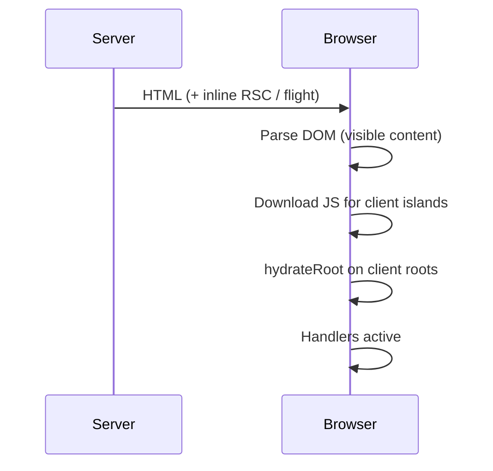

# Hydration

Hydration is attaching React’s event system and component state to **server-rendered HTML** so the page becomes interactive. In Next.js App Router, only **Client Components** hydrate; Server Component output is already in the tree as static slots from the RSC payload.

## The pipeline



Until hydration completes, buttons may look ready but not work (or use progressive enhancement via forms/Server Actions).

## Hydration must match

React 18+ compares server HTML to the client’s first render. Mismatch → warning and client may discard server DOM for that subtree (expensive; UX flash).

```tsx
// ❌ Mismatch — server time ≠ client time
export function Now() {
  return <span>{new Date().toLocaleString()}</span>
}

// ✅
'use client'
export function Now() {
  const [now, setNow] = useState<string | null>(null)
  useEffect(() => setNow(new Date().toLocaleString()), [])
  return <span>{now ?? '—'}</span>
}
```

Common causes:

- `Date.now()`, `Math.random()`, `uuid()` in render
- `window` / `localStorage` during render
- Invalid HTML nesting (`<p><div></div></p>`) browser “fixes” differently
- Locale/timezone formatting differences
- Extensions mutating DOM before hydrate
- Conditionally rendering different trees on server vs client without `useEffect`

## suppressHydrationWarning

```tsx
<html lang="en" suppressHydrationWarning>
  {/* often for theme class set by script before hydrate */}
```

Use narrowly (timestamps, theme). Don’t silence real bugs globally.

## Selective / progressive hydration

With streaming SSR + Suspense, React can hydrate **as islands become available**, prioritizing user interaction. Heavy below-the-fold client trees shouldn’t block above-the-fold interactivity.

```tsx
<Suspense fallback={<Sk />}>
  <HeavyClientChart />
</Suspense>
```

## Client Components + SSR HTML

`'use client'` still SSR once:

1. Server runs client component render → HTML  
2. Browser shows HTML  
3. JS loads → hydrate with same props  

```tsx
'use client'
export function Like({ initial }: { initial: number }) {
  const [n, setN] = useState(initial)
  return <button onClick={() => setN((x) => x + 1)}>{n}</button>
}
```

Props from Server parent must be serializable and identical on both sides.

## Forms without waiting for hydration

```tsx
// Progressive enhancement — works before JS
async function createPost(formData: FormData) {
  'use server'
  await db.post.create({ data: { title: String(formData.get('title')) } })
}

export default function Page() {
  return (
    <form action={createPost}>
      <input name="title" />
      <button type="submit">Save</button>
    </form>
  )
}
```

## Diagnosing mismatches

1. Read the React warning diff carefully  
2. Binary search which client component diverges  
3. Check for invalid nesting in DevTools  
4. Ensure no browser-only branching in render  
5. Verify same React version / strict mode expectations  

## Interview Q&A

**Q: What is hydration?**  
A: Client React attaching to server HTML so Client Components become interactive.

**Q: Do Server Components hydrate?**  
A: They don’t hydrate as stateful client components; their rendered output is part of the payload/HTML without shipping their code.

**Q: Why hydration errors?**  
A: Server HTML ≠ client first render text/structure.

**Q: How avoid mismatch with theme?**  
A: Inline script sets class before paint + `suppressHydrationWarning` on `html`, or CSS-only.

**Q: Hydration vs rendering?**  
A: SSR rendering produces HTML; hydration reuses it and attaches React. Client navigation may skip full HTML document load and use RSC fetch instead.

## Common Mistakes

- Using `typeof window !== 'undefined'` to branch UI in render.
- Random keys during SSR.
- Hydrating the entire page as one giant client component.
- Ignoring mismatches in prod (users get broken interactivity).
- Expecting `useEffect` data to be in first HTML — it isn’t.

## Trade-offs

| Strategy | Pros | Cons |
| --- | --- | --- |
| Full page client hydrate | Simple SPA mental model | Slow TTI, more mismatch surface |
| Island hydration | Faster TTI | Boundary discipline |
| Stream + selective | Progressive interactivity | Complexity |
| Forms/Server Actions | Works pre-JS | Limited UX vs rich client |

**Senior takeaway:** Hydration is a **correctness contract** (identical first render) and a **performance cost** (JS download/parse). Shrink client islands; keep render pure and deterministic.


## useId for SSR-safe labels

```tsx
'use client'
function Field() {
  const id = useId()
  return (
    <>
      <label htmlFor={id}>Name</label>
      <input id={id} />
    </>
  )
}
```

## Extra Q&A

**Q: Why do browser extensions cause hydration warnings?**  
A: They mutate DOM before React hydrates → mismatch. Reproduce in private windows.


## Two-pass client rendering pattern

```tsx
'use client'
export function ClientOnly({ children }: { children: React.ReactNode }) {
  const [mounted, setMounted] = useState(false)
  useEffect(() => setMounted(true), [])
  if (!mounted) return null // or skeleton matching SSR placeholder
  return children
}
```

Use sparingly — prefer fixing mismatches. Valid for browser-only embeds (maps, legacy jQuery).

## Progressive enhancement checklist

| Feature | Works without JS? |
| --- | --- |
| Server Action form | Yes |
| Client `onClick` modal | No |
| `<Link>` prefetch | Degrades to `<a>` |
| Client RQ fetch page | No meaningful HTML |

## Extra mistakes

- Different `className` from CSS-in-JS random hashes between server/client builds  
- Using `typeof window` to choose completely different component trees  
