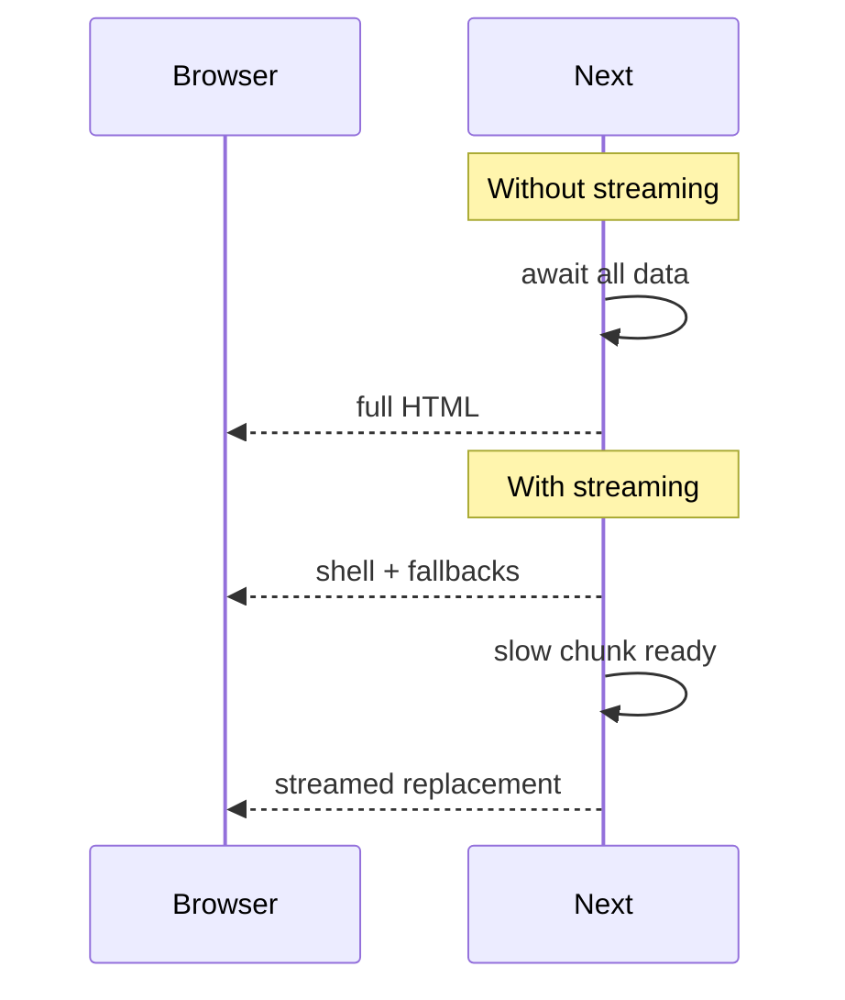

# Streaming

Streaming sends HTML **incrementally** as Suspense boundaries resolve, instead of waiting for the entire page. Users see a shell sooner; slow widgets fill in. Next.js App Router streams RSC/HTML over the network using React’s streaming SSR.

## Without vs with streaming



## Route `loading.tsx`

```tsx
// app/dashboard/loading.tsx
export default function Loading() {
  return <DashboardSkeleton />
}
```

Next wraps the `page` in `<Suspense fallback={<Loading />}>` automatically. Layouts above still render immediately (don’t put slow awaits in root layout without Suspense).

## Explicit Suspense

```tsx
import { Suspense } from 'react'

export default function Page() {
  return (
    <main>
      <h1>Dashboard</h1>
      <Suspense fallback={<CardsSk />}>
        <Cards />
      </Suspense>
      <Suspense fallback={<ChartSk />}>
        <Chart />
      </Suspense>
    </main>
  )
}

async function Cards() {
  const data = await getCards()
  return <CardGrid data={data} />
}
```

Independent boundaries stream independently — one slow chart doesn’t block cards HTML if separated.

## Blocking the shell (anti-pattern)

```tsx
// ❌ Root layout awaits slow CMS — nothing streams usefully
export default async function RootLayout({ children }) {
  const nav = await getMegaNav() // 800ms
  return (
    <html>
      <body>
        <MegaNav data={nav} />
        {children}
      </body>
    </html>
  )
}

// ✅ Suspense the slow part
export default function RootLayout({ children }) {
  return (
    <html>
      <body>
        <Suspense fallback={<NavSk />}>
          <MegaNav />
        </Suspense>
        {children}
      </body>
    </html>
  )
}
```

## Streaming + auth

```tsx
async function Protected() {
  const session = await auth()
  if (!session) redirect('/login')
  return <Secret />
}

export default function Page() {
  return (
    <Suspense fallback={<Sk />}>
      <Protected />
    </Suspense>
  )
}
```

Redirects during stream have nuanced behavior — keep auth checks intentional; sometimes better early in middleware for gated areas.

## Out-of-order / progressive enhancement

Browser paints early HTML. Later chunks patch Suspense regions (React streaming protocol). SEO: critical content should still appear in early HTML when possible; don’t stream the only H1 5s late if SEO-critical.

## Parallel fetching

```tsx
// Good — start both before awaiting
async function Dashboard() {
  const cardsP = getCards()
  const chartP = getChart()
  const [cards, chart] = await Promise.all([cardsP, chartP])
  return (
    <>
      <CardGrid data={cards} />
      <Chart data={chart} />
    </>
  )
}
```

Or split into separate Suspense children so each streams when ready (often better UX than one `Promise.all`).

## Interview Q&A

**Q: What does streaming buy?**  
A: Lower time-to-first-byte meaningful paint; progressive content; main thread can hydrate earlier islands.

**Q: How does Next enable it?**  
A: React streaming SSR + Suspense; `loading.tsx` / `<Suspense>` boundaries.

**Q: Why not stream everything as one boundary?**  
A: Slowest dependency gates all content — defeats progressive reveal.

**Q: Relation to SSR?**  
A: Streaming is how SSR is delivered incrementally.

**Q: Does streaming help CSR SPAs?**  
A: Different problem — CSR waits on JS+API; streaming is server HTML delivery.

## Common Mistakes

- Slow `await` in root layout without Suspense.
- Single page-level Suspense only — coarse UX.
- Skeleton mismatch causing huge CLS when content arrives.
- Sequential awaits creating server waterfalls despite streaming UI.
- Assuming streaming fixes hydration JS cost — it doesn’t.

## Trade-offs

| Design | Pros | Cons |
| --- | --- | --- |
| Many fine boundaries | Progressive | More CLS / design work |
| Few coarse boundaries | Simple | Blank regions longer |
| Promise.all one boundary | Data ready together | Waits for slowest |
| Split Suspense children | Each as ready | Possible layout shift |

**Senior takeaway:** Streaming is **Suspense-shaped SSR**. Architect async boundaries around independent data; keep layouts light; measure LCP/CLS.


## SEO and streaming

Ensure primary content (title, main article) isn’t trapped behind the slowest Suspense if SEO-critical. Stream secondary widgets (comments, related).

## Extra Q&A

**Q: Does streaming require HTTP/2?**  
A: Helps multiplexing; streaming SSR works over HTTP/1.1 chunked transfer too.


## Nested loading.tsx behavior

```text
app/
  dashboard/
    loading.tsx      # Suspense around dashboard/page AND deeper segments as configured
    page.tsx
    settings/
      loading.tsx    # finer skeleton for /dashboard/settings
      page.tsx
```

Navigating within dashboard can show the inner loading UI while the dashboard layout stays mounted — key to perceived performance.

## Timeouts & Slow Component UX

If a stream stalls (upstream hang), users stare at skeletons. Guard with:

- Upstream `AbortSignal` + timeouts  
- Error boundaries around Suspense  
- Fallback content that offers retry  

```tsx
async function Revenue() {
  const data = await Promise.race([
    getRevenue(),
    sleep(8000).then(() => Promise.reject(new Error('timeout'))),
  ])
  return <Chart data={data} />
}
```

## Extra Q&A

**Q: Can you stream JSON APIs the same way?**  
A: Route Handlers can stream bodies; App Router page streaming is HTML/RSC flight specifically.
