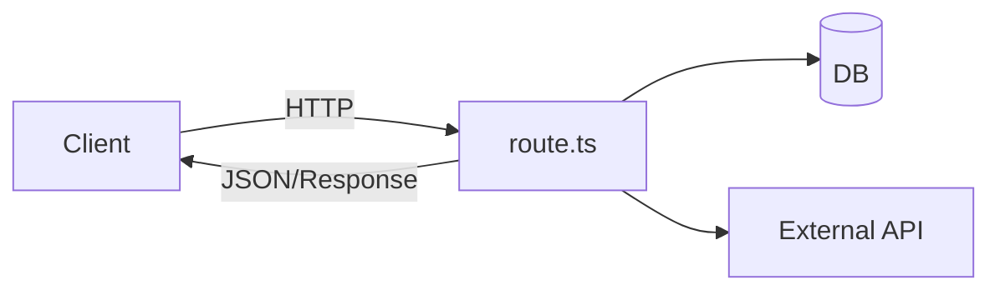

# Route Handlers

Route Handlers (`route.ts` / `route.js`) replace Pages API routes for HTTP endpoints in the App Router. They run on the server (Node or Edge runtime) and export functions named after HTTP methods.

## Basics

```tsx
// app/api/hello/route.ts
import { NextRequest, NextResponse } from 'next/server'

export async function GET(req: NextRequest) {
  const name = req.nextUrl.searchParams.get('name') ?? 'world'
  return NextResponse.json({ message: `Hello ${name}` })
}

export async function POST(req: NextRequest) {
  const body = await req.json()
  return NextResponse.json({ received: body }, { status: 201 })
}
```

Supported exports: `GET`, `POST`, `PUT`, `PATCH`, `DELETE`, `HEAD`, `OPTIONS`. **No `export default`.**



## Dynamic segments

```tsx
// app/api/posts/[id]/route.ts
type Ctx = { params: Promise<{ id: string }> }

export async function GET(_req: Request, ctx: Ctx) {
  const { id } = await ctx.params
  const post = await getPost(id)
  if (!post) return new Response('Not found', { status: 404 })
  return Response.json(post)
}
```

## Runtime & config

```tsx
export const runtime = 'edge' // or 'nodejs'
export const dynamic = 'force-dynamic'
export const revalidate = 60
```

| Runtime | Pros | Cons |
| --- | --- | --- |
| `nodejs` | Full Node APIs, ORM-friendly | Cold start / region |
| `edge` | Low latency, geo | Subset of APIs; some libs break |

## Caching GET handlers

By default, `GET` Route Handlers can be statically cached when they don’t use dynamic data. Force dynamic:

```tsx
export const dynamic = 'force-dynamic'

export async function GET() {
  return Response.json(await getLiveMetrics())
}
```

Or:

```tsx
import { unstable_noStore as noStore } from 'next/cache'
export async function GET() {
  noStore()
  return Response.json(await getLiveMetrics())
}
```

## Cookies / headers / auth

```tsx
import { cookies, headers } from 'next/headers'
import { auth } from '@/auth'

export async function GET() {
  const session = await auth()
  if (!session) return NextResponse.json({ error: 'unauthorized' }, { status: 401 })
  return NextResponse.json({ user: session.user })
}

export async function POST(req: Request) {
  const token = (await cookies()).get('token')
  // ...
}
```

Set cookies on the response:

```tsx
const res = NextResponse.json({ ok: true })
res.cookies.set('session', value, { httpOnly: true, secure: true, sameSite: 'lax' })
return res
```

## Streaming responses

```tsx
export async function GET() {
  const stream = new ReadableStream({
    async start(controller) {
      controller.enqueue(new TextEncoder().encode('data: hello\n\n'))
      controller.close()
    },
  })
  return new Response(stream, {
    headers: { 'Content-Type': 'text/event-stream' },
  })
}
```

## When to use Route Handlers vs Server Actions vs RSC

| Need | Prefer |
| --- | --- |
| `await` data in page | RSC / fetch |
| Form mutate from UI | Server Action |
| Public REST/webhooks/mobile | Route Handler |
| SSE / custom headers | Route Handler |
| Third-party callback (OAuth) | Route Handler |

## CORS

```tsx
const allowed = new Set(['https://app.example.com'])

export async function OPTIONS(req: Request) {
  const origin = req.headers.get('origin') ?? ''
  const res = new Response(null, { status: 204 })
  if (allowed.has(origin)) {
    res.headers.set('Access-Control-Allow-Origin', origin)
    res.headers.set('Access-Control-Allow-Methods', 'GET, POST, OPTIONS')
    res.headers.set('Access-Control-Allow-Headers', 'Content-Type, Authorization')
  }
  return res
}
```

## Interview Q&A

**Q: What is a Route Handler?**  
A: `route.ts` exporting HTTP method functions for an App Router path — Next’s API endpoint model.

**Q: Difference from `pages/api`?**  
A: Web Request/Response standards, segment colocation, same caching/runtime config as app; no default export.

**Q: Server Actions instead?**  
A: Prefer Actions for first-party UI mutations; Handlers for HTTP APIs/webhooks/clients.

**Q: Are GET handlers cached?**  
A: Can be static/cached unless dynamic APIs or config force dynamic — don’t assume always live.

**Q: Edge limitations?**  
A: No full Node filesystem/some native modules; check compatibility.

## Common Mistakes

- Exporting `default` function — won’t work.
- Returning plain objects instead of `Response` / `NextResponse`.
- Forgetting auth on mutating routes.
- Caching personalized GET at CDN without `Vary`/dynamic.
- Putting heavy ORM in Edge without driver support.

## Trade-offs

| Choice | Pros | Cons |
| --- | --- | --- |
| Route Handlers | Explicit HTTP | More boilerplate than Actions for forms |
| Server Actions | Tight UI integration | Not a public REST surface |
| Edge | Latency | Runtime constraints |
| Node | Compatibility | Often higher latency |

**Senior takeaway:** Route Handlers are **first-class HTTP** in `app/`. Know method exports, dynamic params, runtime, caching defaults, and when Actions are the better mutation path.


## Webhook example

```tsx
export async function POST(req: Request) {
  const raw = await req.text()
  const sig = req.headers.get('x-signature')
  if (!verify(raw, sig)) return new Response('bad sig', { status: 401 })
  const event = JSON.parse(raw)
  await enqueue(event)
  return Response.json({ received: true })
}
```

## Extra Q&A

**Q: Can route handlers use Server Actions code?**  
A: Share domain functions in plain server modules; don’t confuse HTTP handler exports with `'use server'` actions.
