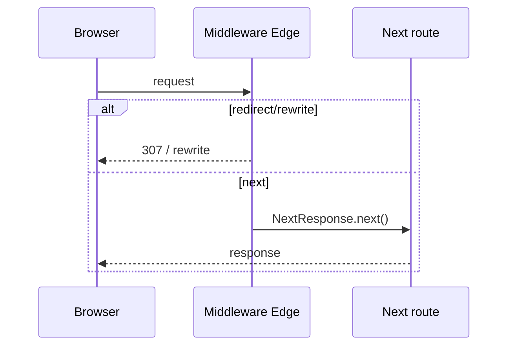

# Middleware

Middleware runs **before** a request is completed — at the Edge — letting you rewrite, redirect, set headers, or short-circuit based on cookies/auth/geo. It is not a general-purpose backend; keep it fast and small.

## Setup

```ts
// middleware.ts (project root or src/)
import { NextResponse } from 'next/server'
import type { NextRequest } from 'next/server'

export function middleware(req: NextRequest) {
  const { pathname } = req.nextUrl
  const token = req.cookies.get('session')?.value

  if (pathname.startsWith('/dashboard') && !token) {
    const url = req.nextUrl.clone()
    url.pathname = '/login'
    url.searchParams.set('from', pathname)
    return NextResponse.redirect(url)
  }

  const res = NextResponse.next()
  res.headers.set('x-pathname', pathname)
  return res
}

export const config = {
  matcher: ['/dashboard/:path*', '/login'],
}
```



## Matcher best practices

Exclude static assets explicitly:

```ts
export const config = {
  matcher: [
    '/((?!_next/static|_next/image|favicon.ico|.*\\.(?:svg|png|jpg)$).*)',
  ],
}
```

Over-broad matchers run middleware on every asset → latency + cost.

## Redirect vs rewrite vs next

| API | User URL | Behavior |
| --- | --- | --- |
| `NextResponse.redirect` | Changes | Browser navigates to new URL |
| `NextResponse.rewrite` | Unchanged | Internally serve different path |
| `NextResponse.next` | Unchanged | Continue to destination |

```ts
// A/B or locale rewrite
url.pathname = `/en${pathname}`
return NextResponse.rewrite(url)
```

## Auth patterns

```ts
import { NextRequest, NextResponse } from 'next/server'

export async function middleware(req: NextRequest) {
  // Prefer verifying a JWT/session cookie signature here (edge-compatible)
  // Avoid full DB session lookup on every request if possible
  const session = await verifyJwt(req.cookies.get('session')?.value)
  if (!session && req.nextUrl.pathname.startsWith('/app')) {
    return NextResponse.redirect(new URL('/login', req.url))
  }
  const res = NextResponse.next()
  if (session) res.headers.set('x-user-id', session.sub)
  return res
}
```

For complex auth (Auth.js), use their official middleware helpers — don’t invent cookie parsing insecurely.

## Request cloning & headers

To pass data to Server Components, set **request headers** via middleware:

```ts
const requestHeaders = new Headers(req.headers)
requestHeaders.set('x-request-id', crypto.randomUUID())
return NextResponse.next({ request: { headers: requestHeaders } })
```

Read with `headers()` in RSC. Don’t put secrets in client-visible response headers casually.

## Limitations

- Edge runtime only (no full Node)
- No direct DB from many ORMs (use JWT / edge config / external fetch)
- Not for heavy CPU or large body parsing
- Runs on matched navigations and often prefetch — keep idempotent and cheap
- Can’t use all Node crypto APIs historically — check current Edge crypto

## Middleware vs layout auth vs Route Handler

| Layer | Good for |
| --- | --- |
| Middleware | Coarse gate, redirects, rewrites, headers, geofence |
| RSC / layout | Precise auth + data loading after gate |
| Route Handler | API token auth, webhooks |

Defense in depth: middleware UX redirect **and** server check before sensitive data.

## Interview Q&A

**Q: When does middleware run?**  
A: On matched requests before the route renders/handles — at the Edge.

**Q: Rewrite vs redirect?**  
A: Rewrite keeps URL, changes internal target; redirect changes browser URL.

**Q: Why matcher?**  
A: Limit execution to relevant paths; skip static files.

**Q: Can middleware replace Server Actions auth?**  
A: No — still authorize mutations on the server. Middleware is a first filter.

**Q: Why keep middleware light?**  
A: Adds latency to every matched request including prefetches; Edge CPU limits.

## Common Mistakes

- Matching all routes including `/_next/static`.
- Doing DB session fetch every request without cache.
- Only middleware auth without server-side checks (bypass via RSC fetch).
- Large dependency graph in `middleware.ts` bloating Edge bundle.
- Mutating request unsafely / losing headers.

## Trade-offs

| Approach | Pros | Cons |
| --- | --- | --- |
| Middleware auth gate | Early redirect UX | Edge constraints |
| Layout-only auth | Full Node/DB | May flash unauthorized HTML |
| Both | Secure + UX | Two places to maintain |
| JWT in cookie | Edge-verifiable | Revocation harder than server sessions |

**Senior takeaway:** Middleware is an **Edge gate + rewrite engine**, not your app server. Matcher narrowly, verify auth properly, still authorize on the server.


## Geo / A/B sketch

```ts
const country = req.geo?.country || req.headers.get('x-country')
if (country === 'DE') {
  url.pathname = `/de${url.pathname}`
  return NextResponse.rewrite(url)
}
```

(Platform `req.geo` availability varies.)

## Extra Q&A

**Q: Does middleware run on Server Actions?**  
A: Actions are POST requests to Next endpoints — matcher may include them; keep middleware fast and avoid breaking action posts.


## Chaining concerns

Order of operations in middleware should be:

1. Cheap rejects (maintenance mode, blocked UA)  
2. Auth gate  
3. Rewrites (locale, A/B)  
4. Security headers on the response  

```ts
const res = NextResponse.next()
res.headers.set('X-Frame-Options', 'DENY')
res.headers.set('X-Content-Type-Options', 'nosniff')
return res
```

Prefer setting CSP in middleware or `next.config` headers — pick one place to avoid fights.
