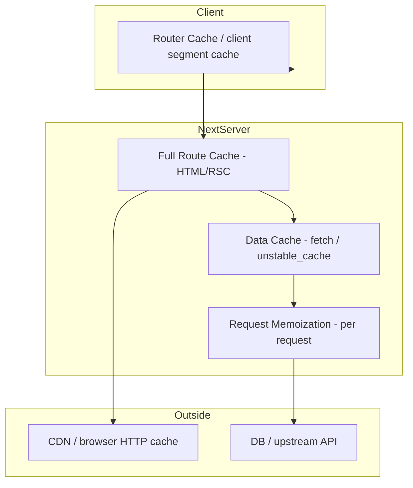

# Caching

Next.js App Router caching is multi-layered and interview-critical. Misunderstanding it causes “my data never updates” or “why is this dynamic?” bugs. Think in **layers** with explicit invalidation.

## The layers



| Layer | What | Lifetime |
| --- | --- | --- |
| Request memoization | Dedupe identical `fetch` during one render | Single request |
| Data Cache | Persistent `fetch` / `unstable_cache` results | Until revalidate/tag |
| Full Route Cache | Static route RSC/HTML payload | Until revalidate / dynamic opt-out |
| Router Cache | Client-side cached segments for back/forward | Session / TTL (version-dependent) |
| CDN | HTTP cached responses | `Cache-Control` |

Exact defaults evolve (esp. client router cache) — state principles + check current docs in interviews.

## `fetch` options (Data Cache)

```tsx
// Cached forever (static) until invalidation / rebuild
await fetch(url, { cache: 'force-cache' })

// Never put in Data Cache
await fetch(url, { cache: 'no-store' })

// ISR-like
await fetch(url, { next: { revalidate: 60 } })

// Tag for on-demand
await fetch(url, { next: { tags: ['product', `product-${id}`] } })
```

```tsx
import { unstable_cache } from 'next/cache'

const getUser = unstable_cache(
  async (id: string) => db.user.findUnique({ where: { id } }),
  ['user'], // key parts
  { revalidate: 60, tags: ['user'] },
)
```

## Request memoization

```tsx
// layout.tsx and page.tsx both call getUser(id) with same fetch
// → one network hit per request automatically for identical fetch
```

Works for `fetch`; for other functions wrap with React `cache()`:

```tsx
import { cache } from 'react'
export const getUser = cache(async (id: string) => db.user.findUnique({ where: { id } }))
```

## Full Route Cache vs Dynamic

Static route → Full Route Cache populated at build / revalidate.  
Dynamic route (`cookies()`, `headers()`, `no-store`, etc.) → rendered per request; Data Cache may still apply to individual fetches.

```tsx
export const dynamic = 'force-dynamic' // opt out of full route cache
export const revalidate = 0
export const dynamic = 'force-static'
```

## Invalidation APIs

```tsx
import { revalidatePath, revalidateTag } from 'next/cache'

revalidateTag('product')
revalidatePath('/products')
revalidatePath('/products/[id]', 'page')
```

Call from Server Actions / Route Handlers after mutations.

## Client Router Cache

Client keeps previously visited Server Component payloads for snappy back navigation. After a mutation:

```tsx
import { useRouter } from 'next/navigation'
router.refresh() // re-fetch server tree for current segment
```

Server Action `revalidatePath` also refreshes as configured.

## Debugging “stale forever”

1. Is the route static? (`cookies` absent?)  
2. Is `fetch` `force-cache` / long `revalidate`?  
3. Did you tag and invalidate?  
4. Is client router cache showing old segment? → `refresh`  
5. CDN caching personalized content?  

```bash
# Often useful in discussion: next build shows ○ static ● SSR
```

## Interview Q&A

**Q: Name Next.js cache layers.**  
A: Request memoization, Data Cache, Full Route Cache, Client Router Cache (+ CDN/HTTP).

**Q: `revalidate: 60` on fetch vs segment?**  
A: Fetch controls Data Cache entry TTL; segment `revalidate` controls route-level ISR for static routes.

**Q: How purge after CMS update?**  
A: Webhook → `revalidateTag` / `revalidatePath`.

**Q: Why layout + page duplicate fetch isn’t double cost?**  
A: Request memoization / `cache()`.

**Q: Difference `no-store` vs `revalidate: 0`?**  
A: Both mean dynamic/freshness-oriented; prefer current docs wording — conceptually skip lasting data cache.

**Q: Does SSR use Data Cache?**  
A: Dynamic pages can still use cached fetch results unless `no-store`.

## Common Mistakes

- Caching user-specific HTML in Full Route Cache.
- Forgetting invalidation after Server Action writes.
- Using `cache: 'force-cache'` on rapidly changing prices.
- Confusing browser CDN cache with Next Data Cache.
- Expecting `router.push` alone to invalidate server data.

## Trade-offs

| Strategy | Pros | Cons |
| --- | --- | --- |
| Aggressive static + tags | Fast, cheap | Invalidation discipline |
| Everything `no-store` | Always fresh | Latency, cost |
| Short revalidate | Simple freshness | Bursty origin load |
| Client refresh often | Fresh UI | Extra RSC fetches |

**Senior takeaway:** Draw the **four Next caches**, know what forces **dynamic**, and always pair mutations with **`revalidateTag`/`Path` + `router.refresh` when needed**.


## `cacheLife` / `"use cache"` awareness

React/Next are evolving explicit cache directives (`use cache`, cache life profiles). Interview stance: **know the layer model**; mention newer directives as emerging without inventing APIs — verify current docs.

## Extra Q&A

**Q: Is `force-cache` the default for fetch in Next?**  
A: Defaults have shifted across versions — always state your Next version’s default; don’t memorize a single eternal default.


## Decision tree (memorize)

```text
Is the page personalized (cookies/auth)?
  YES → dynamic render; optionally cache public fetches with tags
  NO  → can be static/ISR
        Does data change often?
          YES → short revalidate OR on-demand tags
          NO  → force-cache / long revalidate
After a write:
  revalidateTag / revalidatePath
  client: router.refresh if UI still stale
```

## `unstable_cache` vs `fetch` cache

```ts
import { unstable_cache } from 'next/cache'

export const getProduct = unstable_cache(
  async (id: string) => {
    // db access — not fetch
    return db.product.findUnique({ where: { id } })
  },
  ['product'],
  { tags: ['product'], revalidate: 300 },
)
```

`fetch` cache only wraps HTTP `fetch`. DB/SDK calls need `unstable_cache` or `'use cache'` (when available) for Data Cache persistence.
