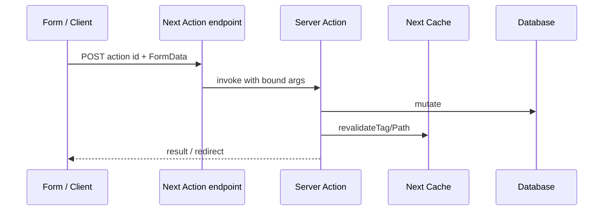

# Server Actions

Server Actions are **async server functions** you can call from Client Components or pass as form `action`s. They replace many “POST to API route then setState” loops with a first-party mutation primitive that integrates with caching/revalidation and progressive enhancement.

## Defining actions

```tsx
// app/actions.ts
'use server'

import { revalidatePath } from 'next/cache'
import { z } from 'zod'

const schema = z.object({ title: z.string().min(1).max(100) })

export async function createPost(formData: FormData) {
  const parsed = schema.safeParse({ title: formData.get('title') })
  if (!parsed.success) return { ok: false as const, error: parsed.error.flatten() }

  await db.post.create({ data: { title: parsed.data.title } })
  revalidatePath('/posts')
  return { ok: true as const }
}
```

`'use server'` at file top marks all exports as actions; or inline on an async function inside a Server Component file.

## Forms (progressive enhancement)

```tsx
import { createPost } from './actions'

export default function NewPostPage() {
  return (
    <form action={createPost}>
      <input name="title" required />
      <button type="submit">Create</button>
    </form>
  )
}
```

Works before hydration — browser native form POST to the action endpoint Next generates.

## Client invocation

```tsx
'use client'
import { useTransition } from 'react'
import { createPost } from './actions'

export function NewPostButton() {
  const [pending, startTransition] = useTransition()
  return (
    <button
      disabled={pending}
      onClick={() => {
        const fd = new FormData()
        fd.set('title', 'Hello')
        startTransition(async () => {
          await createPost(fd)
        })
      }}
    >
      {pending ? 'Saving…' : 'Create'}
    </button>
  )
}
```

Or `useActionState` (React 19) for form state:

```tsx
'use client'
import { useActionState } from 'react'
import { createPost } from './actions'

export function NewPostForm() {
  const [state, action, pending] = useActionState(createPost, null)
  return (
    <form action={action}>
      <input name="title" />
      <button disabled={pending}>Save</button>
      {state?.error && <p>Failed</p>}
    </form>
  )
}
```



## Security model

Actions are **public HTTP endpoints**. Anyone can invoke them if they know the ID.

Must:

1. **Authenticate** (`auth()` / session)  
2. **Authorize** (resource ownership)  
3. **Validate input** (Zod)  
4. **CSRF** — Next includes mitigations for action posts from your origin; still don’t skip auth  
5. Never trust client for prices/roles  

```tsx
'use server'
export async function deletePost(postId: string) {
  const session = await auth()
  if (!session) throw new Error('Unauthorized')
  const post = await db.post.findUnique({ where: { id: postId } })
  if (!post || post.authorId !== session.user.id) throw new Error('Forbidden')
  await db.post.delete({ where: { id: postId } })
  revalidatePath('/posts')
}
```

## Revalidation & redirects

```tsx
'use server'
import { redirect } from 'next/navigation'
import { revalidateTag } from 'next/cache'

export async function publish(id: string) {
  await db.post.update({ where: { id }, data: { published: true } })
  revalidateTag('posts')
  redirect(`/posts/${id}`)
}
```

`redirect` throws a special control-flow error — avoid `try/catch` that swallows it without rethrow.

## Closures & bound arguments

```tsx
// Server Component
export default function Row({ id }: { id: string }) {
  async function remove() {
    'use server'
    await deleteById(id) // id encrypted/bound into action closure
  }
  return (
    <form action={remove}>
      <button>Delete</button>
    </form>
  )
}
```

Bound args are encoded — still authorize; don’t treat binding as a secret capability alone without authz.

## Actions vs Route Handlers

| | Server Action | Route Handler |
| --- | --- | --- |
| UI forms | First-class | Manual |
| Public REST | Awkward | Natural |
| Return values to client | Yes | JSON |
| Progressive enhancement | Yes | DIY |
| Webhooks | No | Yes |

## Interview Q&A

**Q: What is a Server Action?**  
A: A server-side async function callable from forms/client, serialized as a POST endpoint by Next.

**Q: Why not skip auth?**  
A: Actions are invokable over HTTP; authz required every call.

**Q: How update cached UI after action?**  
A: `revalidatePath` / `revalidateTag`; client `router.refresh` if needed.

**Q: Can actions run on Edge?**  
A: Configurable; default often Node — check runtime needs for DB.

**Q: Difference from tRPC mutation?**  
A: Actions are framework-integrated with forms/cache; tRPC is general RPC — both need auth validation.

## Common Mistakes

- No Zod validation — trusting `FormData`.
- Catching `redirect` errors.
- Huge actions doing 10 unrelated things.
- Passing secrets to the client to then send into actions.
- Forgetting revalidation → stale RSC cache.

## Trade-offs

| Pattern | Pros | Cons |
| --- | --- | --- |
| Form actions | Progressive enhancement | Less control than SPA UX |
| Client + useTransition | Snappy pending states | Needs JS |
| Inline `'use server'` | Colocation | Harder reuse/testing |
| Shared `actions.ts` | Clear API surface | Another module layer |

**Senior takeaway:** Server Actions = **typed server mutations with form-first DX**. Treat them as secured HTTP APIs: validate, authz, revalidate.


## Returning data vs redirect

```tsx
'use server'
export async function save(data: FormData): Promise<{ ok: true } | { ok: false; message: string }> {
  // return serializable result for client UI
}
```

Prefer returned result objects for inline errors; `redirect` for successful navigations.

## Extra Q&A

**Q: Rate-limit actions?**  
A: Yes — treat like public POST endpoints (IP/user quotas) especially for expensive mutations.


## Idempotency keys for payments

```tsx
'use server'
export async function charge(formData: FormData) {
  const session = await auth()
  if (!session) throw new Error('Unauthorized')
  const idempotencyKey = String(formData.get('idempotencyKey'))
  const existing = await db.charge.findUnique({ where: { idempotencyKey } })
  if (existing) return { ok: true, chargeId: existing.id }
  const charge = await provider.charge({
    userId: session.user.id,
    amount: Number(formData.get('amount')),
    idempotencyKey,
  })
  await db.charge.create({ data: { id: charge.id, idempotencyKey, userId: session.user.id } })
  revalidatePath('/billing')
  return { ok: true, chargeId: charge.id }
}
```

Actions can be retried by browsers/users — design mutations idempotent.

## Optimistic UI with Actions + `useOptimistic`

```tsx
'use client'
import { useOptimistic, useTransition } from 'react'
import { addTodo } from './actions'

export function Todos({ todos }: { todos: Todo[] }) {
  const [optimistic, addOptimistic] = useOptimistic(todos, (state, title: string) => [
    ...state,
    { id: 'tmp', title, done: false },
  ])
  const [, start] = useTransition()
  return (
    <>
      <ul>{optimistic.map((t) => <li key={t.id}>{t.title}</li>)}</ul>
      <form
        action={(fd) => {
          const title = String(fd.get('title'))
          start(async () => {
            addOptimistic(title)
            await addTodo(fd)
          })
        }}
      >
        <input name="title" />
        <button>Add</button>
      </form>
    </>
  )
}

```
