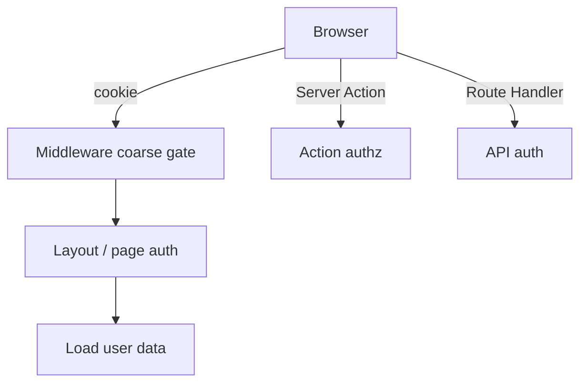

# Authentication

Auth in Next.js App Router spans **middleware gates**, **server session reads**, **Server Action authorization**, and **cookie security**. Prefer battle-tested libraries (Auth.js / Clerk / Cognito) but interviewers want the cookie/session threat model and where checks belong.

## Core goals

1. Prove identity (authentication)  
2. Enforce permissions (authorization)  
3. Protect cookies (HttpOnly, Secure, SameSite)  
4. Avoid leaking auth-gated HTML/data via static caches  



## Session strategies

| Strategy | How | Pros | Cons |
| --- | --- | --- | --- |
| Opaque server session | Session id cookie → store (Redis/DB) | Revocable | Lookup cost |
| JWT in cookie | Signed token with claims | Edge-verifiable | Revocation hard |
| External IdP | OAuth/OIDC | Delegated UX | Complexity |

```tsx
// Conceptual cookie set on login Route Handler / Action
res.cookies.set('session', token, {
  httpOnly: true,
  secure: process.env.NODE_ENV === 'production',
  sameSite: 'lax',
  path: '/',
  maxAge: 60 * 60 * 24 * 7,
})
```

## Auth.js (NextAuth) sketch — App Router

```tsx
// auth.ts
import NextAuth from 'next-auth'
import GitHub from 'next-auth/providers/github'

export const { handlers, auth, signIn, signOut } = NextAuth({
  providers: [GitHub],
  callbacks: {
    authorized: async ({ auth }) => !!auth,
  },
})

// app/api/auth/[...nextauth]/route.ts
import { handlers } from '@/auth'
export const { GET, POST } = handlers
```

```tsx
// Server Component
import { auth } from '@/auth'
import { redirect } from 'next/navigation'

export default async function Page() {
  const session = await auth()
  if (!session) redirect('/login')
  return <h1>Hello {session.user?.name}</h1>
}
```

```tsx
// middleware.ts
export { auth as middleware } from '@/auth'
export const config = { matcher: ['/dashboard/:path*'] }
```

## Authorization in Server Actions

```tsx
'use server'
import { auth } from '@/auth'

export async function updateProfile(formData: FormData) {
  const session = await auth()
  if (!session?.user?.id) throw new Error('Unauthorized')
  const name = String(formData.get('name') ?? '')
  await db.user.update({
    where: { id: session.user.id },
    data: { name },
  })
}
```

Never trust a client-sent `userId` field for ownership.

## Static caching pitfalls

```tsx
// ❌ User-specific page without dynamic — risk of caching one user’s HTML
export default async function Page() {
  const session = await auth() // cookies() → dynamic — good
  return <Secret data={await getSecret(session!.user.id)} />
}
```

If you accidentally force-static a personalized page, you can serve A’s data to B. Dynamic APIs from `auth()`/`cookies()` normally prevent that — don’t override with `force-static` on gated content.

## Client-side session

```tsx
'use client'
import { useSession } from 'next-auth/react'

export function UserMenu() {
  const { data, status } = useSession()
  if (status === 'loading') return null
  if (!data) return <a href="/login">Login</a>
  return <span>{data.user?.email}</span>
}
```

Use for UI chrome; **don’t** use as sole security for data fetches — protect APIs/RSC.

## CSRF & SameSite

- `SameSite=Lax` cookies block many cross-site POSTs  
- Server Actions include framework CSRF protections for same-site usage  
- For cookie tokens on APIs, prefer SameSite + custom header checks for state-changing routes  

## RBAC example

```tsx
type Role = 'user' | 'admin'

export async function requireRole(role: Role) {
  const session = await auth()
  if (!session) redirect('/login')
  if (session.user.role !== role && session.user.role !== 'admin') {
    redirect('/forbidden')
  }
  return session
}
```

## Interview Q&A

**Q: Where do you check auth in App Router?**  
A: Middleware for coarse redirects; `auth()` in layouts/pages for data; every Server Action/Route Handler for mutations/APIs.

**Q: JWT vs server sessions?**  
A: JWT = stateless/edge-friendly, harder revoke. Server session = revoke by deleting store row, extra lookup.

**Q: Why HttpOnly?**  
A: Prevents JavaScript access → mitigates XSS token theft (XSS still dangerous for actions as user).

**Q: Can you SSG an authenticated dashboard?**  
A: Not as personalized static HTML. Use dynamic SSR or client fetch after gate.

**Q: OAuth in Next?**  
A: Auth.js handlers under `/api/auth/*`; callbacks set session cookie; protect routes with `auth()`.

## Common Mistakes

- Client-only route guards (`useEffect` redirect) without server checks.  
- Putting secrets in `NEXT_PUBLIC_*`.  
- Authorizing only in middleware.  
- Caching personalized responses at CDN.  
- Accepting `role` from the client body.  

## Trade-offs

| Approach | Pros | Cons |
| --- | --- | --- |
| Auth.js | Flexible, open | DIY UI/config |
| Clerk/Auth0 | Fast productization | Vendor/cost |
| Middleware-only | Simple UX | Insufficient alone |
| JWT cookie | Edge | Revocation |
| DB session | Control | Latency |

**Senior takeaway:** Auth is **defense in depth** — cookie hygiene + middleware UX + server `auth()` + action/API authz — and **never static-cache personalized HTML**.


## Session rotation & fixation

On login, issue a **new** session id; invalidate the old. Set cookies with new values after privilege elevation. Store `updatedAt` for idle timeout.

## Extra Q&A

**Q: Where store refresh tokens?**  
A: Prefer HttpOnly secure cookies over `localStorage` (XSS-prone).


## Passwordless / magic link sketch

1. User submits email → Server Action  
2. Create opaque token in DB with expiry  
3. Email link `/login/verify?token=…`  
4. Route Handler validates, sets session cookie, deletes token  
5. Redirect to app  

Never put long-lived auth tokens in the email URL without one-time use + expiry.
