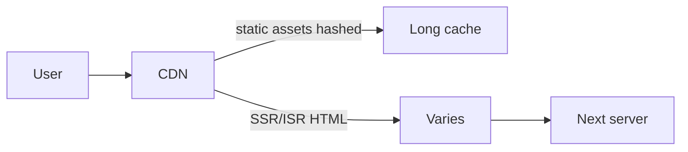

# Deployment

Deploying Next.js means choosing a **runtime host** that supports your features (SSR, ISR, middleware, Route Handlers, image optimization) and configuring **env, caching, regions, and observability**. Interviews probe Vercel vs self-host Node vs containers, and what breaks on static export.

## Platform options

| Platform | Fits | Notes |
| --- | --- | --- |
| Vercel | Full App Router feature set | Native ISR, Edge middleware, Image OCR |
| Node server (`next start`) | Docker / VM / PaaS | You manage scaling, CDN, cache |
| Standalone output | Lean Docker images | `output: 'standalone'` |
| Static export | S3/GitHub Pages | No SSR/ISR/middleware server features |
| Edge-only subsets | Cloudflare / etc. | Adapter constraints — verify support |

```js
// next.config.js
/** @type {import('next').NextConfig} */
const nextConfig = {
  output: 'standalone', // copy .next/standalone + static for Docker
}
module.exports = nextConfig
```

```dockerfile
FROM node:22-alpine AS deps
WORKDIR /app
COPY package*.json ./
RUN npm ci

FROM node:22-alpine AS builder
WORKDIR /app
COPY --from=deps /app/node_modules ./node_modules
COPY . .
RUN npm run build

FROM node:22-alpine AS runner
WORKDIR /app
ENV NODE_ENV=production
COPY --from=builder /app/public ./public
COPY --from=builder /app/.next/standalone ./
COPY --from=builder /app/.next/static ./.next/static
EXPOSE 3000
CMD ["node", "server.js"]
```

## Build vs runtime env

| Prefix | Available |
| --- | --- |
| `NEXT_PUBLIC_*` | Inlined into **client** bundle at build |
| Other `process.env.*` | Server only at runtime (and build if referenced at build) |

```bash
# CI
NEXT_PUBLIC_CDN=https://cdn.example.com npm run build
# Runtime secrets injected by platform — not NEXT_PUBLIC
DATABASE_URL=...
AUTH_SECRET=...
```

Changing `NEXT_PUBLIC_*` requires rebuild. Server secrets can rotate without rebuild if read at runtime.

## Caching in production



- `/_next/static/*` — immutable hashed assets, long `Cache-Control`  
- ISR/Full Route Cache — platform-specific store (Vercel Data Cache / your Redis DIY)  
- Self-host ISR: ensure **shared cache** across instances or sticky behavior  

Multi-instance without shared cache → inconsistent ISR.

## Regions & latency

- Put app near DB or use Edge for middleware + regional SSR  
- Cross-region DB chat kills TTFB — co-locate or use edge-config for flags only  
- Images: `next/image` needs optimizer (Vercel built-in or custom loader to Imgix/Cloudinary)

```js
images: {
  remotePatterns: [{ protocol: 'https', hostname: 'images.example.com' }],
  loader: 'custom',
  loaderFile: './imageLoader.js',
}
```

## Preview deployments & ISR

Preview URLs should use separate caches/env so production tags aren’t purged accidentally. Protect preview with auth if private.

## Observability

```tsx
// Instrumentation hook (App Router)
export async function register() {
  if (process.env.NEXT_RUNTIME === 'nodejs') {
    await import('./sentry.node')
  }
}
```

Track: TTFB, RSC payload size, Server Action error rates, cache hit ratio, cold starts.

## Feature matrix gotchas

| Feature | Needs |
| --- | --- |
| Middleware | Edge-capable host |
| ISR on-demand | Durable data cache |
| Server Actions | Serverful Next |
| `output: 'export'` | No server features |
| Draft mode | Cookie + dynamic render |

## Interview Q&A

**Q: Vercel vs Docker Node?**  
A: Vercel = batteries for Edge/ISR/Images. Docker = control/cost/portability; you wire CDN, cache, scaling.

**Q: What is standalone output?**  
A: Minimal server bundle for container images without full `node_modules` copy.

**Q: Why are env vars confusing?**  
A: `NEXT_PUBLIC_` baked at build into client; secrets must be server-only runtime.

**Q: ISR on multiple pods?**  
A: Need shared cache / object store or you’ll regenerate inconsistently per instance.

**Q: When static export?**  
A: Truly static sites; abandon SSR/ISR/auth server routes.

## Common Mistakes

- Shipping `.env` with secrets in images.  
- Expecting ISR to work identically on every host without reading platform docs.  
- No CDN in front of `next start`.  
- Building with wrong `NEXT_PUBLIC_` for prod.  
- Ignoring image optimizer 404s in self-host.  

## Trade-offs

| Choice | Pros | Cons |
| --- | --- | --- |
| Vercel | DX, features | Cost at scale / lock-in feel |
| Self-host Node | Control | Ops burden |
| Static export | Cheap hosting | Feature cut |
| Edge everywhere | Latency | Runtime limits |
| Single region | Simple | Far users slow |

**Senior takeaway:** Match **host capabilities** to App Router features; treat **env, CDN, shared cache, and images** as first-class deployment design — not afterthoughts.


## Health checks & zero downtime

```tsx
// app/api/health/route.ts
export function GET() {
  return Response.json({ ok: true })
}
```

Drain old pods after new revision passes readiness; watch ISR cache warm on new instances.

## Extra Q&A

**Q: Should you run `next build` in the container?**  
A: Prefer build in CI, ship artifact — faster deploys, reproducible builds, smaller runtime images.


## CDN & asset strategy

```text
/_next/static/chunks/*  → Cache-Control: public, max-age=31536000, immutable
/images/*               → long cache + hashed filenames
/api/*                  → usually no-store or short private cache
HTML / RSC              → depends on static vs dynamic
```

Purge CDN on deploy for HTML if you don’t use hashed HTML URLs (platform usually handles).

## Rollback plan

1. Keep previous standalone image tagged  
2. ISR/data caches may still hold new content after binary rollback — plan tag purge  
3. Feature flags for risky Server Actions  

## Extra Q&A

**Q: Cold start impact?**  
A: Serverless Node functions add TTFB variance; mitigate with warmers, fewer giant deps, Edge where possible, or always-on Node.
