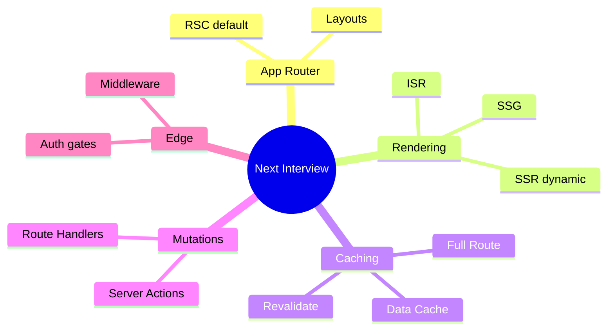

# Next.js Interview Q&A

Drill set for App Router → deployment. Answer in ~90s; follow-ups in italics.

## App Router & RSC

**Q1. What changed with the App Router?**  
A: File conventions (`layout`/`page`/`loading`/`error`), nested layouts that persist, RSC by default, `next/navigation`, streaming.

*Follow-up:* Layout vs template? → layout persists; template remounts.

**Q2. Where does `'use client'` go?**  
A: At the boundary of interactive leaves — not the whole page — so data fetching stays server-side.

**Q3. How can a Client Component wrap Server content?**  
A: Pass Server Components as `children` from a Server parent; don’t import server modules into client files.

**Q4. Serializable props across RSC boundary?**  
A: JSON-like data (+ supported rich types). No arbitrary functions (except Server Actions), classes, etc.

## Rendering modes

**Q5. Static vs dynamic rendering?**  
A: Static = build/ISR full route cache when no dynamic APIs. Dynamic = per-request when `cookies`/`headers`/`no-store`/etc.

**Q6. SSR vs SSG vs ISR?**  
A: SSR request-time HTML; SSG build-time; ISR static + revalidate/on-demand regeneration.

**Q7. `generateStaticParams` purpose?**  
A: Prebuild dynamic segment paths at build time for SSG.

**Q8. When is SSR required?**  
A: Personalization, strong consistency, auth-gated HTML, request-time flags.

## Caching

**Q9. Name cache layers.**  
A: Request memoization, Data Cache (`fetch`/`unstable_cache`), Full Route Cache, Client Router Cache (+ CDN).

**Q10. `revalidatePath` vs `revalidateTag`?**  
A: Path invalidates route tree; tag invalidates tagged fetch/cache entries — prefer tags for data shared across routes.

**Q11. Why layout+page double fetch isn’t double network?**  
A: React `cache()` / fetch request memoization dedupes per request.

**Q12. Mutation then stale UI?**  
A: Call revalidate in Server Action; `router.refresh()` if client cache holds old segment.

## Streaming & hydration

**Q13. How does streaming work?**  
A: Suspense boundaries flush shell/fallbacks first; resolved content streams later.

**Q14. Why avoid slow await in root layout?**  
A: Blocks entire app shell from streaming useful content.

**Q15. What is hydration?**  
A: Client JS attaching to SSR HTML for Client Components; must match server markup.

**Q16. Common hydration mismatch causes?**  
A: `Date`/`random` in render, `window` branching, invalid HTML nesting, locale diffs.

## Route Handlers & Middleware

**Q17. Route Handler vs Server Action?**  
A: Handler = HTTP API/webhooks/SSE. Action = UI mutations/forms with revalidation integration.

**Q18. Middleware use cases?**  
A: Auth redirect, rewrites, headers, geo — keep Edge-light; still authz on server.

**Q19. Redirect vs rewrite?**  
A: Redirect changes URL; rewrite serves different path under same URL.

## Server Actions

**Q20. Are Server Actions private?**  
A: No — they’re callable HTTP endpoints. Auth + validate + authz every time.

**Q21. Progressive enhancement?**  
A: `<form action={serverAction}>` works before hydration.

**Q22. `redirect` inside try/catch?**  
A: `redirect` throws — rethrow or don’t catch control-flow errors.

## Auth & deploy

**Q23. Auth defense in depth?**  
A: Middleware gate + `auth()` in RSC + action/API checks; HttpOnly cookies; no static personalized cache.

**Q24. `NEXT_PUBLIC_` mistake?**  
A: Exposes to browser / baked at build — never put secrets there.

**Q25. Standalone Docker?**  
A: `output: 'standalone'` for minimal runnable server image; remember static file copy.

**Q26. ISR multi-instance issue?**  
A: Need shared cache or inconsistent regenerations per pod.

## Rapid-fire

| Q | A |
| --- | --- |
| `loading.tsx`? | Suspense fallback for segment |
| `error.tsx`? | Client error boundary |
| `next/router` in app/? | Wrong — use `next/navigation` |
| Soft navigation? | Fetch RSC payload; reuse layouts |
| `dynamic = 'force-dynamic'`? | Opt out of full route static cache |
| Draft mode? | Bypass static for preview CMS |
| Image optimizer self-host? | Provide loader or run sharp pipeline |
| Prefetch? | `Link` prefetches in viewport (prod) |
| Parallel routes? | `@slot` for multiple pages in one layout |
| Intercepting routes? | Modal URLs over underlying page |

## Scenarios

**S1. Blog must update within seconds of CMS publish.**  
ISR tags on fetches + webhook `revalidateTag`; don’t rely only on long `revalidate`.

**S2. Dashboard HTML sometimes shows another user’s name.**  
Personalized route was cached — ensure `cookies`/auth dynamic; never `force-static`; fix CDN vary.

**S3. Button works only after delay.**  
Hydration lag — reduce client JS; use Server Action forms for critical actions.

**S4. Everything is slow despite streaming.**  
Root layout await; serial waterfalls; huge client bundle — profile server and client separately.

**S5. Server Action deletes any post by id.**  
Missing ownership check — always authz against session user.

## Common Mistakes

- Client-only auth guards.  
- `'use client'` on root layouts.  
- No revalidation after mutations.  
- Middleware-only security.  
- Confusing Data Cache with CDN.  
- Hydration mismatches ignored.  
- Edge middleware with Node-only ORM.

## Trade-offs cheat sheet

| Decide | Prefer A | Prefer B |
| --- | --- | --- |
| RSC vs Client page | Data/content | Heavy interactivity |
| ISR vs SSR | Public freshness bounded | Per-user / strongly consistent |
| Action vs Route Handler | First-party UI mutate | Public HTTP / webhooks |
| Vercel vs Docker | Feature velocity | Control / custom infra |
| Fine vs coarse Suspense | Progressive UX | Simpler layouts |

**Drill tip:** Always specify **which cache layer** and **static vs dynamic** when answering Next questions — that’s the senior differentiator.

## Additional senior prompts

**Q27. Explain a Server Action POST end-to-end.**  
A: Client invokes → Next action endpoint → runs server function with decrypted bound args → mutates DB → `revalidateTag` → returns/redirects → client refreshes RSC tree.

**Q28. Full Route Cache vs Data Cache miss patterns?**  
A: Dynamic user cookie: miss Full Route, may still hit Data Cache for public `fetch`. `no-store` fetch: miss Data Cache.

**Q29. How design loading UI without CLS?**  
A: Skeletons with reserved min-heights matching final layout; avoid swapping radically different structures.

**Q30. Middleware auth bypass?**  
A: Direct Server Action / Route Handler calls still need auth — middleware isn’t enough.

**Q31. When prefer Pages Router today?**  
A: Legacy codebase cost; otherwise App Router is the default for new apps.

**Q32. `router.refresh` vs `revalidatePath`?**  
A: `revalidatePath` drops server caches; `refresh` re-fetches RSC for current route on client. Often used together after mutations.

## Topic map

