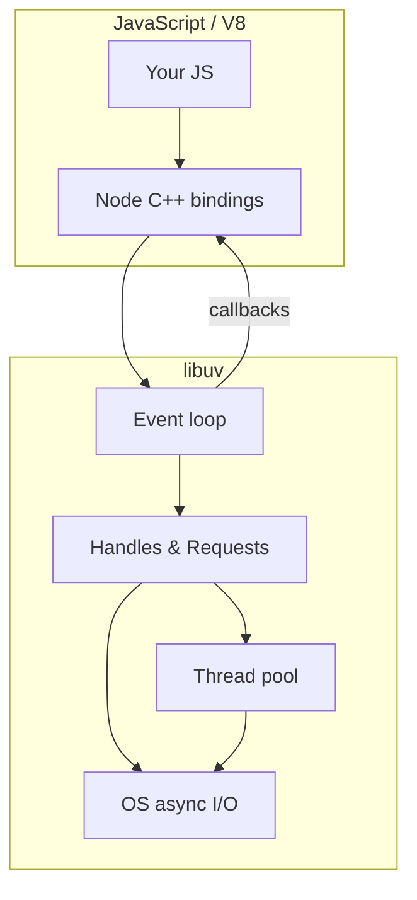

# libuv

Node.js is not “just V8.” **V8 executes JavaScript; libuv owns the event loop, thread pool, async I/O, and OS abstractions.** Interviewers probe whether you know *what* runs on the main thread vs the thread pool, and why CPU work still blocks Node.

Related: [Event Loop phases](/node/02-event-loop) · [Browser/JS event loop](/javascript/10-event-loop) · [Worker Threads](/node/06-worker-threads)

## What libuv is

libuv is a C library (originally for Node, now used elsewhere) that provides:

| Concern | Mechanism |
| --- | --- |
| Event loop | `uv_run` — phases over handles/requests |
| Async I/O | epoll / kqueue / IOCP / event ports |
| Thread pool | Default **4** workers (`UV_THREADPOOL_SIZE`) |
| Timers | Heap of timer handles |
| Networking | TCP/UDP, DNS (parts), pipes |
| FS (many ops) | Thread-pool backed |
| Signals / child processes | Platform wrappers |



## Handles vs requests

- **Handle** — long-lived object (`uv_tcp_t`, `uv_timer_t`, `uv_fs_event_t`). Represents something you watch or keep open.
- **Request** — short-lived operation (`uv_fs_t`, `uv_work_t`, `uv_getaddrinfo_t`). Completes once; then callback fires.

When you `fs.readFile`, Node allocates a request, submits work to the thread pool (or uses async FS where available), and later queues the JS callback for the poll/check path via the loop.

## What uses the thread pool

**Does use pool (by default):**

- Most `fs.*` (except some sync APIs and `fs.watch`/`fs.watchFile` nuances)
- `dns.lookup` (getaddrinfo) — **not** `dns.resolve` (c-ares, async on loop)
- `crypto` PBKDF2, scrypt, randomFill (async variants)
- `zlib` async compress/decompress
- Some userland `uv_queue_work` bindings

**Does not use pool:**

- Network I/O (TCP/HTTP) — non-blocking sockets + kernel readiness
- Timers (`setTimeout` / `setInterval`)
- `process.nextTick` / microtasks (V8 / Node queues, not libuv phases)
- Pure JS CPU on the main thread

```ts
import dns from 'node:dns/promises'
import fs from 'node:fs/promises'

// Thread-pool DNS (getaddrinfo) — can starve pool under load
await dns.lookup('example.com')

// Async DNS via c-ares — does not consume UV thread pool
await dns.resolve4('example.com')

// FS read — typically thread-pool
await fs.readFile('./data.json', 'utf8')
```

## `UV_THREADPOOL_SIZE`

Default **4**. Raising helps concurrent FS/crypto/zlib; too high increases context switching and memory.

```bash
# before process start
export UV_THREADPOOL_SIZE=8
node server.js
```

```ts
// Prove pool contention in interviews / load tests
import { pbkdf2 } from 'node:crypto'
import { performance } from 'node:perf_hooks'

function hash(i: number): Promise<void> {
  return new Promise((resolve, reject) => {
    pbkdf2('pw', 'salt', 100_000, 64, 'sha512', (err) => {
      if (err) reject(err)
      else resolve()
    })
  })
}

const t0 = performance.now()
await Promise.all(Array.from({ length: 8 }, (_, i) => hash(i)))
console.log('ms', performance.now() - t0)
// With UV_THREADPOOL_SIZE=4, 8 heavy crypto jobs queue; with 8, more parallelism
```

## Blocking the loop vs blocking the pool

```ts
// BAD: blocks event loop — no other JS runs
const end = Date.now() + 2000
while (Date.now() < end) {}

// BAD for latency: fills thread pool; other FS/crypto waits
await Promise.all([...Array(100)].map(() => fs.readFile(bigFile)))

// BETTER for CPU: worker_threads / child_process / offload service
```

```mermaid
sequenceDiagram
  participant JS as Main thread JS
  participant Loop as libuv loop
  participant Pool as Thread pool
  participant OS as Kernel
  JS->>Loop: fs.readFile
  Loop->>Pool: uv_fs work
  Pool->>OS: read syscall
  OS-->>Pool: bytes
  Pool-->>Loop: complete request
  Loop-->>JS: callback / promise settle
```

## File watchers & platforms

`fs.watch` uses platform backends (inotify, FSEvents, ReadDirectoryChangesW). Behavior differs; always document “best effort.” `fs.watchFile` polls via timers — higher CPU.

## Interview Q&A

**Q: Why can Node handle thousands of concurrent connections but choke on CPU?**  
A: Connections are mostly idle sockets + readiness events on the loop. CPU burns the single JS thread; no preemptive multitasking for JS.

**Q: `dns.lookup` vs `dns.resolve`?**  
A: `lookup` → getaddrinfo → thread pool + OS resolver/`nsswitch`. `resolve*` → c-ares → async, no pool. Prefer `resolve` when you control DNS and need pool isolation; `lookup` matches system hosts file / corporate DNS behavior.

**Q: Does `await fetch()` use the thread pool?**  
A: Undici/HTTP uses non-blocking sockets on the loop (plus internal queues). Not the classic UV FS pool path.

**Q: What happens if all 4 pool threads are busy?**  
A: New pool work queues. Timers and network can still progress on the loop, but FS/crypto/zlib latency spikes.

**Q: Is `setImmediate` part of libuv?**  
A: Yes — check phase. Contrast with `process.nextTick` (Node queue, before loop continues) and Promise microtasks (V8).

## Common Mistakes

- Assuming “all async I/O uses the thread pool.”
- Setting `UV_THREADPOOL_SIZE` absurdly high without measuring.
- Using sync FS (`readFileSync`) in request handlers — blocks the loop hard.
- Ignoring that `dns.lookup` shares the pool with FS under bursty traffic.
- Treating libuv as “Node’s garbage collector” or as V8 itself.

## Trade-offs

| Choice | Win | Cost |
| --- | --- | --- |
| Raise thread pool | Parallel FS/crypto | Memory, scheduling noise |
| Sync APIs at startup | Simple boot | Never in hot path |
| Offload CPU to workers | Keeps loop free | Serialization, complexity |
| `dns.lookup` | OS-consistent | Pool contention |
| `dns.resolve` | Pool-friendly | May diverge from `/etc/hosts` |

**Production note:** Cap concurrent pool-heavy work (semaphores / queues). Monitor event-loop delay (`perf_hooks.monitorEventLoopDelay`) and pool saturation separately — see [Performance](/node/11-performance) and [Scaling](/node/10-scaling).


## Thread pool starvation scenarios

Under bursty uploads + password hashing + `dns.lookup`, the default 4 workers serialize. Symptoms: event loop delay stays low (JS free) while FS p99 explodes.

```ts
import { setTimeout as sleep } from 'node:timers/promises'

// Bound concurrent pool work — do not rely only on UV_THREADPOOL_SIZE
class Semaphore {
  private q: Array<() => void> = []
  constructor(private n: number) {}
  async acquire() {
    if (this.n > 0) { this.n--; return }
    await new Promise<void>((r) => this.q.push(r))
  }
  release() {
    const next = this.q.shift()
    if (next) next()
    else this.n++
  }
}

const poolGate = new Semaphore(8)

export async function withPoolGate<T>(fn: () => Promise<T>): Promise<T> {
  await poolGate.acquire()
  try { return await fn() }
  finally { poolGate.release() }
}
```

## Handles that keep the process alive

Open servers, sockets, `setInterval` without `unref`, and active `fs.watch` keep `uv_run` from returning. In tests, always close servers and clear intervals or use `unref` intentionally.

## Interview follow-ups (libuv)

**Q: Does `fs.promises.readFile` block the event loop while reading?**  
A: No — work is off-thread; the callback/promise scheduling returns to the loop. Sync APIs block.

**Q: Can you implement custom thread-pool work from JS?**  
A: Not directly; use `worker_threads`, native addons with `uv_queue_work`, or child processes.

**Q: Why might raising the pool make HTTP slower?**  
A: CPU contention with the main thread and other processes; cache thrash; diminishing returns.
