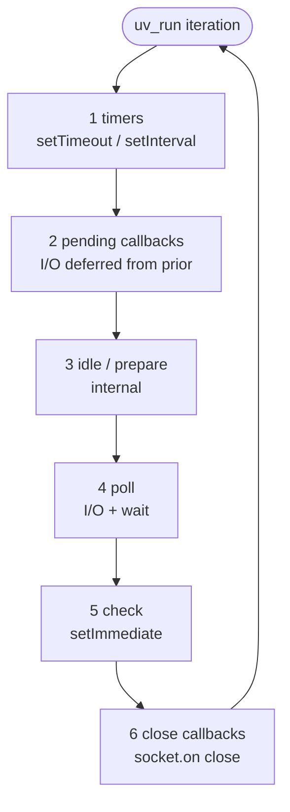
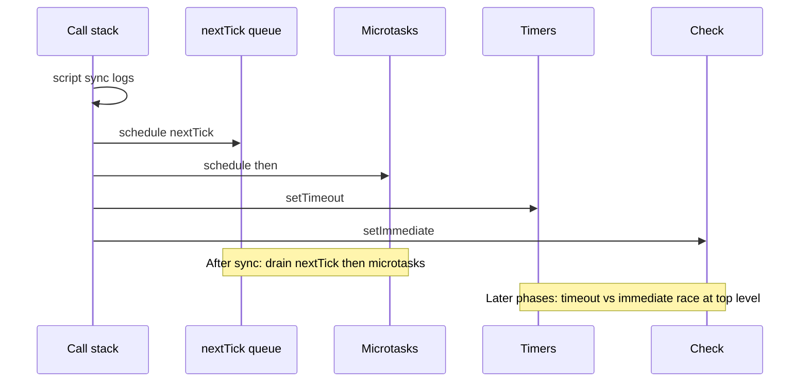

# Event Loop Phases

Node’s event loop is **libuv phases + Node-specific queues** (`process.nextTick`, microtasks). Browser mental model ([JS event loop](/javascript/10-event-loop)) is related but **not identical** — no “render,” and `setImmediate` / `nextTick` are Node-only.

Prerequisite: [libuv](/node/01-libuv)

## Phase order (one iteration)



Between **any** callbacks, Node drains:

1. **`process.nextTick` queue** (exhaust until empty — can starve)
2. **Microtask queue** (Promises, `queueMicrotask`)

```ts
setTimeout(() => console.log('timeout'), 0)
setImmediate(() => console.log('immediate'))
Promise.resolve().then(() => console.log('micro'))
process.nextTick(() => console.log('nextTick'))

// Typical (not guaranteed vs timeout/immediate race):
// nextTick → micro → then either timeout or immediate depending on poll timing
```

## Phase details

### 1. Timers

Runs callbacks whose delay has elapsed. Timer resolution is **not** exact — loop delay + phase scheduling. Many expired timers run in one timers phase.

```ts
const t0 = Date.now()
setTimeout(() => {
  console.log('delta', Date.now() - t0) // often > 0, sometimes >> delay under load
}, 0)
```

### 2. Pending callbacks

Deferred TCP errors / some system operations from previous cycle. Rarely the interview focus; know it exists.

### 3. Idle / prepare

Internal. Don’t schedule user work here.

### 4. Poll

- Execute almost all I/O callbacks (network, most FS completions as they become ready).
- If timers are due soon and poll queue empty, may not block long.
- If nothing to do and no timers, can **block** waiting for I/O (with timeout).

### 5. Check — `setImmediate`

Designed to run **after** poll. Useful to defer work until after I/O callbacks in the same tick pattern.

```ts
import fs from 'node:fs'

fs.readFile('./x.txt', () => {
  setTimeout(() => console.log('timeout in I/O'), 0)
  setImmediate(() => console.log('immediate in I/O'))
  // Inside I/O callback: setImmediate almost always before setTimeout(0)
})
```

### 6. Close callbacks

`socket.on('close')`, `server.close` handlers, etc.

## `nextTick` vs microtasks vs `setImmediate`

| Mechanism | Queue | When | Starvation risk |
| --- | --- | --- | --- |
| `process.nextTick` | Node nextTick | Before loop continues / between phases | **High** if recursive |
| Promise / `queueMicrotask` | V8 microtask | After nextTick drain, before next phase callback batch | High if recursive |
| `setImmediate` | Check phase | After poll | Bounded by phase |
| `setTimeout(0)` | Timers | Next timers phase (≥1ms historically clamped in browsers; Node still phase-bound) | Lower |

```ts
function starve() {
  process.nextTick(starve) // never reaches poll — DO NOT
}
```

```ts
// Prefer setImmediate / queue for yielding
async function yieldToEventLoop(): Promise<void> {
  await new Promise<void>((r) => setImmediate(r))
}

async function processBatch(items: string[]) {
  for (let i = 0; i < items.length; i++) {
    await heavy(items[i]!)
    if (i % 100 === 0) await yieldToEventLoop()
  }
}
```

## Ordering puzzle (classic interview)

```ts
console.log('script')

setTimeout(() => console.log('timeout'), 0)
setImmediate(() => console.log('immediate'))

Promise.resolve().then(() => console.log('then'))
process.nextTick(() => console.log('nextTick'))

console.log('end')

// Always: script, end, nextTick, then
// timeout vs immediate: RACE at top level (depends on poll timing)
```



## `unref` / `ref` and keeping the process alive

Handles keep the loop alive. `server.listen`, open sockets, active timers (ref’d) prevent exit.

```ts
const t = setInterval(() => {}, 1000)
t.unref() // allow process to exit if nothing else keeps loop alive
```

## Interview Q&A

**Q: Why is top-level `setTimeout(0)` vs `setImmediate` a race?**  
A: Entering the loop, timers may or may not be due before poll completes; check runs after poll. Inside an I/O callback, check is next → `setImmediate` wins reliably.

**Q: Does `await` schedule a macrotask?**  
A: Settling continues via microtasks. The async function resumes as a microtask after the Promise resolves (then nextTick rules still apply around bindings).

**Q: How do you measure event-loop lag?**  
A: `perf_hooks.monitorEventLoopDelay`, or histogram of `setImmediate`/`setTimeout` skew. See [Performance](/node/11-performance).

**Q: Can microtasks run in the middle of a phase?**  
A: After each callback returns, nextTick + microtasks drain before the next callback.

**Q: Is the event loop multi-threaded?**  
A: One loop thread for JS; libuv may use pool threads for work, then marshal callbacks back.

## Common Mistakes

- Mapping browser “macrotask → render → …” onto Node phases.
- Recursive `nextTick` / Promise chains that starve I/O.
- Assuming `setTimeout(fn, 0)` runs “immediately after current stack.”
- Blocking poll with CPU so timers fire late and look “broken.”
- Forgetting close callbacks exist when debugging hanging shutdowns.

## Trade-offs

| Pattern | When | Trade-off |
| --- | --- | --- |
| `nextTick` | Must run before I/O continues (legacy APIs) | Starvation; prefer microtasks/`setImmediate` for yielding |
| `setImmediate` | Defer after I/O | Node-only — not in browsers |
| Batch + yield | Long CPU on main thread | Latency vs throughput |
| Unref timers | Health pings shouldn’t block exit | Easy to exit “too early” in tests |

**Cross-link:** Full browser comparison lives in [JavaScript Event Loop](/javascript/10-event-loop). For multi-process scaling of loops, see [Cluster](/node/05-cluster) and [Backend SD: Job Queue](/backend-system-design/08-job-queue).


## `queueMicrotask` vs `Promise.then`

Both enqueue microtasks. `queueMicrotask` avoids allocating a Promise when you only need scheduling. Order among microtasks is FIFO of scheduling.

```ts
queueMicrotask(() => console.log(1))
Promise.resolve().then(() => console.log(2))
queueMicrotask(() => console.log(3))
// 1 2 3
```

## Closing servers & the close phase

```ts
server.close(() => console.log('closed')) // close callback phase
sockets.forEach((s) => s.destroy())
```

Half-open connections and lingering keep-alives delay shutdown — pair with [Production](/node/13-production) drain.

## Fake timers in tests

`node:timers/promises` and Jest fake timers interact poorly with real I/O. Prefer integration tests for phase ordering; unit-test business logic separately.

## More phase puzzles

```ts
import fs from 'node:fs'

console.log('A')
fs.readFile(__filename, () => {
  console.log('B')
  process.nextTick(() => console.log('C'))
  setImmediate(() => console.log('D'))
})
setImmediate(() => console.log('E'))
console.log('F')
// A F ... then E (check) interleaved with I/O completion B C D depending on poll
```

Explain candidates: after sync A/F, poll eventually runs the read callback; inside it nextTick C before setImmediate D.
