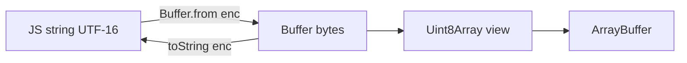

# Buffers

`Buffer` is Node’s fixed-length **raw binary** view (subclass of `Uint8Array` since modern Node). Interviews test encoding pitfalls, unsafe allocation, and sharing memory with streams / `crypto`.

Related: [Streams](/node/03-streams) · [Security](/node/12-security) · [V8](/node/07-v8)

## Why Buffer exists

JS strings are UTF-16 code units; binary protocols (TCP, files, images) need bytes. Buffer provides:

- Explicit encodings (`utf8`, `base64`, `hex`, `latin1`, …)
- Alloc / from / concat / slice semantics
- Interop with TypedArrays and `ArrayBuffer`



## Creating buffers

```ts
import { Buffer } from 'node:buffer'

const a = Buffer.alloc(16)           // zero-filled — safe default
const b = Buffer.allocUnsafe(16)     // fast; may contain old memory — wipe before expose
const c = Buffer.from('hello', 'utf8')
const d = Buffer.from([0x68, 0x69])
const e = Buffer.from(c)             // copy
```

**`allocUnsafe` / `allocUnsafeSlow`:** skip zero-fill for speed. Only use when you immediately overwrite every byte. Leaking uncleared unsafe buffers is a **security** bug (memory disclosure).

```ts
function fillSafe(size: number, fill: number) {
  const buf = Buffer.allocUnsafe(size)
  buf.fill(fill) // overwrite entirely
  return buf
}
```

## Encodings (gotchas)

| Encoding | Notes |
| --- | --- |
| `utf8` | Default for many APIs; multi-byte chars |
| `utf16le` | Endian-sensitive |
| `base64` / `base64url` | Padding rules matter for JWT/crypto |
| `hex` | 2 chars per byte |
| `latin1` / `binary` | 1 byte ↔ 1 char — useful for binary-as-string hacks; easy footgun |

```ts
const emoji = Buffer.from('🙂', 'utf8')
console.log(emoji.length) // 4 bytes, not 1

// Partial UTF-8 decode across chunks — use StringDecoder
import { StringDecoder } from 'node:string_decoder'
const decoder = new StringDecoder('utf8')
console.log(decoder.write(emoji.subarray(0, 2))) // ''
console.log(decoder.write(emoji.subarray(2)))    // '🙂'
console.log(decoder.end())
```

## Slice vs subarray vs copy

Historically `buf.slice()` returned a **view** (shared memory). Prefer `subarray` (explicit view) or `Buffer.from(buf)` (copy).

```ts
const parent = Buffer.from('ABCDEF')
const view = parent.subarray(0, 3)
view[0] = 0x5a // mutates parent → 'ZBCDEF'

const copy = Buffer.from(parent.subarray(0, 3)) // independent
```

## Concat & pooling

```ts
const out = Buffer.concat([Buffer.from('a'), Buffer.from('b')], 2)

// Avoid quadratic concat in a loop — collect chunks then concat once
function collect(chunks: Buffer[]) {
  return Buffer.concat(chunks)
}
```

Node may use a buffer pool for small `allocUnsafe` sizes — another reason uncleared unsafe alloc is dangerous.

## Binary protocols sketch

```ts
function encodeMessage(op: number, payload: Buffer): Buffer {
  const header = Buffer.alloc(5)
  header.writeUInt8(op, 0)
  header.writeUInt32BE(payload.length, 1)
  return Buffer.concat([header, payload])
}

function decodeHeader(buf: Buffer): { op: number; len: number } {
  return { op: buf.readUInt8(0), len: buf.readUInt32BE(1) }
}
```

Endianness (`BE`/`LE`) is a classic wire-bug source — document it.

## Interview Q&A

**Q: Buffer vs Uint8Array?**  
A: Buffer is Uint8Array with Node helpers (encodings, `writeInt*`). Prefer Buffer in Node APIs; Uint8Array in Web-ish code.

**Q: When is `allocUnsafe` OK?**  
A: Hot paths where you overwrite all bytes immediately and never return residual memory to clients/logs.

**Q: Why is `buf.toString()` on huge buffers bad?**  
A: Creates a large string on the heap; can spike memory / GC. Stream + decoder instead.

**Q: How do you safely decode UTF-8 across TCP chunks?**  
A: `StringDecoder` or text streaming decoders — never assume chunk boundaries = character boundaries.

**Q: Can Buffers share memory with workers?**  
A: Transfer `ArrayBuffer` / SharedArrayBuffer carefully; see [Worker Threads](/node/06-worker-threads).

## Common Mistakes

- Logging / returning `allocUnsafe` buffers without filling.
- Using `==` on buffers (use `buf.equals`).
- Treating `length` as character count for UTF-8.
- Mutating `subarray` views and corrupting parent stream buffers.
- Base64url vs base64 confusion in JWT (see [JWT & Auth](/node/08-jwt-auth)).

## Trade-offs

| API | Speed | Safety |
| --- | --- | --- |
| `alloc` | Slower | Zeroed |
| `allocUnsafe` | Faster | Must overwrite |
| Shared `subarray` | Zero-copy | Alias bugs |
| Full copy | Safer | CPU/RAM |

**Production:** Cap max buffer sizes on untrusted input (DoS). Combine with [Security](/node/12-security) body limits and [Streams](/node/03-streams) for large payloads.


## Comparing & searching

```ts
Buffer.compare(a, b) // -1 / 0 / 1
a.equals(b)          // boolean
a.indexOf(0x0a)      // byte search
a.includes(Buffer.from('err'))
```

Sorting arrays of buffers uses `Buffer.compare` as the comparator.

## Reading multi-byte integers safely

Always check `buf.length` before `readUInt16BE` etc., or catch `RangeError`. Malicious short frames are a DoS/parse-crash vector on TCP servers.

```ts
function need(buf: Buffer, n: number) {
  if (buf.length < n) throw new Error('short_buffer')
}
```

## Zero-copy with streams

Prefer passing `Buffer` chunks through transforms without `toString`/`Buffer.from` copies. Decode only at boundaries. For file hashing:

```ts
import { createHash } from 'node:crypto'
import { createReadStream } from 'node:fs'
import { pipeline } from 'node:stream/promises'

const hash = createHash('sha256')
await pipeline(createReadStream('video.bin'), hash)
console.log(hash.digest('hex'))
```

## Interview extras

**Q: Why is `buf.slice` discouraged in docs?**  
A: Historical shared-memory confusion; use `subarray` or copy explicitly.

**Q: Transcoding latin1 to utf8 wrongly — symptom?**  
A: Moјibake; binary treated as text. Keep binary as Buffer until the edge.
