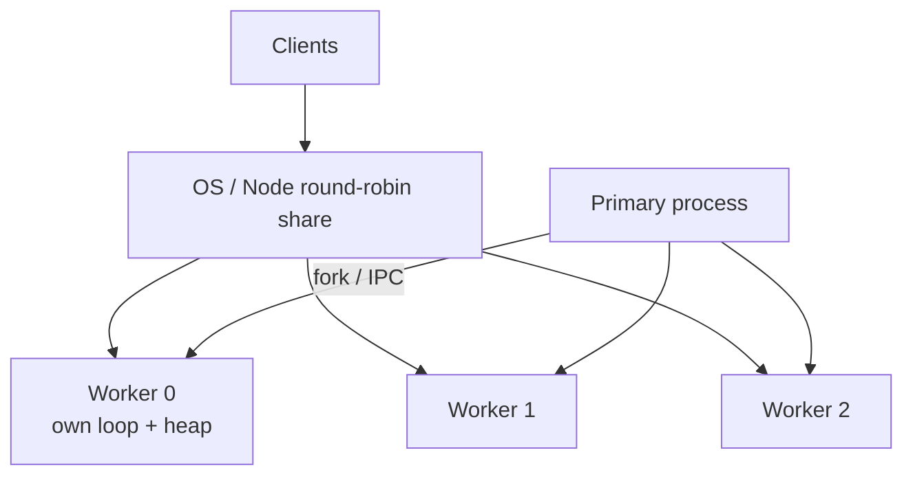

# Cluster

`node:cluster` forks **multiple processes** sharing server ports via the primary. Each worker has its **own** V8 heap, event loop, and libuv pool. Use it to utilize multi-core CPUs for **networked** Node apps — not shared-memory parallelism (that’s [Worker Threads](/node/06-worker-threads)).

Related: [Scaling](/node/10-scaling) · [Production](/node/13-production) · [Backend SD: SaaS API](/backend-system-design/09-saas-api)

## Model



- **Primary:** forks workers, optionally restarts on exit, may hold shared state via IPC (limited).
- **Workers:** accept connections (shared listen) and handle requests.

On Linux, Node can distribute connections round-robin in the primary; other platforms may rely on OS `SO_REUSEPORT`-style behavior — don’t assume identical load balance.

## Minimal pattern

```ts
import cluster from 'node:cluster'
import http from 'node:http'
import os from 'node:os'
import process from 'node:process'

const CPUS = os.availableParallelism?.() ?? os.cpus().length

if (cluster.isPrimary) {
  console.log(`primary ${process.pid}`)
  for (let i = 0; i < CPUS; i++) cluster.fork()

  cluster.on('exit', (worker, code, signal) => {
    console.error(`worker ${worker.process.pid} died`, { code, signal })
    cluster.fork() // naive restart — add crash-loop backoff in prod
  })
} else {
  http.createServer((req, res) => {
    res.end(`hello from ${process.pid}`)
  }).listen(3000)
}
```

## Sticky sessions & state

Workers **do not share** memory. In-process sessions / rate-limit maps / caches are **per worker** → inconsistent behavior.

```ts
// BAD with cluster: Map only on one worker
const sessions = new Map<string, object>()

// GOOD: Redis / DB shared store — see /backend/05-redis and /backend/07-auth
```

For WebSockets needing affinity, use sticky load balancing at LB (IP hash / cookie) or externalize pub/sub ([Chat design](/backend-system-design/03-chat)).

## IPC

```ts
if (cluster.isPrimary) {
  cluster.on('message', (worker, msg) => {
    // broadcast carefully — O(n) workers
    for (const id in cluster.workers) {
      cluster.workers[id]?.send(msg)
    }
  })
} else {
  process.send?.({ type: 'ready' })
  process.on('message', (msg) => {
    // handle
  })
}
```

IPC is for control plane signals, not high-throughput data paths.

## Graceful restart (rolling)

```ts
import cluster from 'node:cluster'

async function restartWorkers() {
  const workers = Object.values(cluster.workers ?? {})
  for (const w of workers) {
    if (!w) continue
    w.send({ type: 'shutdown' })
    await new Promise<void>((resolve) => w.once('exit', () => resolve()))
    cluster.fork()
  }
}

// worker side
process.on('message', (msg: { type?: string }) => {
  if (msg?.type === 'shutdown') {
    server.close(() => process.exit(0))
    setTimeout(() => process.exit(1), 10_000).unref()
  }
})
```

Prefer process managers (PM2, systemd, k8s rolling updates) over hand-rolled cluster in many orgs — see [Ops](/backend/10-ops).

## Cluster vs alternatives

| Approach | Isolation | Shared mem | Best for |
| --- | --- | --- | --- |
| Cluster / multi-process | Strong | No | Multi-core HTTP |
| Worker threads | Same process | Optional SAB | CPU tasks |
| Child process | Strong | No | Isolate crashy native code |
| Horizontal pods | Strong | No | Cloud scale |

## Interview Q&A

**Q: Does cluster make one Node process multi-threaded for JS?**  
A: No — N processes × 1 JS thread each.

**Q: Why is in-memory rate limiting wrong with cluster?**  
A: Each worker has its own counters; effective limit ≈ N× configured unless sticky or centralized ([Rate limit](/backend/08-rate-limit)).

**Q: How many workers?**  
A: Often `≈ CPU count`; measure. Too many → context switch + RAM. Leave headroom for OS and sidecars.

**Q: What happens when a worker OOMs?**  
A: That process dies; primary can fork a replacement. In-flight requests on that worker fail — design retries/idempotency ([Queues](/backend/06-queues)).

**Q: Cluster vs k8s replicas?**  
A: Cluster scales cores on one machine; k8s scales machines. Often: 1 process per container + HPA, not cluster-inside-pod (double-scheduling). See [Production](/node/13-production).

## Common Mistakes

- Crash-loop forking without backoff → thundering primary CPU.
- Assuming sticky WebSockets without LB config.
- Sharing mutable global caches expecting coherence.
- Listening on random ports per worker without shared handle (misses the point of cluster).
- Running cluster *and* many pods without understanding total concurrency.

## Trade-offs

| Choice | Win | Cost |
| --- | --- | --- |
| `cluster` module | Simple multi-core | Operational complexity; IPC limits |
| 1 proc / container | Clean k8s model | Need more pods for cores |
| Sticky LB | Session affinity | Uneven load; failover pain |
| Shared Redis state | Correctness | Latency / dependency |

**Cross-link:** Capacity and fan-out patterns in [Backend System Design](/backend-system-design/index) and [Scaling Node](/node/10-scaling).


## Scheduling modes

On some platforms primary distributes connections; elsewhere kernel distributes accepts. Benchmark before assuming even load. Uneven CPU across workers often means sticky large requests, not broken cluster.

## Shared nothing checklist

| State | Where it must live |
| --- | --- |
| Sessions | Redis/DB |
| Upload temp files | Object storage |
| Cron leader election | Redis/DB lock or k8s CronJob |
| WebSocket rooms | Pub/sub |

## PM2 vs cluster module

PM2 wraps process management (restart, logs, metrics). Still same shared-nothing rules. In Kubernetes, prefer replica sets over PM2 cluster inside a pod.
