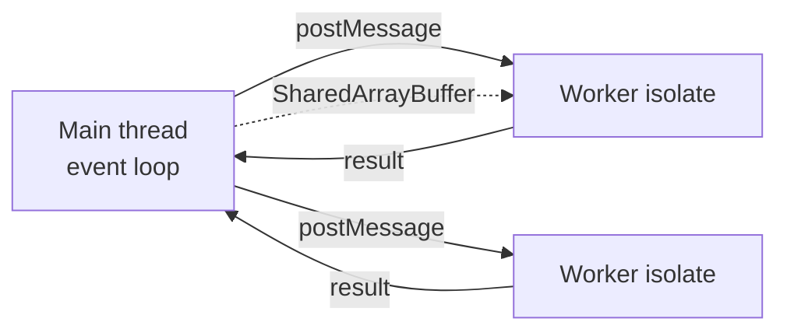

# Worker Threads

Worker threads run JS in **parallel isolates** inside one process — separate V8 heaps by default, optional `SharedArrayBuffer` / transferable `ArrayBuffer`. Use for **CPU-bound** work; use [Cluster](/node/05-cluster) / multiple processes for scaling HTTP sockets.

Related: [libuv](/node/01-libuv) · [V8](/node/07-v8) · [Performance](/node/11-performance)

## When to use

| Workload | Prefer |
| --- | --- |
| JSON parse of huge payloads, image resize, crypto, compression in-request | Worker threads / pool |
| Many concurrent HTTP connections | Cluster / multi-process / more pods |
| Crash isolation for native addons | `child_process` |
| Tiny async I/O | Main thread (workers add overhead) |



## Basic worker

`worker.mjs` / `worker.ts` (compiled):

```ts
// worker-task.ts
import { parentPort, workerData } from 'node:worker_threads'

function fib(n: number): number {
  return n < 2 ? n : fib(n - 1) + fib(n - 2)
}

const result = fib(workerData.n as number)
parentPort?.postMessage({ result })
```

```ts
// main.ts
import { Worker } from 'node:worker_threads'
import path from 'node:path'

function runFib(n: number): Promise<number> {
  return new Promise((resolve, reject) => {
    const worker = new Worker(path.resolve('./worker-task.js'), {
      workerData: { n },
    })
    worker.on('message', (msg: { result: number }) => resolve(msg.result))
    worker.on('error', reject)
    worker.on('exit', (code) => {
      if (code !== 0) reject(new Error(`exit ${code}`))
    })
  })
}

console.log(await runFib(40))
```

## Transferable vs clone vs shared

```ts
import { Worker } from 'node:worker_threads'

const buf = new ArrayBuffer(1024)
const worker = new Worker('./w.js')
// Zero-copy transfer — sender loses access
worker.postMessage({ buf }, [buf])

// Structured clone (default) — copy cost
worker.postMessage({ obj: { a: 1 } })

// SharedArrayBuffer — both sides see mutations; needs Atomics for sync
```

```ts
// Coordination with Atomics
const sab = new SharedArrayBuffer(4)
const view = new Int32Array(sab)
Atomics.store(view, 0, 0)
// worker Atomics.wait / Atomics.notify patterns for pools
```

## `worker_threads` pool sketch

Spawning a worker per request is expensive (isolate startup). Use a fixed pool:

```ts
import { Worker } from 'node:worker_threads'
import { EventEmitter } from 'node:events'

type Job = { id: number; payload: unknown; resolve: (v: unknown) => void; reject: (e: unknown) => void }

export class WorkerPool extends EventEmitter {
  private workers: Worker[] = []
  private idle: Worker[] = []
  private queue: Job[] = []
  private nextId = 1

  constructor(script: string, size: number) {
    super()
    for (let i = 0; i < size; i++) {
      const w = new Worker(script)
      w.on('message', (msg: { id: number; ok: boolean; value?: unknown; error?: string }) => {
        const job = this.pending.get(msg.id)
        this.pending.delete(msg.id)
        if (!job) return
        msg.ok ? job.resolve(msg.value) : job.reject(new Error(msg.error))
        this.idle.push(w)
        this.pump()
      })
      this.workers.push(w)
      this.idle.push(w)
    }
  }

  private pending = new Map<number, Job>()

  exec(payload: unknown): Promise<unknown> {
    return new Promise((resolve, reject) => {
      this.queue.push({ id: this.nextId++, payload, resolve, reject })
      this.pump()
    })
  }

  private pump() {
    while (this.idle.length && this.queue.length) {
      const w = this.idle.pop()!
      const job = this.queue.shift()!
      this.pending.set(job.id, job)
      w.postMessage({ id: job.id, payload: job.payload })
    }
  }

  async close() {
    await Promise.all(this.workers.map((w) => w.terminate()))
  }
}
```

## `isMainThread`, `parentPort`, `MessageChannel`

```ts
import { isMainThread, parentPort, MessageChannel, Worker } from 'node:worker_threads'

if (isMainThread) {
  const { port1, port2 } = new MessageChannel()
  const w = new Worker(new URL(import.meta.url))
  w.postMessage({ port: port2 }, [port2])
  port1.on('message', console.log)
} else {
  parentPort?.once('message', ({ port }) => {
    port.postMessage('ready')
  })
}
```

## Pitfalls with Node APIs in workers

- Many addons are **not** thread-safe.
- Don’t share DB connection pools across threads carelessly — prefer connections per thread or stay on main for I/O.
- CPU workers still compete for cores with libuv pool threads.

## Interview Q&A

**Q: Cluster vs worker_threads?**  
A: Cluster = multi-process, isolate crashes, scale HTTP. Workers = parallel CPU, lighter than processes, shared process fate (one native segfault can kill all).

**Q: Why is `postMessage` of a huge object slow?**  
A: Structured clone copies. Transfer ArrayBuffers or share SAB.

**Q: Can workers share a Redis client singleton from main via memory?**  
A: No automatic sharing of JS objects. Pass config; create clients per worker or keep I/O on main.

**Q: Do workers have their own event loop?**  
A: Yes — each thread runs its own loop / V8 isolate.

**Q: What about `Atomics.wait` on the main thread?**  
A: Blocks the main loop — never. Only wait inside workers.

## Common Mistakes

- Spawning unbounded workers per request.
- Blocking main thread with `Atomics.wait`.
- Forgetting `worker.terminate()` → handle leaks in tests.
- Mutating SharedArrayBuffer without Atomics → races.
- Using workers for tiny I/O tasks (overhead > benefit).

## Trade-offs

| Pattern | Win | Cost |
| --- | --- | --- |
| Per-job Worker | Simple | Startup latency |
| Fixed pool | Amortized cost | Queueing delay under burst |
| SAB + Atomics | Fast shared state | Complexity, data races |
| Child process | Stronger isolation | Heavier IPC |

**See also:** Offloading strategies in [Scaling](/node/10-scaling) and CPU-bound job design in [Job Queue](/backend-system-design/08-job-queue).


## `BroadcastChannel` & parent ports

Multiple workers can subscribe to a `BroadcastChannel` for pub/sub inside one process — still not a substitute for Redis across processes.

## Resource limits

```ts
new Worker(script, {
  resourceLimits: {
    maxOldGenerationSizeMb: 128,
    maxYoungGenerationSizeMb: 32,
  },
})
```

Helps contain runaway CPU workers before the host OOM-killer strikes the whole pod.

## Error surfaces

`worker.on('error')` catches uncaught exceptions in the worker. Unhandled rejections should be treated seriously — mirror main-thread fatal policy in pools.

## When cluster + workers together

HTTP workers via cluster/pods; CPU pool via `worker_threads` inside each process. Cap `poolSize * pods` against machine cores.
