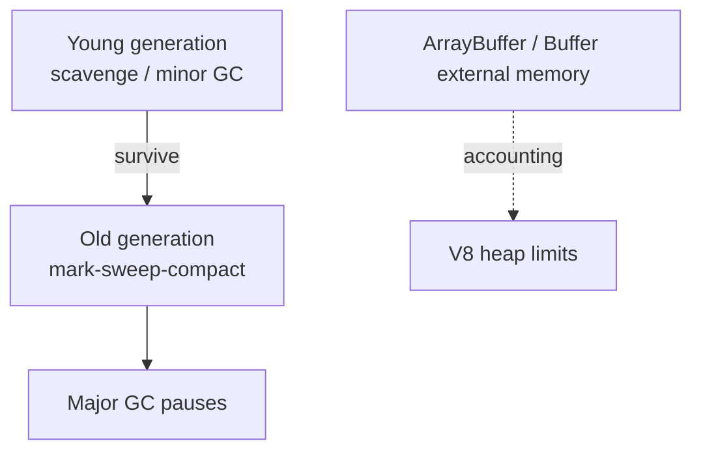

# V8 in Node

V8 compiles and executes JS/WASM, manages the heap, and runs GC. Node embeds V8 and exposes tuning/inspection hooks. Interview depth: **Ignition + TurboFan**, hidden classes / inline caches, GC flavors, and when `Buffer` / external memory sits outside the JS heap.

Related: [libuv](/node/01-libuv) · [Memory in JS](/javascript/12-memory) · [Performance](/node/11-performance)

## Pipeline


- **Ignition:** bytecode interpreter — fast startup.
- **TurboFan:** optimizing compiler for hot functions.
- **Deoptimization:** assumptions break (shape change, unexpected types) → fall back; intermittent latency spikes.

## Hidden classes & ICs

Objects with the same property addition order share a **map / hidden class**. Inline caches speed property access when shapes are stable.

```ts
// Stable shape — good
function point(x: number, y: number) {
  return { x, y }
}

// Shape churn — hurts
function messy(flag: boolean) {
  const o: Record<string, number> = {}
  if (flag) o.a = 1
  else o.b = 2
  return o
}
```

```ts
// Polymorphism: call site sees many shapes → slower ICs
function readX(o: { x: number }) {
  return o.x
}
```

## Heap generations (conceptual)



- **Minor GC:** frequent, short, young space.
- **Major GC:** rarer, longer pauses — event-loop latency.
- Large `ArrayBuffer`/`Buffer` may be **external** memory tracked against limits.

## Tuning flags (know names, measure before applying)

```bash
node --max-old-space-size=4096 app.js          # old space MB
node --trace-gc app.js                         # GC logs
node --inspect=9229 app.js                     # Chrome DevTools
node --prof app.js                             # V8 tick profiler (advanced)
```

```ts
import v8 from 'node:v8'
import { performance } from 'node:perf_hooks'

console.log(v8.getHeapStatistics())
// heap_size_limit, used_heap_size, external_memory, ...

const t = performance.now()
v8.writeHeapSnapshot() // heavy — not on hot path
```

## Optimization killers (interview favorites)

| Pattern | Why it hurts |
| --- | --- |
| `arguments` / `eval` / `with` | Hard to optimize |
| Changing object shapes in hot loops | Deopts / megamorphic ICs |
| Try/catch in micro-hot paths (historically) | Less critical now; still measure |
| Huge monomorphic → polymorphic APIs | Cache misses |
| Accidental retained closures | Old-space growth — see [Closures](/javascript/05-closures) |

## `bigint`, smi, heap numbers

Small integers may be stored as **Smis** (immediate). `number` beyond smi range → heap box. `bigint` is separate — arithmetic costlier; good for IDs that must not lose precision (snowflakes), not for hot float math.

## Snapshot & cold start

V8 snapshots speed startup (Node embeds a snapshot). User cold start still dominated by module graph — see ESM/CJS costs in [Modules](/javascript/13-modules) and serverless notes in [Production](/node/13-production).

## Interview Q&A

**Q: Does V8 run the event loop?**  
A: No. V8 runs JS; **libuv** runs the loop. V8 schedules microtasks related to Promises.

**Q: What is a deopt?**  
A: Optimized code’s assumptions failed; V8 discards optimized code and continues in a slower tier — CPU spike / latency.

**Q: Why can RSS be much larger than `used_heap_size`?**  
A: External buffers, native addons, thread stacks, fragmentation, allocator caches.

**Q: How do you find a memory leak in Node?**  
A: Heap snapshots (compare), `process.memoryUsage()`, allocation timelines; watch detached DOM-less retainers — closures, caches without bounds, global registries.

**Q: `structuredClone` vs JSON for worker messages?**  
A: Clone supports more types; still copy cost. Prefer transferables for large binary.

## Common Mistakes

- Raising `--max-old-space-size` to “fix” leaks — delays OOM only.
- Taking heap snapshots in production on every request.
- Blaming V8 for thread-pool FS latency.
- Unbounded `Map` caches “for performance.”
- Assuming TurboFan always makes code fast without hot stable shapes.

## Trade-offs

| Knob | Benefit | Risk |
| --- | --- | --- |
| Larger old space | Delay OOM | Longer major GC |
| More workers/processes | Parallelism | Multiply heaps |
| Object pooling | Less GC | Stale data / complexity |
| WASM for hot loops | Speed | Tooling / boundary costs |

**Production:** Alert on old-space growth rate and event-loop delay together. Pair with [Observability](/backend/09-observability). For GC-heavy JSON APIs, consider streaming parsers and bounded caches ([Cache layer](/backend-system-design/11-cache-layer)).


## Allocation profiles

Chrome DevTools “Allocation instrumentation on timeline” finds leaking constructors. Compare heap snapshots after forcing `global.gc()` with `--expose-gc` in staging only.

```bash
node --expose-gc --inspect app.js
```

```ts
if (typeof global.gc === 'function') global.gc()
```

## External memory pressure

Large Buffer pools + native addons can OOM the cgroup before V8 heap hits `heap_size_limit`. Monitor `process.memoryUsage().external` and container RSS together.

## Inline caches states (interview vocab)

Monomorphic → polymorphic → megamorphic as a call site sees more shapes. Libraries that accept “any object” pay megamorphic costs in hot loops.
