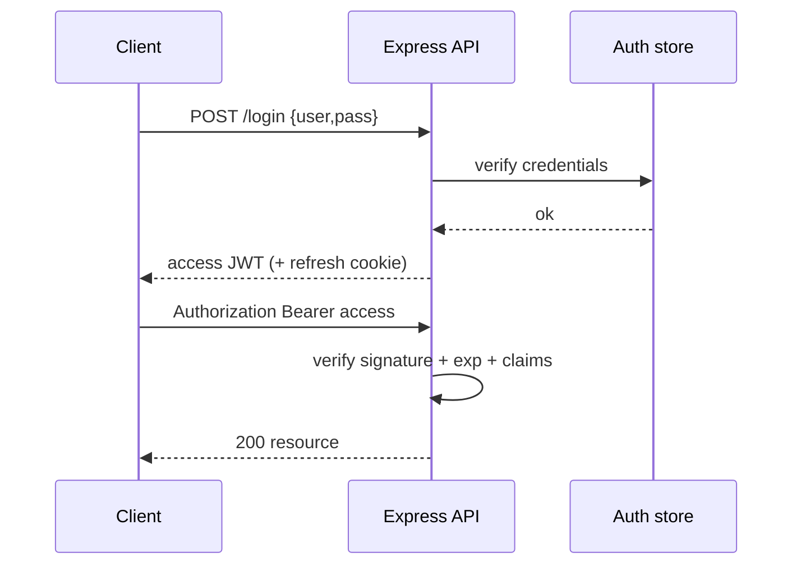

# JWT & Auth in Node/Express

Auth in Node interviews spans **sessions vs JWT**, signing vs encryption, refresh rotation, and where tokens live (cookie vs `Authorization`). This chapter is Node/Express-focused; deeper protocol design is in [Auth at Scale](/backend/07-auth) and [Auth Service SD](/backend-system-design/10-auth-service).

Related: [Middleware](/node/09-middleware) · [Security](/node/12-security)

## Building blocks



| Approach | Server state | Revocation | Horizontal scale |
| --- | --- | --- | --- |
| Opaque session ID + Redis/DB | Yes | Easy | Need shared store |
| JWT access (stateless) | Optional denylist | Harder | Easy |
| JWT + rotating refresh (server-side) | Refresh metadata | Practical | Common prod pattern |

## Password hashing

```ts
import { randomBytes, scrypt as scryptCb, timingSafeEqual } from 'node:crypto'
import { promisify } from 'node:util'

const scrypt = promisify(scryptCb)

export async function hashPassword(password: string): Promise<string> {
  const salt = randomBytes(16)
  const derived = (await scrypt(password, salt, 64)) as Buffer
  return `${salt.toString('hex')}:${derived.toString('hex')}`
}

export async function verifyPassword(password: string, stored: string): Promise<boolean> {
  const [saltHex, hashHex] = stored.split(':')
  if (!saltHex || !hashHex) return false
  const salt = Buffer.from(saltHex, 'hex')
  const expected = Buffer.from(hashHex, 'hex')
  const derived = (await scrypt(password, salt, 64)) as Buffer
  if (derived.length !== expected.length) return false
  return timingSafeEqual(derived, expected)
}
```

Never use MD5/SHA for passwords. Prefer `scrypt` / `argon2` / `bcrypt` with proper cost factors. Async hashing uses libuv pool — see [libuv](/node/01-libuv).

## JWT structure & signing

JWT = `header.payload.signature` (base64url). **Signed ≠ encrypted** — payload is readable. Put secrets only in encrypted tokens (JWE) or never in the token.

```ts
import { createHmac, timingSafeEqual } from 'node:crypto'

function b64url(input: Buffer | string) {
  return Buffer.from(input)
    .toString('base64')
    .replace(/=/g, '')
    .replace(/\+/g, '-')
    .replace(/\//g, '_')
}

export function signJwt(
  payload: Record<string, unknown>,
  secret: string,
  expiresInSec = 900,
): string {
  const header = b64url(JSON.stringify({ alg: 'HS256', typ: 'JWT' }))
  const body = b64url(
    JSON.stringify({
      ...payload,
      iat: Math.floor(Date.now() / 1000),
      exp: Math.floor(Date.now() / 1000) + expiresInSec,
    }),
  )
  const data = `${header}.${body}`
  const sig = createHmac('sha256', secret).update(data).digest('base64url')
  return `${data}.${sig}`
}

export function verifyJwt(token: string, secret: string): Record<string, unknown> {
  const [header, body, sig] = token.split('.')
  if (!header || !body || !sig) throw new Error('malformed')
  const data = `${header}.${body}`
  const expected = createHmac('sha256', secret).update(data).digest('base64url')
  const a = Buffer.from(sig)
  const b = Buffer.from(expected)
  if (a.length !== b.length || !timingSafeEqual(a, b)) throw new Error('bad sig')
  const payload = JSON.parse(Buffer.from(body, 'base64url').toString('utf8'))
  if (typeof payload.exp === 'number' && payload.exp < Math.floor(Date.now() / 1000)) {
    throw new Error('expired')
  }
  return payload
}
```

In production use battle-tested libs (`jose`, `jsonwebtoken`) with **algorithm allowlists** — reject `alg: none` and unexpected algs.

## Express middleware

```ts
import type { Request, Response, NextFunction } from 'express'

export type AuthedRequest = Request & { user?: { sub: string; roles: string[] } }

export function requireAuth(secret: string) {
  return (req: AuthedRequest, res: Response, next: NextFunction) => {
    const header = req.headers.authorization
    if (!header?.startsWith('Bearer ')) {
      return res.status(401).json({ error: 'unauthorized' })
    }
    try {
      const payload = verifyJwt(header.slice(7), secret)
      req.user = { sub: String(payload.sub), roles: (payload.roles as string[]) ?? [] }
      next()
    } catch {
      return res.status(401).json({ error: 'unauthorized' })
    }
  }
}

export function requireRole(...roles: string[]) {
  return (req: AuthedRequest, res: Response, next: NextFunction) => {
    if (!req.user?.roles.some((r) => roles.includes(r))) {
      return res.status(403).json({ error: 'forbidden' })
    }
    next()
  }
}
```

## Cookies vs localStorage

| Storage | XSS risk | CSRF risk | Notes |
| --- | --- | --- | --- |
| `localStorage` access token | High (any XSS steals) | Lower | Common SPA anti-pattern |
| `HttpOnly` + `Secure` + `SameSite` cookie | Lower | Must mitigate CSRF | Preferred for browsers |
| Memory-only access + HttpOnly refresh | Better | CSRF on refresh cookie | Solid SPA pattern |

```ts
res.cookie('refresh', refreshToken, {
  httpOnly: true,
  secure: true,
  sameSite: 'lax', // or 'strict' / CSRF token for state-changing
  path: '/auth',
  maxAge: 7 * 24 * 3600 * 1000,
})
```

## Refresh rotation (sketch)

```ts
// Store hash(refresh) → userId, familyId, revoked
async function rotateRefresh(oldToken: string) {
  const row = await db.findRefresh(hash(oldToken))
  if (!row || row.revoked) {
    await db.revokeFamily(row?.familyId) // reuse detection
    throw new Error('reuse')
  }
  await db.revoke(row.id)
  const next = createRefresh()
  await db.insertRefresh({ hash: hash(next), familyId: row.familyId })
  return { access: signJwt(...), refresh: next }
}
```

## Interview Q&A

**Q: Can you revoke a JWT before exp?**  
A: Not without state: short TTL + refresh, denylist (jti), or version claim checked against DB/Redis.

**Q: Why `timingSafeEqual`?**  
A: Prevent timing attacks when comparing secrets/hashes/signatures.

**Q: HS256 vs RS256?**  
A: HS shared secret (simpler, painful multi-service rotation). RS/ES asymmetric — auth service signs, APIs verify with public key ([Auth service](/backend-system-design/10-auth-service)).

**Q: Where do you put roles?**  
A: Claims for coarse RBAC with short TTL; fine-grained permissions often fetched server-side.

**Q: Is JWT good for server-to-server?**  
A: mTLS or signed service tokens with tight audience (`aud`) / short lived — still validate `iss`/`aud`/`exp`.

## Common Mistakes

- Storing passwords reversible or fast hashes.
- Accepting tokens with `alg` from header unchecked.
- Long-lived access tokens in localStorage.
- Putting PII secrets in JWT payload thinking it’s private.
- No refresh reuse detection → stolen refresh forever.

## Trade-offs

| Design | Win | Cost |
| --- | --- | --- |
| Stateless JWT only | Simple scale | Revocation / PII drift |
| Session in Redis | Instant logout | Sticky dependency |
| Opaque access + refresh | Control | Extra round-trips |
| Cookie sessions | Browser-friendly | CSRF defense needed |

**Next:** Wire auth into [Middleware Internals](/node/09-middleware) and harden with [Security](/node/12-security). Cross-cutting rate limits: [Rate Limit](/backend/08-rate-limit).


## Logout strategies

1. Short access TTL (wait it out)  
2. Store `jti` denylist until exp  
3. Bump `tokenVersion` on user row; embed in access; reject mismatch  
4. Delete refresh sessions server-side  

For stolen access tokens, (1)+(3) dominate; refresh revoke stops renewal.

## Password reset tokens

Single-use, short TTL, hashed at rest, bound to `userId` + email. Invalidate on password change. Never put raw reset tokens in logs/URLs referrers without care (`Referrer-Policy`).

## Express session alternative

```ts
import session from 'express-session'
import RedisStore from 'connect-redis'
// cookie session id → Redis; pairs with CSRF middleware for classic apps
```

Choose sessions when revoke UX and server control beat pure JWT.
