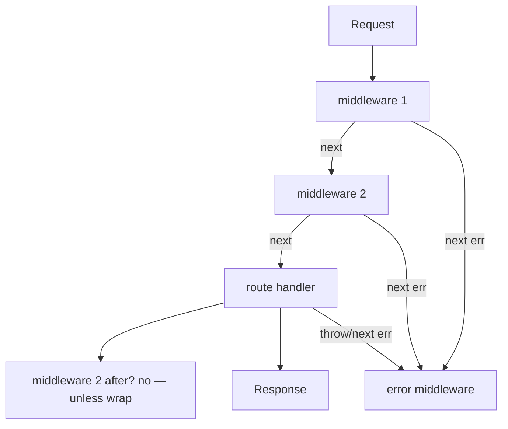

# Middleware Internals (Express)

Express middleware is an **onion of `(req, res, next) => void` functions**. Understanding `next`, `next(err)`, async errors, and router mounting is table stakes for Node interviews.

Related: [JWT & Auth](/node/08-jwt-auth) · [Security](/node/12-security) · [Observability](/backend/09-observability)

## Mental model



Express 4 does **not** catch async rejections automatically unless you wrap or use Express 5 / a patch.

```ts
import express from 'express'

const app = express()
app.use(express.json({ limit: '100kb' }))

// Async wrapper — interview classic
const asyncHandler =
  (fn: (req: express.Request, res: express.Response, next: express.NextFunction) => Promise<void>) =>
  (req: express.Request, res: express.Response, next: express.NextFunction) => {
    Promise.resolve(fn(req, res, next)).catch(next)
  }

app.get('/users/:id', asyncHandler(async (req, res) => {
  const user = await db.user.find(req.params.id)
  if (!user) {
    res.status(404).json({ error: 'not_found' })
    return
  }
  res.json(user)
}))
```

## `next` semantics

| Call | Effect |
| --- | --- |
| `next()` | Continue to next matching middleware/route |
| `next('route')` | Skip remaining middleware in this route; next route |
| `next(err)` | Skip to error-handling middleware `(err, req, res, next)` |
| No `next` / no `res.end` | Request hangs until timeout |

```ts
app.use((req, res, next) => {
  const start = Date.now()
  res.on('finish', () => {
    console.log(req.method, req.path, res.statusCode, Date.now() - start)
  })
  next()
})
```

## Error middleware signature

**Four parameters** — Express detects error handlers by arity.

```ts
app.use((err: unknown, req: express.Request, res: express.Response, _next: express.NextFunction) => {
  const status = (err as { status?: number }).status ?? 500
  const message = status === 500 ? 'internal_error' : (err as Error).message
  if (status >= 500) console.error(err)
  res.status(status).json({ error: message })
})
```

Place error middleware **after** routes. Don’t `res.json` twice.

## Routers & mount paths

```ts
import { Router } from 'express'

const api = Router()
api.use(requireAuth(secret))
api.get('/items', listItems)
api.post('/items', createItem)

app.use('/api/v1', api)
// GET /api/v1/items
```

`req.baseUrl`, `req.path`, `req.originalUrl` differ when mounted — know them for logging/auth.

## Body parsers & order

Order matters:

```ts
app.use(requestId)
app.use(helmet())
app.use(cors({ origin: allowed }))
app.use(express.json({ limit: '100kb' }))
app.use(rateLimit)
app.use('/api', apiRouter)
app.use(notFound)
app.use(errorHandler)
```

Parsing body before auth can waste CPU on unauthenticated huge payloads — prefer early size limits + auth when possible.

## Custom middleware patterns

```ts
// Request-scoped context (AsyncLocalStorage) — better than mutating globals
import { AsyncLocalStorage } from 'node:async_hooks'

type Ctx = { requestId: string; userId?: string }
export const als = new AsyncLocalStorage<Ctx>()

export function withContext(req: express.Request, res: express.Response, next: express.NextFunction) {
  const requestId = (req.headers['x-request-id'] as string) || crypto.randomUUID()
  res.setHeader('x-request-id', requestId)
  als.run({ requestId }, () => next())
}

export function log(msg: string) {
  const ctx = als.getStore()
  console.log(JSON.stringify({ msg, ...ctx }))
}
```

## Ending the response

```ts
// Only one “owner” should send
res.status(204).end()
res.json({ ok: true })
res.sendFile(...)
// Calling next() after send → “Cannot set headers” bugs
```

## Interview Q&A

**Q: Why do async errors become hangs / UnhandledPromiseRejection?**  
A: Express 4 doesn’t `await` your handler. Wrap or use Express 5.

**Q: Difference between app-level and router-level middleware?**  
A: Router middleware runs only for requests that enter that router mount.

**Q: How do you short-circuit?**  
A: Send response and **don’t** call `next` (or call `next(err)` for errors).

**Q: What is `next('route')` for?**  
A: Conditional handlers on same path — skip to next route declaration.

**Q: Middleware vs Nest interceptors / Fastify hooks?**  
A: Same onion idea; frameworks differ in async/error ergonomics. Principles transfer.

## Common Mistakes

- Error handler with 3 args — never called as error middleware.
- Forgetting `return` after `res.status(401)` → falls through and double-sends.
- Mounting `express.json()` without `limit` → memory DoS.
- Auth middleware after handlers that need `req.user`.
- Catching errors and not calling `next(err)` — silent failures.

## Trade-offs

| Pattern | Win | Cost |
| --- | --- | --- |
| Fat middleware | DRY | Hidden control flow |
| Thin middleware + services | Testable | More files |
| AsyncLocalStorage | Clean context | Care with native callbacks losing context |
| Global error mapper | Consistent API errors | Leaking internals if careless |

**See:** Auth middleware in [JWT](/node/08-jwt-auth), hardening headers in [Security](/node/12-security), and structured logging in [Observability](/backend/09-observability).


## Ordering bugs that bite

1. CORS before auth — OK; auth before body parse for huge uploads — better  
2. Rate limit after heavy JSON parse — CPU spent before reject  
3. Error handler registered before routes — never sees `next(err)`  

## Testing middleware

```ts
import httpMocks from 'node-mocks-http' // or raw req/res stubs

await new Promise<void>((resolve, reject) => {
  requireAuth(secret)(req, res, (err) => (err ? reject(err) : resolve()))
})
```

Prefer supertest for full stack paths.

## `app.param` & validation

```ts
app.param('id', (req, res, next, id) => {
  if (!/^\d+$/.test(id)) return res.status(400).end()
  next()
})
```

Keep param handlers pure validation — no DB in `param` without caching (runs per segment).
