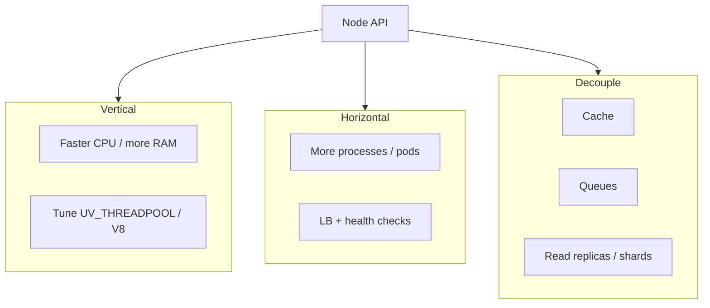
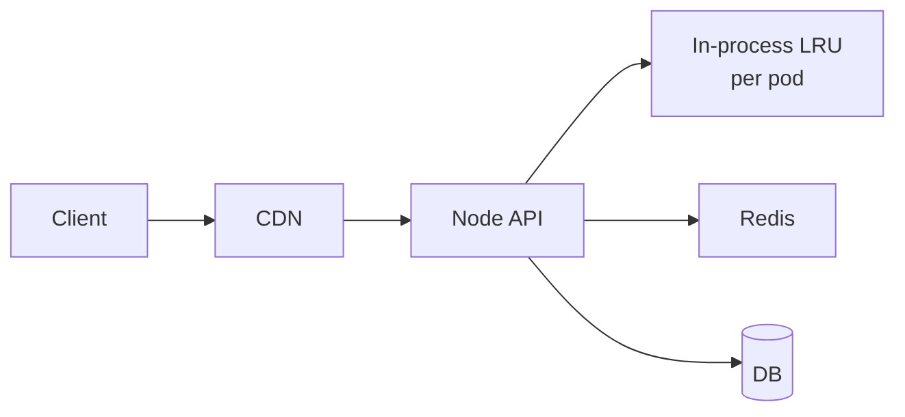

# Scaling Node

Scaling Node is mostly **removing single-thread and single-process bottlenecks**: multi-core, horizontal pods, externalize state, queue async work, cache reads, and shard data. Interviewers want a layered answer, not “just add Redis.”

Related: [Cluster](/node/05-cluster) · [Worker Threads](/node/06-worker-threads) · [Backend SD overview](/backend-system-design/index) · [Redis](/backend/05-redis) · [Queues](/backend/06-queues)

## Scale dimensions



| Lever | Fixes | Doesn’t fix |
| --- | --- | --- |
| Cluster / more pods | Multi-core accept/throughput | Per-request CPU cost |
| Workers | CPU-heavy handlers | Connection count alone |
| Redis cache | Read load / latency | Write-heavy correctness |
| Queue | Spike absorption / retries | Need for sync user response |
| DB indexes / CQRS | Query time | Bad API chatty patterns |

## Stateless API checklist

1. No in-process sessions (use Redis/DB) — [Auth](/backend/07-auth)
2. Uploads to object storage, not local disk — [File/CDN](/backend-system-design/06-file-cdn)
3. Rate limits in Redis — [Rate limit](/backend/08-rate-limit)
4. Idempotency keys for payments/orders — [Queues](/backend/06-queues)
5. Config via env; secrets via vault/KMS

```ts
// BAD: local disk ties instance
await fs.writeFile(`/tmp/uploads/${id}`, buf)

// GOOD
await s3.putObject({ Bucket, Key: id, Body: buf })
```

## Concurrency model for a single instance

```ts
import http from 'node:http'

const server = http.createServer(handler)
server.maxConnections = 10_000 // tune with FD limits
server.listen(3000)

// Protect upstreams
import pLimit from 'p-limit' // or custom semaphore
const limit = pLimit(50)

app.get('/report', async (req, res) => {
  const data = await limit(() => heavyReport(req.query))
  res.json(data)
})
```

Cap concurrent DB pool size ≈ (pods × poolPerPod) under DB `max_connections`.

## Caching layers



- L1: micro-cache for hot keys; short TTL; accept inconsistency across pods.
- L2: shared; handle stampede — [Redis](/backend/05-redis) · [Cache layer SD](/backend-system-design/11-cache-layer).

## Async offload

```ts
// Request path: enqueue + return 202
app.post('/exports', async (req, res) => {
  const jobId = await queue.add('export', { userId: req.user.sub })
  res.status(202).json({ jobId, statusUrl: `/exports/${jobId}` })
})
```

Pattern deep-dive: [Job Queue SD](/backend-system-design/08-job-queue).

## Read vs write scaling

| Problem | Tactic |
| --- | --- |
| Read-heavy | Cache, replicas, CDN |
| Write-heavy | Batching, queues, shard by key |
| Hot partition | Re-shard, salt keys, coalesce updates |
| N+1 APIs | DataLoaders / joins — [SQL](/backend/02-sql) · [ORM](/backend/04-orm) |

## Backpressure & load shedding

```ts
let inflight = 0
const MAX = 2000

function shed(req: http.IncomingMessage, res: http.ServerResponse) {
  if (inflight >= MAX) {
    res.writeHead(503, { 'Retry-After': '1' })
    res.end('overload')
    return true
  }
  return false
}
```

Prefer fail fast over unbounded queues in memory.

## Interview Q&A

**Q: First three steps when Node API CPU is pegged?**  
A: Profile (CPU vs await time). If JS CPU → optimize/offload workers. If await → DB/Redis/downstream. If GC → heap/retention. Then scale out.

**Q: Why doesn’t `UV_THREADPOOL_SIZE=64` solve scaling?**  
A: Helps pool-bound FS/crypto only; doesn’t parallelize JS; can worsen scheduling.

**Q: Sticky sessions required?**  
A: Only if you keep per-node state/WebSocket affinity without pub/sub. Prefer externalize.

**Q: How do you scale WebSockets on Node?**  
A: Pub/sub (Redis) for fanout; multiple nodes; possibly separate realtime tier — [Chat SD](/backend-system-design/03-chat).

**Q: Vertical or horizontal first?**  
A: Fix O(n²)/missing indexes first; then horizontal for redundancy; vertical has ceiling.

## Common Mistakes

- Scaling pods while holding sessions in memory.
- One giant Redis key / hot lock.
- DB pool storm after autoscale.
- Synchronous email/PDF in request path.
- Ignoring tail latency (p99) while celebrating average RPS.

## Trade-offs

| Strategy | Benefit | Cost |
| --- | --- | --- |
| More pods | Throughput / HA | Ops, consistency of local caches |
| Aggressive cache | Speed | Stale reads, stampede risk |
| Queue everything | Resilience | Eventual UX, complexity |
| Shard early | Write scale | Cross-shard queries painful |

**Continue:** [Performance](/node/11-performance) for measurement, [Production](/node/13-production) for deploy topology.


## Capacity napkin math

```text
needed_pods ≈ peak_rps * cost_per_request_sec / (target_util * cores_per_pod)
```

Example: 2k RPS, 20ms CPU/request → 40 CPU-sec/s → at 70% of 2-core pods ≈ 40 / 1.4 ≈ 29 pods (plus headroom for GC/spikes).

Always separate **CPU-sec** from **wait-sec** (DB). Autoscale on the wrong signal overshoots.

## Bulkheads

Isolate thread pools / connection pools / queues per dependency so a slow billing API cannot exhaust the only DB pool. Pattern belongs with [Queues](/backend/06-queues) and circuit breakers.
