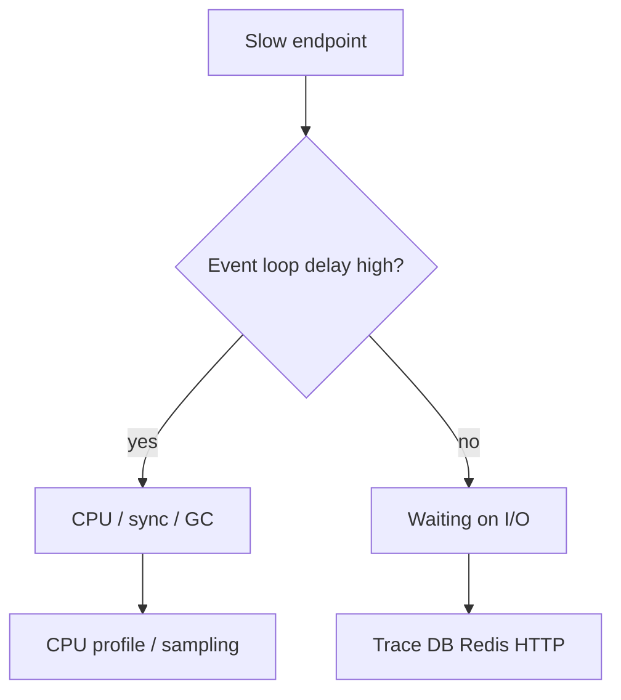

# Performance

Node performance work is **measure → hypothesize → change → verify**. Interviews punish premature micro-opts and reward event-loop awareness, profiling literacy, and p99 thinking.

Related: [Event Loop](/node/02-event-loop) · [V8](/node/07-v8) · [Streams](/node/03-streams) · [Observability](/backend/09-observability)

## What to measure

| Metric | Why |
| --- | --- |
| RPS / concurrency | Capacity |
| Latency p50/p95/p99 | User pain |
| Event loop delay | JS thread saturation |
| Heap / RSS / GC | Memory pressure |
| Pool wait / DB time | External bottlenecks |
| Error rate | False “speed” from failures |

```ts
import { monitorEventLoopDelay } from 'node:perf_hooks'

const h = monitorEventLoopDelay({ resolution: 20 })
h.enable()

setInterval(() => {
  console.log({
    meanMs: h.mean / 1e6,
    p99Ms: h.percentile(99) / 1e6,
    maxMs: h.max / 1e6,
  })
  h.reset()
}, 5000)
```

```ts
import { performance, PerformanceObserver } from 'node:perf_hooks'

const obs = new PerformanceObserver((list) => {
  for (const e of list.getEntries()) console.log(e.name, e.duration)
})
obs.observe({ entryTypes: ['measure', 'function'] })

performance.mark('db-start')
await db.query(...)
performance.mark('db-end')
performance.measure('db', 'db-start', 'db-end')
```

## CPU vs I/O bound diagnosis



- High loop delay + high CPU: tight JS, sync crypto/fs, JSON parse of huge blobs, regex catastrophic backtracking.
- Low loop delay + high latency: await downstream; fix queries, pools, N+1, network.

## Common Node hotspots

```ts
// Sync in request path — kills p99
fs.readFileSync(path)
child_process.execSync(cmd)
crypto.pbkdf2Sync(pw, salt, 1e6, 64, 'sha512')
JSON.parse(hugeString)

// Prefer async / stream / worker
```

```ts
// Excessive logging of large objects
console.log(req.body) // sync-ish stringify cost + I/O

// Unbounded array growth
cache.push(result) // without eviction
```

## HTTP server tuning (sketch)

```ts
import http from 'node:http'

const server = http.createServer(app)
server.keepAliveTimeout = 65_000 // > common LB idle (e.g. 60s)
server.headersTimeout = 66_000
server.requestTimeout = 30_000
```

Mismatch with load balancer idle timeouts → intermittent 502s.

## JSON & serialization

- Prefer smaller payloads / field selection (GraphQL complexity aside — [API design](/backend/01-api-design)).
- Reuse serializers; avoid `JSON.stringify` in tight loops on huge graphs.
- Stream large responses.

## Connection pooling

```ts
// Pseudo pool sizing
// pods * poolSize < db.max_connections * 0.8
const pool = new Pool({ max: 10, idleTimeoutMillis: 30_000 })
```

Too small → queue latency; too large → DB meltdown on scale-out.

## Benchmarking discipline

```bash
# Local microbench — not production truth
npx autocannon -c 100 -d 20 http://localhost:3000/health
```

Warm JIT, pin CPU governors carefully, isolate noise, track p99 not only mean. Load test staging with production-like data.

## Profiling tools (names to cite)

- `node --inspect` + Chrome Performance / Memory
- `clinic doctor` / `clinic flame` (ecosystem)
- OpenTelemetry traces — [Observability](/backend/09-observability)
- `0x` / Linux `perf` for native

## Interview Q&A

**Q: Why is p99 more important than average?**  
A: Users feel tails; one slow dependency spikes a fraction of requests.

**Q: `await` in a loop vs `Promise.all`?**  
A: Sequential vs parallel — parallel needs concurrency caps to protect DB.

**Q: Will clustering fix a single slow SQL?**  
A: No — multiplies identical bad queries. Fix the query/index.

**Q: How does GC affect latency?**  
A: Major GC pauses delay timers and I/O callbacks — looks like random latency.

**Q: Is micro-optimizing V8 shapes worth it?**  
A: Rarely first. Fix algorithmic / I/O issues first; shape stability helps hot libraries.

## Common Mistakes

- Optimizing without a profile.
- Load testing only `/health`.
- Celebrating higher RPS after removing `await` auth checks.
- Logging every request body in prod.
- Infinite retries without backoff → amplification.

## Trade-offs

| Change | Gain | Loss |
| --- | --- | --- |
| Cache aggressively | Latency | Freshness |
| Parallelize queries | Latency | DB load |
| Larger buffers/HW M | Throughput | Memory |
| More verbose metrics | Debug | Overhead |

**Production loop:** SLOs → dashboards → profiles → patches → regression tests. Tie to [Production Architecture](/node/13-production).


## Flamegraphs reading tips

Wide plateaus on `JSON.parse`, regex, or your handler = CPU. Flat event loop with wide `libuv` poll wait = I/O. Many short spikes of GC = allocation churn.

## N+1 at the HTTP layer

Chatty microservice graphs create same pathology as SQL N+1. Batch with DataLoader-like caches per request, or BFF aggregation — [API Design](/backend/01-api-design).

## Compression trade-off

`compression` middleware saves bandwidth, burns CPU. Prefer edge/CDN compression for static; compress large JSON APIs carefully at p99 CPU budget.
