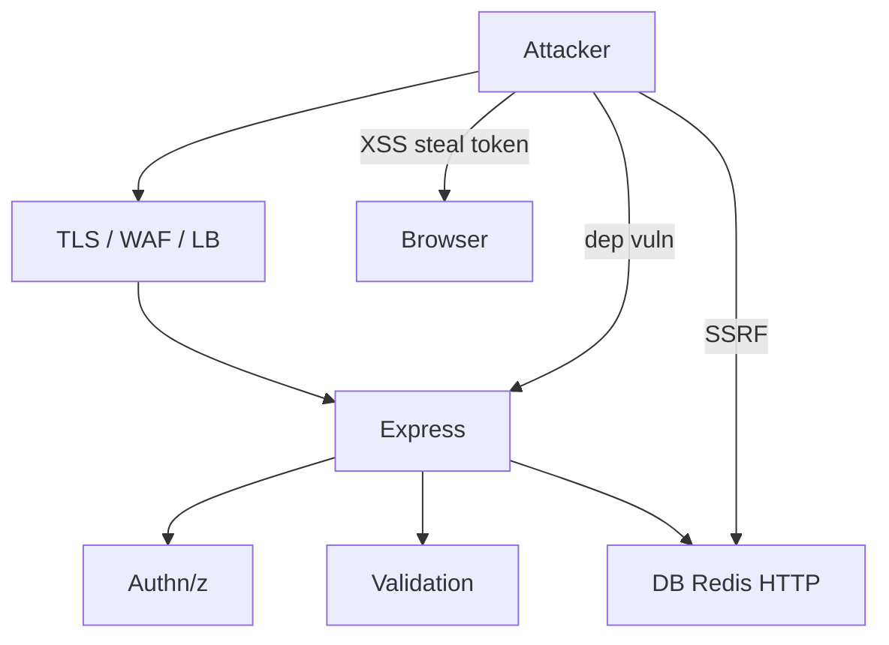

# Security (Node/Express)

Node security interviews mix **web OWASP** with runtime specifics: prototype pollution, ReDoS, command injection, SSRF, unsafe `eval`, and dependency risk. Pair with [JWT Auth](/node/08-jwt-auth) and [Backend Auth](/backend/07-auth).

Related: [Middleware](/node/09-middleware) · [Browser XSS/CSRF](/browser/06-security) · [JS Security](/javascript/21-security)

## Threat map for an API



## Hardening Express baseline

```ts
import express from 'express'
import helmet from 'helmet'
import rateLimit from 'express-rate-limit'
import cors from 'cors'

const app = express()
app.disable('x-powered-by')
app.use(helmet({
  contentSecurityPolicy: false, // enable carefully for HTML apps
}))
app.use(cors({
  origin: ['https://app.example.com'],
  credentials: true,
}))
app.use(express.json({ limit: '100kb' }))
app.use(rateLimit({ windowMs: 60_000, max: 120 }))
```

Always validate/sanitize with a schema library (`zod`, `valibot`, `joi`):

```ts
import { z } from 'zod'

const CreateUser = z.object({
  email: z.string().email().max(320),
  name: z.string().min(1).max(100),
})

app.post('/users', (req, res, next) => {
  const parsed = CreateUser.safeParse(req.body)
  if (!parsed.success) return res.status(400).json(parsed.error.flatten())
  // use parsed.data only
})
```

## Injection classes

### SQL / NoSQL

```ts
// BAD
await db.query(`SELECT * FROM users WHERE id = '${id}'`)

// GOOD
await db.query('SELECT * FROM users WHERE id = $1', [id])
```

Mongo operators: never merge raw `req.query` into filters (`$gt` injection).

### Command injection

```ts
import { execFile } from 'node:child_process'
import { promisify } from 'node:util'
const execFileAsync = promisify(execFile)

// BAD: exec(`convert ${userPath}`)
// GOOD: argv array, no shell
await execFileAsync('convert', [inputPath, outputPath])
```

### Path traversal

```ts
import path from 'node:path'

function safeJoin(root: string, unsafe: string) {
  const resolved = path.resolve(root, unsafe)
  if (!resolved.startsWith(path.resolve(root) + path.sep) && resolved !== path.resolve(root)) {
    throw new Error('path_escape')
  }
  return resolved
}
```

### SSRF

Block link-local / private IP ranges when fetching user-supplied URLs; deny file://; use allowlists for webhooks.

## Prototype pollution

```ts
// Dangerous merges of untrusted JSON into objects
function merge(a: any, b: any) {
  for (const k of Object.keys(b)) a[k] = b[k] // __proto__ / constructor pollution
}

// Mitigations: Object.create(null), Map, hardened merge libs, freeze prototypes where needed
const safe = Object.create(null)
```

## ReDoS

Evil regex on user input can peg CPU (blocks event loop).

```ts
// Risky nested quantifiers on untrusted strings
const bad = /^(\w+)+$/
// Prefer linear-time parsers / simple validation / timeouts / size caps
```

## Secrets & headers

- Secrets in env / secret manager — never commit.
- `timingSafeEqual` for secret compares — [JWT](/node/08-jwt-auth).
- Cookies: `HttpOnly`, `Secure`, `SameSite`.
- CSRF tokens or SameSite strategies for cookie sessions.
- Redirect allowlists (`open redirect` bug).

```ts
function safeRedirect(target: string, allowedHost: string) {
  const u = new URL(target, 'https://' + allowedHost)
  if (u.host !== allowedHost) throw new Error('redirect')
  return u.pathname + u.search
}
```

## Dependency & supply chain

- `npm audit` / lockfiles / ignore scripts in CI when possible.
- Pin versions; review `postinstall`.
- Least privilege OS user in containers — [Ops](/backend/10-ops).

## Interview Q&A

**Q: XSS on an API-only service?**  
A: If it serves JSON to browsers storing tokens in JS-readable storage, XSS on the SPA still steals tokens. Prefer HttpOnly cookies + CSP on the web app.

**Q: How do you stop mass assignment?**  
A: Explicit DTO/schema pick lists — never `UPDATEreq.body)` into ORM create.

**Q: Why body size limits?**  
A: Memory / DoS; JSON parse cost on main thread.

**Q: Is `helmet` enough?**  
A: Baseline headers only — still need authz, validation, dependency hygiene.

**Q: How to handle file uploads safely?**  
A: Stream to object storage, type sniff carefully (don’t trust extension), virus scan async, random keys, no executable serving — [File/CDN](/backend-system-design/06-file-cdn).

## Common Mistakes

- Trusting `X-Forwarded-For` without trusted proxy config → rate-limit bypass / bad audits.
- Disabling TLS verify for “just staging” that ships.
- Detailed stack traces to clients in production.
- Running as root in Docker.
- Logging secrets / tokens / full cards.

## Trade-offs

| Control | Security | Cost |
| --- | --- | --- |
| Strict CSP | XSS ↓ | Breaks inline/third-party |
| Short JWT TTL | Breach window ↓ | Refresh complexity |
| WAF | Block common probes | False positives |
| mTLS internal | Strong service auth | Ops overhead |

**Also revise:** [Rate limiting](/backend/08-rate-limit), [Production](/node/13-production).


## HTTP parameter pollution & prototype

Express query parsers historically allowed `?a=1&a=2` arrays. Be explicit with query schema. Combine with hardened object merge.

## Child process allowlists

Only run known binaries with argv arrays. Never `shell: true` with user input. Prefer libraries over shelling out to `curl`.

## Supply chain quick hits

- Lockfile committed  
- `npm ci` in CI  
- Disable lifecycle scripts when installing untrusted  
- Review sudden maintainer changes on critical deps  

## Security headers beyond helmet

For HTML responses: CSP nonces, `frame-ancestors`, `Referrer-Policy`, `Permissions-Policy`. APIs still benefit from `nosniff` and conservative CORS.
