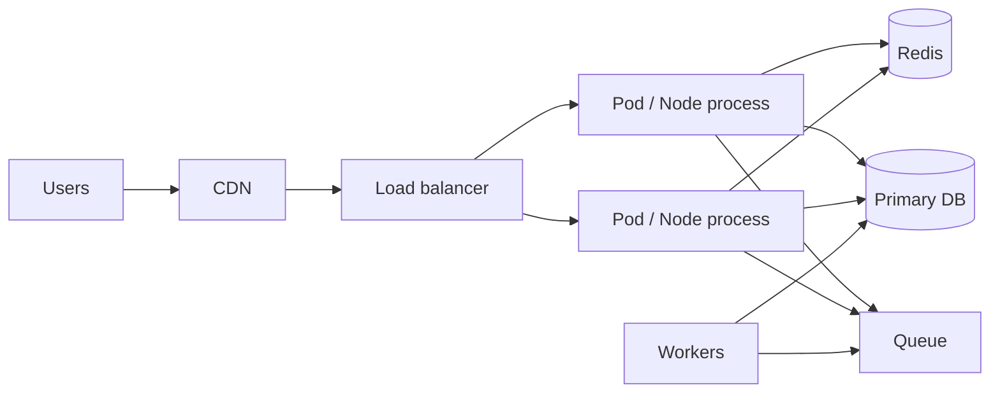

# Production Architecture

How senior candidates describe a **shippable Node service**: process model, health/readiness, config, graceful shutdown, reverse proxy, observability hooks, and 12-factor habits.

Related: [Scaling](/node/10-scaling) · [Ops](/backend/10-ops) · [Observability](/backend/09-observability) · [Cluster](/node/05-cluster)

## Reference topology



Common cloud pattern: **one Node process per container**, autoscale pods — avoid nesting `cluster` inside already-scheduled containers unless measured need.

## Config & secrets

```ts
import { z } from 'zod'

const Env = z.object({
  NODE_ENV: z.enum(['development', 'test', 'production']),
  PORT: z.coerce.number().default(3000),
  DATABASE_URL: z.string().url(),
  REDIS_URL: z.string(),
  LOG_LEVEL: z.enum(['debug', 'info', 'warn', 'error']).default('info'),
})

export const env = Env.parse(process.env)
```

Fail fast on boot if config invalid. Secrets from env injected by platform — not baked into images.

## Health endpoints

```ts
app.get('/healthz', (_req, res) => res.status(200).send('ok')) // liveness

app.get('/readyz', async (_req, res) => {
  try {
    await db.query('SELECT 1')
    await redis.ping()
    res.status(200).send('ready')
  } catch {
    res.status(503).send('not_ready')
  }
})
```

- **Liveness:** process up (don’t check deep deps — causes kill loops).
- **Readiness:** safe to receive traffic.
- See zero-downtime in [Ops](/backend/10-ops).

## Graceful shutdown

```ts
import type { Server } from 'node:http'

export function graceful(server: Server, closeDb: () => Promise<void>) {
  let shuttingDown = false

  async function shutdown(signal: string) {
    if (shuttingDown) return
    shuttingDown = true
    console.log('shutdown', signal)
    server.close(async () => {
      try {
        await closeDb()
        process.exit(0)
      } catch (err) {
        console.error(err)
        process.exit(1)
      }
    })
    setTimeout(() => process.exit(1), 25_000).unref()
  }

  process.on('SIGTERM', () => shutdown('SIGTERM'))
  process.on('SIGINT', () => shutdown('SIGINT'))
}
```

Stop claiming readiness first (k8s), drain connections, then exit. In-flight requests need LB patience (`terminationGracePeriodSeconds`).

## Reverse proxy / TLS

Terminate TLS at LB/ingress. Node sees HTTP; configure `app.set('trust proxy', hops)` for correct IPs / secure cookies.

```ts
app.set('trust proxy', 1)
```

## Logging

Structured JSON logs with `requestId` ([Middleware](/node/09-middleware)). No pretty-print in prod. Correlate with traces ([Observability](/backend/09-observability)).

```ts
console.log(JSON.stringify({
  level: 'info',
  msg: 'request',
  method: req.method,
  path: req.path,
  status: res.statusCode,
  ms: Date.now() - start,
  requestId,
}))
```

## Process reliability

| Concern | Practice |
| --- | --- |
| Uncaught exceptions | Log + exit; let supervisor restart (state may be corrupt) |
| Unhandled rejections | Same in modern Node — treat as fatal in prod |
| Memory growth | Limits + alerts; don’t only raise heap |
| Native crashes | Automatic restart; core dump pipeline optional |

```ts
process.on('uncaughtException', (err) => {
  console.error('fatal', err)
  process.exit(1)
})
```

## Releases

- Immutable images with digest pins.
- Migrations: expand/contract — [SQL](/backend/02-sql).
- Feature flags for risky behavior.
- Blue/green or rolling — [Ops](/backend/10-ops).

## Serverless note

AWS Lambda / Cloud Functions: no sticky process state, cold starts, limited execution time. Prefer smaller deps, provisioned concurrency for latency SLOs. Event loop still applies inside an invocation.

## Interview Q&A

**Q: Liveness vs readiness?**  
A: Live = restart if broken process. Ready = include in LB pool. Checking DB in liveness can cascade outages.

**Q: Why exit on uncaughtException?**  
A: Process may be in unknown state; continuing risks silent corruption.

**Q: How do you do zero-downtime deploys with Node?**  
A: Rolling update + readiness + graceful `server.close` + compatible migrations.

**Q: Where should TLS terminate?**  
A: Usually edge/ingress; mTLS optional mesh-internal.

**Q: One process or cluster module in k8s?**  
A: Usually one process per pod; scale with replicas matching CPU requests.

## Common Mistakes

- Only `/health` that always 200 while DB is down → traffic black hole.
- Ignoring `SIGTERM` → 502s on every deploy.
- Writing to local disk for durable data.
- Unbounded concurrency to DB on cold start of many pods.
- Verbose debug logs left on → cost + PII risk.

## Trade-offs

| Choice | Benefit | Cost |
| --- | --- | --- |
| Many small services | Scale/deploy isolation | Ops + latency |
| Modular monolith Node | Simpler txns | Careful module boundaries |
| Sidecar proxies | Uniform mTLS/metrics | Resource overhead |
| Serverless | Scale-to-zero | Cold start / limits |

**Drill:** Walk a deploy from CI → image → migration → rolling pods → verify SLOs. Cross-check with [Backend Ops](/backend/10-ops) and [Interview Q&A](/node/14-interview-qa).


## Multi-stage CI sketch

```text
lint → typecheck → unit → build image → migrate (job) → deploy canary → soak → full roll
```

Migration job should use the **new** schema with **old/new** compatible app already running when possible.

## Backpressure at the edge

When ready to shed: fail readiness (k8s stops new traffic) or return 503 with Retry-After. Don’t infinite-queue in memory.

## Node version policy

Pin major in image (`node:22-bookworm-slim@sha256:...`). Track LTS. Test upgrades on canaries — native addons break across ABIs.
