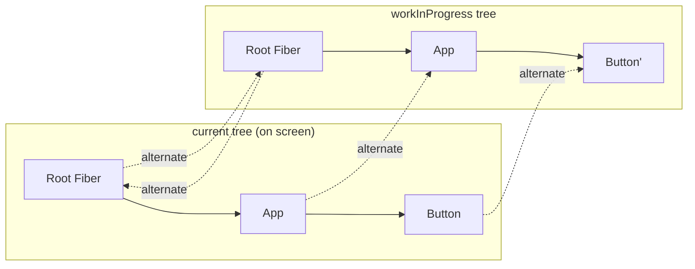
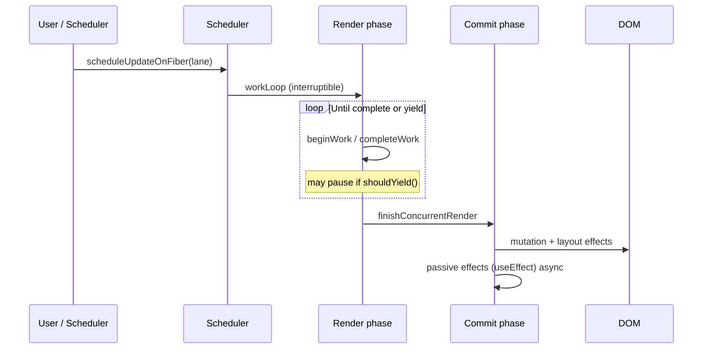

# Fiber Architecture

React Fiber is the unit of work and the reconciler rewrite (React 16+) that made rendering **interruptible**, **prioritizable**, and **resumable**. Before Fiber, the Stack reconciler walked the tree recursively and could not pause mid-tree — a deep update blocked the main thread until commit. Fiber turns that recursive call stack into a linked list of work units the scheduler can yield from.

## Why Fiber exists

Browsers paint at ~60fps (~16ms/frame). If React spends 40ms in `render()`, you drop frames: input lag, janky scroll. Concurrent features (Suspense, Transitions, deferred values) require the ability to:

1. **Pause** work when a higher-priority update arrives (user typing)
2. **Abort** stale work (navigated away, newer state)
3. **Reuse** completed work when possible
4. **Split** render (compute next UI) from commit (mutate DOM)

Fiber enables all four by making each component instance a mutable fiber node with explicit parent/child/sibling pointers.

## Fiber node shape

Each fiber is roughly:

```ts
type Fiber = {
  tag: WorkTag // FunctionComponent, ClassComponent, HostComponent, ...
  type: any // function, class, or DOM tag string
  key: string | null
  stateNode: any // DOM node, class instance, or null for function comps

  // Tree links (singly-linked list of children)
  return: Fiber | null // parent
  child: Fiber | null // first child
  sibling: Fiber | null // next sibling

  // Alternate double-buffering
  alternate: Fiber | null // current ↔ workInProgress pair

  // Hooks / state / effects
  memoizedState: any // hook linked list head for function comps
  updateQueue: any
  flags: Flags // Placement, Update, Deletion, Passive, ...
  subtreeFlags: Flags // OR of child flags (bailout optimization)
  deletions: Fiber[] | null

  // Priority
  lanes: Lanes
  childLanes: Lanes

  // Props
  pendingProps: any
  memoizedProps: any

  index: number
  ref: any
}
```

`memoizedState` on a function component fiber is the **head of the hooks linked list** (`useState` → `useEffect` → …), not “component state” in the class sense.

## Double buffering: current vs workInProgress

React keeps two trees:

| Tree | Role |
| --- | --- |
| **current** | What’s on screen (`fiberRoot.current`) |
| **workInProgress (WIP)** | Tree being built this render |

Each fiber’s `alternate` points to its twin. On successful commit, WIP becomes current (pointer flip on the root). If work is interrupted and discarded, current stays untouched — the DOM never saw a half-built tree.



## Lanes: priority as bitmasks

Lanes replace the older expiration-time model. A **lane** is a bit in a 31-bit mask. Updates claim lanes; the scheduler picks the highest-priority set of lanes to process.

```ts
// Conceptual — actual bit values live in ReactFiberLane.js
const SyncLane = 0b0000000000000000000000000000001
const InputContinuousLane = 0b0000000000000000000000000000100
const DefaultLane = 0b0000000000000000000000000010000
const TransitionLanes = /* range of bits */ 0b0000000011111111110000000000000
const IdleLane = 0b0100000000000000000000000000000
```

**Merge lanes** with bitwise OR; **check overlap** with AND. Batching = multiple updates sharing / merging into the same lane set on one root.

| Source | Typical lane | Behavior |
| --- | --- | --- |
| Discrete input (`click`, `keydown`) | Sync / InputContinuous | Flush ASAP, often sync in event |
| `setState` in event handler | Default (batched) | End-of-event / microtask flush |
| `startTransition` | Transition lanes | Interruptible, lower than input |
| `useDeferredValue` | Transition-like | Keep stale UI, upgrade later |
| Idle work | IdleLane | Only when nothing else pending |

```ts
function scheduleUpdateOnFiber(fiber: Fiber, lane: Lane) {
  // Mark fiber + ancestors' childLanes
  // Ensure root has pendingLanes |= lane
  // Ensure scheduler callback is scheduled at matching priority
}
```

Interview soundbite: **“Lanes are bitmasks so React can cheaply merge, intersect, and strip priorities without sorting queues of timestamps.”**

## Two phases: render and commit



### Render phase (interruptible)

- `beginWork`: reconcile children, process updates, call function components
- `completeWork`: create/update host configs, bubble `subtreeFlags`
- No DOM writes (except rare legacy paths). Safe to throw away WIP.

### Commit phase (synchronous, non-interruptible)

1. **BeforeMutation** — `getSnapshotBeforeUpdate`, scheduling focus
2. **Mutation** — insert/update/delete DOM (`Placement`, `Update`, `Deletion`)
3. **Layout** — `useLayoutEffect`, `componentDidMount/Update` (flush sync)
4. **Passive** — `useEffect` scheduled after paint (via scheduler / message channel)

Once commit starts, React finishes it — partial DOM updates would be visible and broken.

## Work loop (simplified)

```ts
function workLoopConcurrent() {
  while (workInProgress !== null && !shouldYield()) {
    performUnitOfWork(workInProgress)
  }
}

function performUnitOfWork(unit: Fiber) {
  const next = beginWork(unit.alternate, unit, renderLanes)
  unit.memoizedProps = unit.pendingProps
  if (next === null) {
    completeUnitOfWork(unit) // bubble up, find sibling
  } else {
    workInProgress = next // dive into child
  }
}
```

`shouldYield()` checks time slice (~5ms in concurrent mode). If true, React returns to the browser; a continuation resumes from `workInProgress`.

## Host vs composite fibers

| Tag | `stateNode` | Notes |
| --- | --- | --- |
| `HostRoot` | FiberRoot | Owns `containerInfo`, `pendingLanes` |
| `HostComponent` | DOM element | `div`, `span`, … |
| `HostText` | Text node | |
| `FunctionComponent` | `null` | Hooks on `memoizedState` |
| `ClassComponent` | class instance | |
| `SuspenseComponent` | Suspense state | Dehydrated / fallback |
| `OffscreenComponent` | | Hidden / prerender |
| `MemoComponent` / `SimpleMemoComponent` | | `React.memo` |

## FiberRoot vs HostRoot fiber

```ts
type FiberRoot = {
  containerInfo: Element // document.getElementById('root')
  current: Fiber // HostRoot fiber
  pendingLanes: Lanes
  finishedWork: Fiber | null
  callbackNode: any // Scheduler task handle
  // ping cache, hydration state, etc.
}
```

`createRoot(el).render(<App />)` creates a FiberRoot, then a HostRoot fiber whose child is your app.

## Bailout paths

React skips `beginWork` body when:

- Props are shallow-equal (`memo` / `PureComponent` / bailout)
- Context hasn’t changed for consumers that matter
- No pending lanes on this subtree (`!includesSomeLane(renderLanes, fiber.lanes | fiber.childLanes)`)

`subtreeFlags` lets commit skip whole subtrees with no effects.

## Interview Q&A

**Q: What is a Fiber?**  
A: A plain object representing a unit of work / a component instance in the reconciler tree, with tree links, pending props, memoized state, effect flags, and priority lanes. It’s also the data structure that replaced the recursive stack reconciler.

**Q: Why linked list instead of recursion?**  
A: Linked-list traversal can pause between units, store `workInProgress`, and resume. A recursive stack can’t yield without unwinding (losing progress) or blocking.

**Q: What are lanes?**  
A: Bitmask priorities. Updates are assigned lane bits; React selects a set of lanes to render, can merge batches, and can drop/interrupt lower-priority work when higher lanes arrive.

**Q: Can the commit phase be interrupted?**  
A: No. Render can pause; commit runs synchronously to keep DOM consistent.

**Q: Where do hooks live?**  
A: On the function component fiber’s `memoizedState` as a linked list of hook objects (`memoizedState`, `queue`, `next`).

**Q: What is `alternate`?**  
A: Pointer between current and WIP fiber for the same logical component — double buffering.

**Q: SyncLane vs TransitionLane?**  
A: Sync/input lanes flush urgently (often blocking). Transition lanes are interruptible; UI can keep showing previous state via `isPending` until transition completes.

**Q: How does React know which subtree to re-render?**  
A: Update marks the fiber’s `lanes` and bubbles `childLanes` to ancestors. Render only enters subtrees whose lanes intersect `renderLanes` (unless context force).

## Common Mistakes

- Conflating Fiber with Virtual DOM “diff objects” — VDOM is the element tree; Fiber is the persistent reconciler state.
- Saying “React is always async” — discrete updates can still be sync; concurrent mode makes *some* updates interruptible.
- Assuming `key` on Fiber is for arrays only — keys identity-match siblings during reconcile.
- Thinking `useEffect` runs in render phase — it’s passive, after paint.
- Believing Fiber nodes are immutable — WIP is mutated in place during render; that’s intentional.

## Trade-offs

| Choice | Benefit | Cost |
| --- | --- | --- |
| Double buffering | Interruptible render without tearing | Memory: ~2× fiber tree |
| Lane bitmasks | O(1) merge/intersect | Harder mental model than priorities 1–5 |
| Linked-list work | Yield + resume | More pointer chasing; harder to debug |
| Sync commit | Consistent DOM | Long commits still jank (huge trees) |
| Heuristic time slicing | Responsiveness | More scheduling overhead; partial work discarded |

**Senior takeaway:** Fiber is not a user API — it’s the runtime that makes Concurrent React possible. In interviews, connect Fiber → lanes → interruptible render → non-interruptible commit → hooks stored on fibers.


## Scheduler integration

React does not invent its own timers from scratch — it uses the **Scheduler** package (`unstable_scheduleCallback`) with priorities mapped from lanes. Browser yielding typically uses `MessageChannel` (macrotask) so React returns control between units of work without waiting a full `setTimeout` delay.

```ts
// Conceptual mapping
function laneToSchedulerPriority(lanes: Lanes): Priority {
  if (includesSyncLane(lanes)) return ImmediatePriority
  if (includesInputContinuousLane(lanes)) return UserBlockingPriority
  if (includesTransitionLane(lanes)) return NormalPriority
  return IdlePriority
}
```

When an urgent update arrives mid-transition render, React:

1. Marks the higher lane on the root
2. May exit the current work loop early
3. Renders the urgent lanes to completion and commits
4. Reschedules the unfinished transition work

## Effects list vs subtreeFlags

Older React walked an explicit **effect list** (circular linked list of fibers with work). Modern React uses **`flags` + `subtreeFlags`**: during `completeWork`, children OR their flags into the parent. Commit then DFS-skips subtrees where `subtreeFlags === NoFlags`. Interview angle: this is a performance optimization for commit traversal, not a change to when effects run.

## Deletion & passive unmount

On `Deletion`, React:

1. Recursively finds fibers with passive/layout effects
2. Runs layout cleanups in commit
3. Schedules passive cleanups (`useEffect` destroy) after paint
4. Detaches refs
5. Removes host nodes

Sibling order of cleanups is depth-first; don’t rely on cross-tree ordering between unrelated branches.

## Interview deep dive: “Explain a click from setState to DOM”

1. Click handler runs → `dispatchSetState` enqueues update with lane  
2. `ensureRootIsScheduled` → Scheduler callback  
3. `renderRootSync` or concurrent work loop builds WIP  
4. `beginWork` on path with lanes; hooks process queue  
5. `completeWork` sets `Update` flag on host fiber  
6. Commit mutation applies DOM property updates  
7. Layout effects flush; then paint; then passive effects  

## Extra Q&A

**Q: What is `childLanes`?**  
A: Aggregate of pending lanes in the subtree — lets React skip `beginWork` on branches with no overlapping work.

**Q: HostRoot vs FiberRoot?**  
A: FiberRoot is the controller object (`pendingLanes`, container); HostRoot is the fiber node at the top of the React tree.

**Q: Why 31-bit lanes?**  
A: Fit in a signed 32-bit int for fast bitwise ops in JS engines; one bit reserved.


## Worked example: priority inversion avoided

Imagine a large list filter (transition) in progress when the user types in an input (urgent):

```tsx
function Catalog() {
  const [text, setText] = useState('')
  const [filter, setFilter] = useState('')
  const [isPending, startTransition] = useTransition()

  return (
    <>
      <input
        value={text}
        onChange={(e) => {
          const v = e.target.value
          setText(v)
          startTransition(() => setFilter(v))
        }}
      />
      {isPending && <span>Updating…</span>}
      <HugeList filter={filter} />
    </>
  )
}
```

Fiber/lanes view:

1. `setText` → Default/Sync-ish input lane → scheduled  
2. `setFilter` → Transition lane → scheduled  
3. Scheduler runs input lane first (or interrupts transition WIP)  
4. Input commits ASAP — caret stays smooth  
5. Transition render continues / restarts with latest `filter`  
6. List commits when transition lanes complete  

Without transitions, both updates share urgent priority → typing waits on `HugeList`.

## Fiber flags cheat-sheet (commit)

| Flag category | Examples | Commit phase |
| --- | --- | --- |
| Mutation | Placement, Update, Deletion, ContentReset | DOM ops |
| Layout | Layout, Ref, Visibility | before paint |
| Passive | Passive | after paint |

`subtreeFlags` is the OR-reduction used to skip empty subtrees during commit walks.
