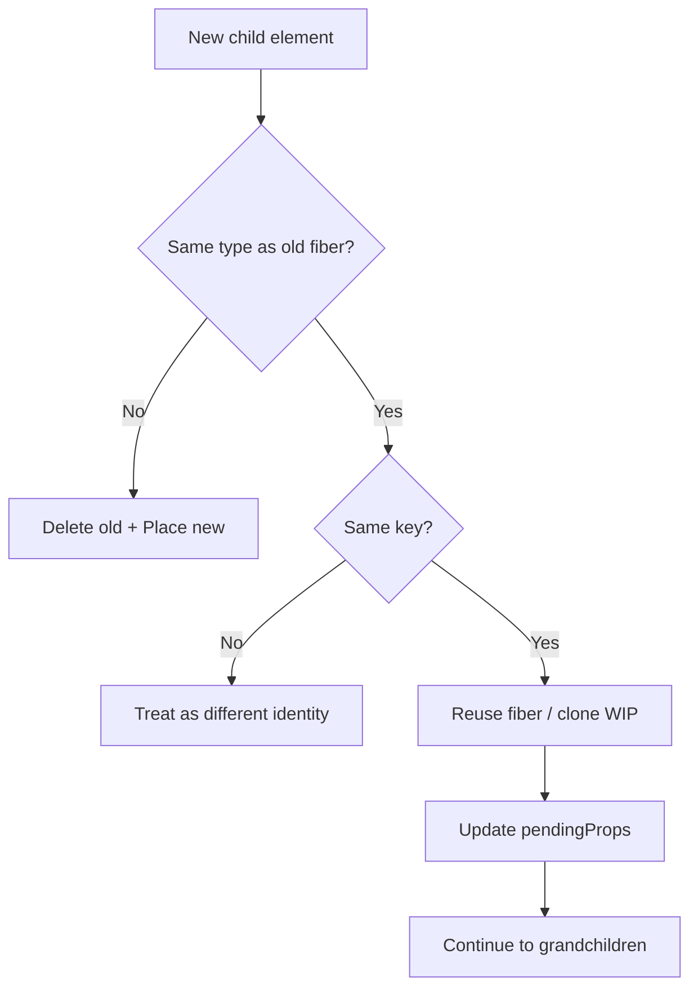

# Reconciliation

Reconciliation is how React decides **what changed** between two trees and which DOM operations to perform. The public model is “diff the Virtual DOM”; the implementation walks fibers, applies **heuristics** (not a general O(n³) tree edit), and records **effect flags** for the commit phase.

## Elements vs fibers

```tsx
// Element — immutable description (what you return from render)
const el = <Button color="blue" /> // { type: Button, props: { color: 'blue' }, key: null }

// Fiber — mutable reconciler instance that persists across renders
```

`reconcileChildFibers` compares the **new element tree** (from `beginWork`) against the **current fiber children** and returns a WIP child fiber (or null).

## The heuristics React bets on

1. **Different `type` ⇒ different tree** — tear down old, mount new (`div` → `span`, `A` → `B`).
2. **Same `type` + same `key` ⇒ reuse fiber** — update props in place.
3. **Keys identify siblings** — list reorder without remounting when keys stable.
4. **Only level-by-level** — React does not magically move a node across parents; that remounts.

These keep reconcile ~O(n) for practical UIs at the cost of not finding globally minimal edits.



## Single child vs lists

### Single child

```ts
function reconcileSingleElement(
  returnFiber: Fiber,
  currentFirstChild: Fiber | null,
  element: ReactElement,
): Fiber {
  const key = element.key
  let child = currentFirstChild
  while (child !== null) {
    if (child.key === key) {
      if (child.elementType === element.type) {
        // reuse — delete remaining siblings
        deleteRemainingChildren(returnFiber, child.sibling)
        const existing = useFiber(child, element.props)
        existing.return = returnFiber
        return existing
      }
      // same key, different type — fall through to delete all
      break
    } else {
      deleteChild(returnFiber, child)
    }
    child = child.sibling
  }
  const created = createFiberFromElement(element)
  created.return = returnFiber
  return created
}
```

### Lists / fragments

For arrays, React builds a **map of existing children by key** (or index fallback) and walks the new list:

1. First pass: try to reuse in order while keys/types match (fast path for append/stable lists).
2. If mismatch: map remaining old fibers by key, place/move/create as needed.
3. Leftover old fibers → `Deletion`.

```tsx
// Stable identity — reorder cheaply
{items.map((item) => (
  <Row key={item.id} item={item} />
))}

// Anti-pattern — remount every reorder / insert
{items.map((item, i) => (
  <Row key={i} item={item} />
))}
```

Index keys look fine until insert/delete/reorder in the middle: fibers reuse wrong state (input text jumps, effects re-fire).

## Effect flags (side effects recorded in render)

| Flag | Meaning |
| --- | --- |
| `Placement` | Insert into DOM (new mount or move) |
| `Update` | Props/text changed — host update |
| `Deletion` | Remove fiber + subtree |
| `ChildDeletion` | Parent has deletions list |
| `Passive` / `PassiveStatic` | `useEffect` |
| `Layout` / `LayoutStatic` | `useLayoutEffect` |
| `Ref` | Attach/detach ref |
| `Visibility` | Offscreen / Suspense hide |

During render React **only sets flags**. Commit walks fibers with flags and mutates the DOM.

```ts
// Conceptual placement
function placeChild(newFiber: Fiber, lastPlacedIndex: number, newIndex: number) {
  newFiber.index = newIndex
  const current = newFiber.alternate
  if (current !== null) {
    const oldIndex = current.index
    if (oldIndex < lastPlacedIndex) {
      newFiber.flags |= Placement // moved forward
      return lastPlacedIndex
    }
    return oldIndex // still in order
  }
  newFiber.flags |= Placement // mount
  return lastPlacedIndex
}
```

## Keys: identity, not performance hack

Keys tell reconcile **which** sibling is which. Wrong keys cause:

- State preserved on the wrong component
- Unnecessary unmount/remount (lost focus, re-fetch, animation restart)
- Subtle bugs with controlled inputs

```tsx
// Conditional swap — without keys, React may reuse the wrong fiber
{isLogin ? <Form key="login" /> : <Form key="register" />}
```

Same component type, different semantic identity → give distinct keys.

## Type change = remount

```tsx
// Loses state every toggle — type identity changes
function Screen({ mode }: { mode: 'a' | 'b' }) {
  const Comp = mode === 'a' ? PanelA : PanelB
  return <Comp />
}

// Preserve state when intentional: lift state, or keep both mounted and hide
```

`React.memo` / `PureComponent` do **not** change reconcile identity — they only bail out of re-rendering when props equal.

## Context and bailout interaction

Even if props bail out, a changed context value forces consumers to re-render. Providers mark `dependency` lanes; `readContext` during render subscribes the fiber. Reconciliation of children still runs if the consumer renders.

## Host config abstraction

Reconcile is platform-agnostic. `completeWork` / commit call host config:

- **DOM**: `createInstance`, `appendChild`, `commitUpdate`
- **React Native**: native views
- **Custom**: React Three Fiber, terminal renderers, etc.

```ts
// react-dom-client host config (conceptual)
function commitUpdate(dom: Element, payload: UpdatePayload) {
  for (const [k, v] of payload) {
    if (k === 'style') Object.assign((dom as HTMLElement).style, v)
    else if (k === 'children') dom.textContent = v
    else dom.setAttribute(k, v)
  }
}
```

## Diffing example walkthrough

```tsx
// Before
<ul>
  <li key="a">A</li>
  <li key="b">B</li>
</ul>

// After
<ul>
  <li key="b">B</li>
  <li key="a">A</li>
</ul>
```

1. First new child `b` matches old fiber `b` but oldIndex may trigger `Placement` (move before `a`).
2. Second new child `a` reuses fiber `a`.
3. No deletions. Text nodes move; component state on each `li`’s child preserved.

## Interview Q&A

**Q: Is React’s diff O(n)?**  
A: Practically linear via heuristics (same-level, type, key). Not a minimal tree-edit distance algorithm.

**Q: What happens when `type` changes?**  
A: Old fiber subtree unmounts (effects cleanup, state destroyed); new fiber mounts. DOM nodes replaced.

**Q: Why not use index as key?**  
A: Indexes aren’t stable identities under insert/delete/reorder — state and effects attach to the wrong item.

**Q: Diff vs paint?**  
A: Diff/reconcile happens in render (JS). Paint is the browser after commit mutates DOM/CSSOM.

**Q: Can reconcile move a node to a new parent without remount?**  
A: No. Fibers are parent-scoped; changing parent = delete + create.

**Q: What is `Placement`?**  
A: Effect flag meaning the host instance must be inserted (or re-inserted) in the parent during mutation.

**Q: Fragments and keys?**  
A: Keyed fragments (`<Fragment key=…>`) participate in list identity; unkeyed fragments are transparent grouping.

## Common Mistakes

- Using array index keys in dynamic lists.
- Changing `type` via inline ternary component variables and being surprised state resets.
- Assuming `memo` skips reconciliation of children entirely — children still reconcile if parent re-renders and returns new elements (unless children also bailed out / weren’t invoked).
- Putting unstable `key={Math.random()}` — remount every render.
- Believing Virtual DOM “diffs against the real DOM” every time — it diffs against the previous React tree (fibers/elements), then applies minimal host ops.

## Trade-offs

| Approach | Pros | Cons |
| --- | --- | --- |
| Heuristic reconcile | Fast, predictable for UI | Misses rare optimal moves |
| Keys required for lists | Correct identity | Developer discipline |
| Type-as-identity | Simple mental model | Remounts on type swap |
| Effect flags deferred to commit | Interruptible render | Extra bookkeeping memory |
| Index fallback when no key | Convenience | Footguns in dynamic lists |

**Senior takeaway:** Reconciliation is identity-preserving reuse + effect recording. Keys and types are the identity model; everything else (lanes, memo, Suspense) layers on top of that walk.


## Text vs element updates

For host text fibers, reconcile compares string children and sets `Update` when text changes. For elements, props are compared in `prepareUpdate` (host config) producing a **payload** of changed properties — not a full prop replace necessarily.

```ts
// Conceptual host payload
type UpdatePayload = Array<string | mixed> // [propName, value, ...]
```

## Fragments & portals

- **Fragment** (`<>...</>`): no DOM node; children reconcile against parent’s child list. Keyed fragments participate as a single slot in lists.
- **Portal**: child fibers still parent to the React portal fiber (`return`), but `stateNode` commit inserts into a different DOM container. Events re-bubble through the **React tree**, not the DOM hierarchy — important for modal click-outside logic.

## `memo` / `forwardRef` / `lazy` wrappers

These create special fiber tags. Reconcile still keys off the **outer** element type identity:

```tsx
const A = memo(Inner)
const B = memo(Inner)
// <A /> → <B /> is a type change → remount, even if Inner is the same function
```

`React.lazy` resolves to the inner component type after load; until then Suspense handles the throw from the lazy initializer.

## Extra Q&A

**Q: Why can’t React “move” a component to a new parent?**  
A: Fiber `return` pointer and state are parent-scoped; cross-parent move isn’t a supported edit — delete + create.

**Q: What does `index` on a fiber do?**  
A: Tracks position among siblings for Placement detection when reordering lists.
